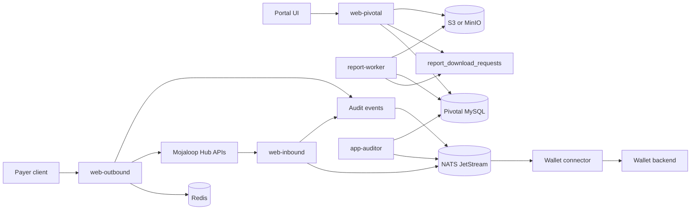
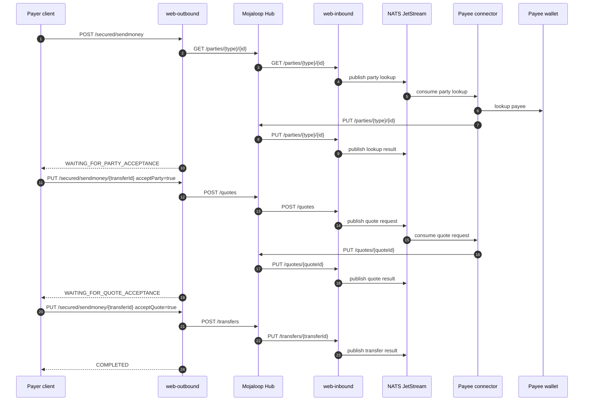
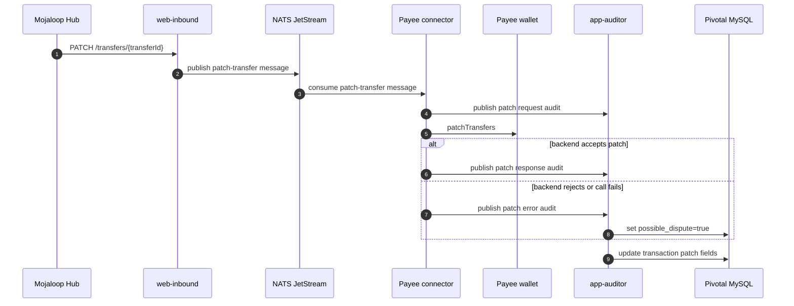
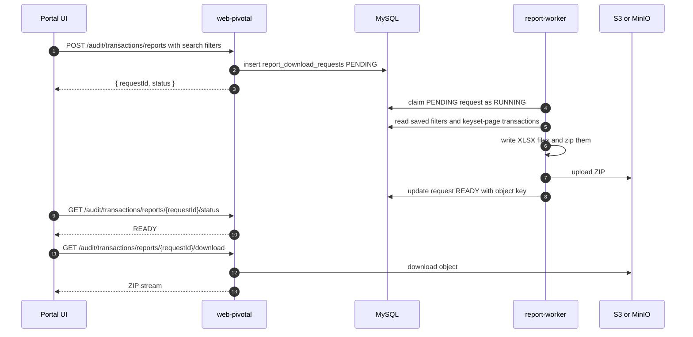

# Pivotal Developer Guide

Pivotal is the multi-tenant payment adapter for Mojaloop. It exposes payer-facing APIs, receives Mojaloop FSPIOP callbacks, publishes connector work through NATS, stores audit data in MySQL, and serves the Pivotal portal API and UI.

## Bookmarks

- [Prerequisites](#prerequisites)
- [Repository Layout](#repository-layout)
- [App Service Guides](#app-service-guides)
- [Architecture](#architecture)
- [Send-Money Flow](#send-money-flow)
- [Transfer Patch Flow](#transfer-patch-flow)
- [Report Download Flow](#report-download-flow)
- [Run With Docker Compose](#run-with-docker-compose)
- [Run As Local Node Processes](#run-as-local-node-processes)
- [Report Download Configuration](#report-download-configuration)
- [Useful Commands](#useful-commands)
- [Helm](#helm)
- [Troubleshooting](#troubleshooting)
- [More Documentation](#more-documentation)

This README is the developer entry point. Deeper flow and deployment docs are linked at the end.

## Prerequisites

Install these before running the full local stack:

| Tool | Purpose |
| --- | --- |
| Node.js 22.x and npm | Build and run NestJS apps and tests. |
| Docker and Docker Compose | Run the self-contained local Docker stack. |
| Helm 3 | Render or deploy the Kubernetes chart. |
| MySQL 8 or MariaDB client | Inspect local/staging Pivotal DB data. Docker Compose starts MySQL for you. |
| NATS with JetStream | Connector and audit event transport. Docker Compose starts this for you. |
| Redis | Temporary transfer state/cache. Docker Compose starts this for you. |
| MinIO or AWS S3 | Required for transaction report download ZIP storage. Docker Compose can start MinIO. |
| Mojaloop Hub services | Required for real end-to-end transfers against ALS, quoting-service, ml-api-adapter, and central-ledger. |

Recommended local setup:

```bash
npm ci
npm ci --prefix packages/portal
```

Do not commit generated `.env` files. Copy examples locally when needed:

```bash
cp packages/apps/web-outbound/.env.example packages/apps/web-outbound/.env
cp packages/apps/web-inbound/.env.example packages/apps/web-inbound/.env
cp packages/apps/web-pivotal/.env.example packages/apps/web-pivotal/.env
cp packages/apps/report-worker/.env.example packages/apps/report-worker/.env
cp packages/apps/app-auditor/.env.example packages/apps/app-auditor/.env
cp docker/.env.example docker/.env
```

## Repository Layout

| Path | Responsibility |
| --- | --- |
| `packages/apps/web-outbound` | Payer-facing send-money API. Starts lookup, quote, and transfer flow. |
| `packages/apps/web-inbound` | Receives FSPIOP callbacks from Mojaloop Hub and publishes connector work to NATS. |
| `packages/apps/web-pivotal` | Portal/admin API, IAM, audit search, report request/status/download proxy. |
| `packages/apps/report-worker` | Background worker that processes queued report downloads. |
| `packages/apps/app-auditor` | Audit event consumer and audit persistence process. |
| `packages/portal` | Vue portal UI. |
| `packages/core/outbound/domain` | Send-money outbound domain logic. |
| `packages/core/inbound/domain` | Inbound FSPIOP domain logic. |
| `packages/core/audit/domain` | Audit persistence, search, report download queue, XLSX/ZIP generation. |
| `packages/core/auth/domain` | IAM users, roles, sessions, JWT/token logic. |
| `packages/core/participant/domain` | Participant onboarding, keys, endpoint data. |
| `packages/samples/wallet*-connector` | Sample wallet connectors for local/testing flows. |
| `docker` | Docker Compose stack and Dockerfiles. |
| `helm` | Kubernetes chart for the same service set. |
| `docs` | Detailed E2E, IAM, and diagram docs. |

## App Service Guides

Use these when you need to run or debug one service instead of reading the full system guide:

- [web-outbound](packages/apps/web-outbound/README.md) - payer-facing send-money API.
- [web-inbound](packages/apps/web-inbound/README.md) - Mojaloop FSPIOP callback receiver.
- [web-pivotal](packages/apps/web-pivotal/README.md) - portal API, IAM, participants, audit, and report download API.
- [report-worker](packages/apps/report-worker/README.md) - queued transaction report generation worker.
- [app-auditor](packages/apps/app-auditor/README.md) - audit event consumer and persistence worker.

## Architecture



## Send-Money Flow

The normal three-call send-money flow is:

1. `POST /secured/sendmoney` starts party lookup.
2. `PUT /secured/sendmoney/{transferId}` with `acceptParty=true` starts quote.
3. `PUT /secured/sendmoney/{transferId}` with `acceptQuote=true` starts transfer.

High-level sequence:



For the full field-level flow, see `docs/pivotal-e2e.md`.

## Transfer Patch Flow

`PATCH /transfers/{transferId}` is not a fourth `/sendmoney` client call. It is a Mojaloop Hub callback/notification that reaches the payee side through `web-inbound` after the transfer lifecycle has already started.

Pivotal handles it as an inbound transfer patch flow:

1. Hub sends `PATCH /transfers/{transferId}` to `web-inbound`.
2. `web-inbound` reads `traceparent`, `FSPIOP-Source`, and `FSPIOP-Destination`, then publishes a patch-transfer message to NATS for the payee connector.
3. The payee connector consumes the message and calls the wallet/backend adapter's `patchTransfers` implementation.
4. The connector records audit events for patch request, patch response, or patch error.
5. `app-auditor` persists those events into `patch_requested_at`, `patch_responded_at`, `patch_request`, and `patch_error`.
6. When the patch callback fails and an error is recorded, the audit record is marked as a possible dispute.

High-level sequence:



## Report Download Flow

Report download is asynchronous so large exports do not block the portal API process.



Important behavior:

- `web-pivotal` creates requests, checks status, enforces access, and streams the ZIP through an authenticated Pivotal URL.
- `report-worker` performs the expensive query, XLSX generation, ZIP generation, and S3/MinIO upload.
- Both `web-pivotal` and `report-worker` need matching `REPORT_S3_*` values. The API needs them even though it does not generate files, because it proxies the final download.

## Run With Docker Compose

Docker Compose is the fastest way to run Pivotal services with MySQL, NATS, Redis, and optional MinIO.

```bash
cd docker
cp .env.example .env
docker compose --profile reports up -d --build
```

Default endpoints:

| Service | URL |
| --- | --- |
| Portal UI | `http://localhost:4173` |
| Web Pivotal API | `http://localhost:3202` |
| Web Outbound API | `http://localhost:3200` |
| Web Inbound API | `http://localhost:3201` |
| MySQL | `localhost:3306` |
| NATS | `localhost:4222` |
| NATS monitor | `http://localhost:8222` |
| Redis | `localhost:6379` |
| MinIO API | `http://localhost:9000` |
| MinIO console | `http://localhost:9001` |

Stop services:

```bash
cd docker
docker compose --profile reports down
```

Remove data volumes as well:

```bash
cd docker
docker compose --profile reports down -v
```

Notes:

- Use `--profile reports` when testing report downloads because MinIO is profile-gated.
- `CENTRAL_LEDGER_URL` and wallet connector backend URLs default to host-machine services where needed. Update `docker/.env` if your Mojaloop Hub or wallet backend runs elsewhere.

## Run As Local Node Processes

Use this when you want a debugger, hot reload, or to connect Pivotal to a separate local Mojaloop stack.

Start dependencies first: MySQL, NATS JetStream, Redis, and MinIO/S3 if report downloads are needed.

Then run the apps you need:

```bash
npm run start:apps-web-outbound:dev
npm run start:apps-web-inbound:dev
npm run start:apps-web-pivotal:dev
npm run start:apps-report-worker:dev
npm run start:apps-app-auditor:dev
npm run dev:portal
```

For full Mojaloop local integration from the sibling `local` repo:

```bash
cd ../local
./scripts/start-all.sh
```

The local monitor is available at `http://127.0.0.1:3400` when started by the local scripts.

## Report Download Configuration

Common report environment variables:

| Variable | Used by | Meaning |
| --- | --- | --- |
| `REPORT_DOWNLOAD_WORKER_ENABLED` | `web-pivotal`, `report-worker` | Enable background processing in that process. Keep `false` for `web-pivotal`; keep `true` for `report-worker`. |
| `REPORT_DOWNLOAD_POLL_INTERVAL_MS` | `report-worker` | How often the worker polls for queued requests. |
| `REPORT_DOWNLOAD_PAGE_SIZE` | `report-worker` | DB read batch size for keyset pagination. |
| `REPORT_DOWNLOAD_MAX_ROWS_PER_FILE` | `report-worker` | XLSX row cap per generated file. |
| `REPORT_DOWNLOAD_MAX_ZIP_FILES` | `report-worker` | Maximum number of XLSX files inside one ZIP. |
| `REPORT_DOWNLOAD_MAX_CONCURRENT` | `report-worker` | Number of report jobs the worker may process concurrently. |
| `REPORT_DOWNLOAD_STALE_RUNNING_TTL_MS` | `report-worker` | Time after which stuck RUNNING jobs can be recovered. |
| `AUDIT_MAX_RESULT_ROWS` | `web-pivotal` | Maximum downloadable/searchable result cap exposed to the API/UI. |
| `REPORT_S3_ENABLED` | both | Must be `true` for upload/download. |
| `REPORT_S3_BUCKET` | both | S3/MinIO bucket for report ZIP files. |
| `REPORT_S3_ENDPOINT` | both | Set for MinIO, empty for AWS S3. Use `http://minio:9000` in Docker and `http://127.0.0.1:9000` for host-local MinIO. |
| `REPORT_S3_FORCE_PATH_STYLE` | both | Usually `true` for MinIO and `false` for AWS S3. |

## Useful Commands

| Task | Command |
| --- | --- |
| Build all Nest apps | `npm run build` |
| Build portal | `npm run build:portal` |
| Build web-pivotal | `npm run build:apps-web-pivotal` |
| Build report worker | `npm run build:apps-report-worker` |
| Test outbound commands | `npm run test:core-outbound-domain:command` |
| Test audit commands | `npm run test:core-audit-domain:command` |
| Test JWT/security | `npm run test:shared-security` |
| Render Helm chart | `helm template pivotal-stack ./helm` |
| Validate Docker Compose | `docker compose -f docker/docker-compose.yml config --quiet` |
| Regenerate FSPIOP DTOs | `npm run regenerate:fspiop-dto` |
| Regenerate Catalyst DTOs | `npm run regenerate:catalyst-dto` |

## Helm

Render locally:

```bash
helm template pivotal-stack ./helm
```

Install or upgrade:

```bash
helm upgrade --install pivotal-stack ./helm
```

Override images:

```bash
helm upgrade --install pivotal-stack ./helm \
  --set webPivotal.image.repository=ghcr.io/thitsax/pivotal-web-pivotal \
  --set webPivotal.image.tag=v0.2.13 \
  --set reportWorker.image.repository=ghcr.io/thitsax/pivotal-report-worker \
  --set reportWorker.image.tag=v0.2.13
```

See `helm/README.md` for more chart-specific examples.

## Troubleshooting

| Symptom | Check |
| --- | --- |
| Report remains `PENDING` | Confirm `report-worker` is running and `REPORT_DOWNLOAD_WORKER_ENABLED=true` in the worker process. |
| Report fails with S3 disabled | Set `REPORT_S3_ENABLED=true` in both `web-pivotal` and `report-worker`. |
| Report is `READY` but download fails | Confirm both processes use the same bucket, endpoint, credentials, and path-style setting. |
| MinIO works in Docker but not local process | Docker uses `http://minio:9000`; host-local apps usually need `http://127.0.0.1:9000`. |
| Send-money callback timeout | Check Mojaloop Hub URLs, `FSPIOP_*` URLs, NATS connection, Redis connection, and connector process logs. |
| Portal cannot call API | Check `VITE_WEB_PIVOTAL_API_BASE_URL` and browser network errors. |
| Login succeeds but API returns permission denied | Check IAM seed data, user roles, and permissions in the Pivotal DB. |
| Audit rows are missing | Check `app-auditor` logs, NATS audit stream/consumer, and DB migrations. |

## More Documentation

- `docs/pivotal-e2e.md`: full Pivotal plus connector P2P transfer sequence.
- `docs/iam-functional-spec.md`: IAM model, roles, permissions, login behavior, and API coverage.
- `docker/README.md`: Docker Compose stack notes.
- `helm/README.md`: Helm deployment notes.
- `docs/mtpa.drawio`: editable architecture diagram source.
