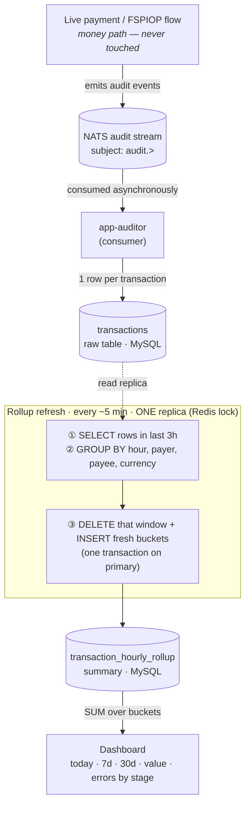
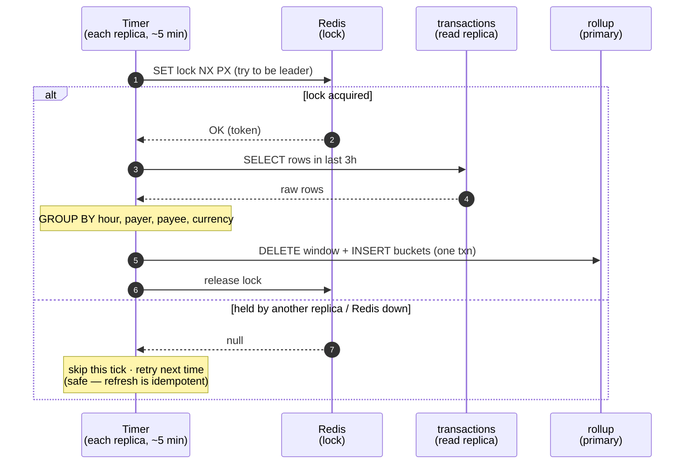
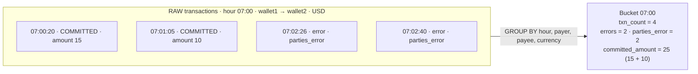
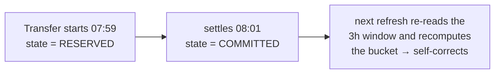

# Pivotal Hub Dashboard — How Data Reaches the Rollup

Visual walkthrough of how a live payment becomes a number on the dashboard.

> These diagrams use **Mermaid**. They render automatically on GitHub/GitLab, in VS Code (with a Mermaid preview extension), or at <https://mermaid.live>.

## 1. End-to-end pipeline



## 2. One refresh cycle (why only one replica runs)



## 3. What GROUP BY does — many raw rows collapse into one bucket



*4 raw rows → 1 summary row. `committed_amount` counts only money that moved (the two failures are excluded).*

## 4. Why re-read a window and replace it



A transfer can start in one hour and finish in the next, so each refresh recomputes a fixed trailing window and **replaces** those buckets (delete + re-insert) rather than adding to them. Once a bucket ages out of the window it is sealed. On a brand-new/empty rollup, a one-time **startup backfill** fills the full 30 days first so history is never missing.

## 5. One tick, end to end — the actual queries

Every ~5 min, one replica (the Redis-lock winner) runs the cycle below. The whole thing is **replace the window**: SELECT-aggregate a fixed 3-hour span, then DELETE + INSERT that *same* span.

**Step 1–2 · compute the window** (hour-aligned UTC; not literally `NOW()-3h`):

```
window_end   = current_hour + 1h     (start of the next hour — exclusive; includes the open hour)
window_start = window_end − 3h        (= current_hour − 2h)
```

At 09:41 → window = `[2026-06-22 07:00:00, 2026-06-22 10:00:00)`.

**Step 3 · SELECT-aggregate `transactions` over the window** (the read leg, on the replica). Say it returns two buckets — same hour/payer/payee, different currency:

```json
[
  { "bucket_hour": "2026-06-22 09:00:00", "payer_fsp": "wallet1", "payee_fsp": "wallet2", "currency": "USD",
    "txn_count": 4, "error_count": 1, "dispute_count": 0,
    "parties_error_count": 0, "quotes_error_count": 0, "transfers_error_count": 1, "patch_error_count": 0,
    "committed_amount": 1502.0000, "committed_count": 3, "latency_count": 4, "sum_latency_ms": 76126.0000 },

  { "bucket_hour": "2026-06-22 09:00:00", "payer_fsp": "wallet1", "payee_fsp": "wallet2", "currency": "XXX",
    "txn_count": 4, "error_count": 2, "dispute_count": 0,
    "parties_error_count": 2, "quotes_error_count": 0, "transfers_error_count": 0, "patch_error_count": 0,
    "committed_amount": 0.0000, "committed_count": 0, "latency_count": 2, "sum_latency_ms": 239.0000 }
]
```

**Step 4 · DELETE the rollup over the SAME window** (not a shifted one — `window_start` already equals `current_hour − 2h`). Half-open range, never SQL `BETWEEN`:

```sql
DELETE FROM transaction_hourly_rollup
WHERE bucket_hour >= '2026-06-22 07:00:00'   -- window_start (inclusive)
  AND bucket_hour <  '2026-06-22 10:00:00';  -- window_end   (exclusive)
```

This clears **all** buckets in the 3-hour span, including 07:00/08:00 buckets from the previous tick — whatever the fresh SELECT returns becomes the new truth.

**Step 5 · INSERT the selected rows** (the write leg). `updated_at` is stamped now (the dashboard's `asOf`); `USD` and `XXX` stay separate rows because `currency` is part of the primary key:

```sql
INSERT INTO transaction_hourly_rollup
    (bucket_hour, payer_fsp, payee_fsp, currency,
     txn_count, error_count, dispute_count,
     parties_error_count, quotes_error_count, transfers_error_count, patch_error_count,
     committed_amount, committed_count, latency_count, sum_latency_ms, updated_at)
VALUES
    ('2026-06-22 09:00:00', 'wallet1', 'wallet2', 'USD',
     4, 1, 0,  0, 0, 1, 0,  1502.0000, 3, 4, 76126.0000, '2026-06-22 09:41:07'),
    ('2026-06-22 09:00:00', 'wallet1', 'wallet2', 'XXX',
     4, 2, 0,  2, 0, 0, 0,  0.0000, 0, 2, 239.0000, '2026-06-22 09:41:07');
```

Steps 4 + 5 run inside **one transaction on the primary**, so a dashboard read never sees a half-rebuilt window. The next tick repeats the same DELETE + INSERT over `[07:00, 10:00)`; once the clock passes 12:00 the 09:00 bucket leaves the window and is sealed.

> The `XXX` bucket stays in the table and still counts toward activity (`txn_count`, `error_count`, latency), but `getValueByCurrency` filters `currency <> 'XXX'` so it never inflates the money view — the activity-vs-money split.

## In one line

**Live payment → NATS audit → `transactions` (raw, 1 row each) → 5-min GROUP BY into hourly buckets → `transaction_hourly_rollup` → dashboard sums.** Redis only picks which replica runs the refresh.
