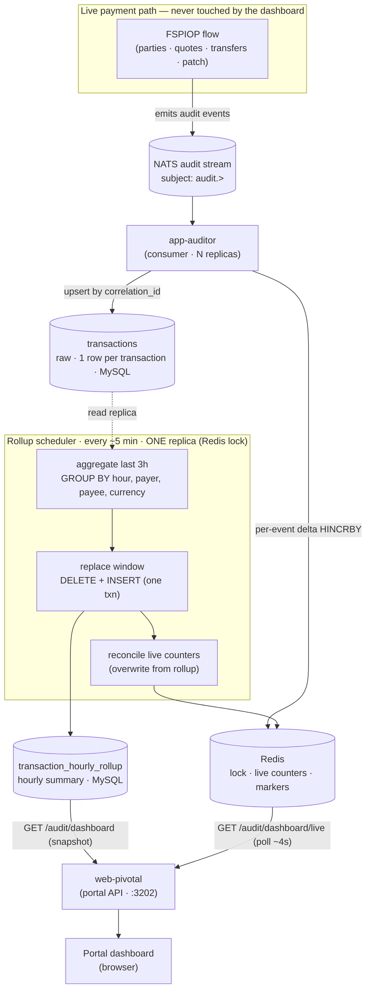
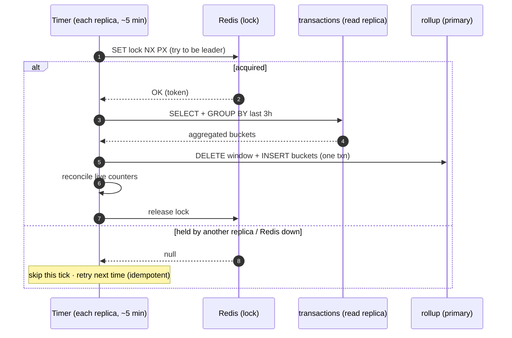
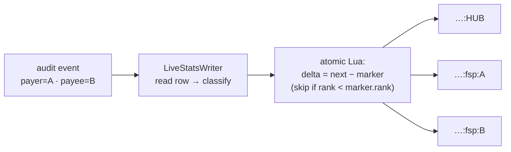

# Pivotal Hub Dashboard — System Design

A complete description of how the hub's statistics dashboard works end to end: the data
foundation, the two serving tiers, and how we use Redis, the database, the scheduler, and the
HTTP layer to deliver fast, correct, near-real-time numbers without ever touching the live
payment path.

> **Who this is for.** It is written for two readers. **Business / operations** readers can stay
> in the *Executive summary*, *What the numbers mean*, and *Operations* sections — they explain
> what the dashboard shows and why the figures are trustworthy. **Developers** get the full
> mechanics: schemas, queries, Redis keyspace, the scheduler, the concurrency model, and the
> file map.
>
> Diagrams use **Mermaid** (render on GitHub/GitLab, VS Code, or <https://mermaid.live>).

---

## 1. Executive summary

The portal home screen answers three questions at a glance: **Is money flowing? Is it
succeeding? Where are the problems?** It shows today/7-day/30-day transaction volumes, success
rate, errors and disputes, latency, value moved per currency, and breakdowns by hour, stage,
and FSP.

The design rests on four principles:

1. **Never touch the money path.** Every number comes from an *audit* copy of transactions,
   filled asynchronously. Looking at statistics can never slow or break a real payment.
2. **Pre-compute, don't scan.** A background job rolls raw transactions into small hourly
   summaries; the dashboard reads those summaries, so a page load is cheap no matter how much
   history exists.
3. **Two tiers, one truth.** An **analytical tier** (exact, refreshed every ~5 minutes) is the
   source of truth and history. A **live tier** (near-real-time, polled every few seconds)
   rides on top for the headline numbers and is continuously reconciled back to the truth.
4. **Honest numbers.** "Money moved" means money that actually moved; "success" means a real
   success; failures are attributed to the stage that failed. Activity and money are never
   blended into one misleading figure.

---

## 2. Architecture at a glance



**In one line:** live payment → NATS audit → `transactions` (raw) → 5-min rollup into hourly
buckets → dashboard reads the rollup for charts and Redis for live KPIs; Redis also coordinates
which replica runs the refresh.

---

## 3. Data foundation

### 3.1 How data arrives (off the money path)

The live FSPIOP flow emits **audit events** to a NATS JetStream subject (`audit.>`).
`app-auditor` consumes them and writes to the audit database. This is a decoupled, downstream
copy — telemetry can never block, await, or crash a payment.

### 3.2 The `transactions` table — one row per transaction

Every audit event for a transaction carries the same `correlation_id`. The auditor **upserts**
that one row through the transaction's lifecycle (parties → quotes → transfers → patch). So by
the time anything aggregates the table, **each transaction is a single row** carrying its final
merged flags — counting is per-transaction "for free."

The flags that matter for the dashboard:

| Column | Meaning |
|---|---|
| `error` (bool) | Outcome: `0` = committed/success, `1` = errored |
| `possible_dispute` (bool) | Payer was debited and the hub committed, but the payee-credit (patch) leg failed |
| `transfer_state` | Only ever `COMMITTED` or `NULL` in practice (so it is **not** used for outcome) |
| `parties_error` / `quotes_error` / `transfers_error` / `patch_error` | Which pipeline stage failed (exactly one set on an errored txn) |
| `transfer_currency` / `quoting_currency` | Currency (falls back transfer → quoting → `XXX`) |
| `transfer_amount` | Amount (populated even on some failures — see value semantics) |
| `transaction_started_at` / `transaction_completed_at` | Timing; latency = completed − started |

All timestamps are stored and read as **UTC** (the DB driver is pinned to `timezone: 'Z'`), and
the dashboard buckets by UTC hour / UTC day throughout.

---

## 4. Tier 1 — Analytical (the hourly rollup)

The exact, historical source of truth. Refreshed every ~5 minutes.

### 4.1 The rollup table

`transaction_hourly_rollup` holds one pre-aggregated row per
**(hour, payer FSP, payee FSP, currency)**:

```
PK (bucket_hour, payer_fsp, payee_fsp, currency)
    txn_count, error_count, dispute_count,
    parties_error_count, quotes_error_count, transfers_error_count, patch_error_count,
    committed_amount, committed_count,        -- value that MOVED (see §8)
    latency_count, sum_latency_ms,            -- additive; average derived at read time
    updated_at                                -- freshness ("as of")
```

Only **additive measures** are stored. Rates and averages (success rate, avg latency) are
derived at read time, so the buckets stay composable across any time range.

### 4.2 The scheduler — in-process timer + Redis lock

Why not a Kubernetes CronJob? It would be extra infrastructure. Instead the refresh runs as an
in-process `setInterval` inside `app-auditor` (matching the codebase's existing periodic-refresh
convention; `@nestjs/schedule` is not a dependency). `app-auditor` is horizontally scaled, so a
**Redis lock** (`SET NX PX`) ensures only one replica runs each cycle.



**Three time parameters (do not conflate):**

| Parameter | Value | Tunable? | Why |
|---|---|---|---|
| Bucket grain | 1 hour | No (schema) | Fine enough for intraday, coarse enough to stay tiny |
| Refresh interval | 300 s (`TRANSACTION_ROLLUP_INTERVAL_SECONDS`) | **Yes** (env) | Freshness knob only |
| Re-aggregation window | 3 hours | **No** (hardcoded) | Correctness-critical — too small silently produces wrong stats |

A **boot guard** refuses to start if `interval > window − 1h`, so a bucket can never age out of
the window before its final recompute.

### 4.3 Window math (replace, don't add)

A transfer can start late in one hour and settle in the next, so recent buckets must be
revisited. Each tick recomputes a fixed trailing window and **replaces** it:

```
window_end   = current_hour + 1h     (exclusive — includes the open hour)
window_start = window_end − 3h        (= current_hour − 2h)
```

At 09:41 the window is `[07:00, 10:00)`. The **same** window is used for both the SELECT and the
DELETE — that symmetry makes the refresh self-correcting and free of double-counting.

### 4.4 The queries

**Read leg (on the read replica)** — the heavy GROUP BY:

```sql
SELECT
    DATE_FORMAT(transaction_started_at, '%Y-%m-%d %H:00:00')        AS bucket_hour,
    payer_fsp, payee_fsp,
    COALESCE(transfer_currency, quoting_currency, 'XXX')            AS currency,
    COUNT(*)                                                        AS txn_count,
    SUM(error)                                                      AS error_count,
    SUM(possible_dispute)                                           AS dispute_count,
    SUM(parties_error    IS NOT NULL)                              AS parties_error_count,
    SUM(quotes_error     IS NOT NULL)                              AS quotes_error_count,
    SUM(transfers_error  IS NOT NULL)                              AS transfers_error_count,
    SUM(patch_error      IS NOT NULL)                              AS patch_error_count,
    COALESCE(SUM(CASE WHEN transfer_state='COMMITTED' OR possible_dispute=1
                      THEN transfer_amount ELSE 0 END), 0)         AS committed_amount,
    SUM(CASE WHEN transfer_state='COMMITTED' OR possible_dispute=1
             THEN 1 ELSE 0 END)                                     AS committed_count,
    SUM(transaction_completed_at IS NOT NULL)                      AS latency_count,
    SUM(TIMESTAMPDIFF(MICROSECOND, transaction_started_at,
                      transaction_completed_at) / 1000)            AS sum_latency_ms
FROM transactions
WHERE transaction_started_at >= ? AND transaction_started_at < ?   -- [window_start, window_end)
GROUP BY bucket_hour, payer_fsp, payee_fsp, currency;
```

**Write leg (on the primary, one transaction)** — replace the window:

```sql
DELETE FROM transaction_hourly_rollup WHERE bucket_hour >= ? AND bucket_hour < ?;
INSERT INTO transaction_hourly_rollup (...) VALUES (...);   -- the freshly computed buckets
```

Both run inside one transaction so a dashboard read never sees a half-rebuilt window.

**Dashboard reads** — small, indexed scans over the rollup (never the raw table):
`getTotals`, `getErrorStageBreakdown`, `getValueByCurrency`, `getTopFsps`, `getAvgLatencyMs`,
`getDailyTrend`, `getHourlyToday`, `getDailyLatency`, `getLastUpdatedAt`. They run concurrently
behind `GET /audit/dashboard` and assemble one payload.

### 4.5 Backfill (always-complete history)

The incremental window only fills *forward*. So on a freshly built/empty rollup (first deploy,
or a schema change that recreates the table), the scheduler does a one-time **backfill of 30
days** (day by day) at startup, before normal ticks — otherwise the 30-day trend would be empty
and "today" would miss hours older than the window. It no-ops on a normal restart (table
persists).

---

## 5. Tier 2 — Live (near-real-time)

The headline KPIs (transactions today, success rate, errors/disputes, avg latency) tick within
seconds instead of waiting for the 5-minute rollup. The live tier is a **fast estimate** that is
**continuously reconciled** back to the rollup truth.

### 5.1 Why it can't just poll the database faster

The 5-minute floor is a property of the *rollup job*, not the data. The freshest signal already
flows through `app-auditor`, which sees every transaction the instant it lands on NATS. So the
live tier taps the auditor: right after it persists a row, it updates small Redis counters.

### 5.2 Per-transaction counting (the crux)

The auditor is **event-driven** (4–8 events per transaction), but the dashboard counts
**transactions**. A naïve `+1` per event would over-count. So the live writer keeps a per-
transaction **marker** (the last vector it counted for that `correlation_id`) and applies only
the **difference**:

- First event → marker absent → delta is the full vector → `txn` increments exactly once.
- Later events → pure reclassifications (e.g. a dispute) with `txn` delta 0.

The classification is **flag-based, identical to the rollup**, so the two tiers measure exactly
the same thing:

| Derived label | Flag rule |
|---|---|
| success | `error = 0` |
| error | `error = 1` |
| dispute | `error = 1 AND possible_dispute = 1` |

### 5.3 Disputes are a late reclassification, not a new transaction

A dispute does **not** change `transfer_state` (it stays `COMMITTED`). On a patch failure the
**same row's flags flip** (`error = 1`, `possible_dispute = 1`). The live writer handles this as
one transition delta:

```
COMMITTED success  →  dispute   ⇒   success −1,  error +1,  dispute +1   (txn unchanged)
```

No special-casing — it falls out of "classify the current row, apply the difference." The rollup
captures the same flip passively (it reads final flags at aggregation time).

### 5.4 Concurrency: atomic, multi-replica-safe

Every `app-auditor` replica runs the writer on its own events, all writing to the same Redis.
The compare-marker → apply-delta → update-marker sequence is therefore done as a **single
atomic Redis Lua script**, gated by a monotonic **rank = the row's `updated_at`**:

- **Atomicity** prevents double-counting — a concurrent duplicate sees the marker already
  advanced and computes a zero delta.
- **Rank guard** prevents regression — an out-of-order (older) event is skipped.



Each transaction updates up to **three scopes** — hub, payer FSP, payee FSP (deduped when
payer == payee) — matching the dashboard's `(payer OR payee)` scoping.

### 5.5 Reconciliation (self-healing)

Every rollup tick, the leader replica recomputes today's authoritative per-scope totals from the
rollup and **overwrites** the live counters (`reconcileLive()`). So any drift the per-event path
accumulated (a missed event, replica lag, a rare race) is healed within one cycle. The live tier
is a fast forward-edge; the rollup remains the truth.

### 5.6 Read path & polling

`GET /audit/dashboard/live` derives the caller's scope from the JWT (exactly like the snapshot
endpoint), reads that scope's Redis counter (one O(fields) read), and returns the KPI DTO. The
portal polls it every ~4 s and overlays the four headline tiles on top of the rollup snapshot,
showing a **"Live"** badge. Charts stay on the snapshot. If Redis is unavailable the endpoint
returns zeros and the portal simply keeps showing the snapshot.

---

## 6. How we use Redis

Redis is a **coordinator and a fast counter store** — never the source of truth (the databases
are). Three uses:

| Use | Keys | TTL | Notes |
|---|---|---|---|
| **Rollup leader lock** | `pivotal:transaction-rollup:lock` | lock-duration | `SET NX PX`; best-effort, fail-closed |
| **Live counters** | `pivotal:live:{YYYY-MM-DD}:{hub \| fsp:ID}` (hash) | 48 h | ~10 small fields each; one per scope per UTC day |
| **Per-transaction markers** | `pivotal:live:cls:{correlationId}` | 1 h | Last counted vector + rank; bounds RAM and the idempotency window |

Counter hash fields: `txn, ok, err, disp, e_parties, e_quotes, e_transfers, e_patch, lat_cnt,
lat_sum`.

**Resilience:** both Redis clients (lock and live store) auto-reconnect with capped backoff and
swallow connection errors so a Redis outage can never crash a pod. The live store is
additionally **fail-fast and best-effort** — every method no-ops when Redis isn't ready, so a
hiccup can never stall the audit consume loop or a dashboard read. Reconciliation repairs the
gap.

**Memory:** counters are KBs even at hundreds of FSPs. Markers are the only real driver and
scale with throughput × 1 h TTL (≈ tens of MB at 10 TPS; KBs on a dev desktop).

---

## 7. How we use the database (queries)

- **Read replica vs primary.** All heavy reads — the rollup's GROUP BY scan, the live writer's
  per-event lookup, every dashboard read, and reconciliation — run on the **read replica**. Only
  the rollup's small `DELETE + INSERT` writes to the **primary**, in a short transaction. This
  keeps the heavy scan and reporting load off the payment-writing primary.
- **Rollup reads are tiny and indexed.** The dashboard never scans `transactions`; it sums the
  small rollup table. The live writer's lookup is a point read on the unique `correlation_id`
  index (sub-millisecond).
- **Reconciliation** reads only the rollup: `getLiveTotals` (per scope) + `getActiveFsps`
  (distinct FSPs active today).
- **Scoping** is one SQL fragment, derived server-side from the JWT and never the client:
  `AND (payer_fsp = ? OR payee_fsp = ?)`. Because a transaction is exactly one rollup row, the
  `OR` counts each once with no double-counting.

---

## 8. What the numbers mean (counting semantics)

*(The most important section for business readers.)*

- **Activity vs. money are separate.** Counts, error rates, and latency include **everything that
  happened** (the operations view). Value metrics reflect **only money that actually moved** (the
  finance view). They are never merged.
- **Outcome is binary on the `error` flag.** `error = 0` is committed/success; `error = 1` is an
  error. There is no vague "unknown" bucket. Success rate = committed ÷ total.
- **A dispute is an error *and* a dispute *and* money-moved.** It lowers success rate (it's an
  error), it's counted as a dispute, and its value still counts (the payer was debited and the
  hub committed; only the payee-credit leg failed).
- **Value = money that moved.** `committed_amount` sums transfers where
  `transfer_state = 'COMMITTED' OR possible_dispute = 1`. Failed/rejected attempts are excluded —
  a single huge failed transfer can't inflate the total. Pivotal has no settlement of its own
  (that's Mojaloop settlement), so we say "moved," not "settled."
- **`XXX` is the no-currency placeholder** for pre-financial failures (e.g. party lookup). It
  counts toward activity but is excluded from the money view (`currency <> 'XXX'`).
- **Errors by stage.** Each failed transaction is attributed to the one stage that failed
  (Parties, Quotes, Transfers, Patch) — turning a raw error count into a "which service is
  struggling" signal.

---

## 9. Security & access scoping

- **Permission-gated.** Both endpoints require `audit.dashboard.view`.
- **Scope derived from the JWT, never the client.** HUB users (no `fspId`) see all FSPs; a DFSP
  user is scoped to its own `(payer OR payee)` activity — in the rollup via the SQL clause, in the
  live tier via the per-FSP Redis scope read for `fsp:{theirId}`.
- **No hybrid live scope.** A session is either HUB or exactly one FSP. A person who genuinely
  needs both powers uses two accounts — keeping the counter model and isolation simple.
- **Permissions are baked into the JWT at login** — a user must re-login after a grant change.

---

## 10. Failure modes & resilience

| Event | Effect | Recovery |
|---|---|---|
| Redis down (lock) | Tick skipped (fail-closed) | Next tick retries; rollup is idempotent |
| Redis down (live) | Live writes/reads no-op | Portal shows the rollup snapshot; reconciliation reseeds when Redis returns |
| `app-auditor` replica restart | In-flight live deltas may be missed | Reconciliation reseeds within one cycle; rollup unaffected |
| Out-of-order / duplicate events | None | Atomic Lua + `updated_at` rank guard; markers make reprocessing idempotent |
| Read-replica lag (row not visible yet) | Live event skipped | Picked up on a later event or by reconciliation |
| Empty/recreated rollup | History would be missing | One-time 30-day backfill at startup |

The unifying idea: **the live tier is best-effort and self-healing; the rollup is exact and
authoritative; reconciliation ties them together every ~5 minutes.**

---

## 11. Performance & scaling

- **Dashboard reads:** sub-millisecond — small indexed sums over the rollup, plus one O(fields)
  Redis read for live.
- **Per audit event (live writer):** +1 indexed point lookup + ~2 Redis round trips. Negligible
  at dev volume; trivial at 100 TPS (≈600 lookups/s, a few k Redis ops/s).
- **Rollup tick:** one bounded GROUP BY on the replica + a small write txn, every 5 minutes, on
  one replica only.
- **Redis RAM:** counters in KBs; markers ≈ throughput × 1 h (tens of MB at 10 TPS).
- **Desktop verdict:** imperceptible across CPU, RAM, and DB. Redis is already required for the
  rollup lock, so the live tier adds no new infrastructure.
- **Scale levers (not needed yet):** shorten marker TTL; batch reconciliation into 3 grouped
  queries instead of one-per-FSP; switch the live transport from polling to SSE (the write side
  is identical).

---

## 12. Operations

**Environment variables**

| App | Variable | Purpose |
|---|---|---|
| app-auditor | `REDIS_URL` | Rollup lock + live counters (required) |
| app-auditor | `TRANSACTION_ROLLUP_INTERVAL_SECONDS` | Refresh frequency (default 300) |
| web-pivotal | `REDIS_URL` | Read live counters (required) |

**Deploy / restart notes**

- Schema or scheduler changes require restarting **app-auditor**; read-side changes require
  restarting **web-pivotal**.
- **web-pivotal now requires Redis** to be reachable (it reads the live counters).
- After a rollup table (re)creation, the first startup backfills 30 days before normal ticks.

**What to watch**

- `asOf` / the "Live" badge on the dashboard — freshness of each tier.
- Auditor logs: rollup tick + reconcile lines; Redis outage warnings (rate-limited).

---

## 13. Key files

| Concern | File |
|---|---|
| Rollup table schema | `packages/core/audit/domain/sql/V1_2__create_transaction_hourly_rollup.sql` |
| Rollup + dashboard + live queries | `packages/core/audit/domain/repository/transaction-rollup.repository.ts` |
| Scheduler (timer, window, backfill, reconcile) | `packages/core/audit/domain/component/transaction-rollup.scheduler.ts` |
| Rollup leader lock | `packages/core/audit/domain/component/rollup-lock.ts` |
| Live classification + delta + KPI mapper | `packages/core/audit/domain/component/live-stats.classifier.ts` |
| Live Redis store (atomic Lua, reseed, read) | `packages/core/audit/domain/component/live-stats.store.ts` |
| Live per-event writer | `packages/core/audit/domain/component/live-stats.writer.ts` |
| Auditor consumer (invokes the writer) | `packages/core/audit/consumer/listener/audit-transaction.consumer.ts` |
| Auditor wiring | `packages/core/audit/consumer/consumer.module.ts` |
| Snapshot read endpoint | `packages/core/audit/domain/query/get-dashboard.{query,handler}.ts` |
| Dashboard controller (snapshot + live) | `packages/apps/web-pivotal/controllers/audit/dashboard.controller.ts` |
| Portal store (snapshot + live polling) | `packages/portal/src/stores/audit-dashboard.store.ts` |
| Portal dashboard page | `packages/portal/src/pages/DashboardPage.vue` |

**Related docs:** `dashboard-data-flow.md` (visual walkthrough), `dashboard-design-decisions.md`
(decision records), `dashboard-features.md` (feature overview).

---

## 14. Glossary

- **Rollup / analytical tier** — the pre-aggregated hourly summary; exact, ~5-min fresh.
- **Live tier** — Redis counters updated per event; near-real-time, reconciled to the rollup.
- **Bucket** — one rollup row for an (hour, payer, payee, currency).
- **Window** — the fixed trailing 3 h the scheduler recomputes each tick.
- **Marker** — per-transaction Redis key holding the last vector counted, for delta + idempotency.
- **Scope** — `hub` (all FSPs) or `fsp:{id}` (one DFSP's `payer OR payee` slice).
- **Reconciliation** — overwriting the live counters from the rollup each tick.
- **Dispute** — payer debited + hub committed, but the payee-credit (patch) leg failed; money
  moved, so it still counts as value.
- **`XXX`** — ISO "no currency" placeholder for pre-financial failures; excluded from money views.
