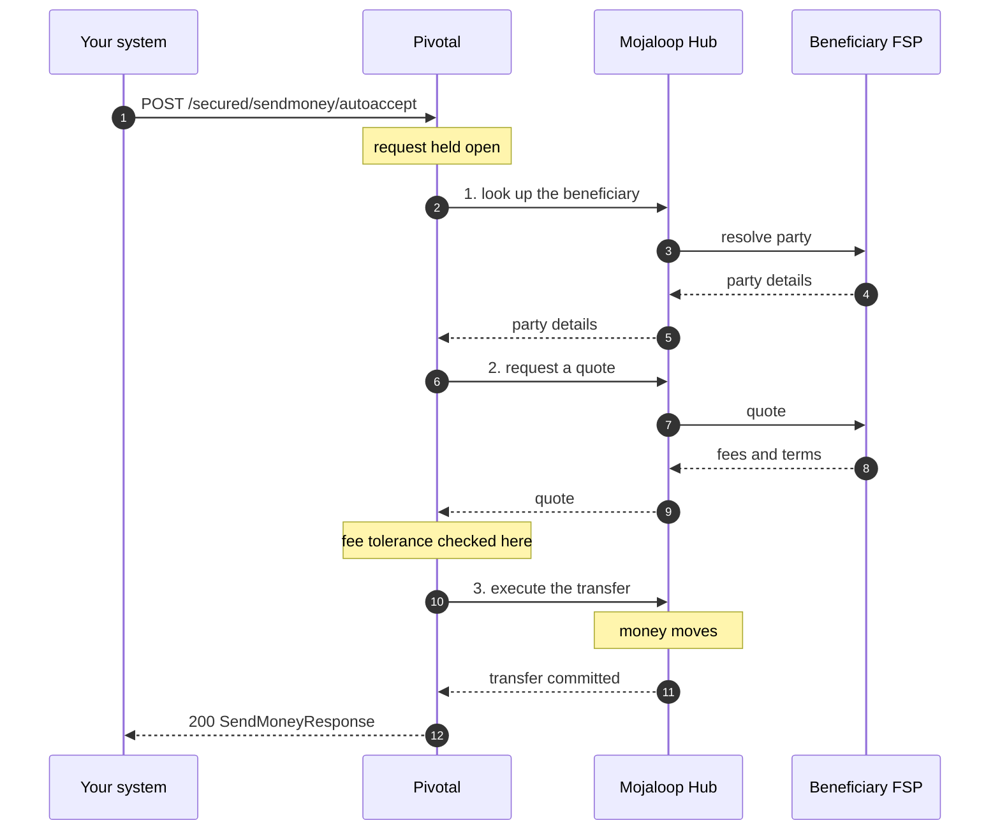
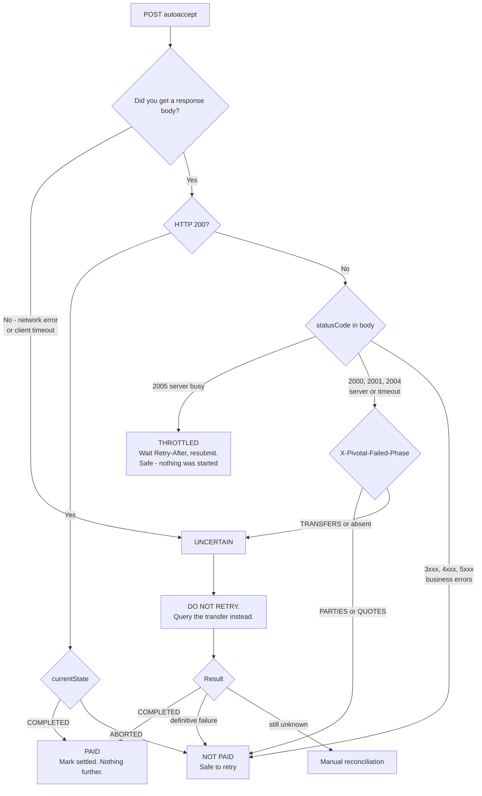
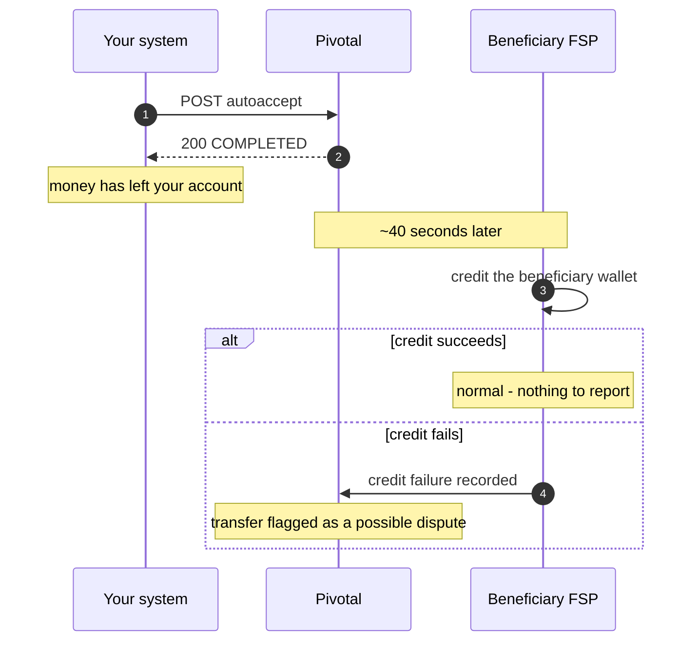

# Send-Money Auto-Accept — DFSP Integration Guide

> ## ⚠ DRAFT — proposed API, not yet available
>
> This document describes an endpoint that is **under design**. No environment currently serves it.
> It is circulated so the contract can be reviewed and agreed before implementation.
>
> **Do not begin integration work until Pivotal confirms availability per environment.**
> Field names, error codes and limits may still change in response to feedback on this draft.

**Audience:** integration engineers at a payer DFSP
**Endpoint:** `POST /secured/sendmoney/autoaccept` *(proposed)*
**Draft:** 0.1 · 2026-08-19

---

## 1. What this endpoint does

Send money to a beneficiary in **one HTTP call**. Pivotal performs the party lookup, obtains a quote
and executes the transfer on your behalf, then returns the completed result.

```
Existing three-call flow                        Auto-accept
────────────────────────                        ───────────
POST /secured/sendmoney              → 202      POST /secured/sendmoney/autoaccept  → 200
PUT  /secured/sendmoney/{id}  acceptParty       (one call, one response)
PUT  /secured/sendmoney/{id}  acceptQuote
```

The response body is **identical** to what the third call returns today, so if you already integrate
with the three-call flow you can reuse your existing response parsing unchanged.

**Use this for:** bulk disbursement (salary, benefits, G2P), and any flow where you do not need to
show the resolved payee name or the quoted fee to a human before paying.

**Do not use this if** your business process requires a person to confirm the beneficiary or the fee
between lookup and payment — the three-call flow exists for that.

---

## 2. Before you start

| # | Item | Notes |
| --- | --- | --- |
| 1 | Your **FSP ID** | e.g. `BIGBANKGN`. Sent in the `FSPIOP-Source` header on every request |
| 2 | An **RSA key pair** for request signing | 2048-bit. You keep the private key — it must never leave your systems |
| 3 | Your **public key registered** with Pivotal | Provide the public half to the hub operator during onboarding |
| 4 | **Network access** | Your egress IPs allowlisted, and VPN or mTLS as agreed |
| 5 | **Base URL** | Provided per environment |
| 6 | **Agreed concurrency limit** | Default **50** concurrent requests — see §8 |

---

## 3. Authentication

Every request carries two headers beyond the usual:

```http
FSPIOP-Source: BIGBANKGN
Authorization: eyJhbGciOiJSUzI1NiIsInR5cCI6IkpXVCJ9.eyJob21lVHJh...
```

`Authorization` is a **raw RS256 JWT whose payload is the request body**. It is a detached signature
over your request, not a bearer token.

### Two things that catch people out

**1. No `Bearer ` prefix.** The header value is the JWT itself — three dot-separated segments.

**2. Your JWT library probably adds `iat`.** Most do by default, and that extra claim makes the token
payload differ from the body, so every request fails with `3105 Invalid signature`. Disable it.

```ts
import jwt from 'jsonwebtoken';
import { readFileSync } from 'node:fs';

const PRIVATE_KEY = readFileSync('./dfsp-access-private.pem', 'utf8');

/** Sign a request that has a JSON body. */
function signBody(body: object): string {
  return jwt.sign(body, PRIVATE_KEY, {
    algorithm: 'RS256',
    noTimestamp: true,   // REQUIRED — see note 2 above
  });
}

/** Sign a request with no body (GET). The payload is the Date header value,
 *  and the string must match the header byte for byte. */
function signBodyless(dateHeader: string): string {
  return jwt.sign({ date: dateHeader }, PRIVATE_KEY, {
    algorithm: 'RS256',
    noTimestamp: true,
  });
}
```

Key order in the body does not matter — Pivotal normalises both sides before comparing.

---

## 4. What happens during the call

You make one request. Pivotal makes three round trips to the Mojaloop Hub on your behalf, which is
why the call takes a few seconds rather than a few milliseconds.



**Typical: about 5 seconds. Worst case: 90 seconds.** Pivotal enforces a hard 90-second deadline and
always returns a response — it will not leave you waiting indefinitely.

---

## 5. Request

```http
POST /secured/sendmoney/autoaccept HTTP/1.1
Host: pivotal.example.com
Content-Type: application/json
FSPIOP-Source: BIGBANKGN
Date: Tue, 19 Aug 2026 10:40:02 GMT
Authorization: eyJhbGciOiJSUzI1NiIsInR5cCI6IkpXVCJ9...
```

```json
{
  "homeTransactionId": "G2P-2026-08-000001",
  "from": {
    "type": "CONSUMER",
    "idType": "MSISDN",
    "idValue": "224620000001",
    "fspId": "BIGBANKGN"
  },
  "to": {
    "idType": "MSISDN",
    "idValue": "224660000002",
    "fspId": "ORANGEGN"
  },
  "amountType": "SEND",
  "currency": "GNF",
  "amount": "150000",
  "transactionType": "TRANSFER",
  "subScenario": "SALARY_DISBURSEMENT",
  "note": "August 2026 salary",
  "maxPayeeFee": "500"
}
```

| Field | Required | Notes |
| --- | --- | --- |
| `homeTransactionId` | **yes** | **Your** identifier, max 128 chars. This is the idempotency key — see §7 |
| `from` | yes | `fspId` must equal your `FSPIOP-Source` |
| `to` | yes | The beneficiary |
| `amountType` | yes | `SEND` or `RECEIVE` |
| `currency`, `amount` | yes | Amount as a string. Decimal places are scheme-configured — Guinea is whole numbers only |
| `transactionType` | yes | e.g. `TRANSFER` |
| `subScenario` | yes | Max 32 chars, `[A-Z_]` |
| `note` | no | Max 128 chars |
| `maxPayeeFee` | no | Reject rather than pay if the quoted payee fee exceeds this |
| `expectedPayeeReceiveAmount` | no | Reject if the beneficiary would receive a different amount |

`maxPayeeFee` matters here in a way it does not in the three-call flow: since nobody reviews the
quote, it is your only control over what the beneficiary FSP charges. **Set it.**

---

## 6. Response

### Success — `200`

Also returns `X-Pivotal-Transfer-Id`.

```json
{
  "transferId": "01JXQK7M8N9P0Q1R2S3T4U5V6W",
  "homeTransactionId": "G2P-2026-08-000001",
  "from": { "type": "CONSUMER", "idType": "MSISDN", "idValue": "224620000001", "fspId": "BIGBANKGN" },
  "to":   { "idType": "MSISDN", "idValue": "224660000002", "fspId": "ORANGEGN",
            "firstName": "Fatoumata", "lastName": "Camara" },
  "amountType": "SEND",
  "transactionType": "TRANSFER",
  "subScenario": "SALARY_DISBURSEMENT",
  "note": "August 2026 salary",
  "amount": "150000",
  "payeeReceiveAmount": "150000",
  "transferAmount": "150000",
  "payeeFee": "0",
  "payerFee": "0",
  "schemeFee": "0",
  "currency": "GNF",
  "currentState": "COMPLETED",
  "initiatedTimestamp": "2026-08-19T10:40:02.482Z",
  "direction": "OUTGOING",
  "supportedCurrencies": ["GNF"]
}
```

`currentState` is `COMPLETED` (money moved) or `ABORTED` (the Hub aborted the transfer — no money
moved, safe to retry).

### Failure

```json
{
  "statusCode": "3204",
  "message": "Party not found",
  "localeMessage": "Beneficiaire introuvable",
  "detailedDescription": "Party with MSISDN 224660000002 not found at ORANGEGN"
}
```

Failures also carry `X-Pivotal-Failed-Phase`, which tells you **where** it failed and therefore
whether retrying is safe:

| Header value | Meaning | Money moved? |
| --- | --- | --- |
| `PARTIES` | failed looking up the beneficiary | no |
| `QUOTES` | failed obtaining or accepting the quote | no |
| `TRANSFERS` | failed during or after the transfer was sent | **possibly** |

---

## 7. Handling the response — the decision that prevents double payment

There are **four** outcomes, not two. Treating the fourth as a failure is how a disbursement gets paid
twice.

**Branch on the `statusCode` in the response body, not on the HTTP status.** The body always carries
the precise reason. HTTP status only matters when there is no body at all.



**The rule:** retry only when you have positive confirmation that no money moved. A timeout is not
confirmation of anything.

Business errors — a beneficiary that does not exist, a limit breach, an unsupported currency — are
always definitive. Money never moved, and retrying after correcting the data is safe.

> **Note on HTTP status codes.** Most Pivotal errors return `417 Expectation Failed` regardless of
> category. Do not attempt to classify on the HTTP status — a `417` may be a validation error, a
> missing beneficiary or a limit breach, and `500` is used for at least one ordinary business
> rejection. The `statusCode` field in the body is the reliable discriminator.

### Resolving an uncertain transfer

```http
GET /secured/sendmoney/{transferId}
```

Use the `X-Pivotal-Transfer-Id` header value. If you never received it — a connection that dropped
before any response — reconcile using your own `homeTransactionId` records with the hub operator.

### Idempotency

`homeTransactionId` is the key that protects you:

| Situation | Pivotal's response |
| --- | --- |
| Same `homeTransactionId`, earlier attempt **succeeded** | `417`, `statusCode 3000`, with a reference to the original transfer — you are not charged twice |
| Same `homeTransactionId`, earlier attempt **definitively failed** | Proceeds normally — this is a legitimate retry |
| Same `homeTransactionId`, earlier outcome **uncertain** | `417`, `statusCode 3000` — must be reconciled, never re-paid automatically |
| Same `homeTransactionId`, **different** request content | `417`, `statusCode 3106` (modified request) — reusing a key for a different payment is rejected |

**Always reuse the same `homeTransactionId` when retrying the same payment.** Generating a fresh one
defeats the protection entirely.

---

## 8. Concurrency and throughput

**Default limit: 50 concurrent in-flight requests per DFSP.**

This is a limit on requests *in flight at once*, not requests per second — each call stays open for
several seconds, so what matters is how many are open simultaneously.

At roughly 5 seconds per transfer:

| Concurrency | Approx. throughput | 100,000 transfers |
| --- | --- | --- |
| 20 | 4 per second | ~6.3 hours |
| **50** | **11 per second** | **~2.5 hours** |

Exceeding the limit returns **`429`** with `statusCode 2005` (server busy) and a `Retry-After`
header. This is normal back-pressure, not an error — the request was rejected before any work
started, so **resubmitting after the delay is completely safe**.

`2005` is the only condition for which resubmitting the identical request is unconditionally safe.

> **Treat `429` as the authoritative signal, not the documented number.** A client that backs off on
> `429` stays correct if the limit is raised or lowered. One that hardcodes 50 does not.

### Timeouts to configure

| Setting | Value |
| --- | --- |
| Your HTTP client timeout | **at least 120 seconds** |
| Your HTTP client retries | **disabled** for this endpoint |

A timeout shorter than 120s means you give up while Pivotal is still working, turning a transfer that
would have succeeded into one you must reconcile.

Many HTTP client libraries retry `POST` on connection failure **by default**. Verify yours does not —
this is the single most common cause of duplicate payments.

---

## 9. Disputes — why a success can still need follow-up

A `COMPLETED` response means the transfer **settled between the two institutions**. It does not
guarantee that the beneficiary's wallet was credited — that happens inside the beneficiary's FSP, a
little later, and can fail on their side.



This is **not** specific to auto-accept — it is true of the three-call flow today. It simply becomes
noticeable at disbursement scale, where thirty cases may surface at once rather than one every few
weeks.

### How this reaches you today

Pivotal records the credit failure against the transaction, and it is visible to hub operations
staff through the Pivotal portal. **There is currently no DFSP-facing API for retrieving these.**
Raise them with the hub operator as part of your post-disbursement reconciliation.

A self-service endpoint for payer DFSPs is under consideration. If your reconciliation process needs
one, say so during review of this draft — it is a strong input to whether it is built.

**A transfer in this state must never be re-paid.** The money has already left your account, and
resolution is an operational matter with the beneficiary FSP.

> Credit failures are only visible where the beneficiary FSP is served by the same Pivotal
> deployment. For beneficiaries at institutions outside it, credit confirmation comes through normal
> settlement reconciliation instead.

---

## 10. Complete example

```ts
import jwt from 'jsonwebtoken';
import { readFileSync } from 'node:fs';

const BASE_URL = 'https://pivotal.example.com';
const FSP_ID = 'BIGBANKGN';
const PRIVATE_KEY = readFileSync('./dfsp-access-private.pem', 'utf8');
const CLIENT_TIMEOUT_MS = 120_000;
const MAX_CONCURRENT = 50;

const sleep = (ms: number) => new Promise(r => setTimeout(r, ms));

const signBody = (body: object) =>
  jwt.sign(body, PRIVATE_KEY, { algorithm: 'RS256', noTimestamp: true });

const signBodyless = (date: string) =>
  jwt.sign({ date }, PRIVATE_KEY, { algorithm: 'RS256', noTimestamp: true });

export type Outcome =
  | { kind: 'PAID';      transferId: string; response: SendMoneyResponse }
  | { kind: 'NOT_PAID';  httpStatus: number; error: PivotalError }
  | { kind: 'THROTTLED'; retryAfterMs: number }
  | { kind: 'UNCERTAIN'; transferId?: string; reason: string };

export async function sendMoney(req: SendMoneyRequest): Promise<Outcome> {
  const date = new Date().toUTCString();

  let res: Response;
  try {
    res = await fetch(`${BASE_URL}/secured/sendmoney/autoaccept`, {
      method: 'POST',
      headers: {
        'content-type': 'application/json',
        'fspiop-source': FSP_ID,
        'date': date,
        'authorization': signBody(req),      // raw JWT, no "Bearer "
      },
      body: JSON.stringify(req),
      signal: AbortSignal.timeout(CLIENT_TIMEOUT_MS),
    });
  } catch (err) {
    // Network failure or client timeout. We do NOT know whether money moved.
    return { kind: 'UNCERTAIN', reason: `transport: ${(err as Error).message}` };
  }

  const transferId = res.headers.get('x-pivotal-transfer-id') ?? undefined;
  const phase = res.headers.get('x-pivotal-failed-phase');

  if (res.ok) {
    return { kind: 'PAID', transferId: transferId!, response: await res.json() };
  }

  const error: PivotalError = await res.json();

  // Branch on the FSPIOP statusCode, NOT the HTTP status. Most errors return 417
  // regardless of category, and at least one business rejection returns 500.
  if (error.statusCode === '2005') {
    return {
      kind: 'THROTTLED',
      retryAfterMs: Number(res.headers.get('retry-after') ?? 1) * 1000,
    };
  }

  // Server-side or timeout errors: safe only if we know it failed before the
  // transfer was dispatched.
  const SERVER_CODES = ['2000', '2001', '2003', '2004'];
  if (SERVER_CODES.includes(error.statusCode) && phase !== 'PARTIES' && phase !== 'QUOTES') {
    return { kind: 'UNCERTAIN', transferId, reason: `statusCode ${error.statusCode}` };
  }

  // Everything else is a business error — definitive, no money moved.
  return { kind: 'NOT_PAID', httpStatus: res.status, error };
}

/** Fan out a disbursement, respecting the concurrency limit. */
export async function runDisbursement(
  rows: SendMoneyRequest[],
  concurrency = MAX_CONCURRENT,
): Promise<Map<string, Outcome>> {
  const results = new Map<string, Outcome>();
  const queue = [...rows];

  async function worker(): Promise<void> {
    for (let req = queue.shift(); req !== undefined; req = queue.shift()) {
      let outcome = await sendMoney(req);

      // Safe: a 429 is rejected before any work starts, so no transfer exists.
      while (outcome.kind === 'THROTTLED') {
        await sleep(outcome.retryAfterMs);
        outcome = await sendMoney(req);
      }

      results.set(req.homeTransactionId, outcome);
    }
  }

  await Promise.all(Array.from({ length: concurrency }, worker));
  return results;
}

/** Resolve an uncertain transfer. Query — never retry. */
export async function queryTransfer(transferId: string) {
  const date = new Date().toUTCString();
  const res = await fetch(`${BASE_URL}/secured/sendmoney/${transferId}`, {
    headers: {
      'fspiop-source': FSP_ID,
      'date': date,
      'authorization': signBodyless(date),
    },
  });
  return res.json();
}
```

### Applying the results

```ts
const results = await runDisbursement(payrollRows);

for (const [homeTransactionId, outcome] of results) {
  switch (outcome.kind) {
    case 'PAID':
      outcome.response.currentState === 'COMPLETED'
        ? markPaid(homeTransactionId, outcome.transferId)
        : scheduleRetry(homeTransactionId);       // ABORTED — no money moved
      break;

    case 'NOT_PAID':
      scheduleRetry(homeTransactionId);           // definitively failed
      break;

    case 'UNCERTAIN':
      queueForReconciliation(homeTransactionId, outcome.transferId);
      break;                                       // never re-pay
  }
}
```

Match results on `homeTransactionId`, never on array position.

Note that `signBodyless` is used only by `queryTransfer` — keep it, since bodyless signing is also
what any future `GET` endpoint will require.

---

## 11. Error reference

| Code | Meaning | Typically means | Retry? |
| `statusCode` | HTTP | Meaning | Typically means | Retry? |
| --- | --- | --- | --- | --- |
| `3100` | 417 | Generic validation error | Malformed request | after fixing |
| `3101` | 417 | Malformed syntax | Bad field format, e.g. a decimal amount where whole numbers are required | after fixing |
| `3102` | 417 | Missing mandatory element | A required field is absent | after fixing |
| `3104` | 413 | Too large payload | Request body exceeds the limit | after fixing |
| `3105` | **401** | Invalid signature | Signing problem — check `noTimestamp` and the `Bearer` prefix | after fixing |
| `3106` | 417 | Modified request | `homeTransactionId` reused with different content | no — use a new id |
| `3000` | 417 | Generic client error | A duplicate of an earlier request | **no — reconcile first** |
| `3203` | 417 | Payee FSP ID not found | `to.fspId` is not a scheme participant | no — fix your data |
| `3204` | 417 | Party not found | The beneficiary does not exist at that FSP | no — fix your data |
| `4001` | 417 | Payer FSP insufficient liquidity | Your position has insufficient funds | after funding |
| `4200` | 417 | Payer limit error | Amount or frequency exceeds your limits | no |
| `5000` | **500** | Generic payee error | Beneficiary-side rejection — **a business error despite the 5xx status** | usually no |
| `5200` | 417 | Payee limit error | Beneficiary would breach a wallet or balance limit | no |
| `1001` | 502 | Destination communication error | The beneficiary FSP could not be reached | yes, later |
| `2003` | 503 | Service currently unavailable | Temporary — maintenance or overload | yes, later |
| `2005` | **429** | Server busy | Concurrency limit reached | **yes — safe, honour `Retry-After`** |
| `2004` | 504 | Server timed out | No callback within the deadline | **check the failed phase first** |

Two rows deserve attention:

**`2004` — server timed out.** With `X-Pivotal-Failed-Phase: PARTIES` or `QUOTES`, no money moved and
retrying is safe. With `TRANSFERS`, or with no phase header at all, treat it as **uncertain** and
query instead.

**`5000` — returns HTTP `500` but is a business error.** The beneficiary FSP rejected the payment and
no money moved. This is why you should classify on `statusCode` rather than the HTTP status: treating
every `5xx` as uncertain would send these to manual reconciliation unnecessarily.

---

## 12. Go-live checklist

| # | Item | Why it matters |
| --- | --- | --- |
| 1 | `noTimestamp: true` (or equivalent) when signing | Otherwise every request fails `3105` |
| 2 | Raw JWT in `Authorization`, no `Bearer ` prefix | Otherwise every request fails |
| 3 | Client HTTP timeout **at least 120s** | Shorter means abandoning transfers still in progress |
| 4 | **HTTP client retries disabled** for this endpoint | **Duplicate payment** |
| 5 | Never retry on timeout, or on `2004`/`2000`/`2001` at the `TRANSFERS` phase — query instead | **Duplicate payment** |
| 6 | Reuse `homeTransactionId` verbatim on retry | **Duplicate payment** |
| 7 | Classify on `statusCode` in the body, not the HTTP status | Misclassified outcomes |
| 8 | Concurrency capped, `2005`/`429` and `Retry-After` honoured | Avoids throttling cascading into timeouts |
| 9 | `maxPayeeFee` set on every request | Your only control over beneficiary FSP fees |
| 10 | Results matched on `homeTransactionId` | Avoids misapplied outcomes |
| 11 | Post-disbursement reconciliation agreed with the hub operator | Uncredited beneficiaries otherwise go unnoticed (§9) |
| 12 | End-to-end test in a non-production environment | Including a deliberate timeout and a deliberate failure |

Items 4, 5 and 6 are the ones that can pay a beneficiary twice. Please verify them explicitly before
go-live rather than assuming library defaults are safe.

---

## 13. Support

Report the following when raising an issue:

- `homeTransactionId` and, if you have it, `X-Pivotal-Transfer-Id`
- The timestamp of the request in UTC
- The HTTP status, `statusCode` and `X-Pivotal-Failed-Phase` from the response
- Your `FSPIOP-Source`

Never include private keys or full `Authorization` header values.
