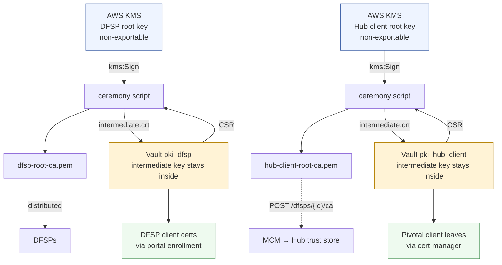

# Production PKI Ceremony — Vault OSS + AWS KMS

Operational runbook for bringing up **both** CA trust domains in the **KMS-backed profile**, using a
non-exportable AWS KMS key as each Root CA and Vault OSS PKI as each Intermediate CA.

Run **once per deployment**.

> ### ⚠ Check this is the right profile before you start
>
> **AWS KMS is multi-tenant hardware.** The root keys here are non-exportable and never leave the
> service, but the service is shared with other customers, and the per-DFSP signing keys under this
> profile are held in Vault and used in software.
>
> **If your deployment requires a dedicated hardware security module for private-key storage, stop.**
> Use [`../../hsm/`](../../hsm/) instead, where both roots are generated inside your own CloudHSM
> cluster and signing happens in the hardware.
>
> This profile is the right answer where that is not required. It is a deliberate choice, not a
> default — make it knowingly.

---

## 1. What you are building

**Two independent trust domains. Run this entire ceremony twice**, with a **separate KMS key each
time.** They must never share a root: a shared root would make a DFSP's client certificate trusted by
the Hub.

| | **DFSP-facing CA** | **Hub-client CA** |
| --- | --- | --- |
| Vault mount | `pki_dfsp` | `pki_hub_client` |
| KMS alias | `alias/pivotal-dfsp-root-ca` | `alias/pivotal-hub-client-root-ca` |
| Issues | client certs **to DFSPs** | client leaves **to Pivotal workloads** |
| Leaf requested by | a human — portal CSR upload | **cert-manager**, automatically |
| Leaf TTL | 1 year | 90 days |
| Trusted by | **Pivotal only** | **the Mojaloop Hub**, via MCM registration |
| Root goes to | distributed to DFSPs | `POST /dfsps/{dfspId}/ca` for **every** tenant, then the Hub operator installs it |



---

## 2. Prerequisites

- An EC2 **ceremony instance** with an IAM role that may `kms:Sign` and `kms:GetPublicKey` on the
  root keys **and nothing else**. Terminate it afterwards.
- Vault OSS reachable, already unsealed. Its **auto-unseal key must be a different KMS key** from
  either root — see §6.
- CloudTrail enabled in the region, with the alarm from §6 **created and tested before** the real
  ceremony.
- **The AWS region decided in advance.** KMS keys are regional and cannot be moved.
- `aws`, `vault`, `openssl`, `jq`, and `python3` with `boto3`, `asn1crypto` and `cryptography`.

> ⚠ **Read this before touching KMS.** The two root keys created here are non-exportable and cannot
> be recovered. Everything issued underneath them stops verifying if a key is deleted. Do not put
> them under Terraform, Argo CD, or any reconcile loop — root creation is a one-time bootstrap.

### Two AWS identities, deliberately separate

Two different AWS identities are involved, deliberately:

| Step | Identity | Needs |
| --- | --- | --- |
| **Creating the keys** (§3) | your **admin** identity | `kms:CreateKey`, `kms:CreateAlias`, `kms:PutKeyPolicy` |
| **The ceremony** (§4) | the **`pki-ceremony`** role | `kms:Sign`, `kms:GetPublicKey`, `kms:DescribeKey` — nothing else |

They are separate on purpose. The identity that creates a root key must not be the one that signs
with it, and the signing identity must not be able to create, delete or export anything.

**To create the keys**, log in with your admin identity. If your organisation uses IAM Identity Center (SSO):

```bash
aws configure sso            # first time only
aws sso login --profile <your-admin-profile>
export AWS_PROFILE=<your-admin-profile>
```

Or with access keys:

```bash
aws configure                # asks for key, secret, region, output format
```

**Confirm who you are and where you are before creating anything:**

```bash
aws sts get-caller-identity
aws configure get region
```

Check the account number is the one you expect and the region is the one this environment lives in.
KMS keys are **regional** — a key created in the wrong region cannot be moved, and you would have to
create another one and start again.

**For the ceremony itself** (§4), do not copy those credentials anywhere. The ceremony host gets its access from an **IAM
instance role** attached to the EC2 instance, so nothing is stored on disk and nothing outlives the
host. On the ceremony host, confirm it picked the role up:

```bash
aws sts get-caller-identity      # should show .../pki-ceremony, not your admin identity
```

> ⚠ **Never put admin credentials on the ceremony host.** That host exists so the signing capability
> is time-boxed and narrowly scoped. Admin keys sitting on it would defeat the whole arrangement,
> and the host is meant to be destroyed afterwards.

> **The ceremony role is deliberately near-blind.** It cannot list keys — `aws kms list-aliases`
> will be denied, and that is correct. Confirm a key exists with
> `aws kms get-public-key --key-id <alias>` instead, which is a call the ceremony makes anyway.


---

## 3. Step 0 — create the KMS keys (once, ever)

```bash
create_root_key () {                       # $1 = short name, $2 = description
  KEY_ID=$(aws kms create-key \
    --key-usage SIGN_VERIFY \
    --key-spec RSA_2048 \
    --description "$2" \
    --query 'KeyMetadata.KeyId' --output text)

  aws kms create-alias \
    --alias-name "alias/pivotal-$1-root-ca" \
    --target-key-id "$KEY_ID"

  echo "$1 -> $KEY_ID"
}

create_root_key dfsp        "Pivotal DFSP-facing Root CA"
create_root_key hub-client  "Pivotal Hub-client Root CA"
```

`RSA_2048` is the key type the whole system signs with. There is **no export API** for an asymmetric KMS private key —
non-exportability is a property of the service, not a flag you set.

**Record both key ARNs in the deployment repo. Do not let Argo CD create or reconcile them** — root
creation is a one-time bootstrap, and a reconcile loop must never own a trust anchor.

Lock each key down so only the ceremony role may sign:

```json
{
  "Sid": "CeremonyRoleMaySignOnly",
  "Effect": "Allow",
  "Principal": { "AWS": "arn:aws:iam::<acct>:role/pki-ceremony" },
  "Action": ["kms:Sign", "kms:GetPublicKey", "kms:DescribeKey"],
  "Resource": "*"
}
```

No Pivotal or Vault workload may hold `kms:Sign` on either root key.

---

## 4. Steps 1–6 — run once per domain

**Work outside the repository.** Every command below writes certificates, CSRs and a CRL into the
current directory. Run them in a scratch directory on the ceremony host, not in a checkout — a root
certificate committed by accident is not a secret, but the habit of running a ceremony inside a
source tree is how the CSRs and tokens end up there too.

```bash
CEREMONY=$(pwd)/docs/operations/shared/ceremony.py    # run this line from the repo root

WORK="${TMPDIR:-/tmp}/pivotal-ceremony-kms"
mkdir -p "$WORK" && cd "$WORK"
```

Set `DOMAIN` to `dfsp` then repeat for `hub-client`.

```bash
DOMAIN=dfsp                 # then: DOMAIN=hub-client
MOUNT=pki_${DOMAIN//-/_}    # pki_dfsp / pki_hub_client
ALIAS=alias/pivotal-${DOMAIN}-root-ca
```

**1–2. Create the self-signed root certificate.** The script fetches the public key from KMS, builds
the root TBS, and has KMS sign it (§5):

```bash
python3 "$CEREMONY" self-sign-root \
  --kms-key "$ALIAS" \
  --common-name "Pivotal ${DOMAIN} Root CA" \
  --days 7300 \
  --out "${DOMAIN}-root-ca.pem"
```

**3. Enable the Vault mount and generate the intermediate keypair + CSR.** The private key is created
inside Vault and is never returned:

```bash
vault secrets enable -path=$MOUNT pki
vault secrets tune -max-lease-ttl=43800h $MOUNT     # bounds LEAF ttl, not the intermediate

vault write -format=json $MOUNT/intermediate/generate/internal \
  common_name="Pivotal ${DOMAIN} Intermediate CA" \
  issuer_name="pivotal-${DOMAIN}-intermediate" \
  key_type=rsa key_bits=2048 \
  | jq -r '.data.csr' > "${DOMAIN}-intermediate.csr"
```

**4. Sign that CSR with the root** — the only step that touches KMS again:

```bash
python3 "$CEREMONY" sign-intermediate \
  --kms-key "$ALIAS" \
  --root-cert "${DOMAIN}-root-ca.pem" \
  --csr "${DOMAIN}-intermediate.csr" \
  --days 3650 \
  --out "${DOMAIN}-intermediate.pem"
```

**5. Import the signed intermediate** back into the mount that generated it:

```bash
vault write $MOUNT/intermediate/set-signed \
  certificate=@"${DOMAIN}-intermediate.pem"
```

**6. Configure the issuing role.** Note `pki/sign`, not `pki/issue` — the requester always supplies
its own CSR, so no private key is ever generated by Vault for a leaf:

```bash
# DFSP-facing: CN is forced to fsp_id by trust-manager, not by the CSR
vault write pki_dfsp/roles/dfsp-client \
  max_ttl=8760h allow_any_name=true client_flag=true server_flag=false

# Hub-client: cert-manager requests these
vault write pki_hub_client/roles/pivotal-workload \
  max_ttl=2160h allow_any_name=true client_flag=true server_flag=false
```

---

## 5. The ceremony script

**It is [`../../shared/ceremony.py`](../../shared/ceremony.py)**, shared with the HSM profile rather
than owned by this one. The first time it was needed it
had been written on the ceremony host and never committed, so it was gone when the host was — which
is why it is in the repository now. It needs `asn1crypto`, `cryptography` and `boto3`.

KMS signs a **digest**; the script builds the X.509. Neither KMS nor CloudHSM is a CA — that is why
the HSM-backed and KMS-backed ceremonies differ by exactly one call.

```python
sig = pkcs11.C_Sign(session, digest)                       # HSM-backed
sig = kms.sign(KeyId=alias, Message=digest,                # KMS-backed
               MessageType='DIGEST',
               SigningAlgorithm='RSASSA_PKCS1_V1_5_SHA_256')['Signature']
```

```python
import boto3, hashlib
from asn1crypto import x509, keys, csr as asn1csr, algos, core

kms = boto3.client("kms")

def kms_sign(alias: str, tbs_der: bytes) -> bytes:
    digest = hashlib.sha256(tbs_der).digest()
    return kms.sign(
        KeyId=alias,
        Message=digest,
        MessageType="DIGEST",
        SigningAlgorithm="RSASSA_PKCS1_V1_5_SHA_256",
    )["Signature"]

def root_public_key(alias: str) -> keys.PublicKeyInfo:
    der = kms.get_public_key(KeyId=alias)["PublicKey"]   # DER SubjectPublicKeyInfo
    return keys.PublicKeyInfo.load(der)

def assemble(tbs: x509.TbsCertificate, signature: bytes) -> bytes:
    return x509.Certificate({
        "tbs_certificate": tbs,
        "signature_algorithm": algos.SignedDigestAlgorithm(
            {"algorithm": "sha256_rsa"}),
        "signature_value": core.OctetBitString(signature),
    }).dump()
```

> **Use an ASN.1 library that lets you sign the TBS yourself.** `asn1crypto` (shown) or `pyasn1` both
> do. **`cryptography`'s `CertificateBuilder.sign()` cannot be used** — it requires a local private-key
> object and offers no external-signer hook, which is the single most common way this ceremony gets
> stuck.

Both subcommands set `basicConstraints CA:TRUE` and `keyUsage keyCertSign, cRLSign`; the intermediate
additionally sets `pathlen:0`.

---

## 6. Required controls

**Root CRL signing — build it now.** Revoking an intermediate requires a **root-signed CRL**, and the
root only exists inside KMS. Write it while the tooling is open, then rehearse it once:

```bash
python3 "$CEREMONY" sign-crl \
  --kms-key "$ALIAS" \
  --root-cert "${DOMAIN}-root-ca.pem" \
  --revoked "" \
  --days 180 \
  --out "${DOMAIN}-root-crl.pem"
```

Discovering during an incident that you cannot revoke an intermediate is the failure this prevents.

**Alarm on `kms:Sign` — zero threshold.** Legitimate use is roughly **three events for the life of
the deployment** per key: root self-sign, intermediate sign, and a CRL. So alarm on **any**
occurrence rather than on a threshold:

```bash
aws logs put-metric-filter \
  --log-group-name /aws/cloudtrail \
  --filter-name pki-root-sign \
  --filter-pattern '{ $.eventName = "Sign" && $.resources[0].ARN = "*root-ca*" }' \
  --metric-transformations metricName=PkiRootSign,metricNamespace=Pivotal,metricValue=1
```

**Three keys, three jobs.** Never collapse these:

| Key | Purpose |
| --- | --- |
| `alias/pivotal-dfsp-root-ca` | DFSP-facing root CA |
| `alias/pivotal-hub-client-root-ca` | Hub-client root CA |
| `alias/pivotal-vault-unseal` | **Vault auto-unseal only** |

---

## 7. Verification

Per domain:

- [ ] `aws kms describe-key` shows `KeyUsage: SIGN_VERIFY`, and no export API exists
- [ ] `openssl verify -CAfile <domain>-root-ca.pem <domain>-intermediate.pem` passes
- [ ] Intermediate carries `CA:TRUE`, `pathlen:0`, `keyCertSign`, `cRLSign`
- [ ] A test leaf issued from the mount chains **leaf → intermediate → root**
- [ ] The root CRL verifies against the root certificate
- [ ] The `kms:Sign` alarm fired for each ceremony signature
- [ ] The ceremony IAM role is revoked and the instance terminated
- [ ] **The two roots are different keys** — compare fingerprints, do not assume

**Then destroy the working directory.** It holds no private keys — those never left KMS — but it
does hold the Vault token you typed and every intermediate file of the ceremony.

```bash
cd / && rm -rf "${TMPDIR:-/tmp}/pivotal-ceremony-kms"
```

Keep the root certificates, the signed intermediates and the CRLs first: copy them somewhere durable
before this runs. They are public, and they are what you distribute.

End state: `pki_dfsp` issues DFSP client certificates on enrollment, `pki_hub_client` issues Pivotal
workload leaves via cert-manager, and **neither issuance path touches KMS again**.

---

## 8. What happens to each root afterwards

| Root | Distribution |
| --- | --- |
| **DFSP-facing** | Published to DFSPs so they can chain their issued client certificate |
| **Hub-client** | `POST /dfsps/{dfspId}/ca` — **the same certificate, registered once per tenant** — then the Hub operator installs it into the FSPIOP ingress trust store **out of band**. MCM is a registry, not a distributor — registering the certificate does not install it anywhere |

**Register the root, never a leaf.** cert-manager can then rotate every workload leaf on its own
cadence with **no MCM interaction at all** — which is what keeps leaf renewal fully automatic.

---

## 9. Rooting a second environment under the same roots

An additional environment — `dev2` and anything after it — reuses the **existing root keys** rather
than creating its own. There is no security cost to that, provided the rule below is kept.

**The alias names carry the environment.** `dev2` roots to the rehearsal keys, so the aliases are
`alias/pivotal-dfsp-root-ca-rehearsal` and `alias/pivotal-hub-client-root-ca-rehearsal`, not the
bare names in section 4. Pass the real alias to `--kms-key`; nothing derives it.

Note also that the ceremony IAM user is scoped to signing, so `aws kms list-aliases` is denied. That
is correct — the credential should not be able to enumerate the account. Confirm a key with
`aws kms get-public-key --key-id <alias>` instead, which is a call the ceremony makes anyway.

**Run steps 3 to 6 only.** Steps 0 to 2 created the roots; they exist. The root certificates are
already on disk from the first ceremony, so the second environment needs the KMS key exactly once
per domain, at step 4.

Everything else is unchanged except the intermediate's name, which must say which environment it
belongs to:

```bash
vault write -format=json $MOUNT/intermediate/generate/internal \
  common_name="Pivotal ${DOMAIN} Intermediate CA — dev2" \
  issuer_name="pivotal-${DOMAIN}-intermediate-dev2" \
  key_type=rsa key_bits=2048 \
  | jq -r '.data.csr' > "${DOMAIN}-intermediate-dev2.csr"
```

**Every environment gets its own intermediate.** Sharing one would put the same signing key in two
Vaults, so a development Vault — dev root token, looser access — could mint certificates a stricter
environment accepts, and rotating or revoking in one would take out the other. The root is a
signature; the intermediate is a live key. Only the first is safe to share.

### The rule that keeps the environments apart

Sharing a root does **not** by itself make one environment's certificates valid in another. What
decides that is the trust anchor each verifier is given:

| Anchor published to the gateway | Effect |
| --- | --- |
| **The environment's own intermediate, alone** | A certificate from another environment fails to verify. This is what you want. |
| The shared root | Every environment accepts every other environment's certificates — a test participant's certificate verifies in production |

So publish the intermediate, never the root, to a DFSP-facing gateway. `DfspCaPublishScheduler`
already behaves this way: leave `DFSP_CA_ROOT_PKI_MOUNT` empty and it publishes the issuing mount's
own chain and nothing above it.

The Hub-client side is the opposite case and is meant to be: the **root** is what gets registered
with MCM, precisely so leaves can rotate without re-registration. That is safe because the Hub is
deciding whether to trust Pivotal at all, not which environment it is talking to. If a Hub must
distinguish environments, register that environment's intermediate instead and accept that a
rotation of it needs a re-registration.

### Before you do this

The root keys currently in use are the **rehearsal** keys, and the pending actions list schedules
them for deletion. An environment rooted in them dies with them — every issued certificate stops
verifying the moment the key is gone. Either take them off the deletion list, or root the new
environment in the production keys once those exist.

---

**Next:** [`2-services-and-gateways.md`](./2-services-and-gateways.md) — wire the platform to the authorities you just created.
