# Pivotal + pivotal-connector-nestjs — End-to-End P2P Transfer

Two DFSPs both using `pivotal-connector-nestjs` backed by Mojaloop DemoWallet.
**wallet1** is the payer FSP. **wallet2** is the payee FSP.

```mermaid
sequenceDiagram
    autonumber

    participant W1Client as Wallet1 DFSP Client
    participant WebOutbound as web-outbound<br/>(Pivotal)
    participant WebInbound as web-inbound<br/>(Pivotal)
    participant Hub as Mojaloop Hub<br/>(ALS / Quoting / ml-api-adapter)
    participant NATS as NATS JetStream<br/>(PIVOTAL_FSPIOP)
    participant W2Connector as wallet2-connector<br/>(pivotal-connector-nestjs)
    participant Redis as Redis
    participant W2DemoWallet as wallet2<br/>DemoWallet API

    %% ─────────────────────────────────────────────────────────
    Note over W1Client,W2DemoWallet: Phase 1 — Party Lookup
    %% ─────────────────────────────────────────────────────────

    W1Client->>WebOutbound: POST /secured/sendmoney<br/>{ from, to, amount, currency }<br/>fspiop-source: wallet1

    Note over WebOutbound: Validate JWT<br/>Generate transferId (ULID)<br/>Audit: Parties/Outbound request

    WebOutbound->>Hub: GET /parties/MSISDN/{payeeId}<br/>fspiop-source: wallet1<br/>fspiop-destination: wallet2

    Hub->>WebInbound: GET /parties/MSISDN/{payeeId}<br/>fspiop-source: wallet1<br/>fspiop-destination: wallet2

    Note over WebInbound: Audit: Parties/Inbound request

    WebInbound->>NATS: Publish fspiop.wallet2.get.parties<br/>{ correlationId, payerFsp, payeeFsp, partyIdType, partyId }

    NATS->>W2Connector: Consume fspiop.wallet2.get.parties<br/>(durable JetStream consumer)

    W2Connector->>W2DemoWallet: POST /find_user_quote?mobile={payeeId}
    W2DemoWallet-->>W2Connector: { firstName, lastName, mobile }

    W2Connector->>Hub: PUT /parties/MSISDN/{payeeId}<br/>{ party: { name, fspId: wallet2 } }<br/>fspiop-source: wallet2<br/>fspiop-destination: wallet1

    Hub->>WebInbound: PUT /parties/MSISDN/{payeeId}<br/>{ party: { name, fspId: wallet2 } }

    Note over WebInbound: Audit: Parties/Inbound response<br/>Publish NATS pub-sub: Parties.success

    Note over WebOutbound: waitFor resolved<br/>(NATS pub-sub: Parties.success)<br/>Audit: Parties/Outbound response

    WebOutbound->>Redis: SET transferId → TransferRequest (TTL 15 min)

    WebOutbound-->>W1Client: 200 OK<br/>{ transferId, currentState: WAITING_FOR_PARTY_ACCEPTANCE,<br/>payeeDetails: { name, fspId } }

    %% ─────────────────────────────────────────────────────────
    Note over W1Client,W2DemoWallet: Phase 2 — Quoting
    %% ─────────────────────────────────────────────────────────

    W1Client->>WebOutbound: PUT /secured/sendmoney/{transferId}<br/>{ acceptParty: true }

    WebOutbound->>Redis: GET transferId → TransferRequest
    Redis-->>WebOutbound: { payer, payee, amount, currency }

    Note over WebOutbound: quoteId = transferId (same ULID)<br/>Audit: Quotes/Outbound request

    WebOutbound->>Hub: POST /quotes<br/>{ quoteId, payer, payee, amount, transactionType }<br/>fspiop-source: wallet1<br/>fspiop-destination: wallet2

    Hub->>WebInbound: POST /quotes<br/>{ quoteId, payer, payee, amount, transactionType }<br/>fspiop-source: wallet1<br/>fspiop-destination: wallet2

    Note over WebInbound: Audit: Quotes/Inbound request

    WebInbound->>NATS: Publish fspiop.wallet2.post.quotes<br/>{ correlationId, payerFsp, payeeFsp, request: QuotesPostRequest }

    NATS->>W2Connector: Consume fspiop.wallet2.post.quotes

    Note over W2Connector: Calculate fee locally<br/>fee = amount × feePercentage / 100<br/>payeeReceiveAmount = amount - fee<br/>Build ILP agreement JSON<br/>{ quoteId, payer, payee, transferAmount, payeeReceiveAmount }<br/>Generate ILP packet<br/>preimage  = SHA256(ilpSecret:amount:g.wallet2:agreement)<br/>condition = SHA256(preimage)<br/>packet    = IlpPrepare(amount, condition, expiry, data)

    W2Connector->>Hub: PUT /quotes/{quoteId}<br/>{ transferAmount, payeeReceiveAmount, ilpPacket, condition, expiration }<br/>fspiop-source: wallet2<br/>fspiop-destination: wallet1

    Hub->>WebInbound: PUT /quotes/{quoteId}<br/>{ transferAmount, payeeReceiveAmount, ilpPacket, condition, expiration }

    Note over WebInbound: Audit: Quotes/Inbound response<br/>Publish NATS pub-sub: Quotes.success

    Note over WebOutbound: waitFor resolved<br/>(NATS pub-sub: Quotes.success)<br/>Audit: Quotes/Outbound response

    WebOutbound->>Redis: SET transferId → TransferRequest (updated with quotes)

    WebOutbound-->>W1Client: 200 OK<br/>{ transferId, currentState: WAITING_FOR_QUOTE_ACCEPTANCE,<br/>quoteDetails: { transferAmount, payeeReceiveAmount, fees } }

    %% ─────────────────────────────────────────────────────────
    Note over W1Client,W2DemoWallet: Phase 3 — Transfer Prepare
    %% ─────────────────────────────────────────────────────────

    W1Client->>WebOutbound: PUT /secured/sendmoney/{transferId}<br/>{ acceptQuote: true }

    WebOutbound->>Redis: GET transferId → TransferRequest
    Redis-->>WebOutbound: { payer, payee, quotes: { ilpPacket, condition } }

    Note over WebOutbound: Audit: Transfers/Outbound request

    WebOutbound->>Hub: POST /transfers<br/>{ transferId, payerFsp: wallet1, payeeFsp: wallet2,<br/>amount, ilpPacket, condition, expiration }<br/>fspiop-source: wallet1<br/>fspiop-destination: wallet2

    Hub->>WebInbound: POST /transfers<br/>{ transferId, payerFsp: wallet1, payeeFsp: wallet2,<br/>amount, ilpPacket, condition, expiration }

    Note over WebInbound: Audit: Transfers/Inbound request

    WebInbound->>NATS: Publish fspiop.wallet2.post.transfers<br/>{ correlationId, payerFsp, payeeFsp, request: TransfersPostRequest }

    NATS->>W2Connector: Consume fspiop.wallet2.post.transfers

    Note over W2Connector: Decode ILP packet (no secret needed)<br/>agreement = JSON.parse(ilpPrepare.data)<br/>payeeMobile = agreement.payee.partyIdentifier<br/>Verify ILP condition<br/>preimage = SHA256(ilpSecret:amount:g.wallet2:agreement)<br/>SHA256(preimage) === condition ✓

    W2Connector->>Redis: SET wallet2-connector:pending:{transferId}<br/>{ payeeMobile, amount, currency } TTL 20 min

    W2Connector->>Hub: PUT /transfers/{transferId}<br/>{ transferState: RESERVED, fulfilment }<br/>fspiop-source: wallet2<br/>fspiop-destination: hub

    Note over Hub: Validate fulfilment vs condition<br/>NDC + liquidity check<br/>Post settlement entries<br/>Commit transfer

    Hub->>WebInbound: PUT /transfers/{transferId}<br/>{ transferState: COMMITTED }

    Note over WebInbound: Audit: Transfers/Inbound response<br/>Publish NATS pub-sub: Transfers.success

    Note over WebOutbound: waitFor resolved<br/>(NATS pub-sub: Transfers.success)<br/>Audit: Transfers/Outbound response

    WebOutbound->>Redis: DEL transferId (cleanup)

    WebOutbound-->>W1Client: 200 OK<br/>{ transferId, currentState: COMPLETED,<br/>transferState: COMMITTED }

    %% ─────────────────────────────────────────────────────────
    Note over W1Client,W2DemoWallet: Phase 4 — Payee Commit (async, independent of Phase 3)
    %% ─────────────────────────────────────────────────────────

    Hub->>WebInbound: PATCH /transfers/{transferId}<br/>{ transferState: COMMITTED }<br/>fspiop-source: hub<br/>fspiop-destination: wallet2

    WebInbound->>NATS: Publish fspiop.wallet2.patch.transfers<br/>{ correlationId, payerFsp, payeeFsp, transferId, response }

    NATS->>W2Connector: Consume fspiop.wallet2.patch.transfers

    W2Connector->>Redis: GET wallet2-connector:pending:{transferId}
    Redis-->>W2Connector: { payeeMobile, amount, currency }

    W2Connector->>W2DemoWallet: POST /credit_amount<br/>{ mobile: payeeMobile, amount, currency, externalId: transferId }
    W2DemoWallet-->>W2Connector: { balanceBefore, balanceAfter }

    W2Connector->>Redis: DEL wallet2-connector:pending:{transferId}

    Note over W2Connector: Payee wallet credited ✓<br/>Transfer complete end-to-end
```

## Key design notes

| Concern | Detail |
|---|---|
| **NATS routing** | All 4 operations route to the **payee FSP's** connector via `fspiop.{payeeFsp}.{operation}` |
| **ILP secret** | wallet2-connector and Pivotal must share the same `CONNECTOR_ILP_SECRET` so condition verification succeeds |
| **Redis (web-outbound)** | Stores payer-side `TransferRequest` keyed by `transferId` — owned by Pivotal web-outbound |
| **Redis (connector)** | Stores `{ payeeMobile, amount, currency }` keyed by `wallet2-connector:pending:{transferId}` — owned by the connector |
| **Phase 3 vs Phase 4** | Phase 3 completes synchronously back to wallet1 client. Phase 4 (payee credit) is async — triggered independently by the Hub PATCH |
| **No DemoWallet call in quotes** | Fees are calculated locally using `BACKEND_API_FEE_PERCENTAGE` — no API call needed |
| **Connector callback URLs** | `FSPIOP_*_URL` vars in the connector point to the Mojaloop Hub services (ALS: 4002, quoting-service: 3002, ml-api-adapter: 3000). The connector sends PUT callbacks directly to Hub, not to web-inbound |
| **Single Pivotal instance** | Both wallet1 and wallet2 share the same Pivotal web-outbound and web-inbound. web-inbound receives Hub PUT callbacks and publishes NATS pub-sub that resolves web-outbound's `waitFor` |
| **Connector deployment** | The connector communicates with the Mojaloop Hub (PUT callbacks) and consumes NATS commands published by web-inbound. It does not need direct access to other DFSP infrastructure, supporting future deployment at the client DFSP's environment |
