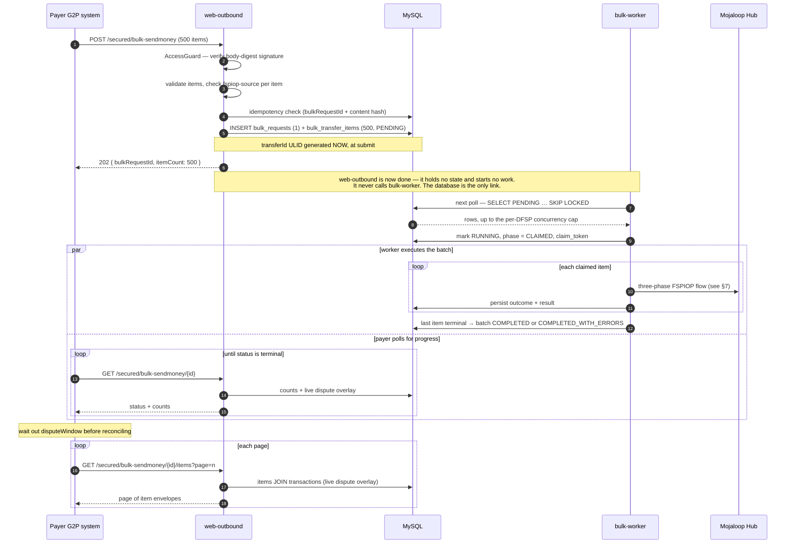
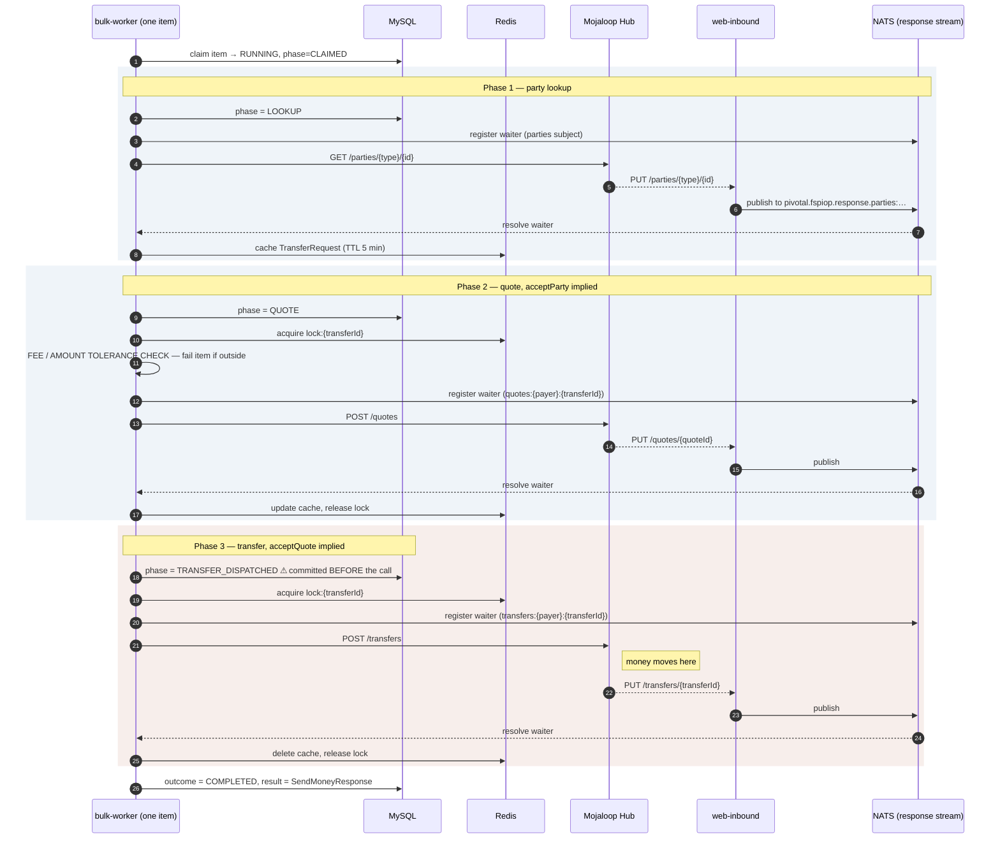
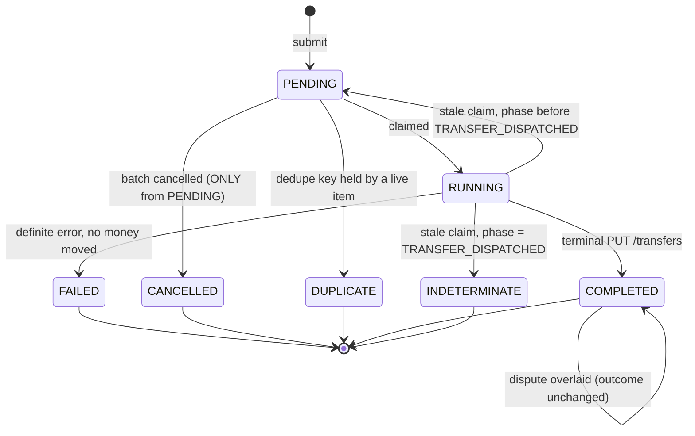
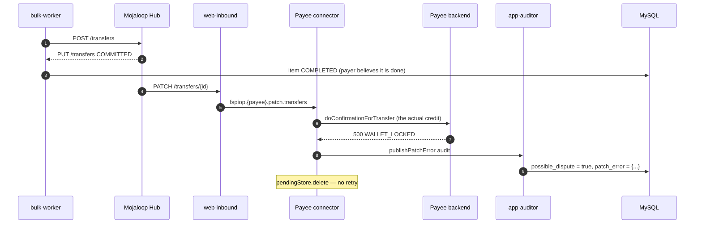

# Bulk Transfer — Architecture

**Status:** design proposal
**Date:** 2026-08-19
**Driver:** G2P (Government-to-Person) disbursement
**Prerequisites:** [`docs/issues/todo_before_bulk_transfer_implementation.md`](../issues/todo_before_bulk_transfer_implementation.md)

---

## 1. Objectives

### 1.1 The requirement

G2P disbursement — a government programme pays many citizens in one operation: social
benefits, pensions, salaries, subsidy payments. The paying institution is a DFSP holding a treasury
account; the beneficiaries are citizens, frequently on mobile money rather than bank accounts.

The payer's system today must issue three separate authenticated HTTP calls per beneficiary
(`POST /sendmoney`, `PUT acceptParty`, `PUT acceptQuote`) and drive each one to completion itself.
For a monthly disbursement of tens of thousands of beneficiaries this is impractical: the payer must
implement its own concurrency control, retry logic, and partial-failure tracking, and any defect in
that layer risks either missed or duplicated payments of public funds.

### 1.2 Goals

| # | Goal |
| --- | --- |
| G1 | A DFSP submits many send-money instructions in **one authenticated request** and receives an immediate acknowledgement |
| G2 | Pivotal drives each instruction through the full FSPIOP lifecycle **unattended**, with `acceptParty` and `acceptQuote` implied |
| G3 | The payer can **poll** for progress and retrieve **per-item outcomes** in the same response format the single-transaction API already returns |
| G4 | **No beneficiary is ever paid twice**, including across resubmissions of the same file |
| G5 | **No beneficiary is silently missed** — every item reaches a reported terminal state |
| G6 | Failures that leave money in an uncertain position are **distinguishable** from failures that definitively moved nothing |
| G7 | A payee-side credit failure (dispute) is **surfaced to the payer**, not buried in Pivotal's audit tables |
| G8 | The whole batch is **reconcilable** — per-item and in aggregate — through existing portal reporting |

### 1.3 Why G2P raises the stakes

These are not generic bulk-payment concerns; they are the reasons the design is shaped as it is.

- **Public funds.** A double payment is an audit finding, not an inconvenience. G4 is a hard
  requirement, which is why idempotency is enforced in the schema rather than in application logic.
- **Beneficiaries are people who will notice.** An uncredited beneficiary generates a complaint to
  the programme, not a reconciliation ticket. G7 exists because the payee-side credit failure is
  invisible to the payer today.
- **Disbursements are deadline-bound and bursty.** Everyone is paid on the same day. Throughput and
  back-pressure behaviour matter more than average latency.
- **Every payment is auditable after the fact.** Programme audits happen months later, so per-item
  outcomes must be durable, not derived from a cache that has since expired.

### 1.4 Non-goals

| Not in scope | Rationale |
| --- | --- |
| FSPIOP `/bulkTransfers` and `/bulkQuotes` | This feature batches **individual** FSPIOP transfers. The FSPIOP bulk primitives are a different protocol feature — see §12 |
| Maker-checker approval of a batch | Authorisation of public disbursement belongs in the payer's own system. Pivotal authenticates the **DFSP**, not the disbursement decision |
| Beneficiary registry / entitlement calculation | Upstream of Pivotal entirely |
| Scheduling ("pay on the 1st") | The payer submits when it wants paid. See §11.4 for rate shaping |
| Automatic remediation of disputes | Pivotal reports them; crediting the beneficiary is the payee DFSP's operational task |

---

## 2. Terminology

| Term | Meaning |
| --- | --- |
| **Batch** | One `POST /secured/bulk-sendmoney` submission — a `bulk_requests` row |
| **Item** | One send-money instruction inside a batch — a `bulk_transfer_items` row, one beneficiary |
| **Outcome** | An item's terminal disposition (`COMPLETED`, `FAILED`, `INDETERMINATE`, …) |
| **Phase** | Where an item is in the FSPIOP lifecycle (`LOOKUP`, `QUOTE`, `TRANSFER_DISPATCHED`) |
| **Dispute** | Hub committed the transfer but the payee's backend failed to credit the beneficiary |
| **Dispute window** | The period after batch completion during which late `PATCH` callbacks may still arrive |

---

## 3. High-level system design

```mermaid
flowchart TB
    subgraph Payer["Payer DFSP"]
        G2P[G2P disbursement system]
    end

    subgraph WO["web-outbound (5 replicas)"]
        API[Bulk API<br/>submit · status · items · cancel]
        SYNC[Existing /secured/sendmoney]
    end

    subgraph BW["bulk-worker (N replicas)"]
        CLAIM[Claim loop]
        DRIVER[Item driver]
        CB[Payee circuit breaker]
    end

    DB[(MySQL<br/>bulk_requests<br/>bulk_transfer_items<br/>transactions)]
    REDIS[(Redis<br/>TransferRequest cache<br/>in-flight locks)]
    NATS[(NATS JetStream)]

    HUB[Mojaloop Hub]
    WI[web-inbound]
    CONN[Payee connector]
    WALLET[Payee backend]

    AUD[app-auditor]
    PORTAL[Portal / web-pivotal]

    G2P -->|POST batch| API
    G2P -->|GET status / items| API
    API -->|write batch + items| DB

    CLAIM -->|poll + claim PENDING items| DB
    CLAIM --> DRIVER
    DRIVER --> REDIS
    DRIVER -->|GET parties · POST quotes · POST transfers| HUB
    DRIVER --> DB
    CB -.->|pause on dispute rate| CLAIM

    HUB --> WI
    WI -->|pivotal.fspiop.response.*| NATS
    NATS -->|resolves waiter| DRIVER
    WI -->|fspiop.{fsp}.*| NATS
    NATS --> CONN
    CONN --> WALLET
    CONN -->|patch error audit| NATS

    DRIVER -->|audit.transaction| NATS
    NATS --> AUD
    AUD --> DB
    DB --> PORTAL
```

### 3.1 Design decisions

| # | Decision | Rationale |
| --- | --- | --- |
| A1 | **Execution runs in a separate `bulk-worker`, not in web-outbound** | web-outbound serves the latency-critical synchronous API. A large batch would contend for its event loop, Hub connection pool and Redis |
| A2 | **The unit of queued work is one whole item, never one phase** | Two deadlines bound an item — the ILP quote expiry and the Redis cache TTL (§7.4). Splitting phases across queue hops guarantees breaching them |
| A3 | **An item's three phases run in one process, start to finish** | `FspiopResponseSubscriber` holds pending waiters in memory; the process that issues a phase's HTTP call must be the one holding that phase's waiter |
| A4 | **Work is distributed through the database, not a new NATS subject** | trust-manager open decision **C** flags request subjects as an unguarded injection path. Bulk introduces no new subject family |
| A5 | **The driver calls the existing `CommandBus` commands unchanged** | `PostSendMoneyCommand` → `PutAcceptPartyCommand` → `PutAcceptQuoteCommand`. No new FSPIOP or ILP code; audit, locks and duplicate guards are inherited |
| A6 | **Per-item results are persisted, not read back from Redis** | The `TransferRequest` cache is deleted on completion and TTL-bounded. G8 requires durability |
| A7 | **Dispute state is overlaid live at read time, not frozen into the result** | The dispute is detected strictly *after* the item completes (§8) |
| A8 | **Idempotency is enforced by a database constraint, not application logic** | G4 is a hard requirement; application-level checks race under concurrent submission |

---

## 4. New services

### 4.1 `packages/apps/bulk-worker`

Mirrors `report-worker` in shape and lifecycle.

```
packages/apps/bulk-worker/
  main.ts               bootstrap, env loading, shutdown hooks
  app.module.ts         ConfigModule + BulkWorkerModule.forRootAsync
  required.settings.ts  the single env-reading point
  index.ts
  tsconfig.app.json
  README.md
```

Imports `ParticipantDomainModule`, `OutboundDomainModule`, `BulkDomainModule` and
`AuditProducerModule`. Requires NATS, Redis, MySQL and HTTP egress to the Hub. It does **not** talk to
web-inbound.

It runs its own `FspiopResponseSubscriber`, which works because the `PIVOTAL_FSPIOP_RESPONSE` stream
uses `LimitsPolicy` — every consumer receives every message, and only the process holding a matching
pending waiter resolves it.

Gated by `BULK_WORKER_ENABLED`, following `REPORT_DOWNLOAD_WORKER_ENABLED`: `false` in web-outbound,
`true` in the worker.

### 4.2 `packages/core/bulk/domain`

```
command/    submit-bulk · claim-items · execute-item · cancel-bulk
query/      get-bulk-status · find-bulk-items
model/      bulk-request.model.ts · bulk-transfer-item.model.ts
repository/ bulk-request.repository.ts · bulk-item.repository.ts
sql/        V1_0__create_bulk_tables.sql
component/  bulk-settings · bulk-driver · payee-circuit-breaker
domain.module.ts
```

### 4.3 Registration checklist

- `nest-cli.json` — projects `apps-bulk-worker`, `core-bulk-domain`
- `package.json` — `build:apps-bulk-worker`, `start:apps-bulk-worker{,:dev,:prod}`, `build:core-bulk-domain`
- `docker/` — Dockerfile and compose service
- `helm/` — deployment, config, HPA
- Migration locations registered wherever `DbMigration` runs

### 4.4 Changes to existing code

| Area | Change |
| --- | --- |
| `shared/fspiop` `FspiopResponseSubscriber` | Multi-waiter fix — **blocker B1**, ship separately first |
| `web-outbound` `access.guard.ts` | Digest-mode signature for the bulk endpoint (§10.1) |
| `web-outbound` `main.ts` | Explicit `json({ limit: '1mb' })` — currently inherits the 100 KB default |
| `web-outbound` `outbound-exception.filter.ts` | Extract `toErrorInformation()` into a reusable `OutboundErrorMapper` so the worker produces identical error bodies |
| `core/audit` `transactions` | Add `bulk_request_id` column + index |

---

## 5. New APIs

All on **web-outbound**, under the existing `AccessGuard`, because the caller authenticates as a DFSP
(`fspiop-source` + accessKey signature) rather than as a portal user.

| Method | Path | Purpose | Success |
| --- | --- | --- | --- |
| `POST` | `/secured/bulk-sendmoney` | Submit a batch | `202` |
| `GET` | `/secured/bulk-sendmoney/{bulkRequestId}` | Status summary | `200` |
| `GET` | `/secured/bulk-sendmoney/{bulkRequestId}/items` | Paginated per-item results | `200` |
| `POST` | `/secured/bulk-sendmoney/{bulkRequestId}/cancel` | Stop claiming further items | `202` |

### 5.1 Submit

```jsonc
POST /secured/bulk-sendmoney
{
  "bulkRequestId": "c8f1a2b3-4d5e-6f70-8192-a3b4c5d6e7f8",   // client-supplied idempotency key
  "mode": "EXECUTE",                                          // or "VALIDATE_ONLY" — §11.5
  "transfers": [ /* ordinary SendMoneyRequest objects */ ]
}
```

The envelope **must be a JSON object, never a bare array** — `AccessGuard.isJsonObject` excludes
arrays, and a top-level array would silently fall through to a signature covering only the `Date`
header (blocker B2).

```json
202 { "bulkRequestId": "c8f1a2b3-…", "itemCount": 500, "status": "ACCEPTED" }
```

### 5.2 Status

```json
{ "bulkRequestId": "c8f1a2b3-…",
  "status": "RUNNING",
  "mode": "EXECUTE",
  "submittedAt": "2026-08-19T10:40:02Z",
  "completedAt": null,
  "counts": { "total": 500, "pending": 180, "running": 20, "completed": 296,
              "failed": 3, "indeterminate": 1, "cancelled": 0,
              "duplicate": 0, "disputed": 2 },
  "disputeWindowOpen": true,
  "disputeWindowClosesAt": null,
  "disputeStateAsOf": "2026-08-19T10:47:31Z" }
```

`status` ∈ `ACCEPTED · RUNNING · COMPLETED · COMPLETED_WITH_ERRORS · CANCELLED`.
Serves `Retry-After: 5` while non-terminal.

### 5.3 Items

`GET …/items?page=1&size=100&outcome=FAILED&outcome=INDETERMINATE`

`size` default 100, max 500. `outcome` is optional and repeatable — most callers only want exceptions.
Enable gzip; these payloads compress roughly 10:1.

```json
{ "bulkRequestId": "c8f1a2b3-…",
  "page": 1, "size": 100, "total": 500, "totalPages": 5,
  "disputeStateAsOf": "2026-08-19T10:52:03Z",
  "items": [
    { "homeTransactionId": "G2P-2026-08-000001", "transferId": "01JXQK…",
      "outcome": "COMPLETED", "httpStatusCode": 200,
      "result": { /* verbatim SendMoneyResponse */ } },

    { "homeTransactionId": "G2P-2026-08-000002", "transferId": "01JXQL…",
      "outcome": "FAILED", "failedPhase": "PARTIES", "httpStatusCode": 404,
      "error": { "statusCode": "3204", "message": "…",
                 "localeMessage": "…", "detailedDescription": "…" } },

    { "homeTransactionId": "G2P-2026-08-000003", "transferId": "01JXQM…",
      "outcome": "COMPLETED", "httpStatusCode": 200,
      "result": { /* … */ },
      "dispute": { "possibleDispute": true, "detectedAt": "2026-08-19T10:44:02Z",
                   "phase": "PATCH", "error": { /* connector backend error */ } } },

    { "homeTransactionId": "G2P-2026-08-000004",
      "outcome": "DUPLICATE", "httpStatusCode": 200,
      "duplicateOf": { "bulkRequestId": "a1b2c3d4-…", "transferId": "01JXPP…",
                       "originalOutcome": "COMPLETED",
                       "submittedAt": "2026-08-19T09:10:00Z" } }
  ] }
```

**Response-form guarantee (G3).** `result` is the *verbatim* `SendMoneyResponse` the single-call API
returns, and `error` is the *verbatim* `{ statusCode, message, localeMessage, detailedDescription }`
shape both the exception filter and the validation path already produce. Only the envelope fields —
`outcome`, `failedPhase`, `httpStatusCode`, `dispute`, `duplicateOf` — are new, because HTTP status and
failing phase are conveyed by the protocol in the single-call flow and have nowhere else to live here.

### 5.4 Cancel

Stops claiming further items. In-flight items run to completion. This is the manual counterpart to the
payee circuit breaker (§8.4) — without it, a payer who spots a bad file cannot stop the remaining
payments.

---

## 6. Sequence — batch lifecycle



### 6.1 How the worker gets the work

**It is not handed the work — it goes looking for it.** web-outbound and bulk-worker have no
direct connection: no HTTP call, no NATS message, no in-process reference. Submit writes rows and
returns; the worker's next poll finds them.

That decoupling is deliberate:

- **A worker being down never fails a submit.** The batch is durably queued the moment the
  transaction commits, and processing begins whenever a worker is next available.
- **Restarting or scaling workers requires no coordination.** There is no registry, no dispatch
  target, nothing for web-outbound to discover.
- **Crash recovery is the same code path as normal claiming** (§7.3) — an abandoned item simply
  becomes claimable again.
- **No new NATS subject** is introduced, which matters while trust-manager open decision **C**
  (NATS authorisation) is unresolved.

The cost is claim latency: a batch waits up to one poll interval before work starts. That is
negligible against the five-minute per-item budget (§7.4), and the interval can be shortened, or the
worker woken on submit, if it ever matters.

Multiple `bulk-worker` replicas run this identical loop concurrently. `SKIP LOCKED` guarantees each
item is claimed by exactly one of them, so replicas need no awareness of each other — the diagram
shows one worker only because a second would add no new interaction.

---

## 7. Per-item processing — detail

This is the core of the design. One item is claimed, driven through all three FSPIOP phases in a
single process, and persisted. It is never split across processes or queue hops (A2, A3).

### 7.1 Sequence



### 7.2 The write-ahead phase marker

`phase = TRANSFER_DISPATCHED` **must be committed before** the `POST /transfers` call, never after.

That single ordering is what lets crash recovery distinguish an item that definitely moved no money
from one that may have. If the write lands after the call, a crash in the window between them leaves
an item that *looks* un-dispatched but has actually paid — and recovery re-pays it, violating G4.

### 7.3 Crash recovery

Stale-claim reaping splits on the phase marker. It must never blanket-fail orphaned items.

```sql
-- never dispatched → safe to re-drive; the dedupe key stays held throughout
UPDATE bulk_transfer_items
   SET outcome = 'PENDING', claim_token = NULL, phase = 'CLAIMED'
 WHERE outcome = 'RUNNING'
   AND phase IN ('CLAIMED','LOOKUP','QUOTE')
   AND claimed_at < :staleCutoff;

-- dispatched, no terminal answer → never re-drive
UPDATE bulk_transfer_items
   SET outcome = 'INDETERMINATE'
 WHERE outcome = 'RUNNING'
   AND phase = 'TRANSFER_DISPATCHED'
   AND claimed_at < :staleCutoff;
```

This is the one place where bulk deliberately diverges from the `report-worker` precedent: re-running a
report is free, re-running a transfer is a double payment.

### 7.4 Per-item deadline

Two independent deadlines bound one item, and the **tighter one wins**:

| Deadline | Source | Value |
| --- | --- | --- |
| ILP prepare-packet expiry | `FspConnector._15_MINUTES` | 15 min after quote |
| Cached `TransferRequest` TTL | `REDIS_CACHE_ITEM_TIMEOUT_MS` | **5 min in production** |

So an item must complete within **5 minutes** of starting phase 1 under current production config.
Queue wait must not count against it — **claim late, not early**. Validate the relationship at startup
rather than discovering it as sporadic `TRANSFER_ID_NOT_FOUND` under load.

### 7.5 Item state machine



**`CANCELLED` is reachable only from `PENDING`.** Cancelling a batch is a label meaning "stop claiming";
it must never cascade onto items that already ran:

```sql
UPDATE bulk_transfer_items
   SET outcome = 'CANCELLED'
 WHERE bulk_request_id = ?
   AND outcome = 'PENDING';        -- this guard is the entire safety property
```

A cancelled batch therefore ends mixed — e.g. `480 COMPLETED, 3 FAILED, 1 INDETERMINATE, 16 CANCELLED`.

**A dispute never changes `outcome`.** The transfer did complete; the dispute is an orthogonal axis
carried in a sibling field (§8).

---

## 8. Dispute handling

### 8.1 Why it is a bulk problem

The dispute is discovered strictly **after** the payer's item is already recorded as successful:

```
t1   Hub → PUT /transfers COMMITTED  → item written COMPLETED     ← result frozen here
t2   Hub → PATCH /transfers → payee connector → wallet credit fails
     → publishPatchErrorAudit → app-auditor → possible_dispute = true
```

`t2` is unbounded and always later than `t1`. In the single-transaction flow the DFSP reconciles one
payment and will notice. In bulk the caller's model is "fetch results once, close the batch" — so a
dispute arriving after that fetch is silently lost, violating G7.



### 8.2 Resolution — overlay, do not re-freeze

Keep `result` frozen so it stays byte-identical to the single-call response, and read
`possible_dispute` / `patch_error` **live from `transactions`** at result-fetch time, joined on
`correlation_id = transferId`.

Expose a settling window so callers know when it is safe to reconcile:

- `disputeWindowOpen` — `true` until `completedAt + 15 min`
- `disputeStateAsOf` — when the overlay was read

Without an explicit signal, a client fetches once, sees zero disputes, and closes the run.

### 8.3 Coverage limits

| Payee | Dispute visible? |
| --- | --- |
| Tenant of this Pivotal | Yes — both sides fold into one `transactions` row by `correlation_id` |
| External DFSP | **No** — the `PATCH` goes to their infrastructure; closes only at settlement reconciliation |

State this in the API contract, or "no disputes" will be read as "everyone was credited."

### 8.4 Payee circuit breaker

`PatchTransfersListener` deletes the pending record in its catch block, so **there is no retry** — the
Hub has committed, the payer is debited, the beneficiary is not credited, and remediation is manual.

Single-transaction, that is a trickle. In a 10,000-item G2P batch, a two-minute wallet outage produces
hundreds of uncredited beneficiaries at once.

**If dispute rate for a payee FSP exceeds a threshold, pause claiming for that payee.** In the
single-call world there is nothing to pause — the DFSP drives. In bulk, Pivotal generates the load and
can stop. Pair with alerting on dispute *rate* per batch and per payee FSP, not on presence.

Test hook: the Java connector already has `config.isConnectorForcePatchError()` /
`maybeForceCreditFailure()` — build the bulk dispute test plan around it.

---

## 9. Idempotency and duplicate handling

Two independent layers, because they fail differently.

| Layer | Key | Prevents |
| --- | --- | --- |
| Batch | `bulkRequestId` | A transport retry creating a second batch |
| Item | `homeTransactionId` | A human resubmit paying a beneficiary twice |

### 9.1 Batch level

| Case | Behaviour |
| --- | --- |
| Same key, same content hash | `202`, return the existing batch, no new work |
| Same key, **different** content hash | `409` — never silently return the old batch |

### 9.2 Item level

A plain `UNIQUE (payer_fsp, home_transaction_id)` is **wrong**: it also blocks the legitimate retry of a
failed item, which is the most common G2P remediation flow ("480 paid, fix the 20 that failed,
resubmit"). The key must be **released only by terminal failure**:

```sql
home_txn_dedupe_key VARCHAR(200)
  GENERATED ALWAYS AS (
    CASE WHEN outcome IN ('FAILED','CANCELLED','DUPLICATE') THEN NULL
         ELSE CONCAT(payer_fsp, ':', home_transaction_id) END
  ) STORED,
UNIQUE KEY bulk_items_home_txn_uk (home_txn_dedupe_key)
```

MySQL unique indexes ignore `NULL`, and a `STORED` generated column recomputes on update — so an item
moving to `FAILED` releases its key automatically.

| Item outcome | Holds key? | Why |
| --- | --- | --- |
| `PENDING` / `RUNNING` | yes | Two concurrent batches must not both proceed |
| `COMPLETED` (incl. disputed) | yes | Money moved |
| `INDETERMINATE` | yes | Unknown — never re-pay |
| `FAILED` / `CANCELLED` / `DUPLICATE` | no | Definitively no money moved |

Note that stale-claim recovery returns un-dispatched items to `PENDING`, which still holds the key —
so the key is continuously held from submit until a definitively-unpaid state. There is no window
through which a concurrent resubmit can slip.

An `INDETERMINATE` item later reconciled as never paid requires a **deliberate, audited operator
action** to release. That is the one place a human confirms money did not move.

### 9.3 Content hashing

Store a hash of each item payload alongside the key:

```
same homeTransactionId + same item hash       → DUPLICATE (safe, idempotent)
same homeTransactionId + different item hash  → 409, reject the batch
```

Reusing an id with a different amount or payee is a data error; without the hash it would be silently
deduplicated.

### 9.4 Duplicates within one batch

Two rows in the same file sharing a `homeTransactionId` is a file-generation bug. Catch it in memory at
submit, before validation and before any DB work, and name **both** indexes so the payer can diff:

```
400 — "Duplicate homeTransactionId in request: G2P-2026-08-000042 appears at index 41 and 317."
```

### 9.5 Feedback to trust-manager

trust-manager open decision **G** currently recommends bare `homeTransactionId` uniqueness. This design
refines it, and the refinement is strictly better for the single-transaction endpoint too:

> Scoped to `payer_fsp`, released only by terminal failure, paired with a content hash so key reuse
> with differing content is rejected rather than silently deduplicated.

---

## 10. Security

### 10.1 The signature scheme must change for this endpoint

`AccessGuard` requires the JWT payload to **be** the request body. For bulk that means base64-encoding
the entire batch into an HTTP header (+33%), against Node's 16 KB default `--max-http-header-size`.

Measured against the real DTOs — a typical item is 503 bytes:

| Items | Body | JWT header | Verdict |
| --- | --- | --- | --- |
| 10 | 5.1 KB | 7.2 KB | ok |
| 25 | 12.7 KB | 17.3 KB | **exceeds 16 KB header limit** |
| 200 | 100.9 KB | 134.9 KB | header + body limits both blown |
| 1,000 | 504 KB | 672 KB | impossible |

**Body-in-JWT caps bulk at roughly 20 items.** That is not a bulk feature.

**Resolution — sign a digest for this endpoint:**

```json
{ "bodySha256": "9f86d081884c7d65…", "iat": 1755600000, "jti": "c8f1a2b3-…" }
```

Constant ~200 bytes regardless of batch size. Three reasons this is the right call rather than a
workaround:

- **It closes trust-manager open decision G.** `iat` gives a validity window, `jti` a nonce — the
  replay protection `open-decisions.md` calls "the one most likely to be raised in a security review."
- **The endpoint is new**, so there are no existing DFSP clients and no compatibility constraint.
  `/secured/sendmoney` keeps body-in-JWT unchanged.
- **It removes the guard's CPU stall** — `toCanonicalJson` recurses over the whole body; SHA-256 over
  raw bytes does not.

Requires `rawBody` access via the `verify` callback on `json()`.

### 10.2 Authorisation is decoupled from execution in time

Today the DFSP signs **every** money-moving call. Bulk collapses N×2 signatures into **one signature
authorising N payments over the following minutes or hours**. Consequences:

- accessKey revocation (trust-manager open item **E**) cannot stop a batch in flight
- `valid_to` expiry — **enforced** for `key_type = access` — is not observed mid-batch

**Re-validate the submitting participant's accessKey status at each item's execution**, and fail
remaining items closed if it has been revoked or expired. This is cheap:
`PARTICIPANT_KEY_STORE_REFRESH_INTERVAL_SECONDS: "5"` in production means the cache is already
near-real-time.

### 10.3 Other

| Concern | Requirement |
| --- | --- |
| Per-item source binding | Every item's `from.fspId` must equal the single `fspiop-source` — per item, not once per batch (trust-manager decision 8) |
| Status/items ownership | A `GET` signature covers only `{date}` and binds no resource. The batch's `payer_fsp` must be checked server-side against `fspiop-source` |
| Worker readiness | trust-manager decision 19 fails closed on cache miss, made costless by HTTP readiness gating. **A poller receives no HTTP traffic** — the worker must not claim items until its first cache load succeeds |
| Cache-miss stampede | The specified "one bounded synchronous re-read, then reject" becomes N concurrent re-reads under bulk. Add single-flight de-duplication per `fspId` |

---

## 11. Constraints, limits and scaling

### 11.1 Limits

| Limit | Default | Scope | Rationale |
| --- | --- | --- | --- |
| Items per batch | **1,000** | request | Contract; validation cost; ~500 KB body |
| Request body | **1 MB** | request | Explicit `json({ limit })`, not the 100 KB default |
| Concurrent items | **20** | **per payer DFSP** | central-ledger takes a position lock **per payer FSP** — this is where contention is |
| Concurrent items | **100** | **global** | Protects shared infrastructure: Hub, HSM signing pool, DB |
| Active batches | **1** | per payer DFSP | Makes "my batch" unambiguous |
| Queued batches | **5** | per payer DFSP | Bounded backlog — 6 accepted per DFSP |
| Result page size | 100 default / 500 max | request | ≤ ~680 KB per response |

Both concurrency scopes are required. Per-DFSP alone lets ten DFSPs collectively saturate the HSM
session pool, which `implementation-plan.md` §3 warns must be sized "to expected concurrency."
Global alone lets one DFSP monopolise the workers.

**Enforce per-DFSP concurrency from the database, not a Redis counter.** A Redis counter leaks on
worker crash and throttles the DFSP until someone reconciles; a `COUNT(*) WHERE payer_fsp = ? AND
status = 'RUNNING'` with an index on `(payer_fsp, status)` is exact and self-healing, because stale
`RUNNING` rows are already reaped (§7.3). Claims happen a few times per second — the cost is
irrelevant.

Per the project's "no env vars for correctness parameters" rule: the **1,000-item cap is contract** and
should be hardcoded. Concurrency ceilings are operational and may live in env, but validate at startup
that `maxBodyBytes ≥ maxItems × typicalItemBytes`.

### 11.2 Rejection responses

Every rejection uses the existing error shape, so clients parse one form everywhere.

| Condition | HTTP | `statusCode` | Notes |
| --- | --- | --- | --- |
| > 1,000 items | `400` | `3100` | Check `transfers.length` **before** validation runs |
| Body > 1 MB | `413` | `3100` | Must be distinguishable from the above |
| Item validation failure | `400` | `3100` | Whole batch rejected — see below |
| Queue full | `429` | `3000` | `Retry-After` + name the blocking batch |
| Duplicate batch key, same content | `202` | — | Not an error — return existing `bulkRequestId` |
| Duplicate batch key, different content | `409` | `3100` | |
| `fspiop-source` ≠ an item's `from.fspId` | `403` | `3100` | |

```http
HTTP/1.1 429 Too Many Requests
Retry-After: 60
```
```json
{ "statusCode": "3000", "message": "Generic client error",
  "localeMessage": "Erreur client générique",
  "detailedDescription": "Bulk queue limit reached for BIGBANKGN: 1 active and 5 queued batches (maximum 6). Retry after 60 seconds or wait for batch c8f1a2b3-… to complete." }
```

Name the blocking batch — otherwise the client has nothing to wait for. FSPIOP has no rate-limit code,
so `3000` carries it while HTTP 429 conveys the semantics.

**Validation is all-or-nothing.** One malformed item rejects the whole batch. A partially-accepted
batch with silently dropped rows is far worse operationally than a clean rejection.

### 11.3 Scaling beyond 1,000

A national G2P programme may disburse hundreds of thousands of payments per cycle. With a 1,000-item
cap that is hundreds of batches.

**Phase 1 — client-side chunking.** The payer splits its file and submits sequentially, respecting the
`429` back-pressure. With 1 active + 5 queued per DFSP the pipeline stays full. At 20 concurrent items
and ~1.5 s/item, throughput is roughly **13 items/sec per DFSP**, or ~48,000/hour. A 500,000-payment
programme is ~10 hours — acceptable for a monthly cycle, and it parallelises across payer DFSPs.

**Phase 2 — file-based ingestion (future).** If a single batch must exceed 1,000, the natural extension
mirrors the existing report-download flow in reverse: the payer uploads a file to S3 via a presigned
URL, submits a reference, and the worker streams it. That removes the body-size limit entirely and
reuses infrastructure that already exists. **Not in scope now** — recorded so the API shape does not
foreclose it.

### 11.4 Rate shaping

G2P disbursements are bursty by nature — everyone is paid on the same day. The per-DFSP concurrency
limit is the primary shaping mechanism. If the Hub needs protection beyond that, add a token-bucket
rate limit on item dispatch rather than raising queue depth: a deeper queue moves the problem, a rate
limit solves it.

### 11.5 `VALIDATE_ONLY` mode

**Strongly recommended for G2P.** A batch submitted with `mode: "VALIDATE_ONLY"` runs **phase 1 only**
— party lookup for every item — and records whether each beneficiary resolves, without quoting or
transferring.

This lets a programme verify that 50,000 beneficiaries are reachable **before** committing public funds,
turning "300 payments failed at lookup" from an incident into a pre-flight report. It reuses the entire
pipeline; the driver simply stops after phase 1 and marks items `VALIDATED` / `FAILED`.

Validation batches must not hold `homeTransactionId` dedupe keys, since no money moves.

---

## 12. Relationship to FSPIOP bulk primitives

`shared/fspiop/dto` already contains `bulk-transfers-post-request.ts` and `bulk-quotes-post-request.ts`
— the real FSPIOP bulk protocol features, where the **Hub** processes a batch as one unit.

This feature is **Pivotal-side batching over individual FSPIOP transfers**. The Hub sees N ordinary,
independent transfers and knows nothing about the batch. Consequences:

- No Hub-side atomicity — partial completion is normal and expected
- No dependency on Hub support for bulk operations
- Settlement is per transfer, exactly as today

Name it `bulk-sendmoney`, never `bulk-transfers`, or the two will be conflated.

---

## 13. Data model

```
bulk_requests
  id                    BIGINT PK (snowflake)
  bulk_request_id       VARCHAR(64)   -- client-supplied idempotency key
  payer_fsp             VARCHAR(32)
  content_hash          CHAR(64)      -- SHA-256 of the submitted envelope
  mode                  VARCHAR(16)   -- EXECUTE | VALIDATE_ONLY
  status                VARCHAR(32)
  item_count            INT
  submitted_at          DATETIME(6)
  completed_at          DATETIME(6) NULL
  dispute_window_closes_at DATETIME(6) NULL
  UNIQUE (payer_fsp, bulk_request_id)

bulk_transfer_items
  id                    BIGINT PK (snowflake)
  bulk_request_id       BIGINT FK
  payer_fsp             VARCHAR(32)
  home_transaction_id   VARCHAR(128)
  transfer_id           VARCHAR(64)   -- ULID, generated at SUBMIT
  item_hash             CHAR(64)
  outcome               VARCHAR(32)
  phase                 VARCHAR(32)   -- CLAIMED | LOOKUP | QUOTE | TRANSFER_DISPATCHED
  failed_phase          VARCHAR(16) NULL
  http_status_code      SMALLINT NULL
  request               JSON          -- the submitted SendMoneyRequest
  result                JSON NULL     -- verbatim SendMoneyResponse
  error                 JSON NULL     -- verbatim OutboundErrorInformation
  duplicate_of_item_id  BIGINT NULL
  claim_token           VARCHAR(64) NULL
  claimed_at            DATETIME(6) NULL
  completed_at          DATETIME(6) NULL
  home_txn_dedupe_key   VARCHAR(200) GENERATED … STORED
  UNIQUE (home_txn_dedupe_key)
  INDEX (bulk_request_id, outcome)
  INDEX (payer_fsp, outcome)        -- per-DFSP concurrency count
  INDEX (outcome, claimed_at)       -- stale-claim reaping
  INDEX (transfer_id)               -- dispute overlay join

transactions
  + bulk_request_id     BIGINT NULL, INDEX   -- portal filtering by batch
```

---

## 14. Observability

| Signal | Why |
| --- | --- |
| Items/sec dispatched, per payer FSP and global | Capacity and the concurrency ceilings |
| Item latency p50/p95/p99, per phase | The 5-minute deadline (§7.4) is a hard cliff |
| **Dispute rate** per batch and per payee FSP | Drives the circuit breaker; the primary G2P health signal |
| `INDETERMINATE` count | Should be near zero; any non-zero value is a manual reconciliation task |
| Stale claims reaped, split by phase | Distinguishes benign restarts from dispatch-window losses |
| **Terminated audit messages** | `msg.term()` currently drops poison messages with no DLQ — a dropped patch-error means an invisible dispute |
| Queue depth and 429 rate per DFSP | Whether back-pressure is working or callers are being starved |
| HSM signing latency and pool saturation | Bulk is the burst generator |

**Alert on dispute rate, not dispute presence.** A single dispute is an operational ticket; fifty in
five minutes is a payee outage that should have paused the batch.

---

## 15. Prerequisites

Detail in [`docs/issues/todo_before_bulk_transfer_implementation.md`](../issues/todo_before_bulk_transfer_implementation.md).

| # | Item | Why it blocks |
| --- | --- | --- |
| 1 | **`FspiopResponseSubscriber` multi-waiter fix** | Two items paying the same beneficiary collide and both fail. Ship as its own PR first |
| 2 | **Digest-mode signature** (§10.1) | Without it bulk caps at ~20 items |
| 3 | **Object envelope, never a bare array** | An array body silently bypasses body signing |
| 4 | **Batch + item idempotency** (§9) | G4 |
| 5 | **trust-manager open decision G resolved** | Bulk multiplies replay damage by batch size |
| 6 | **Fee / amount tolerance check** | Auto-accept removes the human confirmation of the quoted fee |
| 7 | **Audit DLQ or terminated-message alerting** | A silently dropped patch-error is an invisible dispute |
| 8 | **`STRICT_AMOUNT_TYPE` clarified** | Set in prod and stg, consumed by nothing — confirm whether an amount control was intended and lost |

---

## 16. Open questions

1. Maximum batch size — determines guard CPU, response shape and HSM burst sizing.
2. End-to-end SLA for a batch, and whether it tolerates the 5-minute per-item deadline under queue depth.
3. Ownership of fee-tolerance policy — per-DFSP config, per-batch input, or global ceiling?
4. Mid-batch accessKey revocation — abort remaining items, or complete the batch?
5. Does the ALS collapse identical concurrent `GET /parties`? If so, intra-batch lookup de-duplication
   becomes required rather than merely an optimisation (and cuts Hub load either way).
6. Is `VALIDATE_ONLY` (§11.5) in scope for phase 1? For G2P the answer is probably yes.
7. Dispute-window duration — 15 minutes is a placeholder; confirm against observed `PATCH` latency.

---

## Appendix A — payer integration example

```js
const DISPUTE_POLL_MS = 60_000;

async function runDisbursement(transfers) {
  // 1. Submit. The idempotency key is yours — reuse it verbatim on ANY retry.
  const idem = crypto.randomUUID();
  const { bulkRequestId } = await post('/secured/bulk-sendmoney', {
    bulkRequestId: idem, mode: 'EXECUTE', transfers,
  });

  // 2. Poll to terminal, honouring Retry-After.
  let s;
  do {
    await sleep(retryAfterMs(s) ?? 5000);
    s = await get(`/secured/bulk-sendmoney/${bulkRequestId}`);
  } while (!['COMPLETED', 'COMPLETED_WITH_ERRORS', 'CANCELLED'].includes(s.status));

  // 3. Wait out the dispute window BEFORE reconciling. A fetch at t+0 honestly
  //    reports zero disputes that will appear minutes later.
  while (s.disputeWindowOpen) {
    await sleep(DISPUTE_POLL_MS);
    s = await get(`/secured/bulk-sendmoney/${bulkRequestId}`);
  }

  // 4. Page through results.
  const items = [];
  for (let page = 1; ; page++) {
    const r = await get(`/secured/bulk-sendmoney/${bulkRequestId}/items?page=${page}&size=500`);
    items.push(...r.items);
    if (page >= r.totalPages) break;
  }

  // 5. Disposition. The two "never re-pay" branches are the point of the whole design.
  for (const it of items) {
    if (it.dispute?.possibleDispute)          flagForPayeeRemediation(it); // paid, not credited
    else if (it.outcome === 'INDETERMINATE')  flagForReconciliation(it);   // outcome unknown
    else if (it.outcome === 'DUPLICATE')      alreadyPaidEarlier(it);      // no action
    else if (it.outcome === 'CANCELLED')      safeToRetry(it);             // never started
    else if (it.outcome === 'FAILED')         safeToRetry(it);             // no money moved
    else if (it.result.currentState === 'ABORTED') safeToRetry(it);        // Hub aborted
    else                                      markPaid(it);
  }
}
```

Two points to stress to integrating DFSPs:

- **Reconcile on `homeTransactionId`, never on array position.** Filters and paging make positional
  matching fragile.
- **A retry of the whole batch must reuse the same `bulkRequestId`.** A fresh key creates a second
  batch and pays everyone twice.

---

## Appendix B — disposition reference

| Item state | Money moved? | Beneficiary credited? | Correct action |
| --- | --- | --- | --- |
| `COMPLETED`, `currentState: COMMITTED` | yes | yes | none |
| `COMPLETED` + `dispute.possibleDispute` | **yes** | **no** | payee remediation — **never re-pay** |
| `COMPLETED`, `currentState: ABORTED` | no | no | safe to retry |
| `FAILED` | no | no | safe to retry |
| `CANCELLED` | no | no | safe to retry — never started |
| `INDETERMINATE` | unknown | unknown | reconcile — **never re-pay** |
| `DUPLICATE` | paid earlier | see `duplicateOf` | none |
