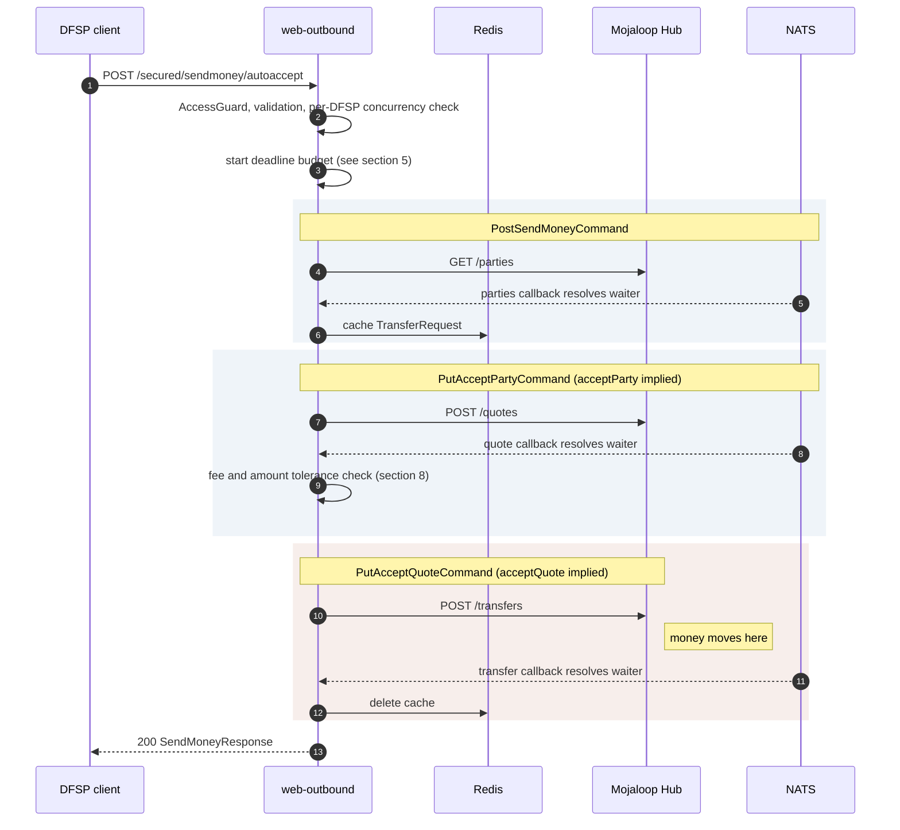

# Auto-Accept Send-Money Endpoint

**Status:** design proposal
**Date:** 2026-08-19
**Supersedes for now:** [`bulk_transfer_architecture.md`](./bulk_transfer_architecture.md) *(parked, not withdrawn — see §13)*
**DFSP-facing draft:** [`../integration/sendmoney-autoaccept-dfsp-guide.md`](../integration/sendmoney-autoaccept-dfsp-guide.md)

---

## 1. Objective

Collapse the three-call send-money flow into **one synchronous call**. The DFSP posts a single
transfer instruction and receives the completed `SendMoneyResponse`; Pivotal performs party lookup,
quoting and transfer internally with `acceptParty` and `acceptQuote` implied.

```
Today                                        Proposed
─────                                        ────────
POST /secured/sendmoney            →  202    POST /secured/sendmoney/autoaccept  →  200
PUT  /secured/sendmoney/{id}  acceptParty         (one call, one response)
PUT  /secured/sendmoney/{id}  acceptQuote
```

For batch disbursement (G2P), **the DFSP performs its own fan-out** — calling the endpoint N times at
a documented concurrency limit. Pivotal provides no queue, no batch tracking and no worker.

### 1.1 Why this shape

The parked bulk design put the fan-out, queueing, claiming, retry and reconciliation inside Pivotal.
That is a substantial new subsystem: a new service, new tables, claim/recovery semantics, batch
idempotency, dispute-window management. This design moves the fan-out to the caller and keeps
Pivotal's surface almost unchanged — one endpoint, one orchestration command, no new persistence.

### 1.2 Non-goals

| Not in scope | Consequence |
| --- | --- |
| Batch submission or batch tracking | The DFSP correlates its own results |
| Server-side queueing | The DFSP self-paces within a published limit; Pivotal rejects excess with `429` |
| A worker process | Nothing new to deploy or operate |
| Automatic retry of failed transfers | The DFSP retries, protected by `homeTransactionId` uniqueness (§6) |
| Dispute-window management | Credit failures surface out of band, after the response (§9) |

---

## 2. The endpoint

```
POST /secured/sendmoney/autoaccept
```

On **web-outbound**, under the existing `AccessGuard`. A **separate route** rather than a flag on the
existing `POST /secured/sendmoney`, because it needs its own Istio timeout, its own concurrency limit
and its own retry policy (§5, §6, §7).

### 2.1 Request

The existing `SendMoneyRequest` plus the one field the `acceptParty` call carries today:

```jsonc
{
  "homeTransactionId": "G2P-2026-08-000001",   // required — idempotency key, see §6
  "from": { "idType": "MSISDN", "idValue": "224620000001", "fspId": "BIGBANKGN" },
  "to":   { "idType": "MSISDN", "idValue": "224660000002", "fspId": "ORANGEGN" },
  "amountType": "SEND",
  "currency": "GNF",
  "amount": "150000",
  "transactionType": "TRANSFER",
  "subScenario": "SALARY_DISBURSEMENT",
  "note": "August 2026 salary",

  "extensionList": [ ... ],          // optional — was on PutSendMoneyRequest
  "maxPayeeFee": "500",              // optional — see §8
  "expectedPayeeReceiveAmount": "150000"   // optional — see §8
}
```

`SendMoneyRequest` gains `extensionList` and the two optional tolerance fields. Everything else is
unchanged, so a DFSP already integrated with `POST /secured/sendmoney` needs no new field mapping.

### 2.2 Response

**Success — the verbatim `SendMoneyResponse` the third call returns today**, with
`currentState: COMPLETED` or `ABORTED`. No new success shape.

**Failure — the verbatim `OutboundErrorInformation`** the exception filter already produces
(`{ statusCode, message, localeMessage, detailedDescription }`), with the HTTP status
`FspiopStatusTranslator` already assigns.

The response contract is therefore **identical to the existing flow**. The only difference is that
one call produces it instead of three.

Two envelope-free additions carried as headers, so the body shape stays untouched:

```
X-Pivotal-Transfer-Id:   01JXQK7M8N9P0Q1R2S3T4U5V6W
X-Pivotal-Failed-Phase:  QUOTES        (only on failure)
```

`X-Pivotal-Transfer-Id` matters: on a timeout or dropped connection the client has no body, and
without the transfer id it cannot query the outcome (§7).

### 2.3 HTTP status codes — verified behaviour

`FspiopStatusTranslator` does **not** map by category the way its own doc comment claims. Verified
against `component/fspiop-status-translator.ts`:

| FSPIOP code | Actual HTTP |
| --- | --- |
| `3000` generic client, `31xx` validation, `32xx` not found, `33xx` expired, `4xxx` payer, most `5xxx` payee | **`417 EXPECTATION_FAILED`** |
| `3104` too large payload | `413` |
| `3105` invalid signature | `401` |
| `1000` / `1001` communication | `502` |
| `2000` / `2001` server error | `500` |
| `2003` unavailable, `2005` server busy | `503` |
| `2004` server timed out | `504` |
| **`5000` generic payee error** | **`500`** — a *business* rejection returned as `5xx` |
| unmapped | `500` |

Three consequences for this design:

1. **Clients must classify on the FSPIOP `statusCode` in the body, not the HTTP status.** `417`
   covers validation, missing beneficiary and limit breaches alike, and `5000` is a business error
   returned as `500`. The DFSP guide is written this way.
2. **`429` is currently unreachable.** Throttling (§10) needs `SERVER_BUSY (2005)` remapped from
   `503` to `429`. `SERVER_BUSY` is **unused anywhere in the codebase**, so this is a zero-risk
   addition — but it is a required code change, listed in §16.
3. **`409` is unreachable and is not worth adding.** Duplicate `homeTransactionId` uses
   `GENERIC_CLIENT_ERROR (3000)` — consistent with the existing duplicate guard in
   `PutAcceptQuoteHandler` — and key-reuse-with-different-content uses `MODIFIED_REQUEST (3106)`.
   Both return `417`, which is acceptable once clients branch on `statusCode`.

> **Separate defect worth fixing regardless of this feature:** the doc comment at the top of
> `fspiop-status-translator.ts` documents `400` / `404` / `422` mappings that the implementation
> below it does not perform. It is actively misleading.

---

## 3. Internal orchestration

A single new command — `PostSendMoneyAutoAcceptCommand` — whose handler calls the three **existing**
handlers in sequence. No new FSPIOP, ILP, audit or locking code.



Everything inherited for free: audit events at all three phases, the Redis in-flight locks on the
accept handlers, the duplicate guard in `PutAcceptQuoteHandler`, the participant JWS signing, the
`SendMoneyResponseMapper` output shape.

### 3.1 Where it runs

The same process, the same request. The `FspiopResponseSubscriber` pending waiters live in the
replica handling the HTTP request, which is exactly where they need to be — no cross-process
correlation, no claim logic, no recovery machinery.

---

## 4. Prerequisite — the multi-waiter fix

`FspiopResponseSubscriber` keys pending waiters by NATS subject in a `Map<string, PendingEntry>`, and
parties subjects are addressed by FSPIOP resource path rather than transaction id:

```
pivotal.fspiop.response.parties:{payer}:{payee}:{partyIdType}:{partyId}
```

Two concurrent lookups for the same payee **on the same replica** overwrite each other, and the
orphaned waiter's timeout then cancels its sibling's registration.

This endpoint makes that collision routine rather than rare — a G2P run is exactly the workload that
pays the same beneficiary from two rows, or repeats a beneficiary across retries. **Ship the
multi-waiter fix first**, as its own PR; it is described in
[`../issues/todo_before_bulk_transfer_implementation.md`](../issues/todo_before_bulk_transfer_implementation.md) §B1
and benefits the existing API equally.

---

## 5. The deadline budget — the central constraint

### 5.1 The real worst case is ~105s, not 90s

Each phase registers its 30s waiter **before** issuing the Hub call, then awaits the axios call. With
production settings:

```
FSPIOP_SOCKET_TIMEOUT_MS:      30000
FSPIOP_CONNECTION_TIMEOUT_MS:   5000
```

axios can take up to **35s**, and the waiter's rejection is not observed until that await returns. So
the axios timeout dominates: **per-phase worst case ≈ 35s**, and three phases ≈ **105s**.

The Istio VirtualService for web-outbound is `timeout: 60s` today (all three route entries in
`prod-hub-guinea-gitops/apps/pivotal/values.yaml`). 105s of possible work behind a 60s gateway is a
guaranteed indeterminate outcome: the gateway returns `504` while Pivotal completes the transfer.

### 5.2 Resolution — raise the outer limits, enforce an inner deadline

Shrinking Pivotal's budget to fit under 60s would not help: aborting mid-phase-3 leaves the same
uncertainty. The correct fix is to make the connection outlive the work, and to bound the work
explicitly.

| Layer | Value | Role |
| --- | --- | --- |
| **Pivotal internal deadline** | **90s** | The real control — always produces a response |
| **Istio autoaccept route** | **100s** | Backstop; should never fire |
| **DFSP client HTTP timeout** | **120s** | Backstop; should never fire |

10s of gateway headroom is ample *because* the inner deadline is enforced — by then the response is
already written and serialising an error body takes milliseconds. Headroom only needs to be generous
when the inner bound is a guess rather than a guarantee.

Since 99.8% of transfers return in under a minute, this affects roughly 2 requests in 1,000 — and for
those, the difference is a real FSPIOP error instead of an opaque `504`.

### 5.3 Check the budget before phase 3, never during it

This rule matters more than the numbers. Entering the money-moving phase with 8 seconds left produces
exactly the indeterminate state the design exists to eliminate.

```
budget 90s
  ├─ phases 1+2 must finish within 55s combined
  ├─ before POST /transfers: require >= 35s remaining, else abort cleanly
  │     (nothing has moved — a clean, retryable failure)
  └─ phase 3 then runs to its natural <= 35s bound
                                          → hard ceiling 90s
```

Self-consistent: phase 3 cannot start later than 55s and cannot run past 35s, so the total cannot
exceed 90s. The abort path only ever fires **before** dispatch, so it is always clean.

Derive the floor rather than configuring it separately:

```
phaseFloorMs = FSPIOP_CONNECTION_TIMEOUT_MS + FSPIOP_SOCKET_TIMEOUT_MS    // 35_000
```

It then stays correct automatically if the Hub timeouts are retuned.

### 5.4 Relationships to validate at startup

```
AUTOACCEPT_DEADLINE_MS  >=  2 x phaseFloorMs          (enforceable in-process)
AUTOACCEPT_DEADLINE_MS  <   REDIS_CACHE_ITEM_TIMEOUT_MS   (300_000 in prod — comfortable)
AUTOACCEPT_DEADLINE_MS  <   istio route timeout  <  client HTTP timeout   (document; spans systems)
```

The last relationship spans three independently configured systems and will drift. Validate what
Pivotal can see, and state the rest in the DFSP integration guide and the deployment checklist (§12).

---

## 6. Retry safety

This is the sharpest difference from the existing `POST /secured/sendmoney`.

Today that POST is deliberately **unlocked** — it only performs a party lookup, so a duplicate is
harmless, and only the two `PUT` handlers carry the Redis in-flight lock (MOJ-1128). **Autoaccept
moves money on the first call**, so that reasoning no longer holds.

The `transferId` is generated server-side per request
(`send-money.controller.ts:84`, `Ulid.generate()`), so **a retried POST creates a new transferId and
a second transfer**. Nothing downstream recognises the duplicate.

### 6.1 Gateway retries must stay off

The Guinea VirtualServices have retries **commented out** — currently safe:

```yaml
timeout: 60s
# retries:
#   attempts: 3
#   perTryTimeout: 10s
#   retryOn: gateway-error,connect-failure,refused-stream
```

That block sitting there is a hazard: uncommenting it would turn every slow autoaccept into up to
three transfers. Add an explicit comment on the autoaccept route recording *why* retries must not be
enabled, rather than relying on the block staying commented.

### 6.2 `homeTransactionId` uniqueness

The durable protection, and the same mechanism trust-manager open decision **G** recommends for
replay protection:

| Case | Behaviour |
| --- | --- |
| Same `homeTransactionId`, prior attempt **succeeded** | `417` / `3000`, with a reference to the original `transferId` — never re-pay |
| Same `homeTransactionId`, prior attempt **definitively failed** | proceed — this is the legitimate retry |
| Same `homeTransactionId`, prior outcome **indeterminate** | `417` / `3000` — requires reconciliation, never automatic re-pay |
| Same `homeTransactionId`, **different request content** | `417` / `3106` `MODIFIED_REQUEST` — key reuse with differing content is a data error |

See §2.3 for why these are `417` rather than `409`.

`homeTransactionId` is already `@IsNotEmpty()` and `@MaxLength(128)` on `SendMoneyRequest`, so no DTO
change is needed — only the uniqueness constraint and the rejection path.

Scoping and release semantics follow the analysis in the bulk document: the key is scoped to
`payer_fsp`, released only by definitive failure, and paired with a content hash. A plain unique
constraint would block the legitimate retry in row two.

---

## 7. The indeterminate case, and how a client resolves it

With no worker to reconcile, the client is on its own when a call does not return cleanly. That is
acceptable **only if the client can ask what happened.**

### 7.1 New query endpoints

```
GET /secured/sendmoney/{transferId}        resolve one uncertain transfer
GET /secured/disputes?from=...&to=...      find disputes across many transfers
```

Neither exists today — the controller has only `@Post()` and `@Put(':transferId')`.

**`GET /secured/sendmoney/{transferId}`** returns the same `SendMoneyResponse` plus dispute state.
**Autoaccept should not ship without it**, because it widens the uncertainty window from a single
phase to the whole transaction.

**`GET /secured/disputes`** is the reconciliation mechanism (§9). It is `O(disputes)`, not
`O(transfers)` — for a 100K disbursement with 30 disputes that is a handful of small responses rather
than 100,000 lookups.

```json
{ "from": "2026-08-19T10:00:00Z", "to": "2026-08-19T12:00:00Z",
  "page": 1, "size": 100, "total": 3,
  "disputes": [
    { "transferId": "01JXQK…", "homeTransactionId": "G2P-2026-08-000042",
      "detectedAt": "2026-08-19T10:44:02Z",
      "amount": "150000", "currency": "GNF",
      "payee": { "idType": "MSISDN", "idValue": "224660000002", "fspId": "ORANGEGN" },
      "error": { ... } } ] }
```

Ownership must be checked server-side on both: the transfer's `payer_fsp` must equal `fspiop-source`.
A `GET` has no body, so the accessKey signature covers only `{date}` and binds no resource.

Both endpoints read the existing `transactions` table — `possible_dispute` and `patch_error` are
already populated by `app-auditor`. **No new persistence and no new query logic:**
`apps/web-pivotal/controllers/audit/transactions.controller.ts` already exposes a `dispute` filter
over `TransactionRepository`, so these are thin web-outbound controllers over an existing repository
method. The difference is the auth model — web-pivotal uses portal session JWT plus permission
guards, which a DFSP cannot use.

> `GET /secured/disputes` has been **removed from the DFSP-facing draft** pending a decision on
> whether to build it. That guide currently directs DFSPs to the hub operator for post-disbursement
> reconciliation.

### 7.2 Client rule

`X-Pivotal-Failed-Phase` makes retry-safety **determinable** rather than assumed, which materially
shrinks the set of transfers needing manual reconciliation:

```
No response body at all (network error, client timeout)
      → UNCERTAIN.  Do not retry.

statusCode 2005 (server busy)
      → THROTTLED.  Safe to resubmit after Retry-After.

statusCode 2000 / 2001 / 2003 / 2004  (server-side or timeout)
      phase PARTIES or QUOTES  → no money moved, safe to retry
      phase TRANSFERS or absent → UNCERTAIN.  Do not retry.

any 3xxx / 4xxx / 5xxx business error
      → definitive, no money moved, safe to retry after correcting the data.

On UNCERTAIN:
  Read X-Pivotal-Transfer-Id.
  GET /secured/sendmoney/{transferId} until it resolves.
  Only retry if the result is a definitive failure.
```

Note that a `SERVER_TIMED_OUT (2004)` at the lookup or quote phase is now cleanly retryable, where a
naive "all timeouts are uncertain" rule would have escalated it.

This must be stated prominently in the DFSP integration guide — the natural instinct on a timeout is
to retry, and here that pays twice.

---

## 8. Fee and amount tolerance

Auto-accepting the quote removes the human confirmation step that the three-call flow exists to
provide. Nothing then bounds what the payee FSP quotes — `PutAcceptQuoteHandler` will pay whatever
`transferAmount` comes back.

Check the optional `maxPayeeFee` and `expectedPayeeReceiveAmount` between the quote callback and the
transfer dispatch, failing the request rather than paying outside tolerance. Nothing has moved at that
point, so the failure is clean.

Whether tolerance is mandatory, per-DFSP configuration or a global ceiling is a policy decision
(§15). Making it optional in the DTO but enforcing a configured global ceiling regardless is the safe
default.

---

## 9. Disputes — out of band, by design

**The response returns at the `PUT /transfers/{id}` callback and never waits for dispute
information.** That is identical to what `PutAcceptQuoteHandler` does today, so integrating DFSPs need
no new mental model.

### 9.1 Why waiting is not an option

The transfer outcome and the credit outcome are two different events:

```
t0        POST /transfers
t1 ~1.5s  Hub commits, PUT /transfers  → money HAS moved; the response is correct and final
t2 ~+40s  Hub PATCHes the payee → connector credits the beneficiary
          → if that fails, possible_dispute = true
```

Folding `t2` into the response is not a matter of a longer timeout:

1. **It would tax every success.** A dispute cannot be ruled out without waiting for it, so the wait
   applies to **100%** of transfers, not the small fraction that dispute. At ~45s per transfer instead
   of ~5s, a 100K run goes from hours to roughly a day.
2. **Disputes are the *slowest* callbacks.** A successful credit returns quickly; a failing one
   typically burns the full 30s backend timeout. So any bounded "best effort" wait catches the
   successes you do not need and misses the failures you do — the optimisation is anti-correlated
   with its own goal.
3. **It is unbounded under load.** The connector's `NatsPullListener` runs a single thread per
   subject, processing sequentially, so under fan-out the PATCH queue drains in minutes to hours.
4. **For an external payee it never arrives at all.** The `PATCH` goes to their infrastructure.
   No timeout of any length can reveal data Pivotal never receives.

### 9.2 The channel

`GET /secured/disputes?from=…` (§7.1), polled every few minutes. One loop regardless of how many
transfers were submitted.

`GET /secured/sendmoney/{transferId}` remains for resolving one *specific* uncertain transfer after a
crash or partition — it is not the reconciliation mechanism.

### 9.3 This gap already exists

A DFSP using the ordinary three-call flow today also receives `currentState: COMPLETED` and never
learns of a later dispute. Autoaccept does not create the gap; it makes it visible, because a G2P run
surfaces thirty disputes at once rather than one every few days.

`GET /secured/disputes` therefore has value independently and **can ship before autoaccept**. It has
been **removed from the DFSP-facing draft** for now — that guide points DFSPs at the hub operator
instead — so building it is a decision, not a dependency.

Coverage limit for the contract: disputes are only observable when the payee is a tenant of the same
Pivotal.

---

## 10. Concurrency limits and back-pressure

Publishing a limit is not enforcing one. Without a server-side limit, one DFSP's fan-out saturates
web-outbound and degrades every other caller, including interactive traffic.

### 10.1 The limit is expressed in *concurrent requests*, not requests per second

Concurrency is the natural control here: each in-flight request holds a socket, a pending waiter and
a Redis entry for its **whole duration**, and those are the resources that actually run out. A
requests-per-second limit would not bound them, because it says nothing about how long each request
lives.

Throughput follows from Little's Law at ~4.5s per transfer:

```
throughput  =  concurrency / latency
```

| Published limit | Throughput | 100K transfers | Bottleneck check |
| --- | --- | --- | --- |
| 20 | 4.4 TPS | 6.3 hours | comfortably safe, but too slow for G2P |
| **50** | **11 TPS** | **~2.5 hours** | **safe on all three constraints — recommended start** |
| 100 | 22 TPS | 1.3 hours | needs ~8 payee connector replicas |
| 200 | 44 TPS | 38 min | needs ~15 replicas; approaching the Hub bulk share |
| 300 | 67 TPS | 25 min | at the Hub ceiling; connector almost certainly the limit |

### 10.2 Why 50 — and why not higher yet

50 concurrent is safe on **all three** constraints simultaneously, which is what makes it a defensible
starting point rather than a guess:

| Constraint | At 50 concurrent | Headroom |
| --- | --- | --- |
| **Hub** (100 TPS, ~70 TPS bulk share) | 11 TPS offered | large |
| **web-outbound** (5 replicas) | ~10 long-lived requests per replica | trivial |
| **Payee connector** | 11 TPS needs ~4 replicas at 300 ms backend latency | plausible today |

The third row is the one that governs. The connector's `NatsPullListener` runs **one thread per
subject**, processing sequentially, so per replica it sustains `1 / backendLatency` — roughly 3.3 TPS
at 300 ms. Raising the published limit above ~50 without scaling the dominant payee connector simply
queues requests at the connector: latency inflates, throughput does **not**, and requests start
hitting the 90s deadline. Offered load above the slowest link converts into timeouts, not speed.

**So the ceiling is set by the payee connector, not by Pivotal or the Hub** — and nobody has measured
the payee backend's credit latency yet.

### 10.3 Recommended values

| Setting | Value | Scope |
| --- | --- | --- |
| `AUTOACCEPT_MAX_CONCURRENT_PER_DFSP` | **50** | published to DFSPs as the integration limit |
| `AUTOACCEPT_MAX_CONCURRENT_GLOBAL` | **250** | allows ~5 DFSPs at the per-DFSP limit; 56 TPS offered, under the Hub bulk share |

Raise only after measuring, in this order: payee backend credit latency → payee connector replica
count → per-DFSP limit. Raising the limit first just moves the failure into the 90s deadline.

Publish the limit, but treat `429` as the authoritative signal in the integration guide — a client
that backs off on `429` stays correct when the limit changes, one that hardcodes 50 does not.

### 10.4 Enforcement

| Control | Scope | Purpose |
| --- | --- | --- |
| Concurrent in-flight requests | per DFSP | The primary limit — bounds sockets and pending waiters |
| Concurrent in-flight requests | global | Protects web-outbound and the shared Hub budget |
| Reserved headroom | — | The Hub also serves interactive single transfers; bulk fan-out must not consume all of it |

Concurrency is the natural control here, not a rate limiter: each request holds a socket, a pending
waiter and a Redis entry for its whole duration, and those are the resources that actually run out.

Over the limit, return `SERVER_BUSY (2005)` — which requires remapping that code from `503` to
**`429`** in `FspiopStatusTranslator` (§2.3, zero-risk since it is currently unused) — with
`Retry-After` and the standard error shape, naming the limit so the
client can self-tune:

```json
{ "statusCode": "3000", "message": "Generic client error",
  "localeMessage": "Erreur client generique",
  "detailedDescription": "Concurrent request limit reached for BIGBANKGN: 50 in flight (maximum 50). Retry after 1 second." }
```

A well-behaved client treats `429` as its pacing signal rather than relying on a documented number —
which is more robust than any figure published in a guide.

### 10.5 Capacity on the Pivotal side

At 225 concurrent across 5 web-outbound replicas that is ~45 long-lived requests per replica: fine for
Node, but confirm socket limits, the Hub connection pool, and that `max_ack_pending: 1000` on the
response consumer is comfortable. Memory per in-flight request is small — one cached `TransferRequest`
plus a pending entry.

---

## 11. What is reused unchanged

The reason this design is small:

| Component | Change |
| --- | --- |
| `PostSendMoneyHandler`, `PutAcceptPartyHandler`, `PutAcceptQuoteHandler` | **none** — called in sequence |
| `SendMoneyResponseMapper` | none |
| `OutboundExceptionFilter`, error shape | none |
| Audit publishing and `app-auditor` | none |
| Redis in-flight locks and duplicate guards | none |
| `FspiopResponseSubscriber` | the multi-waiter fix (§4) — needed anyway |
| Payee connectors | **none** |
| Hub | **none** |
| Portal and reporting | none — transactions appear exactly as today |

New: one controller route, one orchestration command and handler, one query endpoint, a concurrency
limiter, the `homeTransactionId` uniqueness constraint, and three optional DTO fields.

---

## 12. Deployment configuration

All paths below are `prod-hub-guinea-gitops/apps/pivotal/values.yaml`; stg and the other environments
need the equivalent.

### 12.1 Istio — a dedicated autoaccept route (three VirtualServices)

Each of `pivotal-web-outbound-vs`, `pivotal-web-outbound-int-dns-vs` and
`pivotal-web-outbound-int-ip-vs` currently has a single catch-all with `timeout: 60s`. Istio evaluates
`http` entries **in order and the first match wins**, so the autoaccept match must be inserted
**before** the `prefix: /` entry, or it will never be reached.

```yaml
      - name: pivotal-web-outbound-vs
        namespace: pivotal
        gateways:
          - pivotal-external-gateway
        hosts:
          - pivotal.prod-hub.gimpss.com
        http:
          # Autoaccept drives all three FSPIOP phases in one request. Pivotal enforces a
          # 90s internal deadline, so 100s here is a backstop that should never fire.
          # RETRIES MUST NEVER BE ENABLED ON THIS ROUTE: transferId is generated per
          # request, so a retry creates a SECOND transfer, not a resumption of the first.
          - match:
              - uri:
                  exact: /secured/sendmoney/autoaccept
            route:
              - destination:
                  host: web-outbound
                  port:
                    number: 3200
            timeout: 100s

          # Everything else keeps the existing 60s.
          - match:
              - uri:
                  prefix: /
            route:
              - destination:
                  host: web-outbound
                  port:
                    number: 3200
            timeout: 60s
```

Repeat for the two internal VirtualServices. **Do not** raise the catch-all to 100s — an ordinary
single-phase call should not be able to hang for 100s.

### 12.2 Termination grace period — the one that will bite

```yaml
terminationGracePeriodSeconds: 30      # currently line 17 — MUST be raised
```

A 90s autoaccept request in flight during any rolling deploy, node drain or HPA scale-down is
**SIGKILLed at 30 seconds**. If it was in phase 3, the transfer completes at the Hub while the client
receives nothing — the exact indeterminate outcome this design exists to prevent, triggered by routine
operations.

```yaml
terminationGracePeriodSeconds: 120     # > AUTOACCEPT_DEADLINE_MS (90s) + margin
```

**The grace period alone is not sufficient.** `main.ts` calls `app.enableShutdownHooks()`, and
`FspiopResponseSubscriber.onModuleDestroy` currently cancels pending waiters — clearing their timers —
**without settling their promises**. In-flight requests therefore hang rather than failing fast, and
are killed when the process exits regardless of the grace period.

Graceful drain must accompany the config change:

1. On SIGTERM, stop accepting new requests (fail readiness) but keep serving in-flight ones.
2. Reject pending waiters with an explicit FSPIOP error instead of silently cancelling them.
3. Only then tear down NATS and Redis.

Without step 2 a deploy still produces indeterminate transfers; the longer grace period just makes
them rarer.

### 12.3 New `webOutbound.env` entries

```yaml
webOutbound:
  env:
    # ── autoaccept ────────────────────────────────────────────────────────────
    AUTOACCEPT_ENABLED: "true"

    # Hard internal deadline. MUST stay below the Istio route timeout (100s).
    # The phase-3 floor is derived from FSPIOP_CONNECTION_TIMEOUT_MS +
    # FSPIOP_SOCKET_TIMEOUT_MS (35s) and is not configured separately.
    AUTOACCEPT_DEADLINE_MS: "90000"

    # Concurrency limits — each in-flight request holds a socket, a pending
    # waiter and a Redis entry for its whole duration.
    AUTOACCEPT_MAX_CONCURRENT_PER_DFSP: "50"
    AUTOACCEPT_MAX_CONCURRENT_GLOBAL: "250"

    # Fee ceiling applied when the request carries no explicit tolerance.
    # Auto-accepting a quote removes the human confirmation step.
    AUTOACCEPT_MAX_PAYEE_FEE_PERCENT: "2"
```

Existing values that autoaccept depends on and should **not** be changed without re-checking §5:

| Variable | Current | Why it matters |
| --- | --- | --- |
| `FSPIOP_SOCKET_TIMEOUT_MS` | `30000` | With connect timeout, sets the ~35s per-phase bound and the derived phase-3 floor |
| `FSPIOP_CONNECTION_TIMEOUT_MS` | `5000` | As above |
| `REDIS_CACHE_ITEM_TIMEOUT_MS` | `300000` | Must exceed `AUTOACCEPT_DEADLINE_MS` — comfortable at 5 min |
| `PIVOTAL_FSPIOP_RESPONSE_MAX_AGE_MS` | `60000` | Correlation stream retention; unrelated to the request deadline but worth knowing |
| `ACCESS_JWT_ENABLED` | `"true"` | AccessGuard is live; autoaccept inherits it |

### 12.4 Retries — keep them off, explicitly

The three VirtualServices carry a commented-out retry block:

```yaml
            # retries:
            #   attempts: 3
            #   perTryTimeout: 10s
            #   retryOn: gateway-error,connect-failure,refused-stream
```

Currently safe, but an inviting block for someone tuning latency. Uncommenting it would turn every
slow autoaccept into up to **three transfers**. Replace the commented block on the autoaccept route
with the explanatory comment in §12.1 so the reason is recorded where the change would be made.

The same applies to any load balancer, service mesh or DFSP HTTP client library in the path — several
default to retrying idempotent-looking `POST`s on connection failure.

### 12.5 Scaling and probes

- **HPA signal.** Long-lived requests are I/O-bound, so CPU barely moves under load while concurrency
  saturates. If web-outbound is autoscaled on CPU it will not react. Scale on in-flight request count
  or accept a fixed replica count.
- **Probes.** `readinessProbe` and `livenessProbe` are `tcpSocket`, so a 90s request cannot trip them.
  No change needed — but do not switch them to an HTTP probe with a short timeout without rechecking.
- **Replicas.** At 250 global concurrency across 5 replicas that is ~50 long-lived requests each.
  Confirm socket limits and the Hub connection pool before raising the limits.

### 12.6 Checklist

| # | Change | File | Risk if missed |
| --- | --- | --- | --- |
| 1 | Autoaccept route, 100s, **before** the catch-all, ×3 VirtualServices | `values.yaml` | Route never matches, or 60s cutoff → `504` on slow transfers |
| 2 | `terminationGracePeriodSeconds: 30 → 120` | `values.yaml` | **Rolling deploys create indeterminate transfers** |
| 3 | Graceful drain in web-outbound (app change, not config) | `main.ts`, subscriber | Grace period alone does not stop the hang |
| 4 | New `AUTOACCEPT_*` env vars | `values.yaml` | Feature inert or unbounded concurrency |
| 5 | Confirm retries stay disabled everywhere in the path | VS, LB, DFSP client | **Double payment** |
| 6 | DFSP client timeout ≥ 120s | DFSP side | Client gives up while Pivotal is still working |

---

## 13. Relationship to the parked bulk design

This does not withdraw [`bulk_transfer_architecture.md`](./bulk_transfer_architecture.md); it is a
smaller first step that keeps that door open.

| | Autoaccept | Pivotal-side bulk |
| --- | --- | --- |
| New services | none | `bulk-worker` |
| New tables | none | `bulk_requests`, `bulk_transfer_items` |
| Fan-out owner | the DFSP | Pivotal |
| Back-pressure | `429`, client self-paces | server-side queue absorbs it |
| Recovery from client crash | client re-queries | worker resumes |
| Batch reporting | client correlates | native |
| Time to ship | weeks | months |

If server-side batching is later required, the bulk design layers cleanly on top: its item driver
would call the same orchestration command this endpoint exposes. Building autoaccept first is
therefore a strict prerequisite of that design rather than a detour.

---

## 14. Settled decisions

Recorded so they are not relitigated:

| Decision | Rationale |
| --- | --- |
| Respond at the `PUT /transfers` callback; never wait for dispute information | Identical to `PutAcceptQuoteHandler` today; waiting taxes 100% of transfers to catch a rare case, and cannot work for external payees (§9.1) |
| Timeout ladder **90s / 100s / 120s** | Raise the outer limits rather than shrink the inner budget — shrinking relocates indeterminacy instead of removing it (§5.2) |
| Retries disabled at every layer | `transferId` is per-request, so a retry is a second transfer, not a resumption (§6) |
| Disputes delivered out of band via `GET /secured/disputes` | `O(disputes)` rather than `O(transfers)`; the gap already exists in the three-call flow (§9.3) |
| A dedicated Istio route, not a raised catch-all | An ordinary single-phase call should not be able to hang for 100s (§12.1) |

---

## 15. Open questions

1. **What is the payee backend's credit latency, and how many connector replicas run?** (§10.2) This
   sets the real concurrency ceiling — not Pivotal, not the Hub. Everything else in §10 is derived
   from it, and it has never been measured.
2. **Is ~2.5 hours acceptable for a 100K disbursement** at the recommended limit of 50? If not, the
   answer is connector replicas first, not a higher limit.
3. **Is fee tolerance mandatory, per-DFSP, or a global ceiling?** (§8) The proposed
   `AUTOACCEPT_MAX_PAYEE_FEE_PERCENT` default assumes a global ceiling.
4. **What is the real per-transfer latency?** Every throughput number scales off the ~4.5s assumption.
5. **Should the deadline be configurable per DFSP?** A payee with a slow backend may want longer — but
   it must always stay below the route timeout, which is shared.
6. **Who owns the `terminationGracePeriodSeconds` change?** (§12.2) It is currently a global value; if
   raising it for every service is unacceptable, web-outbound needs a per-deployment override.

---

## 16. Implementation sequence

| # | Step | Type | Note |
| --- | --- | --- | --- |
| 1 | `FspiopResponseSubscriber` multi-waiter fix | code | Own PR, standalone value (§4) |
| 2 | Graceful drain on SIGTERM | code | Settle pending waiters instead of silently cancelling (§12.2) |
| 3 | `homeTransactionId` uniqueness + rejection path | code | Closes trust-manager **G** too (§6.2) |
| 4 | `GET /secured/sendmoney/{transferId}` | code | Required before autoaccept ships (§7.1) |
| 5 | Remap `SERVER_BUSY (2005)` to HTTP `429` | code | Required for throttling (§2.3). Currently unused, so zero-risk |
| 5b | `GET /secured/disputes` | code | **Optional** — removed from the DFSP draft pending a decision (§9.3) |
| 6 | `PostSendMoneyAutoAcceptCommand` + route + DTO fields | code | The endpoint itself (§3) |
| 7 | Deadline budget with the phase-3 floor | code | (§5.3) |
| 8 | Per-DFSP and global concurrency limiter | code | (§10.2) |
| 9 | Fee tolerance check | code | (§8) |
| 10 | Istio autoaccept route ×3, grace period, env vars | **deploy** | Checklist in §12.6 |
| 11 | DFSP integration guide | docs | Especially never-retry-on-timeout (§7.2) and the client timeout (§12.6) |

Steps 1–5 are independently valuable and carry no dependency on the autoaccept decision. Step 10 must
land **with** step 6, not after — the endpoint behind a 60s catch-all route produces exactly the
indeterminate outcomes it was designed to eliminate.

---

## Appendix A — DFSP integration guide (Node.js / TypeScript)

Intended to be extracted and given to integrating DFSPs.

### A.1 Request

```http
POST /secured/sendmoney/autoaccept HTTP/1.1
Host: pivotal.prod-hub.gimpss.com
Content-Type: application/json
FSPIOP-Source: BIGBANKGN
Date: Tue, 19 Aug 2026 10:40:02 GMT
Authorization: eyJhbGciOiJSUzI1NiIsInR5cCI6IkpXVCJ9.eyJob21lVHJh...
```

```json
{
  "homeTransactionId": "G2P-2026-08-000001",
  "from": {
    "type": "CONSUMER",
    "idType": "MSISDN",
    "idValue": "224620000001",
    "fspId": "BIGBANKGN"
  },
  "to": {
    "idType": "MSISDN",
    "idValue": "224660000002",
    "fspId": "ORANGEGN"
  },
  "amountType": "SEND",
  "currency": "GNF",
  "amount": "150000",
  "transactionType": "TRANSFER",
  "subScenario": "SALARY_DISBURSEMENT",
  "note": "August 2026 salary",
  "maxPayeeFee": "500"
}
```

`homeTransactionId` is **your** identifier and is the idempotency key. Reuse it verbatim when
retrying the same payment; never reuse it for a different one.

### A.2 Responses

**Success — `200`**, plus `X-Pivotal-Transfer-Id`:

```json
{
  "transferId": "01JXQK7M8N9P0Q1R2S3T4U5V6W",
  "homeTransactionId": "G2P-2026-08-000001",
  "from": { "type": "CONSUMER", "idType": "MSISDN", "idValue": "224620000001", "fspId": "BIGBANKGN" },
  "to":   { "idType": "MSISDN", "idValue": "224660000002", "fspId": "ORANGEGN",
            "firstName": "Fatoumata", "lastName": "Camara" },
  "amountType": "SEND",
  "transactionType": "TRANSFER",
  "subScenario": "SALARY_DISBURSEMENT",
  "note": "August 2026 salary",
  "amount": "150000",
  "payeeReceiveAmount": "150000",
  "transferAmount": "150000",
  "payeeFee": "0",
  "payerFee": "0",
  "schemeFee": "0",
  "currency": "GNF",
  "currentState": "COMPLETED",
  "initiatedTimestamp": "2026-08-19T10:40:02.482Z",
  "direction": "OUTGOING",
  "supportedCurrencies": ["GNF"]
}
```

`currentState` is `COMPLETED` (money moved) or `ABORTED` (the Hub aborted — no money moved).

**Failure — `4xx` / `5xx`:**

```json
{
  "statusCode": "3204",
  "message": "Payee identifier not found",
  "localeMessage": "Identifiant du beneficiaire introuvable",
  "detailedDescription": "Party with MSISDN 224660000002 not found at ORANGEGN"
}
```

**Throttled — `429`**, with `Retry-After`:

```json
{
  "statusCode": "3000",
  "message": "Generic client error",
  "localeMessage": "Erreur client generique",
  "detailedDescription": "Concurrent request limit reached for BIGBANKGN: 50 in flight (maximum 50). Retry after 1 second."
}
```

### A.3 Signing — two gotchas

The `Authorization` header is a **raw RS256 JWT whose payload is the request body**. There is no
`Bearer ` prefix.

```ts
import jwt from 'jsonwebtoken';
import { readFileSync } from 'node:fs';

const PRIVATE_KEY = readFileSync('./dfsp-access-private.pem', 'utf8');

/** Sign a request body. The JWT payload must equal the body exactly. */
function signBody(body: object): string {
  return jwt.sign(body, PRIVATE_KEY, {
    algorithm: 'RS256',
    // REQUIRED. jsonwebtoken injects `iat` by default, which makes the token
    // payload differ from the body and fails verification with INVALID_SIGNATURE.
    noTimestamp: true,
  });
}

/** Sign a bodyless request (GET). The payload is the Date header, and the
 *  string must match the header byte for byte. */
function signBodyless(dateHeader: string): string {
  return jwt.sign({ date: dateHeader }, PRIVATE_KEY, {
    algorithm: 'RS256',
    noTimestamp: true,
  });
}
```

Key order does not matter — Pivotal canonicalises both sides before comparing.

### A.4 The client

```ts
const BASE_URL = 'https://pivotal.prod-hub.gimpss.com';
const FSP_ID = 'BIGBANKGN';
const CLIENT_TIMEOUT_MS = 120_000;   // must exceed Pivotal's 90s deadline

export type Outcome =
  | { kind: 'PAID';      transferId: string; response: SendMoneyResponse }
  | { kind: 'NOT_PAID';  httpStatus: number; error: PivotalError }        // safe to retry
  | { kind: 'THROTTLED'; retryAfterMs: number }                            // safe to resubmit
  | { kind: 'UNCERTAIN'; transferId?: string; reason: string };            // NEVER retry

export async function sendMoneyAutoAccept(req: SendMoneyRequest): Promise<Outcome> {
  const date = new Date().toUTCString();

  let res: Response;
  try {
    res = await fetch(`${BASE_URL}/secured/sendmoney/autoaccept`, {
      method: 'POST',
      headers: {
        'content-type': 'application/json',
        'fspiop-source': FSP_ID,
        'date': date,
        'authorization': signBody(req),       // raw JWT — no "Bearer "
      },
      body: JSON.stringify(req),
      signal: AbortSignal.timeout(CLIENT_TIMEOUT_MS),
    });
  } catch (err) {
    // Transport failure, abort, or client timeout. The transfer may or may not
    // have completed. This is the one case you must NOT retry.
    return { kind: 'UNCERTAIN', reason: `transport: ${(err as Error).message}` };
  }

  const transferId = res.headers.get('x-pivotal-transfer-id') ?? undefined;

  if (res.ok) {
    return { kind: 'PAID', transferId: transferId!, response: await res.json() };
  }

  if (res.status === 429) {
    const retryAfterMs = Number(res.headers.get('retry-after') ?? 1) * 1000;
    return { kind: 'THROTTLED', retryAfterMs };
  }

  // A gateway timeout means Pivotal was cut off mid-flight — outcome unknown.
  if (res.status === 504 || res.status === 502) {
    return { kind: 'UNCERTAIN', transferId, reason: `http ${res.status}` };
  }

  return { kind: 'NOT_PAID', httpStatus: res.status, error: await res.json() };
}
```

### A.5 Concurrency-limited fan-out

```ts
const MAX_CONCURRENT = 50;   // agreed limit — but treat 429 as authoritative

const sleep = (ms: number) => new Promise(r => setTimeout(r, ms));

export async function runDisbursement(
  rows: SendMoneyRequest[],
  concurrency = MAX_CONCURRENT,
): Promise<Map<string, Outcome>> {
  const results = new Map<string, Outcome>();
  const queue = [...rows];

  async function worker(): Promise<void> {
    for (let req = queue.shift(); req !== undefined; req = queue.shift()) {
      let outcome = await sendMoneyAutoAccept(req);

      // Resubmitting after 429 is safe: the request was rejected before any
      // work started, so no transfer was created.
      while (outcome.kind === 'THROTTLED') {
        await sleep(outcome.retryAfterMs);
        outcome = await sendMoneyAutoAccept(req);
      }

      results.set(req.homeTransactionId, outcome);
    }
  }

  await Promise.all(Array.from({ length: concurrency }, worker));
  return results;
}
```

### A.6 Disposition — the rule that matters

```ts
for (const [homeTransactionId, outcome] of results) {
  switch (outcome.kind) {
    case 'PAID':
      outcome.response.currentState === 'COMPLETED'
        ? markPaid(homeTransactionId, outcome.transferId)
        : scheduleRetry(homeTransactionId);        // ABORTED — no money moved
      break;

    case 'NOT_PAID':
      scheduleRetry(homeTransactionId);            // definitively failed, safe
      break;

    case 'UNCERTAIN':
      queueForReconciliation(homeTransactionId, outcome.transferId);
      break;                                        // NEVER re-pay
  }
}
```

**Resolving an uncertain transfer** — query, do not retry:

```ts
export async function resolveUncertain(transferId: string): Promise<SendMoneyResponse> {
  const date = new Date().toUTCString();
  const res = await fetch(`${BASE_URL}/secured/sendmoney/${transferId}`, {
    headers: {
      'fspiop-source': FSP_ID,
      'date': date,
      'authorization': signBodyless(date),
    },
  });
  return res.json();
}
```

### A.7 Dispute reconciliation

A `COMPLETED` response means the transfer settled — **not** that the beneficiary's wallet was
credited. A payee-side credit failure surfaces minutes later. Poll for it:

```ts
export async function pollDisputes(from: Date, to: Date) {
  const date = new Date().toUTCString();
  const qs = `from=${from.toISOString()}&to=${to.toISOString()}&size=100`;
  const res = await fetch(`${BASE_URL}/secured/disputes?${qs}`, {
    headers: {
      'fspiop-source': FSP_ID,
      'date': date,
      'authorization': signBodyless(date),
    },
  });
  const { disputes } = await res.json();

  for (const d of disputes) {
    // Money left your account and the beneficiary was NOT credited.
    // This requires payee-side remediation. Do NOT re-pay.
    flagForRemediation(d.homeTransactionId, d.transferId, d.error);
  }
}
```

Run it a few minutes after a disbursement finishes, and periodically thereafter. It returns only
disputed transfers, so the cost is proportional to disputes rather than to volume.

### A.8 Integration checklist

| # | Requirement | Consequence if missed |
| --- | --- | --- |
| 1 | `noTimestamp: true` when signing | Every request fails `INVALID_SIGNATURE` |
| 2 | Raw JWT in `Authorization`, no `Bearer ` prefix | `MALFORMED_SYNTAX` |
| 3 | Client HTTP timeout **≥ 120s** | You abandon transfers Pivotal is still completing |
| 4 | **Retries disabled** in your HTTP client for this endpoint | **Double payment** |
| 5 | Never retry on timeout or `5xx` — query instead | **Double payment** |
| 6 | Reuse `homeTransactionId` verbatim on retry | **Double payment** |
| 7 | Cap concurrency and honour `429` + `Retry-After` | Throttling, then timeouts |
| 8 | Correlate on `homeTransactionId`, never array position | Misapplied results |
| 9 | Poll `/secured/disputes` after each run | Uncredited beneficiaries go unnoticed |

Items 4, 5 and 6 are the ones that move money twice. Many HTTP clients retry `POST` on connection
failure by default — verify yours does not.
