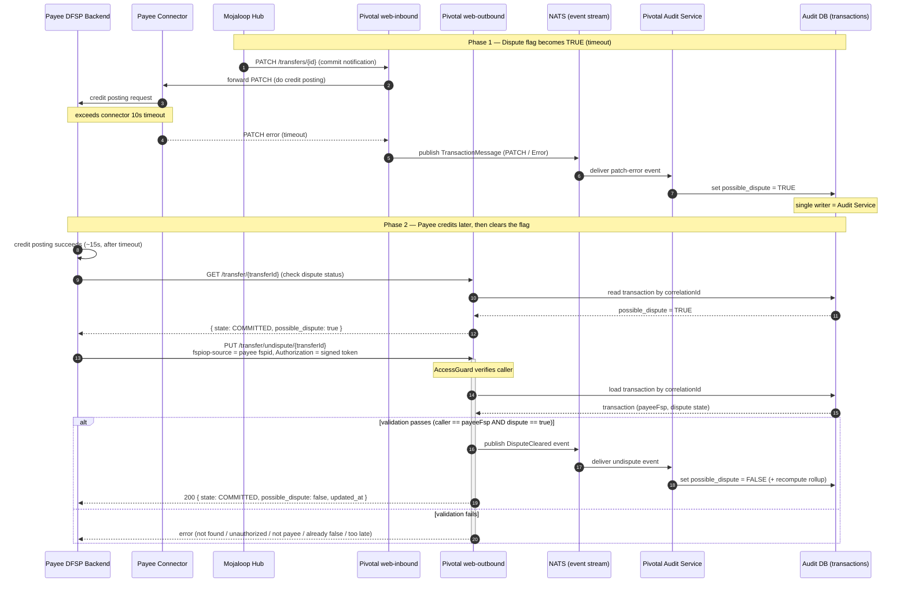

# Update Dispute Status (Payee Undispute) — Requirement Review

**Status:** Draft for Business Analyst review
**Last updated:** 2026-07-08

A new API that lets the **Payee DFSP** clear a transaction's dispute flag
(`possible_dispute: true → false`) after it has successfully completed the credit
posting that originally timed out.

---

## 1. Background

When the Hub sends `PATCH /transfers/{id}` to confirm a commit, the payee connector
performs credit posting to the payee's account. If that credit posting **exceeds the
connector's timeout window (~10s)**, the connector emits a patch error. Pivotal records
the transaction as `possible_dispute = true`.

The problem: the payee often **does** credit the customer a few seconds later (a slow
but successful posting). The transaction then stays marked as disputed even though the
money was correctly credited. A stale dispute flag can trigger unnecessary refund /
reverse-settlement processes.

The proposal is to let the payee, after confirming its credit posting succeeded, call a
new API to clear the flag.

---

## 2. How disputes work today (verified against the codebase)

These facts constrain the design and must be understood before implementing:

1. **`possible_dispute` has exactly one writer: the Audit Service.**
   The app that handles the patch error only **publishes a NATS event**
   (`TransactionMessage`, PATCH / `Error`). The **audit consumer** projects
   `possible_dispute = true` into the audit DB.
   _Refs:_ `packages/core/audit/consumer/listener/audit-transaction.consumer.ts:348`
   → `packages/core/audit/domain/command/transaction/audit-transaction.mapper.ts:344`.

2. **`possible_dispute` is a bare boolean.** There is no dispute *state machine*, no
   dispute timestamp, no "who cleared it" record.
   _Ref:_ `packages/core/audit/domain/sql/V1_0__create_audit_tables.sql:22`.

3. **Pivotal has no concept of a settlement window.** Settlement is Hub-side. Today an
   operator reads the flag and drives Hub adjustments manually — there is no software
   coupling between the flag and settlement timing.

4. **The flag feeds analytics.** It drives the hourly rollup `dispute_count` and the
   "committed value includes disputed" logic.
   _Ref:_ `packages/core/audit/domain/sql/V1_2__create_transaction_hourly_rollup.sql`.

**Implication:** the "clear the flag" path must go through the **same event → audit
consumer** route that sets it (so the rollup is recomputed correctly). The API host must
**not** write the audit table directly.

---

## 3. Proposed placement

**Host the endpoints in `web-outbound`.**

- `web-outbound` is the payer/DFSP-facing API for **client-initiated** requests
  (e.g. `POST /secured/sendmoney`), guarded by `AccessGuard` (access token).
- The payee clearing its own dispute is a **client-initiated, custom (non-FSPIOP)
  management action** — the same shape as `sendmoney`. It is **not** a Hub FSPIOP
  callback, so it does not belong in `web-inbound` (which is the strict FSPIOP callback
  receiver, guarded by `FspInboundGuard`).
- The "caller must be the payee" rule is a simple handler check:
  `transaction.payeeFsp === authenticatedCaller`.

Proposed endpoints:

| Method | Path | Purpose |
|--------|------|---------|
| `GET`  | `/transfer/{transferId}` | Read current dispute status of a transaction |
| `PUT`  | `/transfer/undispute/{transferId}` | Clear the dispute flag (true → false) |

> **Key both endpoints on `transferId` (= `correlationId`)**, not the internal snowflake
> `id`. The DFSP only ever knows the FSPIOP `transferId`.

---

## 4. Proposed flow



### API contract (draft)

`PUT /transfer/undispute/{transferId}`

Request body:
```json
{ "payee_potential_dispute": "false" }
```

Response body:
```json
{
  "payerHomeTransactionId": "home-txn-11111",
  "payeeHomeTransactionId": "home-txn-11132411",
  "payee_potential_dispute": "false",
  "state": "COMMITTED",
  "updated_at": "2026-06-07T13:53:11.279Z"
}
```

> Naming note: the DB column is `possible_dispute` but the API body uses
> `payee_potential_dispute`. **Pick one name** and use it consistently.

### Validation rules

1. Transaction exists (keyed on `transferId`).
2. Authenticated caller is the **payee DFSP** of the transaction
   (`transaction.payeeFsp === caller`).
3. Current flag is `true` (idempotent: if already `false`, no-op / conflict — see Q1).
4. **Credit posting was successful** — see concern C2; pivotal cannot verify this
   independently.
5. Only then publish the `DisputeCleared` event.

### Error handling

`404` not found · `401/403` unauthorized / not the payee · `409` already false or
"too late" (settlement acted) · `500` internal error. Every call must be **audit-logged**.

---

## 5. Concerns

- **C1 — Do not write the audit table directly.** The flag is an event-sourced
  projection; a direct write would corrupt the hourly rollup and race the consumer.
  Clear it via a `DisputeCleared` event, symmetric with how it is set.

- **C2 — Pivotal cannot verify "credit posting was successful."** Pivotal only knows the
  PATCH errored; it has no view into the payee's core-banking credit. So this validation
  really means "trust the authenticated payee's assertion." The acceptance criteria
  should say that explicitly, not imply pivotal checks it.
  _Alternative worth discussing:_ a payee that retries successfully sends a **successful
  PATCH**, which already updates `patch_responded_at`. Pivotal could **auto-clear** on a
  later good PATCH — possibly removing the need for a new API at all.

- **C3 — Eventual consistency / race with the projection.** `possible_dispute` lives in
  the async audit read-model. An undispute fired immediately after the PATCH may hit the
  row before the projection writes it. The undispute write must be a **compare-and-set**
  (conditional update), not read-then-write.

- **C4 — The flag is not authoritative for money.** The Hub settlement outcome is the
  final word. Pivotal's flag is an **early indicator** to reduce customer-facing delay.
  Both DFSPs must ultimately reconcile against settlement. This must be stated so nobody
  treats the flag as the source of truth and loses money on a race.

- **C5 — Settlement / dispute lifecycle does not exist yet.** Enforcing any "cutoff" or
  "too late" behaviour requires a real dispute **state machine + timestamps + a
  settlement-claim marker** — a schema change beyond "flip a boolean."

- **C6 — Scope creep.** The requirement bundles cross-party settlement policy (payer
  refund after 10 min, Hub reverse settlement). Those are **org / Hub-side policy**, not
  behaviour of this API. Keep them out of this endpoint's acceptance criteria.

---

## 6. Open questions for the Business Analyst

### Q1 — Settlement race (highest priority)

If the payee's undispute call arrives **after** settlement has already started a reverse
settlement for the transaction, the payee is penalised twice (it credited its customer
**and** got reverse-settled). Today the boolean has no protection against this.

Questions in simple English:

1. **Is there a time limit to clear the dispute?** After settlement already started for
   this transaction, should we **reject** the payee's request ("too late"), or always
   accept it and fix the money by hand later?
2. **What is the time limit?** Should the payee clear the dispute only **before the
   settlement window closes**? If yes, how long is that, and how often does settlement
   run in this system?
3. **What happens when it is "too late"?** Return an error and tell the payee to open a
   manual support case? Who handles that case — operations team, or Hub operator?
4. **Which one is the real truth — our flag or the Hub settlement?** Is our dispute flag
   only an early signal, with the Hub settlement result being the final answer?

### Q2 — The undispute window (policy + duration)

The window is a **correctness-critical parameter relative to the settlement cutoff**;
the invariant is `undispute_deadline < settlement_dispute_freeze`. If undispute can be
honoured after settlement swept the transaction, Q1's double-correction returns.

- Tie the deadline to **when the transaction is locked into a settlement batch**, not an
  arbitrary "5 minutes."
- Clock source = `transaction_completed_at`.
- If a duration is exposed, validate at startup that it is shorter than the settlement
  cadence — do not ship it as a free env knob.
- **Note:** none of this exists in pivotal today; it requires the schema change in C5, or
  it stays a purely operational/manual policy for now.

### Q3 — The payer side

The payer got a timeout on send-money and wants to know whether to refund its customer.
A bare boolean is not safe for the payer to act on either, because before the cutoff the
status is still **provisional**.

- Before the cutoff → status is **PROVISIONAL**; the payer must wait.
- After the cutoff → status is **FINAL**: `true` ⇒ reverse settlement ⇒ payer keeps the
  refund; `false` ⇒ payee credited ⇒ payer completes the debit.
- The `GET` endpoint should therefore return **more than a boolean** — a phase
  (`PROVISIONAL` / `FINAL`) and a `stableAfter` timestamp — so the payer knows when it is
  safe to act.

---

## 7. Recommendation

The small version — a JWS/access-token-guarded `web-outbound` endpoint that flips the
flag true → false **via a `DisputeCleared` event**, keyed on `transferId`, idempotent,
audit-logged, trusting the authenticated payee's assertion — is easy and matches the
existing architecture.

But Q1–Q3 all collapse to one missing piece: **there is no dispute lifecycle or
settlement cutoff in pivotal today, so the flag has no notion of "final."** Before
building, the BA must answer:

> **Does `possible_dispute` drive real money movement (settlement reversal), or is it
> only a reporting flag?**

- If **reporting only** → the small version above is sufficient.
- If it **drives settlement** → it needs an authoritative home + a dispute state machine
  + a settlement-aware cutoff. That is a materially bigger change than the ticket implies.
