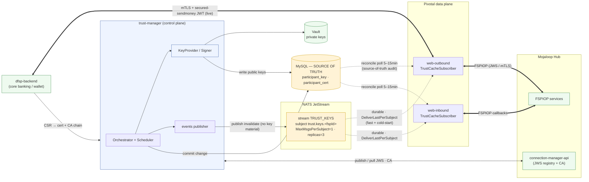
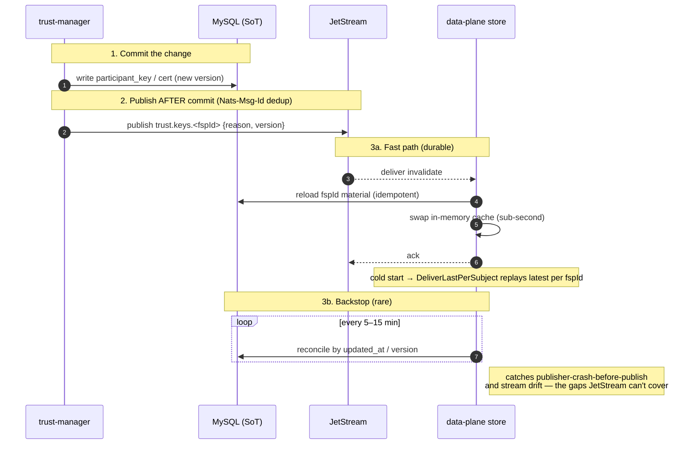
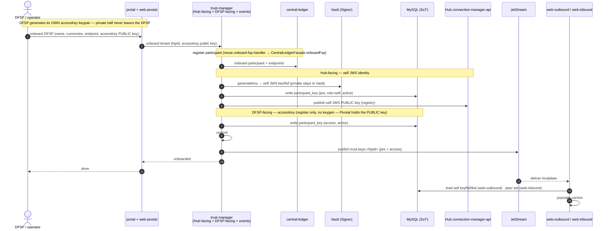
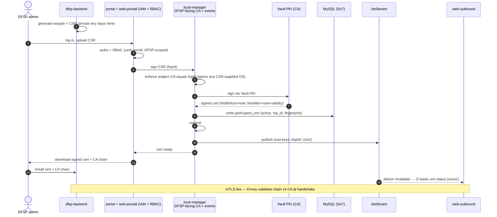
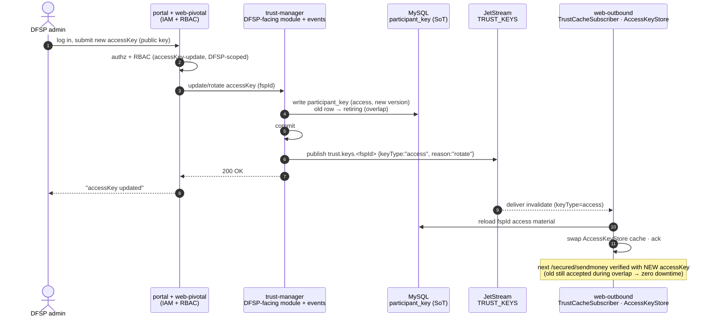
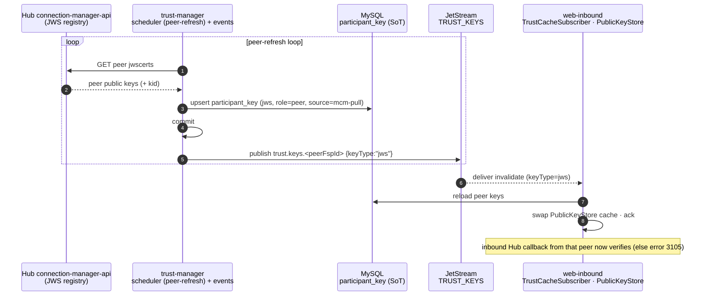
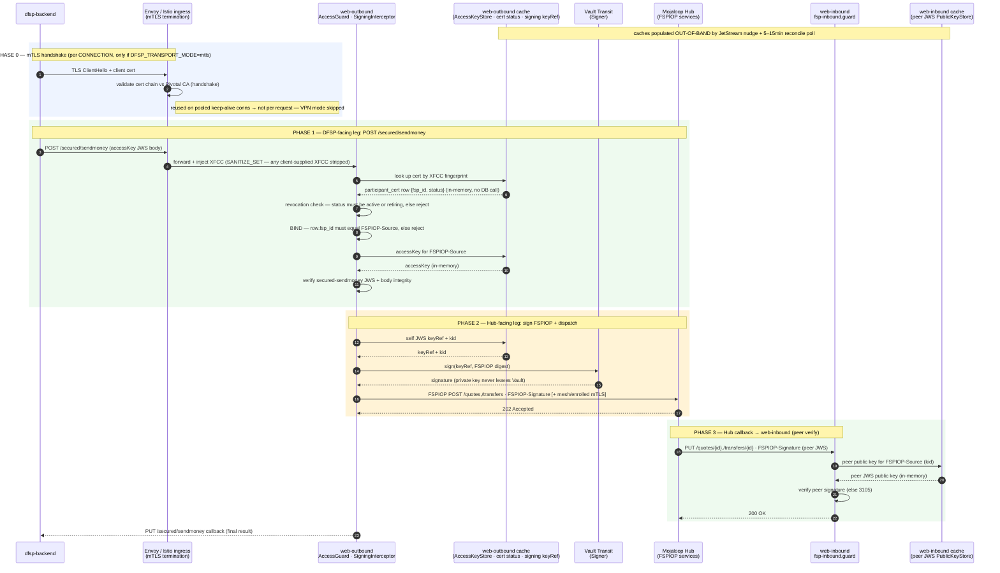
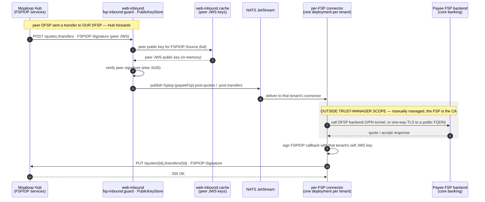
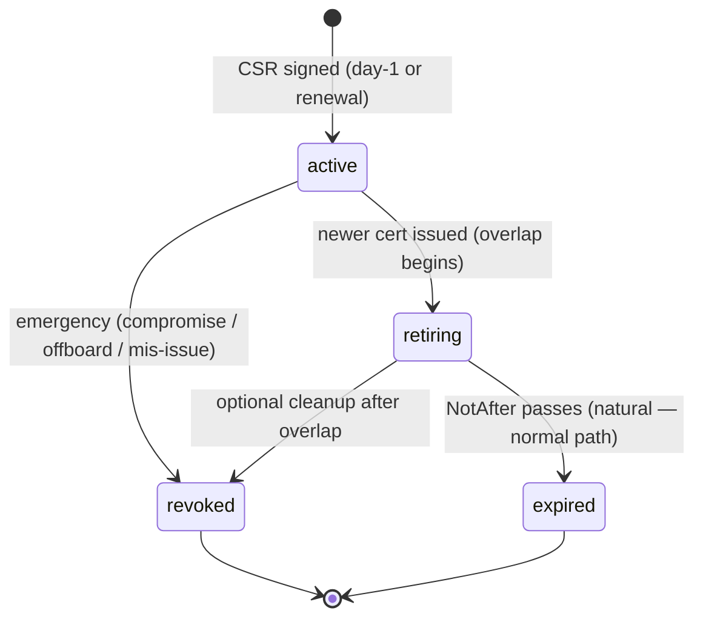
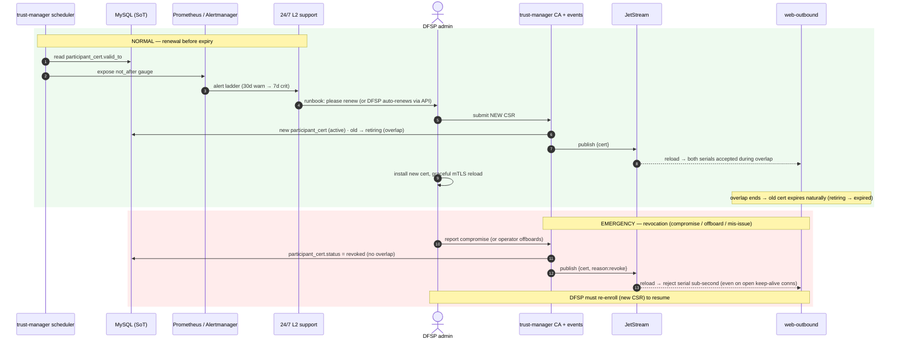

# Trust-Manager — Flow Diagrams

Single home for all trust-manager operational flows on the chosen **JetStream** propagation design.
Companion to [`trust-manager-architecture.md`](./trust-manager-architecture.md) (conceptual
architecture) and [`trust-manager-implementation-plan-jetstream.md`](./trust-manager-implementation-plan-jetstream.md)
(the build plan).

**Nine diagrams**, three tiers: overview → control-plane lifecycle → data-plane runtime.

## Legend / invariants (true in every diagram below)

- **MySQL is the single source of truth.** JetStream carries **invalidation nudges only — never key material**.
- **The data plane never calls trust-manager.** It reads MySQL, is *nudged* by JetStream, and is backstopped by a **5–15 min reconcile poll**.
- **Private keys stay in Vault** (delegated `Signer`). The data plane holds only a `keyRef + kid`; signing is delegated.
- **mTLS is validated at the TLS handshake (per-connection)** by Envoy — not per request. Envoy **injects** the `X-Forwarded-Client-Cert` (XFCC) header and strips any client-supplied one. **Hard requirement:** Envoy must be configured `SANITIZE_SET`, never `APPEND_FORWARD` — XFCC carries *identity*, so a client-settable XFCC would defeat the binding rule below.
- **Certificate identity is bound to `FSPIOP-Source`.** The client cert and the accessKey JWT are **two independent credentials**, and a request is rejected unless both name the **same** DFSP. Without this the cert only proves "some enrolled tenant", and a leaked accessKey alone would be enough to move that tenant's money. Active in `mtls` mode only.
- **Rotation / renewal is additive with an overlap window** — the old key/cert goes `active → retiring` (not deleted), so there is **zero downtime**.
- **Publish happens *after* the DB commit** — never before.

Two toggles gate whole flows: `DFSP_TRANSPORT_MODE = vpn | mtls` (DFSP-facing mTLS/CA active only in `mtls`) and `HUB_MTLS_MODE = mesh | mcm-enroll` (Hub-facing cert enrollment active only in `mcm-enroll`).

---

# Tier 1 — Overview

## 1. High-level — System context / propagation path

MySQL = source of truth · JetStream = durable transport · poll = audit. Control-plane writes are
solid; data-plane reads (the two propagation channels) are dotted; live transaction traffic is thick.

**How to read it:** trust-manager commits to MySQL then publishes a nudge; the data plane consumes
via two dotted channels (durable stream = fast, poll = audit) and never calls trust-manager back.
Private keys stay in Vault; live traffic (thick) runs on already-cached material, so trust-manager
can be down and transactions keep flowing.

## 2. Propagation sequence — rotate / revoke

The generic control→data mechanic behind every lifecycle flow in Tier 2.

**How to read it:** commit → publish → deliver → reload → ack, all sub-second and idempotent.
Cold-start is free (`DeliverLastPerSubject`). The 5–15 min loop is the only thing covering the gap
JetStream can't: a change committed to MySQL whose nudge was never published, or stream drift.

---

# Tier 2 — Control-plane lifecycle

## 3. Onboarding (Day-1)

Provisioning a brand-new DFSP: register the participant, mint its Hub-facing **self JWS** key and
publish it to the Hub registry, and record the DFSP-supplied **accessKey** public key — then let the
data plane pick everything up.

> **Two different key models sit side by side in this flow.** The **self JWS** key is *generated by
> Pivotal* (private half never leaves Vault, public half is published to MCM). The **accessKey** is
> *generated by the DFSP* — Pivotal never sees its private half and only records the public key it
> was handed. Diagram 5 is the same registration path used later for rotation.

**How to read it:** onboarding fans out to three systems — central-ledger (participant),
MCM (publish the self JWS public key so peers can verify us), and MySQL (local registry rows).
Only the **public** key goes to MCM; the JWS private key never leaves Vault. The accessKey touches
Vault at no point — there is no private half on Pivotal's side to protect. The single
commit-then-nudge lets the data plane converge without any direct call.

## 4. DFSP-facing mTLS enrollment (CSR → cert + CA chain)

Active only when `DFSP_TRANSPORT_MODE = mtls` (no VPN). Pivotal is the CA; the DFSP's private key
**never leaves the DFSP**.

**How to read it:** CSR-based enrollment means Pivotal signs a public cert but never sees the DFSP's
private key. The CA chain is public — the real concern is authenticity of first delivery, so it's
downloaded over the authenticated HTTPS portal. web-outbound only needs the cert **status** (active),
which arrives via the same nudge.

## 5. Control-plane update — DFSP accessKey change propagation (portal → web-outbound)

The DFSP rotates its accessKey (DFSP-facing). Only web-outbound reacts.

**How to read it:** accessKey is DFSP-facing, so **only web-outbound** consumes the nudge (web-inbound
filters it out by `keyType`). The old key goes `retiring`, not deleted, so in-flight requests still
verify. The 5–15 min reconcile poll would catch this even if the nudge were dropped.

## 6. Peer JWS pull / refresh (MCM → web-inbound)

The Hub-facing mirror of #5: a **peer** DFSP rotated its key and published to MCM; Pivotal pulls it
so web-inbound can verify that peer's callbacks.

**How to read it:** peers rotate their **own** keys — Pivotal never rotates a peer key, it just
**pulls** the new public key from MCM (the shared registry that makes cross-connector interop work)
and refreshes web-inbound. This is why a peer's rotation doesn't break inbound verification.

---

# Tier 3 — Data-plane runtime + lifecycle tail

## 7. Runtime transaction path — `/sendmoney` outbound send

Both legs on one live call. Every key lookup is an **in-memory cache hit**; the only per-request
crypto is the Vault sign in Phase 2.

**Why three checks in Phase 1, and why in that order.** Envoy has already proved the caller holds a
key for a cert *our CA issued* — but not **which tenant** they are. The three app-layer checks close
that gap, cheapest rejection first: revocation status, then the **binding** of cert identity to
`FSPIOP-Source`, then the (most expensive) signature verification. The binding check is effectively
free: the same cached row fetched for the revocation check already carries `fsp_id`. Without it the
two credentials are independent, and a leaked accessKey plus *any* enrolled tenant's cert would be
enough to transact as the victim. In `vpn` mode there is no cert, so only the signature check runs
and the accessKey is the sole credential — a deliberately weaker posture (see open decisions).

**How to read it:** mTLS is validated once at the handshake (Phase 0), so most `/sendmoney` calls
ride an already-validated pooled connection. Auth and verify (Phases 1 & 3) are pure in-memory
lookups. The single per-message network crypto is the delegated Vault sign (Phase 2) — the real TPS
lever (~300 signs/sec at 100 TPS).

## 8. Inbound receive path (Hub → web-inbound → connector → Payee FSP)

The receive direction: a peer-initiated transfer arrives *for* one of Pivotal's DFSPs. Note that
web-inbound never calls a DFSP backend directly — it publishes to NATS, and the **per-tenant
connector** makes that call and issues the FSPIOP callback to the Hub itself.

**How to read it:** the mirror of #7 — verification uses the same cached **peer** JWS keys. But the
DFSP-facing hop belongs to the **connector**, not web-inbound, and the connector also signs and
sends the Hub callback itself. That has a consequence for the Hub-facing JWS work: signing is **not**
confined to the Pivotal monorepo — every connector needs access to its tenant's signing key and must
produce a correctly-formed FSPIOP protected header.

> **Scope boundary — `connector → Payee FSP` is outside trust-manager.**
> On this hop Pivotal is the **client** and the FSP is both the **server and the CA**, so lifecycle
> authority sits with the FSP. Provisioning is handled manually between DevOps and the FSP's team.
> Pivotal holds **no key material** here — the connectors carry no keystore, truststore or client
> certificate — so there is nothing for trust-manager to custody, and no reason to build a
> cross-language distribution path to reach the Java connectors.
>
> Two follow-ups that do **not** reopen the scope decision:
> - Because the process is manual, nothing alerts on an FSP server certificate nearing expiry — that
>   connector simply stops. A TLS endpoint probe per `BACKEND_ENDPOINT` (e.g. blackbox_exporter's
>   `probe_ssl_earliest_cert_expiry`) reuses the monitoring stack §4.1 already requires.
> - Several backends are bare private IPs, which cannot chain to a public CA. Confirm with the
>   connector team whether server-certificate verification is enabled there (custom truststore) or
>   disabled. If disabled, that hop has encryption but no server authentication — acceptable inside a
>   VPN, but it should be a stated posture rather than an accident.

## 9. Cert lifecycle — renewal · expiry-alert · revocation

The DFSP-facing cert over time (`DFSP_TRANSPORT_MODE = mtls`). State model first, then the operational flow.

**How to read it:** normal renewal **never revokes** — the old cert is left to expire after an
overlap, giving zero downtime. Revocation is a separate emergency path with no overlap; because
enforcement is app-layer (XFCC serial → cached status), it takes effect within seconds even on
already-open connections, which a handshake-only CRL/OCSP would miss.

---

## Coverage map

| Tier | Diagram | Leg(s) | Plane |
| --- | --- | --- | --- |
| 1 | System context / propagation path | both | both |
| 1 | Propagation sequence (rotate/revoke) | both | control→data |
| 2 | Onboarding (Day-1) | both | control |
| 2 | DFSP-facing mTLS enrollment | DFSP-facing | control |
| 2 | accessKey update propagation | DFSP-facing | control→data |
| 2 | Peer JWS pull / refresh | Hub-facing | control→data |
| 3 | Runtime `/sendmoney` outbound send | both | data |
| 3 | Inbound receive path (via connector) | both — payee hop out of scope | data |
| 3 | Cert lifecycle (renewal/alert/revocation) | DFSP-facing | control→data |

**Not covered by design, deliberately:** `connector → Payee FSP`. Manually provisioned between
DevOps and the FSP, the FSP is the CA, and Pivotal holds no key material there. See the scope
boundary under diagram 8.
