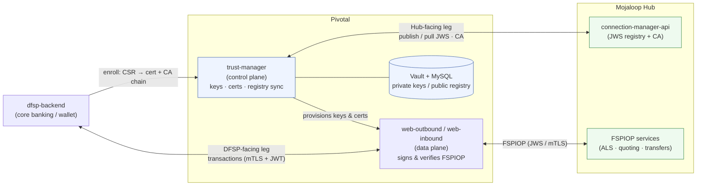
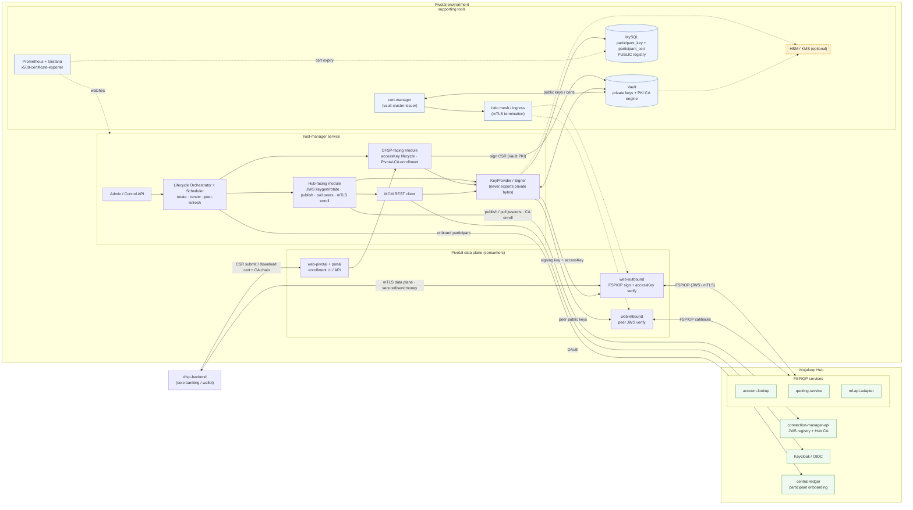
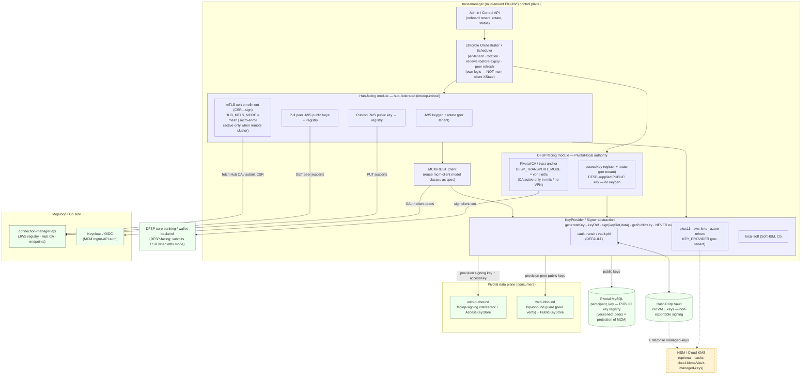

# Trust-Manager — Architecture Diagrams

`trust-manager` is the proposed multi-tenant **PKI / JWS / mTLS control plane** for Pivotal.
It lets one Pivotal deployment front many DFSPs to a Mojaloop Hub (the way PM4ML fronts one),
managing cryptographic identity lifecycle — key generation, rotation, renewal, certificate
enrollment, and registry sync — without ever sitting on the transaction path.

## Terminology

| Term | Meaning |
| --- | --- |
| **Hub-facing leg** | Pivotal ↔ Mojaloop Hub. FSPIOP JWS (both directions), MCM registry sync, `HUB_MTLS_MODE = mesh \| mcm-enroll`, MCM OAuth. |
| **DFSP-facing leg** | The **payer DFSP → web-outbound** hop. secured-sendmoney accessKey JWT, `DFSP_TRANSPORT_MODE = vpn \| mtls`, Pivotal-as-CA when `mtls`. **Pivotal is the server here.** |
| **Payee-side hop** | `connector → Payee FSP backend`. **Outside trust-manager scope** — see below. |

> Glossary note: Pivotal *acts as* the DFSP on the Hub-facing leg (it signs FSPIOP as that DFSP),
> but *connects to* the DFSP's backend on the DFSP-facing leg — same DFSP, identity vs backend.

### Scope boundary — the payee-side hop is not managed here

"DFSP-facing" covers **two** hops in opposite directions, and only the first is in scope:

| Hop | Pivotal's role | Who is the CA | In scope? |
| --- | --- | --- | --- |
| payer DFSP → `web-outbound` | server | **Pivotal** | **Yes** — accessKey + Pivotal-issued client certs |
| `connector` → payee FSP backend | client | **the FSP** | **No** |

On the payee-side hop the FSP owns both the endpoint and the certificate authority, provisioning is
handled manually between DevOps and the FSP's team, and Pivotal holds **no key material** — the
connectors carry no keystore, truststore or client certificate. There is therefore nothing for
trust-manager to custody, and no justification for building a cross-language provisioning path to
reach the Java connectors.

This is a deliberate boundary, not an omission. Two follow-ups sit outside it: expiry alerting on
each FSP backend endpoint (the manual process has no monitoring), and confirming whether the
connectors verify those backends' server certificates — several are bare private IPs, which cannot
chain to a public CA. Both are recorded under diagram 8 in `flow-diagrams.md`.

---

## 1. High-level view

Just the major blocks, the two legs, and the control-plane vs data-plane split.

**The whole story in four lines:**

- **trust-manager = control plane** — manages keys/certs, never on the transaction path.
- It **provisions** the data plane (web-outbound/web-inbound) with signing keys, peer keys, and accessKeys.
- **DFSP-facing leg**: the DFSP backend transacts with the data plane (mTLS + secured-sendmoney JWT) and enrolls certs through trust-manager (CSR → cert + CA chain).
- **Hub-facing leg**: trust-manager syncs JWS/CA with the Hub's connection-manager-api; the data plane runs live FSPIOP traffic to the Hub's services.

---

## 2. Context / component view (mid-level)

DFSP actor on the left, the Pivotal environment in the middle (trust-manager's internal
components + supporting tools + the data-plane consumers it provisions), and the Hub as a
larger box with the relevant services inside.

**How to read it:**

- **Left — `dfsp-backend`**: two relationships — the **data-plane** mTLS/secured-sendmoney to `web-outbound`, and the **provisioning** channel to `web-pivotal`/portal (submit CSR, download signed cert + CA chain).
- **Center — trust-manager**: the six components; everything signs *through* the `KeyProvider/Signer`, which is the only thing that touches Vault/HSM.
- **Supporting tools**: Vault (private keys + PKI CA), optional HSM behind it, MySQL (public registry only), cert-manager (issues off the existing `vault-cluster-issuer` → Istio ingress), and the monitoring stack (with the cert-expiry exporter watching for renewals).
- **Right — Hub**: the bigger box with the services trust-manager actually deals with — MCM (JWS registry + Hub CA), Keycloak (MCM auth), central-ledger (onboarding) — plus the FSPIOP services grouped, which the *data plane* talks to using the keys/certs trust-manager provisioned.

> **Clean division:** trust-manager never sits on the transaction path — it provisions key
> material into the data-plane stores (`web-outbound`, `web-inbound`), and those handle the live
> FSPIOP traffic to the Hub.

---

## 3. Internal architecture (component detail)

trust-manager's internal modules, the toggles, and the systems it reads/writes.

**Key elements:**

- **Orchestrator** is the multi-tenant engine (rotation/renewal/peer-refresh) — deliberately *not* mcm-client's single-tenant XState machine.
- **Hub-facing module** is always active for **JWS** (publish own + pull peers via the MCM registry) and holds the **OAuth** credential to call MCM; its **mTLS enrollment** only runs in `mcm-enroll` mode (remote cluster) and is a no-op under a shared mesh.
- **DFSP-facing module** always manages **accessKey**; its **CA** only exists in `mtls` mode (no VPN) — the toggle that decides whether trust-manager is ever a CA.
- **KeyProvider/Signer** is the only path to private key material — it never exports private bytes, so signing is delegated (Vault Transit/PKI by default, HSM/KMS when required). This is the abstraction that makes HSM a drop-in.
- **Custody split:** Vault holds **private** keys (non-exportable signing); MySQL holds the **public** registry (versioned; peers as a projection of MCM).

---

## Storage model (secrecy split)

| Material | Secret? | Store |
| --- | --- | --- |
| `jwsPrivateKey` (Hub-facing, Pivotal signs *as* the DFSP) | private | **Vault** (non-exportable signing) |
| CA / mTLS private keys (if `mtls` / `mcm-enroll`) | private | **Vault PKI engine** (HSM-backable) |
| DFSP client cert `.crt` (issued when Pivotal is CA) | public | **MySQL** `participant_cert` (serial, validity, status) |
| DFSP private key | private | **the DFSP — never stored by Pivotal** (CSR-based enrollment) |
| accessKey (DFSP-facing, verify secured-sendmoney JWT) | public | **MySQL** `participant_key` |
| JWS public keys (own + peers) | public | **MySQL** `participant_key` (peers = projection of MCM) |

## Configuration toggles

| Toggle | Values | Effect |
| --- | --- | --- |
| `HUB_MTLS_MODE` | `mesh` \| `mcm-enroll` | Hub-facing transport: Istio mesh (co-located) vs MCM CA enrollment (remote cluster). JWS is managed in both. |
| `DFSP_TRANSPORT_MODE` | `vpn` \| `mtls` | DFSP-facing transport: VPN tunnel (no CA) vs mTLS (Pivotal-as-CA). Decides whether trust-manager is ever a CA. |
| `KEY_PROVIDER` | `vault-transit` \| `vault-pki` \| `pkcs11` \| `aws-kms` \| `azure-mhsm` \| `local-soft` | Signing provider (per-tenant mapping + global default). Default `vault-transit`; HSM/KMS when a client requires it. |
