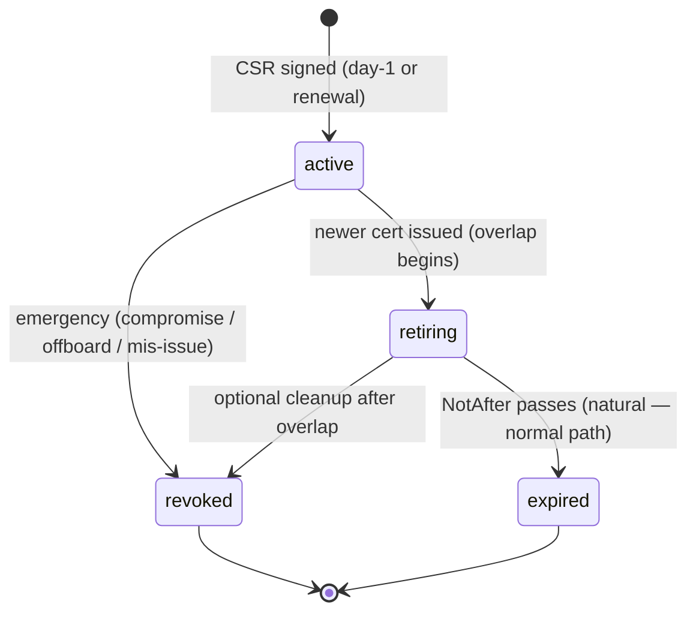
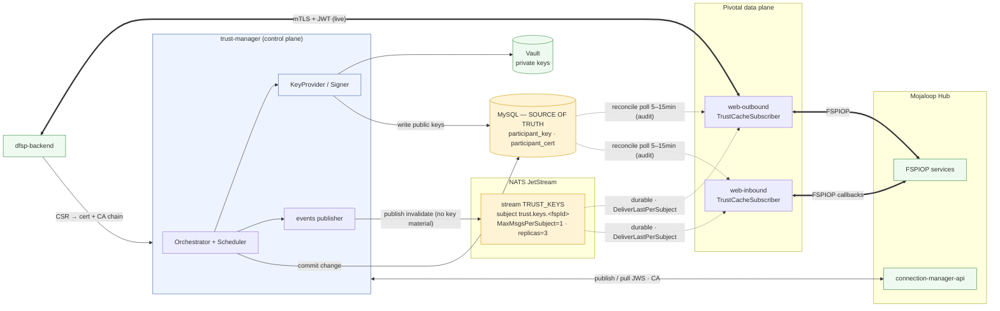
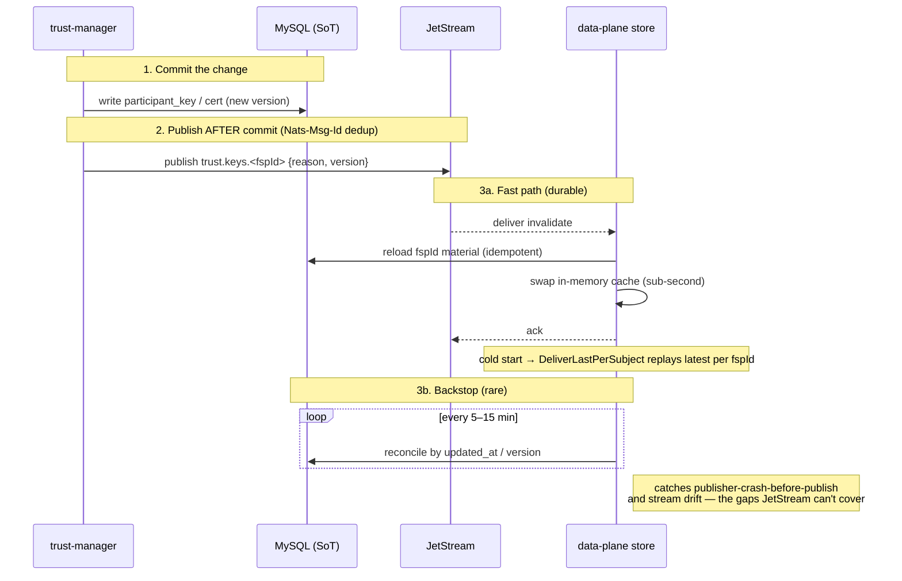

# Trust-Manager — Implementation Plan (JetStream variant — CHOSEN)

Companion to [`trust-manager-architecture.md`](./trust-manager-architecture.md) and
[`flow-diagrams.md`](./flow-diagrams.md).

This is the **selected** propagation design: a **NATS JetStream** durable invalidation stream
(sub-second, replayable, self-bootstrapping on cold start) **plus a lazy MySQL reconcile poll** as a
source-of-truth audit. §5.5 and §6 are where the propagation specifics live. Two alternatives were
evaluated and rejected — **poll-only** (~5s DB poll) and **core NATS** (at-most-once + tight poll);
the three-way trade-off is retained in **Appendix B**.

> **Core invariant:** MySQL is the single source of truth. The bus carries only "re-read this
> fspId" nudges — never key material. Dropping the reconcile poll is never on the table.

---

## 0. Goal & scope

Add a multi-tenant **PKI / JWS / mTLS control plane** (`trust-manager`) so one Pivotal
deployment can provision and maintain the cryptographic identity of the DFSPs it fronts:

- **Hub-facing leg** — generate/rotate per-tenant JWS keys, publish public keys to the Hub
  `connection-manager-api` (MCM) registry, pull peer public keys, and (remote-cluster only)
  enroll mTLS certs via the Hub CA.
- **DFSP-facing leg** — manage the secured-sendmoney `accessKey`, and (mTLS mode only) act as a
  CA that issues client certs to DFSP backends.
- **Custody** — private keys move out of MySQL into **Vault** (delegated, non-exportable signing);
  MySQL keeps only **public** material as a versioned registry.
- **Lifecycle** — renewal-before-expiry, peer refresh, and **Prometheus alerting to 24/7 L2**.
- **Propagation** — changes reach the data plane **sub-second via a durable JetStream invalidation
  event**, self-bootstrapping on cold start, with a **lazy DB reconcile poll** as a correctness audit.

trust-manager is a **control plane**: it never sits on the transaction path; it provisions key
material into the existing data-plane stores. **The data plane never calls trust-manager** — it
reads material from the shared stores and is nudged to re-read by a JetStream event.

---

## 1. Deliverables at a glance

| # | Deliverable | Type |
| --- | --- | --- |
| 1 | `core/trust/domain` library | new |
| 2 | `apps/trust-manager` service | new |
| 3 | `shared/vault` client + `shared/mcm-client` (MCM REST) | new |
| 4 | `KeyProvider`/`Signer` abstraction | new (in `shared/security`) |
| 5 | **`shared/trust-events` — JetStream publisher + durable-consumer subscriber** | **new (JetStream)** |
| 6 | **JetStream stream `TRUST_KEYS` (gitops/bootstrap: subjects, R=3, MaxMsgsPerSubject=1)** | **new (infra)** |
| 7 | DB schema: `participant_key`, `participant_cert`, `participant_contact`, `participant_key_ref`; deprecate `participant.jwsPrivateKey` | change |
| 8 | Signing/verify rewired to KeyProvider + registry **+ JetStream-driven store refresh** | update `web-outbound`, `web-inbound`, `shared/fspiop`, `core/participant` |
| 9 | Cert enrollment API + portal views + RBAC permissions | update `web-pivotal`, `core/auth`, `portal` |
| 10 | Vault engines (Transit + PKI), Alertmanager rules, Grafana board, gitops app | infra |

---

## 2. New service: `trust-manager` — project structure

```
packages/
  core/trust/domain/                         # new domain library (CQRS)
    domain.module.ts
    sql/                                      # Flyway-style migrations (V1__...)
    model/                                    # participant-key, participant-cert, key-ref, status enums
    repository/                               # participant-key.repository, participant-cert.repository, contact.repository
    command/                                  # generate-jws-key, rotate-jws-key, publish-jws, sign-csr,
                                              #   register-access-key, enroll-dfsp-cert, revoke-cert, onboard-tenant
                                              #   (register-access-key stores a DFSP-SUPPLIED public key — no keygen)
    query/                                    # get-cert-status, list-keys, get-ca-chain, get-peer-keys
    component/
      key-provider/                           # Signer/KeyProvider interface + selection (per-tenant)
      mcm/                                    # MCM sync orchestration (publish/pull) — uses shared/mcm-client
      ca/                                     # DFSP-facing CA (Vault PKI) sign/revoke
      scheduler/                              # renewal-before-expiry + peer-refresh loop (+ distributed lock)
      metrics/                                # cert not_after gauges for Prometheus
      events/                                 # publishes invalidation to JetStream AFTER DB commit
    trust-errors.ts

  apps/trust-manager/                         # new deployable app
    main.ts  app.module.ts  trust-manager.module.ts
    controllers/                              # admin/control API: onboard, rotate, status, ca-chain
    component/                                # auth guard (reuse IAM), metrics endpoint, settings
    required.settings.ts

  shared/vault/                               # new: node-vault wrapper (KV + Transit + PKI)
  shared/mcm-client/                          # new: MCM REST client (reuse mcm-client model classes as the contract)
  shared/trust-events/                        # new (JetStream): subject constants, payload types,
                                              #   TrustEventPublisher (JetStream publish, dedup header)
                                              #   TrustCacheSubscriber (ephemeral push consumer, DeliverLastPerSubject)
```

- **scheduler** = multi-tenant engine (our own logic — **not** mcm-client's single-tenant XState machine).
- All private-key access goes **through** `key-provider/` (never returns raw private bytes).
- `KeyProvider`/`Signer` interface lives in `shared/security`; `core/trust` provides concrete providers.
- **`shared/trust-events`** is the JetStream contract shared by control plane (publisher) and every
  data-plane consumer (subscriber). It owns the subject scheme, payload types, and consumer config so
  producers/consumers can't drift.

---

## 3. Database changes

Identical to the other variants — the stream carries no key material, so MySQL stays source of truth.
`updated_at` / version columns drive the reconcile audit (§5.5).

### 3.1 New tables (`core/trust/domain/sql/V1__create_trust_tables.sql`)

**`participant_key`** — public key registry (versioned; supports rotation overlap)

| Column | Notes |
| --- | --- |
| `id` | PK |
| `fsp_id` | participant |
| `key_type` | `jws` \| `access` |
| `role` | `self` \| `peer` |
| `kid` | key id |
| `algorithm` | e.g. `RS256`, `ES256` |
| `public_key_pem` | the public key (non-secret) |
| `status` | `active` \| `retiring` \| `revoked` |
| `valid_from`, `valid_to` | validity window |
| `source` | `self` \| `mcm-pull` |
| `created_at`, `updated_at` | `updated_at` drives reconcile |

**`participant_cert`** — DFSP-facing client certs issued when Pivotal is CA

| Column | Notes |
| --- | --- |
| `id` | PK |
| `fsp_id` | participant — **the binding target**: must equal `FSPIOP-Source` at runtime (§6.4) |
| `serial` | cert serial |
| `fingerprint_sha256` | SHA-256 of the DER cert — **the runtime lookup key** from XFCC (§6.4) |
| `subject` | DN / CN — CN is **enforced** to `fsp_id` at issuance, never taken from the CSR |
| `cert_pem` | issued cert (public) |
| `ca_chain_ref` | reference to CA chain used |
| `status` | `active` \| `retiring` \| `revoked` \| `expired` (matches the §6.1 state model) |
| `valid_from`, `valid_to` | drives expiry alerting |
| `issued_at`, `revoked_at` | |

**`participant_contact`** — L2 runbook / notification contact

| Column | Notes |
| --- | --- |
| `id` | PK |
| `fsp_id` | participant |
| `contact_type` | `email` \| `webhook` \| `phone` |
| `value` | address/URL |
| `purpose` | e.g. `cert-expiry` |

**`participant_key_ref`** — pointer to private key material in the provider (never the key itself)

| Column | Notes |
| --- | --- |
| `fsp_id`, `key_use` (`jws-sign` \| `ca` \| `mtls-server`) | |
| `provider` | `vault-transit` \| `vault-pki` \| `pkcs11` \| `aws-kms` … |
| `key_ref` | Vault path / HSM label / KMS key-id |
| `created_at` | |

### 3.2 Existing `participant` table

- **Stop writing `jwsPrivateKey`** — private key now lives in Vault, referenced via `participant_key_ref`.
- Migrate existing DB private keys → Vault (one-off), then **drop the column** in a later migration.
- `jwsPublicKey` / `accessPublicKey` become read-through to `participant_key` during transition.

### 3.3 RBAC (`core/auth/domain/sql/V10__add_participant_cert_permissions.sql`)

- New DFSP-scoped permissions e.g. `participant.certs.enroll`, `participant.certs.manage`.

---

## 4. Supporting services

### 4.1 Already in staging — configure only

| Service | Config work for trust-manager |
| --- | --- |
| **Vault** (+ vault-config-operator) | enable **Transit** (delegated signing) + **PKI** (DFSP-facing CA); per-tenant paths + policies |
| **cert-manager** (+ `vault-cluster-issuer`) | web-outbound/ingress server cert + client-trust bundle for DFSP-facing mTLS |
| **Prometheus / Alertmanager** | cert-expiry alert ladder → **prometheus-msteams** / PagerDuty (L2) |
| **Grafana** | cert-expiry / renewal-status + **JetStream consumer-lag** dashboard |
| **x509-certificate-exporter** | point at DFSP-facing certs |
| **MCM (connection-manager-api)** + Keycloak | publish/pull JWS + OAuth; already deployed |
| **Istio** | mTLS termination at ingress (DFSP-facing `mtls` mode) |
| **NATS — with JetStream enabled** | host the durable `TRUST_KEYS` stream. **Requires JetStream turned on and persistent storage; stream must be `replicas=3` (HA) or it becomes a SPOF for propagation.** |

### 4.2 New / conditional

| Service | When |
| --- | --- |
| **`trust-manager` deployment** (helm/gitops app under `apps/`) | always |
| **JetStream stream `TRUST_KEYS`** (bootstrap job / gitops) | always (this variant) |
| **HSM / Cloud KMS** + SoftHSM (CI) | only when `KEY_PROVIDER != vault-*` |
| **VPN gateway** (WireGuard/IPsec) | only when `DFSP_TRANSPORT_MODE = vpn` |

---

## 5. Changes to existing services

| Package / area | File(s) (high-level) | Change |
| --- | --- | --- |
| **web-outbound** | `shared/fspiop/component/axios/interceptor/fspiop-signing.interceptor.ts` | sign via **KeyProvider** (delegated Vault Transit) instead of loading `jwsPrivateKey` |
| **web-outbound** | `component/access.guard.ts`, `shared/security/component/key/access-key-store.ts` | read `accessKey` from `participant_key`; **subscribe to JetStream** (§5.5) |
| **web-outbound** | ingress / Istio config (no code) | DFSP-facing mTLS termination when `mtls` mode |
| **web-inbound** | `shared/fspiop/component/nest/guard/fsp-inbound.guard.ts`, `shared/fspiop/component/security/fspiop-jws-public-key-store.ts` | verify peer sigs from `participant_key`; **subscribe to JetStream** (§5.5) |
| **core/participant** | `component/store/participant-jws-private-key-store.ts` | replace with **Signer** delegate (no raw private key) |
| **core/participant** | `component/store/participant-jws-public-key-store.ts`, `participant-access-key-store.ts`, `participant-signing-keys-cache.ts` | source from `participant_key`; **JetStream refresh + reconcile poll** (§5.5) |
| **core/participant** | `command/onboard-fsp.handler.ts`, `add-signing-keys.handler.ts`, `generate-signing-key…` | publish public key to MCM (via trust-manager) + write `participant_key`; stop writing `jwsPrivateKey`; keep central-ledger onboarding |
| **core/participant** | `model/participant.model.ts`, `repository/participant.repository.ts` | schema changes |
| **web-pivotal** | `controllers/participant/*` (+ new `controllers/trust/*`) | CSR submit, download cert + CA chain, list/renew status; admin rotate/status |
| **core/auth** | `model/permission-key.ts`, `seed/rbac-seeder.ts`, `preset/role-presets.ts` | new cert permissions + menu entries (DFSP-scoped) |
| **portal** (Vue) | new views under participant/trust | CSR submit, download cert + CA chain, cert status + expiring banner |
| **shared/security** | `component/key/*`, `component/cert/*`, new `key-provider/` | `KeyProvider`/`Signer` interface; provider-backed stores |
| **shared/fspiop** | signing interceptor + inbound guard | depend on `Signer` + registry instead of env/DB key loaders |
| **shared/trust-events** | **new** | `TrustEventPublisher` (JetStream publish) + `TrustCacheSubscriber` (durable/`DeliverLastPerSubject`) |
| **root** | `nest-cli.json`, `package.json` | register `core-trust-domain`, `apps-trust-manager`, `shared-vault`, `shared-mcm-client`, **`shared-trust-events`**; build/start scripts |

### 5.5 Key-material propagation (JetStream — the core of this variant)

**Two channels, one source of truth** (MySQL `participant_key` / `participant_cert`).

**A. Fast path — JetStream durable invalidation.**

Stream & subject scheme:

| Setting | Value | Why |
| --- | --- | --- |
| stream | `TRUST_KEYS` | one stream for all key/cert invalidations |
| subject | `trust.keys.<fspId>` | **subject per tenant** → `DeliverLastPerSubject` = "current state of every tenant" |
| `MaxMsgsPerSubject` | `1` | keep only the **latest** nudge per tenant; stream stays tiny (N tenants, not N events) |
| `replicas` | `3` | HA — a single JetStream node must not be a propagation SPOF |
| retention | interest/limits with the above cap | bounded storage regardless of churn |

Payload (no key material):
```
subject : trust.keys.<fspId>
header  : Nats-Msg-Id = <fspId>:<version>   # publish-side dedup
payload : { fspId, keyType: "jws"|"access"|"cert", reason: "rotate"|"revoke"|"peer-pull", version, at }
```

Publisher (`trust-manager` `events/`): **publish only AFTER the DB commit** succeeds. Use
`Nats-Msg-Id` for idempotent publish (JetStream dedups within its window), so a retry can't create
divergent duplicates.

Consumers (`TrustCacheSubscriber` in each data-plane pod):
- **Ephemeral push consumer per pod** with **`DeliverLastPerSubject`** — **NOT** a shared queue
  group. Each pod is a *cache* and must see **every** update; a queue group would load-balance and
  each pod would miss others' messages (wrong for cache invalidation).
- On message → **reload that fspId's material from MySQL**, swap in-memory cache, `ack`. Handler is
  **idempotent** ("reload fspId X"), so at-least-once redelivery is harmless.
- **Cold start is self-bootstrapping:** a fresh pod's `DeliverLastPerSubject` consumer is handed the
  latest message for every subject (every tenant) on connect → the cache is populated from the stream,
  **no warm-up query needed**.

**B. Backstop path — lazy MySQL reconcile poll.**

- Each store still reconciles against MySQL by `updated_at`/version — but now as a **source-of-truth
  audit**, not the recovery mechanism.
- Interval: **5–15 min** (was 15–20s in the core-NATS variant, 5s in poll-only). JetStream already
  covers missed-delivery and cold-start; the poll only exists for the class JetStream can't:
  **publisher committed the DB row but crashed before publish**, or **stream drift** (retention purge,
  stream recreated, misconfig). No delivery guarantee can deliver a message that was never sent.

**Private keys are exempt from both.** The signing cache holds only `keyRef + version`; signing
delegates to `Signer` → Vault Transit/HSM. Private-key material never rides the stream and is never
polled.

**Failure modes (eyes open):**

| Failure | Behavior |
| --- | --- |
| Pod down when event fired | **JetStream durable replay** on reconnect (no gap) |
| Fresh/cold-start pod | **`DeliverLastPerSubject`** replays latest per tenant (no warm-up query) |
| Duplicate delivery | Harmless — reload is idempotent |
| Publisher commits DB then crashes pre-publish | Caught by reconcile poll (≤5–15 min) |
| Stream purge / recreate / misconfig | Caught by reconcile poll |
| **JetStream node loss without R=3** | Propagation stalls until stream recovers → **mandate `replicas=3`** |
| JetStream fully down | Degrade to poll-only (≤5–15 min) — correctness preserved, latency worse |

**Observability:** alert on **JetStream consumer lag / pending** per data-plane pod (a stuck consumer
means stale security material) and on **publish failures** in trust-manager. Add both to the Grafana
board (§4.1).

> **This is the one meaningful difference from the other variants.** Everything else in this document
> matches the original plan. The poll is retained — only its role (audit) and interval (5–15 min) change.

---

## 6. Certificate lifecycle & revocation (DFSP-facing)

Applies when `DFSP_TRANSPORT_MODE = mtls` (Pivotal-as-CA). Guiding rule:

> **Normal renewal does NOT revoke the old cert.** Renewal happens *before* expiry with an overlap;
> the old cert is **retired and left to expire naturally**. **Revocation is reserved for abnormal
> events** (key compromise, DFSP offboarding, mis-issuance).

### 6.1 `participant_cert.status` state model



App-layer check accepts `active` **and** `retiring`; rejects `revoked`; `expired` is rejected at the
TLS handshake by Envoy.

### 6.2 Lifecycle timeline

**Phase 1 — Day-1 enrollment**
1. DFSP generates **keypair + CSR** (private key never leaves them).
2. DFSP uploads the CSR via the portal.
3. trust-manager **signs via Vault PKI** → `participant_cert` row = **`active`**; **publishes
   `trust.keys.<fspId>` (reason `rotate`)** after commit.
4. DFSP **downloads** cert + CA chain and installs on their backend.
5. mTLS live: Envoy validates chain vs CA, injects XFCC; app checks `status=active` → transactions flow.

**Phase 2 — Steady state (day-1 → ~T-30d)**
6. Each request: Envoy validates chain + app-layer status lookup (**in-memory cache**, kept fresh by
   JetStream + reconcile). Cert stays `active`.
7. Scheduler exposes the `not_after` metric to Prometheus.

**Phase 3 — Expiry approaching (~T-30d → T-1d)**
8. Alertmanager fires the severity ladder to **24/7 L2**.
9. L2 contacts the DFSP to renew — or the DFSP auto-renews via API (silent).

**Phase 4 — Renewal (before expiry)**
10. DFSP generates **new keypair + CSR**.
11. DFSP uploads it.
12. trust-manager signs → **new** row `active`; **old** row → **`retiring`** (overlap begins);
    **publishes invalidation**.
13. DFSP downloads new cert + CA chain, installs alongside old, **gracefully reloads** its mTLS client.

**Phase 5 — Overlap window (both valid)**
14. New connections use the new cert; pooled connections drain on the old (`retiring`) — both accepted
    (same CA, both non-revoked). **Zero downtime**; mid-transaction cert change is safe (keyed by
    `transferId` + JWT, not the cert).

**Phase 6 — Retire the old cert**
15. After overlap:
    - **Default:** let it **expire** (`retiring → expired`) — Envoy rejects past `NotAfter`.
    - **Optional hygiene:** set **`revoked`** → JetStream propagates rejection **sub-second**.
16. New cert is the sole `active` cert → loop to Phase 2.

### 6.3 Emergency revocation (separate path)

Trigger: **key compromise, DFSP offboarding, mis-issuance**.
- Set `participant_cert.status = revoked` **immediately, no overlap**; **publish invalidation
  `reason: revoke`** after commit.
- App-layer rejects that serial **sub-second** (JetStream), even on already-open keep-alive
  connections (transport-layer CRL/OCSP would only catch it at the next handshake). Reconcile poll
  (≤5–15 min) is the fallback if the stream is down.
- The DFSP must **re-enroll** (new CSR) to resume.

### 6.4 Revocation enforcement

- **Authoritative source:** `participant_cert.status` in Pivotal's DB (Pivotal *is* the CA).
- **Primary (app-layer):** Envoy terminates mTLS, validates chain vs CA, **injects** the
  `X-Forwarded-Client-Cert` (XFCC) header — the DFSP never sends it; Envoy strips any client-supplied
  XFCC. **This requires `SANITIZE_SET`, not `APPEND_FORWARD`** — XFCC carries identity (below), so a
  client-settable header would defeat both checks. A guard in web-outbound resolves the XFCC
  fingerprint to the **cached `participant_cert` row**. **In-memory lookup, not a per-request DB
  call** — cache kept fresh by **JetStream (sub-second) + reconcile poll (≤5–15 min)**.
- **Two checks on that one cached row, cheapest first:**
  1. **Revocation** — `status` must be `active` or `retiring`, else reject.
  2. **Binding** — `row.fsp_id` must equal the request's `FSPIOP-Source`, else reject.
- **Why binding is not optional.** The client cert and the accessKey JWT are *independent*
  credentials. Checked separately, the cert proves only "the caller is **some** enrolled tenant" —
  so an attacker holding a leaked accessKey for DFSP-B plus **any** valid tenant cert (their own,
  as an enrolled DFSP-C) transacts as DFSP-B. Binding forces compromise of **both** credentials
  **of the same tenant**. It costs one comparison on a row already fetched for check 1.
- **Enforced at issuance too:** trust-manager **sets** the cert subject CN to the tenant's `fspId`
  and ignores any CN in the submitted CSR, so no cert exists whose subject contradicts its `fsp_id`.
- **`vpn` mode:** no cert, so neither check runs and the accessKey is the sole credential. That is a
  deliberately weaker posture — see §9.
- **Optional defense-in-depth:** Vault PKI **CRL** (Envoy refreshes) or **OCSP**. CRL has refresh
  staleness; OCSP adds per-handshake latency + availability dependency — skip OCSP unless compliance
  forces it.

---

## 7. Configuration toggles (env)

| Toggle | Values | Effect |
| --- | --- | --- |
| `HUB_MTLS_MODE` | `mesh` \| `mcm-enroll` | mesh (co-located) vs MCM CA enrollment (remote cluster); JWS managed in both |
| `DFSP_TRANSPORT_MODE` | `vpn` \| `mtls` | VPN (no CA) vs mTLS (Pivotal-as-CA); decides whether the CA subsystem is active |
| `KEY_PROVIDER` | `vault-transit` \| `vault-pki` \| `pkcs11` \| `aws-kms` \| `azure-mhsm` \| `local-soft` | signing provider (per-tenant map + global default); default `vault-transit` |
| `TRUST_INVALIDATION_ENABLED` | `true` \| `false` | JetStream fast path on/off. `false` = poll-only fallback |
| `TRUST_STREAM_NAME` | string | JetStream stream, default `TRUST_KEYS` |
| `TRUST_SUBJECT_PREFIX` | string | subject prefix, default `trust.keys` (→ `trust.keys.<fspId>`) |
| `PARTICIPANT_KEY_STORE_REFRESH_INTERVAL_SECONDS` | int | reconcile audit interval — **`300`–`900` (5–15 min)** in this variant |

> Correctness-critical params (rotation/overlap windows, expiry thresholds, stream durability =
> `replicas=3`, `MaxMsgsPerSubject=1`) are **hardcoded/validated at startup or set in gitops**, not
> left to per-instance env. Env holds operational/freshness knobs only.

---

## 8. Phased rollout

1. **Foundation** — `shared/vault`, `KeyProvider`/`Signer` in `shared/security`, `core/trust/domain`
   skeleton + `participant_key`/`participant_key_ref` tables. Move JWS private key → Vault Transit;
   rewire `web-outbound` signing + `web-inbound` verify. *(No external behavior change; custody fixed.
   Stores still poll — stream not yet wired.)*
2. **JetStream propagation** — provision the `TRUST_KEYS` stream (R=3, `MaxMsgsPerSubject=1`,
   subject-per-tenant); `shared/trust-events` publisher + `TrustCacheSubscriber`
   (`DeliverLastPerSubject`); relax reconcile poll to 5–15 min; add consumer-lag alerts +
   `TRUST_INVALIDATION_ENABLED` kill-switch. *(Sub-second propagation; self-bootstrapping cold start.)*
3. **Hub-facing sync** — `shared/mcm-client`, MCM publish/pull, peer projection into `participant_key`,
   `HUB_MTLS_MODE` enrollment path. *(Interop via shared registry; peer-pull publishes invalidation.)*
4. **DFSP-facing CA** — Vault PKI mount, `participant_cert`, enrollment API + portal views + RBAC,
   `DFSP_TRANSPORT_MODE=mtls`. *(Only if not VPN-only; issue/revoke publish invalidation.)*
5. **Lifecycle & alerting** — scheduler (renewal + peer refresh + lock), cert not_after metrics,
   Alertmanager rules → L2, Grafana board (incl. JetStream lag), `participant_contact` + runbook.
6. **HSM (deferred)** — add `pkcs11`/KMS provider behind the abstraction when a client demands it;
   SoftHSM in CI.

---

## 9. Open decisions

- **Deployment mode per environment** — co-located vs remote-cluster (sets `HUB_MTLS_MODE`); confirm
  whether Hub FSPIOP ingress demands per-DFSP client certs from in-cluster callers.
- **DFSP-facing transport per deployment** — VPN vs mTLS (sets `DFSP_TRANSPORT_MODE`).
- **Onboarding split** — participant/endpoint onboarding direct to central-ledger vs also via MCM.
  JWS registry is always MCM.
- **Key algorithm** — ECDSA P-256 vs RSA (ECDSA cheaper for HSM/TLS handshake throughput).
- **JetStream footprint** — confirm the existing NATS deployment has JetStream enabled with persistent
  storage and can run the stream at `replicas=3`; if not, that is a prerequisite infra task.

### 9.1 DFSP-facing security decisions (open)

Raised during design review. The **binding** rule (§6.4) is settled and written in; these are not.

- **Cache-miss behaviour — fail open or fail closed?** The Phase-1 checks read an in-memory cache.
  With the reconcile poll relaxed to 5–15 min, a pod that cold-starts while JetStream is down can
  hold an **empty** cert cache for that whole window. Fail closed ⇒ every DFSP locked out. Fail open
  ⇒ revoked certs pass. Proposed rule: distinguish **cache-cold / unknown fingerprint** (fail
  **open** + alarm — Envoy already validated the chain, so this degrades to transport-only, which is
  exactly today's `vpn` posture) from **known and `revoked`** (fail **closed**, always). Needs a
  decision, because whoever implements it will otherwise pick one silently.
- **accessKey emergency revocation.** §6.3 gives *certificates* a no-overlap emergency path, but the
  accessKey has only rotation-with-overlap (Diagram 5) — so a reported key compromise leaves the
  attacker signing valid requests for the whole overlap. The accessKey authorises **payments**; it
  needs the same two-path model as certs (normal rotation with overlap, emergency revocation without).
- **Who may replace an accessKey?** Diagram 5 authorises it with a DFSP-scoped portal role, which
  makes a single portal login the root of trust for the entire DFSP-facing leg — compromise it and
  the attacker installs their own accessKey and signs arbitrary `/sendmoney`. Options: dual control
  (HUB-scoped approver), out-of-band confirmation to a registered `participant_contact`, or at
  minimum mandatory change notification.
- **Replay protection.** The accessKey JWT payload is the canonicalised request body — no nonce, no
  `jti`, no timestamp bound into the signature. The same signed `POST /secured/sendmoney` replays
  into a **new** transfer each time, since the transfer id is minted server-side. Pre-existing rather
  than introduced here, and contained by the VPN today — but this is the moment it should be scoped.
  FSPIOP binds the `Date` header into its signature for exactly this reason.
- ~~**accessKey overlap: `kid` or try-both?**~~ **DECIDED: try-both. No `kid`.** Rationale: `kid`
  would be a contract change every DFSP must adopt, and it makes rotation *more* fragile at the
  client end — a DFSP that switches signing keys but still emits the old `kid` fails every request,
  a failure mode try-both cannot produce. The saving is ~30–60µs of local CPU. Mechanics:
  - `participant_key` carries `status` (`active` / `retiring` / `revoked`) and `valid_to`.
    Registering a new accessKey moves the previous one to `retiring` with
    `valid_to = now + overlap`, and it **expires automatically** — no operator action, so overlaps
    cannot silently become permanent.
  - Overlap window: **fixed default ~7 days, hardcoded** (a correctness-critical parameter, per §7),
    with an operator action to end an overlap early.
  - The store caches `Map<fspId, PublicKey[]>` — **ordered `active` first, then `retiring`**.
    Rows are filtered to `status ∈ {active, retiring}` and unexpired **at cache-refresh time, not
    per request**, so the verification path never reasons about status. Outside a rotation window
    the list holds exactly one key and the cost is identical to today.
  - Revocation remains a **separate, immediate** path with no overlap, propagated by JetStream
    nudge rather than waiting for `valid_to`.
  - Log which key verified each request — this yields free telemetry on rotation progress
    (how much traffic still uses the retiring key), which is what tells an operator when it is safe
    to end an overlap early.
- **XFCC field — confirm against the live Istio config.** §6.4 keys the lookup on the SHA-256
  fingerprint because Envoy's `set_current_client_cert_details` exposes `Hash`, `Subject`, `URI`,
  `DNS` and `Cert` but **no serial**. Verify before building.
- **Which CA chain does the DFSP download?** Two distinct CAs exist on this leg: the one signing DFSP
  *client* certs (Vault PKI — Pivotal validates against it) and the one behind *Pivotal's server*
  cert (cert-manager / `vault-cluster-issuer` — the DFSP validates against it). Diagram 4 says "cert
  + CA chain" without saying which. Disambiguate, or DFSPs will install the wrong bundle.
- **Is `Connector → Payee FSP` in scope for mTLS, or does it stay VPN?** Every DFSP-facing flow here
  models Pivotal as the **server** and the **CA**. The payee-side hop inverts both: Pivotal is the
  client, against a CA it does not own. If in scope, trust-manager needs a capability it currently
  has no concept of. (Diagram 8's topology also omits the connectors entirely — see review notes.)
- **State the `vpn` posture explicitly.** In `vpn` mode the accessKey is the sole per-request
  credential and neither §6.4 check runs. That is defensible, but it should be a written decision
  rather than an implicit consequence of a toggle.

---

## Appendix A — Architecture (propagation)

**System context** — MySQL = source of truth, JetStream = durable transport, poll = audit:



**Propagation sequence** — rotate/revoke, with the poll as backstop:



---

## Appendix B — What differs from the other variants

| Area | Poll-only | Core NATS | **JetStream (this)** |
| --- | --- | --- | --- |
| Fast path | none | core NATS (at-most-once) | **JetStream (durable, at-least-once)** |
| Cold-start population | poll | poll | **stream (`DeliverLastPerSubject`)** |
| Missed-delivery recovery | poll | poll | **stream (durable replay)** |
| Reconcile poll role | primary | load-bearing | **audit only** |
| Reconcile interval | 5s | 15–20s | **5–15 min** |
| Normal rotation latency | ≤5s | sub-second | **sub-second** |
| Revocation latency | ≤5s | sub-second / ≤20s | **sub-second / ≤5–15 min** |
| New dependency | none | NATS | **NATS + JetStream (R=3, persistent)** |
| Main cost | constant DB poll | bus can drop | **operate a stateful HA stream** |

All non-propagation sections (custody split, `KeyProvider`, schema, CA lifecycle, transport/provider
toggles, phased-rollout intent) are identical across the three.
