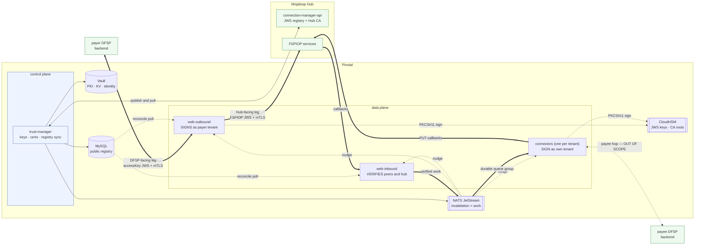

# Architecture

The conceptual model: what sits where, who holds which key, and how changes reach the data plane.

---

## 1. Topology

Three legs, only two of which this design manages:

| Leg | Pivotal's role | In scope |
| --- | --- | --- |
| payer DFSP → `web-outbound` | server, and the CA | **yes** |
| Pivotal ↔ Mojaloop Hub | both client and server | **yes** |
| `connector` → payee DFSP backend | client, against the FSP's own CA | **no** — see below |

### The payee-side hop is deliberately excluded

On that hop the FSP owns both the endpoint and the certificate authority, provisioning is a manual
arrangement between DevOps and the FSP's team, and **Pivotal holds no key material** — no connector
carries a keystore, truststore or client certificate. There is nothing to custody and no
justification for building a cross-language provisioning path to reach the Java connectors.

This is a boundary, not an omission. Two follow-ups sit outside it: expiry probing of each
`BACKEND_ENDPOINT` (the manual process has no monitoring), and confirming whether the connectors
verify those backends' server certificates — several are bare private IPs, which cannot chain to a
public CA.

---

## 2. Who signs, who verifies

No component does both.

| Component | Signs | Verifies |
| --- | --- | --- |
| **web-outbound** | FSPIOP requests, as the **payer tenant** | the DFSP's accessKey JWS on `/secured/sendmoney` |
| **web-inbound** | — | peer FSPIOP signatures, and Hub-originated errors |
| **connector** | FSPIOP `PUT`/`PATCH` callbacks, as **its own tenant** | — work arrives pre-verified over NATS |
| **trust-manager** | — | — never on the transaction path |

Connectors have no HTTP server; work reaches them over NATS from web-inbound, which has already
verified the peer signature. **Connectors therefore never need peer public keys.**

---

## 3. Key inventory

Every piece of key material in the system, and who holds what. This is the table to check when
someone asks "do you hold our private key?"

| # | Material | Leg | Generated by | Private half held by | Public half registered |
| --- | --- | --- | --- | --- | --- |
| 1 | **accessKey** | DFSP-facing | **the DFSP** | **the DFSP** | Pivotal MySQL |
| 2 | **DFSP client cert** | DFSP-facing | **the DFSP** (CSR) | **the DFSP** | Pivotal MySQL |
| 3 | DFSP-facing CA | DFSP-facing | Pivotal | **root: CloudHSM** · intermediate: Vault PKI | root distributed to DFSPs |
| 4 | Pivotal server cert (DFSP ingress) | DFSP-facing | cert-manager | k8s Secret | publicly trusted issuer |
| 5 | **FSPIOP JWS key** | Hub-facing | **Pivotal** — or the DFSP, in the remote-signing case | **CloudHSM** — or the DFSP's own KMS | MCM, per tenant |
| 6 | Pivotal Hub-client CA | Hub-facing | Pivotal | **root: CloudHSM** · intermediate: Vault PKI | root to MCM, under every tenant |
| 7 | Pivotal Hub-client leaves | Hub-facing | cert-manager | k8s Secret per workload | not registered — CA covers them |
| 8 | Pivotal server cert (Hub ingress) | Hub-facing | Pivotal (CSR) | k8s Secret | signed by the **Hub CA** |
| 9 | Hub CA | Hub-facing | the Hub | the Hub | pulled via `GET /hub/ca` |
| 10 | Peer JWS public keys | Hub-facing | peers | peers | pulled from MCM |
| 11 | MCM OAuth credentials | control plane | Keycloak | Vault, per tenant | — |

Rows 1 and 2 are the ones a DFSP asks about: **Pivotal never holds either private half.**

Row 5 is the one that needs explaining rather than denying — it is the DFSP's *Mojaloop scheme
identity*, generated and custodied by Pivotal because the DFSP delegated scheme connectivity. It is
not a copy of anything the DFSP holds. Where a client's policy forbids even that, `KEY_PROVIDER` is
a **per-tenant** setting: the DFSP generates the key in its own KMS and grants Pivotal sign-only
access, so Pivotal never holds it in any form.

### One JWS key per FSP

Row 5 is per-FSP, not per-component. MCM stores exactly one public key per `dfspId`, and the FSPIOP
protected header has no `kid`, so there is no key selection — one `FSPIOP-Source`, one key.

That means **web-outbound and that tenant's connector sign with the same key**: web-outbound when the
tenant sends money, the connector when it receives. Different processes, same identity.

HSM access is consequently asymmetric — web-outbound needs sign access to *every* tenant's key, each
connector to *one*. A compromised connector can sign as one DFSP; a compromised web-outbound as all
of them. On CloudHSM this is expressed through per-crypto-user key ownership and sharing rather than
per-key policy — see §4.3.

---

## 4. Custody

**Private keys never leave their custodian.** All access goes through a `Signer` abstraction whose
contract is `sign(keyRef, digest)` — it never returns private bytes. The data plane holds a `keyRef`,
nothing more.

### 4.0 The governing requirements

Four project requirements drive every custody decision below. The precise wording matters, so each is
stated exactly as it constrains the design:

| | Requirement |
| --- | --- |
| **R1** | Cryptographic key management operations must be **performed within** Hardware Security Modules |
| **R2** | The HSM must be a **dedicated** cloud-hosted HSM, or an on-premises HSM securely connected to the cloud environment |
| **R3** | For the cloud deployment period, HSM services are provided through **AWS CloudHSM integrated with an AWS KMS custom key store** |
| **R4** | An eventual **on-premises** deployment is anticipated, with its detailed design deferred to a later phase |

Three consequences that are not obvious from a casual reading:

- **"Performed within" rules out protecting a software keystore with an HSM-held key.** Encrypting
  Vault's storage — auto-unseal or Enterprise Seal Wrap — leaves keys in process memory and signing
  in software. It does not satisfy **R1**.
- **"Dedicated" rules out plain AWS KMS**, which is multi-tenant. CloudHSM is single-tenant, so **R2**
  points where **R3** then goes explicitly.
- **On-premise is deferred**, so **R4** is a constraint on not foreclosing the option, not a
  deliverable now. §4.4 is what keeps it a configuration change.

The treatment of **application-layer keys** is left open for confirmation with the client. In this
design those are the **per-DFSP FSPIOP JWS signing keys** — CA keys are PKI infrastructure, TLS leaf
keys are transport, and the DFSP's accessKey is never in Pivotal's custody at all.

### 4.1 Where each key lives

| Key | Custodian | Used |
| --- | --- | --- |
| **Per-DFSP FSPIOP JWS signing keys** | **CloudHSM** | ~`TPS × 6` per second |
| **CA roots ×2** | **CloudHSM** | once per trust domain, at setup |
| Intermediate CA keys ×2 | Vault PKI (software) | daily |
| TLS leaf keys | Kubernetes Secrets via cert-manager | short-lived, auto-rotated |
| DFSP accessKey, DFSP client-cert key | **the DFSP** | — |

**The cluster is justified by row 1.** The roots are a free rider — once the cluster exists, putting
two more keys in it costs nothing and strengthens the compliance position.

Row 3 reflects Pivotal's position that **HSM custody of the roots is sufficient**: the root is the
trust anchor external parties install and its compromise is unrecoverable without every DFSP
reinstalling, whereas an intermediate can be revoked at the root and replaced without any relying
party changing anything. *Pivotal's position, pending client confirmation — see open decision **L**.*

### 4.2 Two paths to the same hardware

CloudHSM is reachable two ways, and the choice is **not** about which HSM:

| Path | Charged | Use it for |
| --- | --- | --- |
| **PKCS#11 direct** | nothing beyond the cluster | **JWS signing** — the high-volume path |
| **KMS custom key store** | per KMS key, **plus per request** | Vault auto-unseal, symmetric material |

Both are CloudHSM and both satisfy **R1**. Routing payment-rate signing through the KMS API would
add a per-request meter on top of hardware already paid for, and stacks KMS API quotas on top of HSM
capacity. Keeping the custom key store in genuine use for the seal satisfies **R3** literally while
the metered path stays off the hot path.

*Depends on confirming whether a custom key store can hold `ECC_NIST_P256` at all — if it cannot,
PKCS#11-direct is the only mechanism that works — see open decision **N**.*

### 4.3 Who talks to what

| Component | PKCS#11 to CloudHSM | Notes |
| --- | --- | --- |
| web-outbound | **yes** | signs for every payer tenant |
| Connectors | **yes** | each signs for one tenant |
| Root ceremony script | **yes** | standalone, run twice at setup |
| **Vault** | **no — never** | supplies `keyRef`, HSM credentials and workload identity only |
| trust-manager | no | control plane, never on the signing path |

**Vault is not a key custodian and is not on the signing path.** Compromising Vault no longer yields
a private key — it yields the ability to *ask* the HSM to sign while access lasts. That is the
practical value **R1** buys.

Two implementation notes:

- **PKCS#11 returns ECDSA signatures as raw R‖S already**, padded to the curve order. No DER
  conversion, and no Vault-Transit-style marshaling flag. It is the cleanest of the three backends
  for JOSE.
- **CloudHSM authenticates with crypto-user credentials, not IAM policy.** Per-key isolation is
  achieved through key ownership and sharing between crypto users rather than per-key policy —
  workable, but heavier to operate, and the credentials are static. CU provisioning and rotation is
  open decision **O**.

### 4.4 Portability

The interface is **PKCS#11**, which is what makes the deferred on-premise phase tractable:

| | Cloud phase (now) | On-premise (deferred) | Dev / CI |
| --- | --- | --- | --- |
| Device | AWS CloudHSM | client data centre HSM | **SoftHSM** |
| Interface | PKCS#11 | PKCS#11 | PKCS#11 |
| Vault seal | KMS custom key store | Shamir ceremony, or Transit seal | Shamir / dev |

Migrating changes **three** things: the PKCS#11 library, the slot configuration, and the Vault seal.
No application code, no schema, no flow, no `keyRef` semantics.

Note that **Vault OSS cannot auto-unseal against PKCS#11** — HSM seal is an Enterprise feature. The
cloud phase is unaffected because it seals against the KMS custom key store, which OSS supports. The
on-premise phase would need Shamir unseal with a documented key ceremony, a Transit seal from a
second Vault, or an Enterprise licence. Shamir is entirely legitimate for a central bank deployment,
so **no Enterprise licence is required by this design**.

### 4.5 `keyRef` is opaque and version-inclusive

Key-version semantics are irreconcilable across backends — PKCS#11 has no version concept, KMS has no
asymmetric versions, and software backends such as Vault Transit version *within* a key.

So `keyRef` is an **opaque string identifying one specific keypair**, and **rotation always produces a
new `keyRef`**. Never "latest". This normalizes every backend and makes the §A3.1 rotation rule
structural rather than a convention: you cannot accidentally sign with a key your peers have not been
told about.

### 4.6 Provider portability

`KEY_PROVIDER` is a **per-tenant map with a global default**:

| Provider | Use |
| --- | --- |
| `pkcs11` | production — CloudHSM now, on-premise HSM later |
| `pkcs11` against SoftHSM | dev and CI, same code path |
| `aws-kms` / `azure-mhsm` / `gcp-kms` | a tenant insisting on holding its own scheme identity |
| `local-soft` | unit tests only |

Adapters absorb signature encoding, digest-versus-message input, and credential type. Two constraints
do **not** absorb cleanly:

- **Non-exportability** is a creation-time flag no backend can retrofit.
- **Access-control granularity.** Per-key policy makes "a compromised connector signs as one DFSP"
  true. CloudHSM achieves it through per-crypto-user key ownership; verify the model holds before
  relying on the claim.

A tenant on an external KMS complicates the connector signing path, since that connector would need
the tenant's cloud credentials — open decision **J**.

### 4.7 Trust domains

Three separate CA trust domains. These must not be merged:

| Domain | Issues | Trusted by |
| --- | --- | --- |
| `pki-hub` (existing) | Pivotal internal server certs | internal clients |
| **`pki-hub-client`** (new) | Pivotal's Hub-facing client leaves | the **Hub**, via MCM registration |
| **DFSP-facing CA** (new) | client certs issued **to DFSPs** | **Pivotal only** |

Sharing the last two would make a DFSP's client certificate trusted by the Hub.

Each new domain has a **root in CloudHSM** and an **intermediate in Vault PKI**. The root signs its
intermediate exactly once, through a standalone PKCS#11 ceremony script. **Build root CRL signing
into that same script** — revoking an intermediate requires a root-signed CRL, and it is far easier
to write while the ceremony tooling is open than to discover during an incident.

## 5. Propagation

**CloudHSM, MySQL and Vault are the sources of truth. JetStream carries nudges, never key material.**

- **Fast path** — trust-manager publishes `trust.keys.<fspId>` to the durable `TRUST_KEYS` stream
  *after* the DB commit. Data-plane and connector caches reload that tenant's material and swap
  in-memory state. Sub-second.
- **Backstop** — each store reconciles against its source on a slow interval, as an audit for the
  one class JetStream cannot cover: a publisher that committed and then died before publishing, or
  stream drift.

Because the nudge carries no key material, **a forged nudge can at worst cause a re-read.**

Consumer mode differs by purpose, and confusing the two is the easiest mistake to make here:

| Consumer | Mode | Why |
| --- | --- | --- |
| Trust-cache (web-outbound, web-inbound, connectors) | **ephemeral, `DeliverLastPerSubject`, fan-out** | every replica is a cache and must see every update |
| FSPIOP work (connectors) | **durable queue group** | each message must be handled exactly once |

---

## 6. Configuration

| Setting | Values | Effect |
| --- | --- | --- |
| `DFSP_FACING_MTLS` | `true` / `false` | Enables mTLS on the DFSP-facing leg. When on, it is **uniform** — Envoy `REQUIRE`, no per-tenant exceptions |
| `KEY_PROVIDER` | per-tenant map, default `pkcs11` | Which signer backs a tenant's JWS key |
| `TRUST_INVALIDATION_ENABLED` | `true` / `false` | JetStream fast path. **`false` must also restore a tight reconcile interval**, or it degrades security rather than just latency |
| `TRUST_STREAM_NAME` | string, default `TRUST_KEYS` | |
| `TRUST_SUBJECT_PREFIX` | string, default `trust.keys` | |
| `PARTICIPANT_KEY_STORE_REFRESH_INTERVAL_SECONDS` | int | Reconcile audit interval |

**VPN is not configuration.** Pivotal cannot observe whether traffic arrived over a tunnel — it sees
a TCP connection. A VPN is a network-layer arrangement that sits outside this design entirely, and it
composes freely with mTLS.

Correctness-critical parameters — rotation and overlap windows, expiry thresholds, stream durability
(`replicas=3`, `MaxMsgsPerSubject=1`) — are **hardcoded or validated at startup**, not left to
per-instance env. Env carries operational and freshness knobs only.
