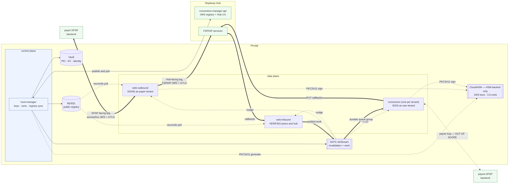
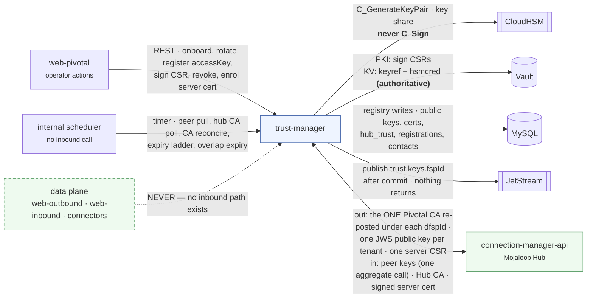
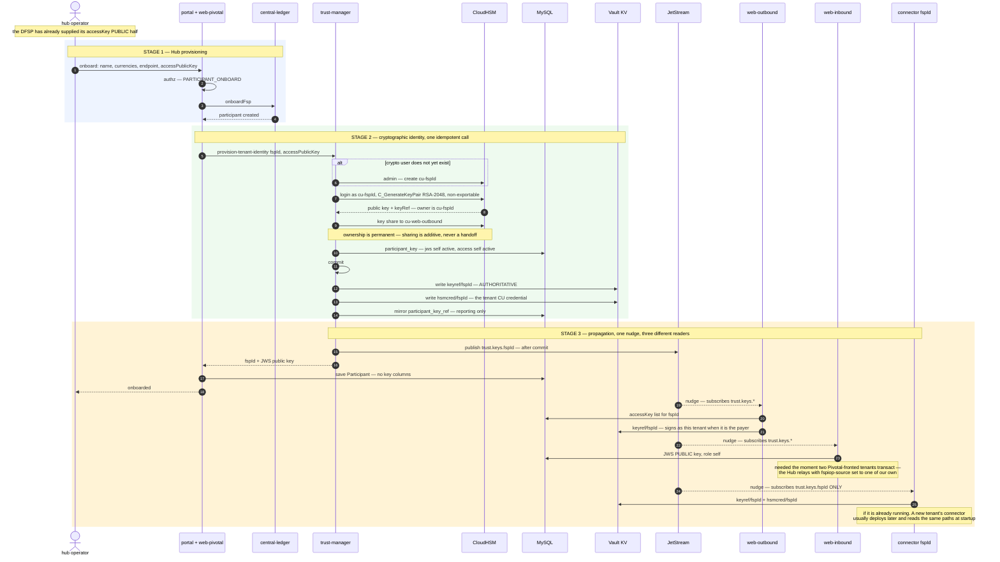

# Architecture

The conceptual model: what sits where, who holds which key, and how changes reach the data plane.

---

## 0. Deployment profiles

This design serves **two deployment profiles with different obligations**, and the difference is confined to a
single axis: **where the FSPIOP JWS private key lives, and therefore where signing happens.**

| | **KMS-backed** | **HSM-backed** |
| --- | --- | --- |
| Driving requirement | none stated — no dedicated HSM required | **CloudHSM mandatory** for private-key storage (R1–R3) |
| `KEY_PROVIDER` | **`vault-kv`** | **`pkcs11`** |
| JWS signing | **in-process** — Node `crypto` / Java JCA | **inside CloudHSM** — PKCS#11 `C_Sign` |
| JWS private key | **Vault KV**, encrypted at rest | **CloudHSM**, non-exportable |
| Vault KV holds | the private key PEM | `keyRef` + crypto-user credentials |
| CA roots | **AWS KMS** — non-exportable, IAM-scoped | **CloudHSM** |
| Vault seal | plain **AWS KMS** auto-unseal | **KMS custom key store → CloudHSM** |
| Crypto users | none | one per DFSP, plus `cu-web-outbound` |
| R1 / R2 / R3 (§4.0) | **not satisfied** — not required | **satisfied** |

Both profiles use **RS256 (RSA-2048)** for FSPIOP JWS — see
[`hub-facing-leg.md`](./hub-facing-leg.md) §A1 — and both are sized for **80–100 TPS**, roughly
**480–600 signatures per second**.

### Vault Transit is not used in either profile

It is software crypto *plus* a network round trip per signature: slower than in-process signing and
no more compliant than it, so it loses to `vault-kv` on every axis that matters. It also puts Vault
on the transaction critical path — under Transit, Vault down means no signing at all. Both profiles
here read Vault **once at startup and cache**, so Vault can be down and payments continue, which is
how Pivotal already behaves today.

### What the profile does not change

The `Signer` contract, `keyRef` opacity, the schema, every flow, propagation, MCM integration, both
mTLS legs, and the phasing. That is what the abstraction is for — §4.6.

---

## 1. Topology

Three legs, only two of which this design manages:

| Leg | Pivotal's role | In scope |
| --- | --- | --- |
| payer DFSP → `web-outbound` | server, and the CA | **yes** |
| Pivotal ↔ Mojaloop Hub | both client and server | **yes** |
| `connector` → payee DFSP backend | client, against the FSP's own CA | **no** — see below |

### The payee-side hop is deliberately excluded

On that hop the FSP owns both the endpoint and the certificate authority, provisioning is a manual
arrangement between DevOps and the FSP's team, and **Pivotal holds no key material** — no connector
carries a keystore, truststore or client certificate. There is nothing to custody and no
justification for building a cross-language provisioning path to reach the Java connectors.

This is a boundary, not an omission. Two follow-ups sit outside it: expiry probing of each
`BACKEND_ENDPOINT` (the manual process has no monitoring), and confirming whether the connectors
verify those backends' server certificates — several are bare private IPs, which cannot chain to a
public CA.

---

## 2. Who signs, who verifies

No component does both.

| Component | Signs | Verifies |
| --- | --- | --- |
| **web-outbound** | FSPIOP requests, as the **payer tenant** | the DFSP's accessKey JWS on `/secured/sendmoney` |
| **web-inbound** | — | FSPIOP signatures from peers **and from Pivotal's own tenants**, plus Hub-originated errors |
| **connector** | FSPIOP `PUT`/`PATCH` callbacks, as **its own tenant** | — work arrives pre-verified over NATS |
| **trust-manager** | — | — never on the transaction path |

Connectors have no HTTP server; work reaches them over NATS from web-inbound, which has already
verified the peer signature. **Connectors therefore never need peer public keys.**

---

## 3. Key inventory

Every piece of key material in the system, and who holds what. This is the table to check when
someone asks "do you hold our private key?"

| # | Material | Leg | Generated by | Private half held by | Public half registered |
| --- | --- | --- | --- | --- | --- |
| 1 | **accessKey** | DFSP-facing | **the DFSP** | **the DFSP** | Pivotal MySQL |
| 2 | **DFSP client cert** | DFSP-facing | **the DFSP** (CSR) | **the DFSP** | Pivotal MySQL |
| 3 | DFSP-facing CA | DFSP-facing | Pivotal | **root: CloudHSM** (HSM-backed) · **AWS KMS** (KMS-backed) · intermediate: Vault PKI in both | root distributed to DFSPs |
| 4 | Pivotal server cert (DFSP ingress) | DFSP-facing | cert-manager | k8s Secret | publicly trusted issuer |
| 5 | **FSPIOP JWS key** | Hub-facing | **Pivotal** — or the DFSP, in the remote-signing case | **CloudHSM** (HSM-backed) · **Vault KV** (KMS-backed) — or the DFSP's own KMS | MCM, per tenant |
| 6 | Pivotal Hub-client CA | Hub-facing | Pivotal | **root: CloudHSM** (HSM-backed) · **AWS KMS** (KMS-backed) · intermediate: Vault PKI in both | root to MCM, under every tenant |
| 7 | Pivotal Hub-client leaves | Hub-facing | cert-manager | k8s Secret per workload | not registered — CA covers them |
| 8 | Pivotal server cert (Hub ingress) | Hub-facing | Pivotal (CSR) | k8s Secret | signed by the **Hub CA** |
| 9 | Hub CA | Hub-facing | the Hub | the Hub | pulled via `GET /hub/ca` |
| 10 | Peer JWS public keys | Hub-facing | peers | peers | pulled from MCM |
| 11 | MCM OAuth credentials | control plane | Keycloak | Vault, per tenant | — |

Rows 1 and 2 are the ones a DFSP asks about: **Pivotal never holds either private half.**

Row 5 is the one that needs explaining rather than denying — it is the DFSP's *Mojaloop scheme
identity*, generated and custodied by Pivotal because the DFSP delegated scheme connectivity. It is
not a copy of anything the DFSP holds. Where a client's policy forbids even that, `KEY_PROVIDER` is
a **per-tenant** setting: the DFSP generates the key in its own KMS and grants Pivotal sign-only
access, so Pivotal never holds it in any form.

### One JWS key per FSP

Row 5 is per-FSP, not per-component. MCM stores exactly one public key per `dfspId`, and the FSPIOP
protected header has no `kid`, so there is no key selection — one `FSPIOP-Source`, one key.

That means **web-outbound and that tenant's connector sign with the same key**: web-outbound when the
tenant sends money, the connector when it receives. Different processes, same identity.

HSM access is consequently asymmetric — web-outbound needs sign access to *every* tenant's key, each
connector to *one*. A compromised connector can sign as one DFSP; a compromised web-outbound as all
of them. On CloudHSM this is expressed through per-crypto-user key ownership and sharing rather than
per-key policy — see §4.3.

---

## 4. Custody

**Private keys never leave their custodian.** All access goes through a `Signer` abstraction whose
contract is `sign(keyRef, digest)` — it never returns private bytes. The data plane holds a `keyRef`,
nothing more.

### 4.0 The governing requirements — HSM-backed only

Four project requirements drive every **HSM-backed** custody decision below. Where a deployment states
**none of them**, the `vault-kv` profile becomes available instead (§0). The precise
wording matters, so each is stated exactly as it constrains the design:

| | Requirement |
| --- | --- |
| **R1** | Cryptographic key management operations must be **performed within** Hardware Security Modules |
| **R2** | The HSM must be a **dedicated** cloud-hosted HSM, or an on-premises HSM securely connected to the cloud environment |
| **R3** | For the cloud deployment period, HSM services are provided through **AWS CloudHSM integrated with an AWS KMS custom key store** |
| **R4** | An eventual **on-premises** deployment is anticipated, with its detailed design deferred to a later phase |

Three consequences that are not obvious from a casual reading:

- **"Performed within" rules out protecting a software keystore with an HSM-held key.** Encrypting
  Vault's storage — auto-unseal or Enterprise Seal Wrap — leaves keys in process memory and signing
  in software. It does not satisfy **R1**.
- **"Dedicated" rules out plain AWS KMS**, which is multi-tenant. CloudHSM is single-tenant, so **R2**
  points where **R3** then goes explicitly.
- **On-premise is deferred**, so **R4** is a constraint on not foreclosing the option, not a
  deliverable now. §4.4 is what keeps it a configuration change.

The treatment of **application-layer keys** is left open for confirmation with the client. In this
design those are the **per-DFSP FSPIOP JWS signing keys** — CA keys are PKI infrastructure, TLS leaf
keys are transport, and the DFSP's accessKey is never in Pivotal's custody at all.

### 4.1 Where each key lives

| Key | Custodian — **HSM-backed** | Custodian — **KMS-backed** | Used |
| --- | --- | --- | --- |
| **Per-DFSP FSPIOP JWS signing keys** | **CloudHSM** | **Vault KV**, read once at startup | ~`TPS × 6` per second — 480–600/s |
| **CA roots ×2** | **CloudHSM** | **AWS KMS**, non-exportable | once per trust domain, at setup |
| Intermediate CA keys ×2 | Vault PKI (software) | Vault PKI (software) | daily |
| TLS leaf keys | Kubernetes Secrets via cert-manager | same | short-lived, auto-rotated |
| DFSP accessKey, DFSP client-cert key | **the DFSP** | **the DFSP** | — |

**The HSM-backed cluster is justified by row 1.** The roots are a free rider — once the cluster exists,
putting two more keys in it costs nothing and strengthens the compliance position. The KMS-backed
profile funds no cluster, so its roots are created as non-exportable **AWS KMS** asymmetric keys
instead
([`implementation-plan.md`](../implementation/implementation-plan.md) §1.3).

**Row 1 is the whole of the profile difference.** In KMS-backed the key is read from Vault KV at
startup and held in process memory; signing is a local `crypto.sign()` with no network call. That is
what Pivotal does today, with the storage upgraded from plaintext MySQL to encrypted, policy-scoped,
audited Vault KV.

Row 3 reflects Pivotal's position that **HSM custody of the roots is sufficient**: the root is the
trust anchor external parties install and its compromise is unrecoverable without every DFSP
reinstalling, whereas an intermediate can be revoked at the root and replaced without any relying
party changing anything. *Pivotal's position, pending client confirmation — see open decision **L**.*

### 4.2 Two paths to the same hardware — HSM-backed only

The KMS-backed profile has no cluster, so this section does not apply there; its Vault seals against a plain KMS
key (§0). For HSM-backed, CloudHSM is reachable two ways, and the choice is **not** about which HSM:

| Path | Charged | Use it for |
| --- | --- | --- |
| **PKCS#11 direct** | nothing beyond the cluster | **JWS signing** — the high-volume path |
| **KMS custom key store** | per KMS key, **plus per request** | Vault auto-unseal, symmetric material |

Both are CloudHSM and both satisfy **R1**. Routing payment-rate signing through the KMS API would
add a per-request meter on top of hardware already paid for, and stacks KMS API quotas on top of HSM
capacity. Keeping the custom key store in genuine use for the seal satisfies **R3** literally while
the metered path stays off the hot path.

*Open decision **N** asked whether a custom key store can hold `ECC_NIST_P256`. It is **resolved as
moot**: signing is RS256 (decision 3), so no EC key exists, and the custom key store backs only the
Vault seal (decision 14).*

### 4.3 Who talks to what

**This section describes the HSM-backed profile.** The KMS-backed profile has no CloudHSM, no crypto users and no
PKCS#11 at all: trust-manager generates the keypair in software, writes the private half to Vault KV,
and the data plane reads it at startup. The ownership and sharing model below has no counterpart
there — its equivalent is Vault path policy, which is simpler but weaker (§4.8).

| Component | PKCS#11 to CloudHSM | Notes |
| --- | --- | --- |
| web-outbound | **yes** — sign | signs for every payer tenant |
| Connectors | **yes** — sign | each signs for one tenant |
| Root ceremony script | **yes** — generate + sign | standalone, run twice at setup |
| **trust-manager** | **yes — generation** | Drives `C_GenerateKeyPair` at onboarding and rotation. Never signs *by design*, though it is not structurally prevented from doing so — see the privilege note below |
| **Vault** | **no — never** | supplies `keyRef`, HSM credentials and workload identity only |

**trust-manager generates but never signs**, and the distinction is what keeps the control plane off
the transaction path. Key generation is a control-plane event — once per tenant at onboarding, and
again only on a deliberate rotation. Signing is a data-plane operation at `TPS × 6` per second.
trust-manager therefore drives `C_GenerateKeyPair` and hands the resulting `keyRef` onward. It never
calls `C_Sign`, and no transaction ever waits on it.

#### Ownership is permanent — generate as the tenant, then share

CloudHSM's access model constrains how that generation must be performed, and it does not work the
way an IAM-shaped intuition suggests:

> *"Only the CU who created the key and consequently owns it can share the key. Users with whom a key
> is shared can use the key in cryptographic operations, but they cannot delete, export, share,
> unshare, derive, or wrap the key."* — AWS CloudHSM CLI, `key share`

Three consequences:

- **Creation confers ownership, permanently.** There is no ownership-transfer operation in
  `cloudhsm-cli` or `cloudhsm_mgmt_util`. `key list` reports `key-owners` and `shared-users` as
  separate, non-interchangeable lists.
- **The owner always retains use rights.** Sharing is purely additive; it never removes the owner's
  ability to sign.
- **Therefore whichever CU creates a key can sign with it forever.** An earlier draft of this section
  had trust-manager create every key and "transfer ownership" to the tenant. That operation does not
  exist, and had it been built as described, trust-manager's CU would have retained signing rights
  over every DFSP.

So **each key is generated authenticated as the tenant's own CU**, and then shared to web-outbound:

| CU | Owns | Shared to it | Held by |
| --- | --- | --- | --- |
| `cu-<fspId>` — one per DFSP | that tenant's JWS key | — | that tenant's connector |
| `cu-web-outbound` | nothing | **every** tenant key | web-outbound |
| `cu-trust-manager` | nothing | nothing | trust-manager |

This is what makes "a compromised connector signs as one DFSP" true, and it maps cleanly onto the
sharing model: web-outbound can sign for every tenant but cannot delete, export, re-share or alter
the attributes of any key, because it owns none of them.

#### The residual privilege, stated plainly

The onboarding flow is a single portal action (§ [`implementation-plan.md`](../implementation/implementation-plan.md)
§1.2), so trust-manager necessarily sets each tenant CU's password at creation. **It can therefore
re-authenticate as any tenant CU and sign as any DFSP.** Rotating the password afterwards does not
change this, because trust-manager would generate the replacement too.

This is accepted rather than solved, because the alternative buys less than it appears: a compromised
trust-manager can already mint a fresh key, repoint the authoritative `keyRef` in Vault, publish the
new public key to MCM and sign as anyone — without needing a CU password at all. Correct ownership
still earns its place by making the quiet path unavailable, so an attacker must perform several loud
control-plane operations instead of one silent `C_Sign`.

**Compensate with detection, not with structure.** CloudHSM logs every operation, and `C_Sign` by
`cu-trust-manager` is legitimately **zero forever** — so alarm on any occurrence at all, rather than
on a threshold.

**Vault is not a key custodian and is not on the signing path.** Compromising Vault no longer yields
a private key — it yields the ability to *ask* the HSM to sign while access lasts. That is the
practical value **R1** buys.

Two implementation notes:

- **RS256 signatures need no re-encoding on any backend.** A PKCS#1 v1.5 signature is a single
  fixed-length integer, so PKCS#11 and Node `crypto` both emit exactly what JOSE expects. The
  ECDSA R‖S-versus-DER question that would have differed per backend does not arise.
- **CloudHSM authenticates with crypto-user credentials, not IAM policy**, and those credentials are
  static. Provisioning and rotation is open decision **O**; the ownership matrix above is settled by
  the product's own model and is not open.

### 4.4 Portability

The interface is **PKCS#11**, which is what makes the deferred on-premise phase tractable:

| | Cloud phase (now) | On-premise (deferred) | Dev / CI |
| --- | --- | --- | --- |
| Device | AWS CloudHSM | client data centre HSM | **SoftHSM** |
| Interface | PKCS#11 | PKCS#11 | PKCS#11 |
| Vault seal | KMS custom key store (HSM-backed) · plain KMS (KMS-backed) | Shamir ceremony, or a Transit seal from a second Vault | Shamir / dev |

Migrating changes **three** things: the PKCS#11 library, the slot configuration, and the Vault seal.
No application logic, no schema, no flow, no `keyRef` semantics.

Expect **provider-specific session handling** rather than a pure drop-in, however. PKCS#11 is a
stable API but a loose contract: login models, session lifetime, re-login after an idle disconnect,
and which `CKM_*` mechanisms are offered all vary by device. SoftHSM in CI will not reproduce
CloudHSM's behaviour on any of them. Budget an integration pass per device, and keep that behaviour
behind the `Signer` adapter so it stays out of the domain code.

Note that **Vault OSS cannot auto-unseal against PKCS#11** — HSM seal is an Enterprise feature. The
cloud phase is unaffected because it seals against the KMS custom key store, which OSS supports. The
on-premise phase would need Shamir unseal with a documented key ceremony, a Transit seal from a
second Vault, or an Enterprise licence. Shamir is entirely legitimate for a central bank deployment,
so **no Enterprise licence is required by this design**.

### 4.5 `keyRef` is opaque and version-inclusive

Key-version semantics are irreconcilable across backends — PKCS#11 has no version concept, KMS has no
asymmetric versions, and some software backends version *within* a key. Under `vault-kv` the `keyRef`
is the KV path plus its version, which is why rotation writes a new version rather than overwriting.

So `keyRef` is an **opaque string identifying one specific keypair**, and **rotation always produces a
new `keyRef`**. Never "latest". This normalizes every backend and makes the §A3.1 rotation rule
structural rather than a convention: you cannot accidentally sign with a key your peers have not been
told about.

### 4.6 Provider portability

`KEY_PROVIDER` is a **per-tenant map with a global default**:

| Provider | Use |
| --- | --- |
| `pkcs11` | **HSM-backed profile — HSM-backed.** CloudHSM now, on-premise HSM later |
| **`vault-kv`** | **software-backed profile — KMS-backed.** Private key read from Vault KV at startup, signing in-process. See §4.8 |
| `pkcs11` against SoftHSM | dev and CI, same code path as HSM-backed |
| `aws-kms` / `azure-mhsm` / `gcp-kms` | a tenant insisting on holding its own scheme identity |
| `local-soft` | unit tests only — key generated in-test, never persisted |

**`vault-transit` is deliberately absent.** It was in an earlier draft as the software tier; it is
removed because it is strictly worse than `vault-kv` — same software custody, plus an HTTP round trip
on every signature, plus Vault on the transaction critical path. See §0.

Adapters absorb signature encoding, digest-versus-message input, and credential type. Two constraints
do **not** absorb cleanly:

- **Non-exportability** is a creation-time flag no backend can retrofit.
- **Access-control granularity.** Per-key policy makes "a compromised connector signs as one DFSP"
  true. CloudHSM achieves it through per-crypto-user key ownership; verify the model holds before
  relying on the claim.

A tenant on an external KMS complicates the connector signing path, since that connector would need
the tenant's cloud credentials — open decision **J**.

### 4.7 Trust domains

Three separate CA trust domains. These must not be merged:

| Domain | Issues | Trusted by |
| --- | --- | --- |
| `pki-hub` (existing) | Pivotal internal server certs | internal clients |
| **`pki-hub-client`** (new) | Pivotal's Hub-facing client leaves | the **Hub**, via MCM registration |
| **DFSP-facing CA** (new) | client certs issued **to DFSPs** | **Pivotal only** |

Sharing the last two would make a DFSP's client certificate trusted by the Hub.

Each new domain has a **root** — CloudHSM in the HSM-backed profile, **AWS KMS** in the KMS-backed profile (§4.8) — and
an **intermediate in Vault PKI**, in software, in **both** profiles. The root signs its intermediate
exactly once, through a standalone ceremony script. **Neither CloudHSM nor KMS is a CA**: both only
sign a digest; the script builds the X.509.

**The intermediate was never in the HSM**, even in the HSM-backed profile, so every certificate any DFSP
or the Hub ever sees is issued by software in both profiles. The profile difference on this leg is
confined to root custody. **Build root CRL signing
into that same script** — revoking an intermediate requires a root-signed CRL, and it is far easier
to write while the ceremony tooling is open than to discover during an incident.

### 4.8 The software-backed profile — KMS-backed, no HSM

A deployment with no dedicated-HSM requirement funds no cluster. `KEY_PROVIDER` makes that a supported
configuration rather than a fork — but it is a **different assurance tier**, and the difference must
be written down rather than discovered.

| | HSM-backed — **HSM-backed** | Software-backed — **KMS-backed** |
| --- | --- | --- |
| Signer | `pkcs11` → CloudHSM | **`vault-kv`** → in-process `crypto.sign()` |
| JWS private keys | inside the HSM, non-exportable | **Vault KV**, encrypted at rest, read once at startup |
| Key in process memory | **never** | **yes** — for the life of the process |
| CA roots | CloudHSM | **AWS KMS** — non-exportable, IAM-scoped, CloudTrail-audited |
| Vault's role | supplies references and credentials | **key custodian** — but still *not* on the signing path |
| Vault seal | KMS custom key store → CloudHSM | plain AWS KMS auto-unseal |
| Crypto users | one per DFSP, plus `cu-web-outbound` | none |
| **R1 / R2 / R3** | **satisfied** | **not satisfied — and not required** |

**The compliance difference is the whole point of the distinction.** §4.0 rules the software profile
out for a deployment bound by those requirements: *"'Performed within' rules out protecting a
software keystore with an HSM-held key."* A KMS-backed Vault seal protects data **at rest** and is
touched roughly once per Vault process start; it does not make signing an in-HSM operation. A
deployment not bound by R1–R3 may legitimately choose this — but it should be a **stated and
accepted** position, not an inference from a config value — **the absence of a stated requirement is
not the same as agreement.**

Two invariants **invert** in this profile, and both are stated elsewhere as though universal:

- Decision 15 — *"Vault is not a key custodian."* Here it is the custodian.
- The README invariant — *"Signing operations happen inside the HSM."* Here they happen in process.

One invariant that does **not** invert, contrary to the earlier Transit-based draft: **Vault stays
off the transaction critical path.** The key is read once at startup and cached, exactly as today, so
Vault can be down and payments continue. That is a direct consequence of dropping Transit.

What else does not change: the `Signer` contract, `keyRef` opacity, the schema, every flow,
propagation, MCM integration, both mTLS legs, and the phasing.

#### What the software profile actually costs

The distinction is sharp rather than gradual, and it is worth stating in the terms an incident would:

> **HSM:** a compromise yields the ability to *ask* the HSM to sign, **while access lasts**, and every
> call is logged.
> **In-process:** a compromise yields **the key itself — permanently, silently, and copyable.** A heap
> dump, a core dump, or root on the node is sufficient.

Blast radius is asymmetric in the same way it is under `pkcs11`: **web-outbound must read every
tenant's key**, because it signs as whichever tenant is the payer, so one compromise there exposes
all of them. A connector reads only its own.

Rotation is the usual mitigation and it is expensive here — the FSPIOP header carries no `kid` and
MCM stores one key per `dfspId`, so every rotation is a coordinated break per FSP
([`hub-facing-leg.md`](./hub-facing-leg.md) §A3.1). Do not plan around frequent rotation as a
compensating control.

#### Mitigations that are cheap and should be mandatory

- **Per-tenant KV paths and policies** — `secret/pivotal/jwskey/{fspId}`, so a connector's Vault
  policy grants exactly one path. In this profile that policy **is** the isolation boundary: with no
  HSM there is no non-exportable handle, so settled decision 4 holds here by path scoping rather than
  by the connector never seeing key material. Amended 2026-08-24. This is the same mechanism §1.2.1 of
  [`implementation-plan.md`](../implementation/implementation-plan.md) already specifies for `keyref` and `hsmcred`.
- **Never environment variables.** They appear in `kubectl describe`, need a redeploy to rotate, and
  leave no record of who read them.
- **Disable core dumps** in production, and do not enable heap-dump-on-OOM for web-outbound.
- **Alert on unexpected Vault reads.** A steady-state pod reads each key once at startup; a read
  outside a deploy or a nudge is worth an alarm, and Vault's audit log already emits one line per read.

## 5. Propagation

**CloudHSM, MySQL and Vault are the sources of truth. JetStream carries nudges, never key material.**

- **Fast path** — trust-manager publishes `trust.keys.<fspId>` to the durable `TRUST_KEYS` stream
  *after* the commit. Data-plane and connector caches reload that tenant's material and swap
  in-memory state. Sub-second.
- **Backstop** — each store reconciles against its source on a slow interval, as an audit for the
  one class JetStream cannot cover: a publisher that committed and then died before publishing, or
  stream drift.

Because the nudge carries no key material, **a forged nudge can at worst cause a re-read.**

### 5.1 One store per value — no projections

Each value has **exactly one authoritative store**, chosen by who reads it rather than by what kind
of thing it is:

| Value | Authoritative store | Read by |
| --- | --- | --- |
| `keyRef` + crypto-user credentials — **HSM-backed** | **Vault KV** — `secret/pivotal/keyref/<fspId>`, `secret/pivotal/hsmcred/<fspId>` | web-outbound, connectors |
| **JWS private key — KMS-backed** | **Vault KV** — `secret/pivotal/jwskey/<fspId>` | web-outbound, connectors |
| Public keys, certificates, registrations, contacts | **MySQL** | web-outbound, web-inbound |

The two profiles differ only in *what* the Vault KV path holds — an opaque reference, or the key
itself. The read path, the authentication, the policy model and the caching are identical, which is
why the profile is a configuration rather than a fork.

An earlier draft made MySQL authoritative for `keyRef` and **projected** it into Vault KV, because
the Java connectors have no MySQL access. That created a value living in two places, written
non-transactionally — and a crash between the MySQL commit and the KV write would leave web-outbound
and the connector signing for the same FSP with *different* keys, with nothing in the system able to
converge them. The fix would have been a reconciler; removing the second copy is better than
reconciling it.

The split is workable because **web-outbound already depends on Vault** — it cannot sign at all
without its crypto-user credentials, which live there. Reading the `keyRef` from the same place adds
no dependency, no startup ordering and no failure mode. Meanwhile public keys and certificates stay
in MySQL, where they are filtered by status, looked up by fingerprint, joined to participants and
shown in the portal — none of which Vault KV does, and none of which is secret.

`participant_key_ref` remains as a **non-authoritative mirror** for the portal and reporting, written
after the Vault write. If it drifts, nothing breaks; it is a view, not a source.

Consumer mode differs by purpose, and confusing the two is the easiest mistake to make here:

| Consumer | Mode | Why |
| --- | --- | --- |
| Trust-cache (web-outbound, web-inbound, connectors) | **ephemeral, `DeliverLastPerSubject`, fan-out** | every replica is a cache and must see every update |
| FSPIOP work (connectors) | **durable queue group** | each message must be handled exactly once |

---

## 6. Configuration

| Setting | Values | Effect |
| --- | --- | --- |
| `DFSP_FACING_MTLS` | `true` / `false` | **Requires** a client certificate on every DFSP-facing request. A hardening switch flipped *after* migration completes — **not** the mechanism that enables mTLS. See §6.1 |
| `FSPIOP_VERIFY_INBOUND` | `off` / `verify-if-present` / `require` | Whether web-inbound verifies peer and Hub JWS signatures. See §6.2 |
| `KEY_PROVIDER` | per-tenant map; default `pkcs11` (HSM-backed) / `vault-kv` (KMS-backed) | Which signer backs a tenant's JWS key — §0 |
| `TRUST_INVALIDATION_ENABLED` | `true` / `false` | JetStream fast path. **`false` must also restore a tight reconcile interval**, or it degrades security rather than just latency |
| `TRUST_STREAM_NAME` | string, default `TRUST_KEYS` | |
| `TRUST_SUBJECT_PREFIX` | string, default `trust.keys` | |
| `PARTICIPANT_KEY_STORE_REFRESH_INTERVAL_SECONDS` | int | Reconcile audit interval |

**VPN is not configuration.** Pivotal cannot observe whether traffic arrived over a tunnel — it sees
a TCP connection. A VPN is a network-layer arrangement that sits outside this design entirely, and it
composes freely with mTLS.

Correctness-critical parameters — rotation and overlap windows, expiry thresholds, stream durability
(`replicas=3`, `MaxMsgsPerSubject=1`) — are **hardcoded or validated at startup**, not left to
per-instance env. Env carries operational and freshness knobs only.

### 6.1 `DFSP_FACING_MTLS` does not gate the certificate checks

An earlier draft made this a global switch that turned the certificate checks on and off together
with mTLS itself. That is incompatible with the parallel-endpoint migration in
[`dfsp-facing-leg.md`](./dfsp-facing-leg.md) §2, and the incompatibility is not cosmetic.

During migration both endpoints are live at once, so some requests carry XFCC and some do not. A
single global flag cannot describe that state, and either setting is wrong for the whole migration
period:

| Setting | Consequence while migration runs |
| --- | --- |
| `false` | Migrated DFSPs present certificates that are **never bound to `FSPIOP-Source`** — decision 8, the entire purpose of the leg, is inert |
| `true` | Every DFSP still on the legacy endpoint breaks |

**So the certificate checks key on XFCC presence, per request, not on this flag.** If a certificate
was presented, Envoy has already validated its chain and injected XFCC, and checks 1 and 2 run. If
none was presented, the accessKey is the sole credential — a weaker posture, deliberately accepted
for the legacy endpoint only.

`DFSP_FACING_MTLS=true` then means one thing: **a request without XFCC is rejected.** It is the final
hardening step, flipped once the last DFSP has migrated and the legacy endpoint has been retired.
Enforcement remains uniform and at the transport layer, with no per-tenant exception surface — the
property decision 7 exists to protect.

### 6.2 Inbound verification is enabled separately from signing

Every phase in the plan concerns *signing*. Verification needs its own switch, because turning it on
depends on parties outside Pivotal's control:

| Value | Behaviour |
| --- | --- |
| `off` | Signatures ignored. The state before phase 4 |
| `verify-if-present` | A signature that is present must verify; a missing one is accepted and counted. The migration state |
| `require` | A missing or invalid signature is rejected |

Two external dependencies make the middle state necessary. The Hub today runs
`FSPIOP_USE_JWS=false`, so Hub-originated errors arrive **unsigned** — and per
[`hub-facing-leg.md`](./hub-facing-leg.md) §A4, enabling verification without a seeded `hub`
participant fails every one of them with 3105. Peer DFSPs likewise start signing on their own
schedules.

`verify-if-present` also supplies the rollout telemetry: the count of unsigned-but-accepted requests
per source is exactly what tells you when `require` is safe. And it is the rollback the plan
otherwise lacks — a peer broken by a signature change is one setting away from being unblocked.

---

## 7. What trust-manager does

Everything it performs, and who it performs it against. Two trigger classes, five counterparties, and
one direction that deliberately does not exist.

### Operator-initiated — REST from web-pivotal

Synchronous, because each one needs an answer the operator acts on: a certificate to hand over, a
validation error to correct, a confirmation that a revocation took effect.

| Operation | Touches |
| --- | --- |
| `provision-tenant-identity(fspId, accessPublicKey)` — the onboarding composite, §8 | HSM · MySQL · Vault · JetStream |
| `rotate-jws-key(fspId)` — new keypair, new `keyRef`, in A3.1's four-step order | HSM · MySQL · MCM · Vault · JetStream |
| `register-access-key(fspId, publicKeyPem)` — previous row to `retiring` with `valid_to` | MySQL · JetStream |
| `revoke-access-key(fspId)` — immediate, no overlap | MySQL · JetStream |
| `sign-dfsp-csr(fspId, csrPem)` — CN forced to `fsp_id` | Vault PKI · MySQL · JetStream |
| `revoke-dfsp-cert(fspId, fingerprint)` | MySQL · JetStream |
| `publish-jws-key-to-mcm(fspId)` — then read back and compare the PEM | MCM |
| `enroll-hub-server-cert()` — CSR to MCM, install the Hub-signed cert into the Gateway | MCM · MySQL |
| `upsert-participant-contact(...)` | MySQL |

### Scheduled — internal timer, nothing calls in

| Operation | Touches |
| --- | --- |
| Pull peer JWS keys — `GET /dfsps/jwscerts`, upsert `role = peer` | MCM · MySQL · JetStream |
| Poll the Hub CA — `GET /hub/ca`, rewrite both trust bundles | MCM · MySQL |
| **Reconcile MCM CA registration** across all tenants, converge `mcm_ca_registration` | MCM · MySQL |
| Certificate expiry scan → alerting ladder → notify contacts | MySQL |
| Expire `retiring` accessKeys past `valid_to` | MySQL · JetStream |
| Re-enrol the Hub-facing server certificate before expiry, with overlap | MCM · MySQL |

CA registration is scheduled rather than a REST call because registering one CA across *N* tenants is
*N* MCM calls — too long for a synchronous request. `mcm_ca_registration` already exists as a
**drift-detection** table, so declare-intent-and-converge is the shape the schema was pointing at.

#### What "CA per dfspId" means, since the cardinalities differ

It is **one certificate registered N times**, not N certificates. MCM's model assumes one DFSP is one
organisation with one CA, and stores it at `secrets/dfsp-ca/<dbId>`; Pivotal is one organisation
fronting many DFSPs, and MCM offers no endpoint for that shape. So the same `pki-hub-client` root PEM
is posted under every tenant. It works because MCM applies **no uniqueness constraint and no
cross-DFSP comparison** — see B2 of [`hub-facing-leg.md`](./hub-facing-leg.md).

| Artifact | How many | Endpoint |
| --- | --- | --- |
| Pivotal's Hub-client CA | **one certificate × N tenants** | `POST /dfsps/{dfspId}/ca` |
| JWS public keys | **N distinct keys**, one per tenant | `POST /dfsps/{dfspId}/jwscerts` |
| Server-certificate CSR | **one**, for Pivotal itself — not per tenant | inbound enrollment |
| Peer JWS keys (inbound) | **one aggregate call**, not N | `GET /dfsps/jwscerts` |
| Hub CA (inbound) | one | `GET /hub/ca` |

Registering the CA rather than the leaf is settled decision 6, and it is what lets cert-manager
rotate every workload's client certificate with **no MCM interaction at all**.

Note what the registration does *not* do: MCM is a registry, not a distributor, so posting a CA does
not make the Hub's ingress trust it. The Hub operator installs it out of band, and
`mcm_ca_registration` exists to detect when the two have drifted apart.

### What it never does

- **Sign an FSPIOP message, or verify one.** It calls `C_GenerateKeyPair`, never `C_Sign` — §4.3.
- **Get called by the data plane.** The dashed edge above has no implementation. A control-plane
  outage cannot stop a transfer; caches keep serving and the reconcile poll resumes.
- **Hold private key material.** Not the DFSP's accessKey, not their certificate key, not the JWS key
  it generates. It holds references.
- **Issue an accessKey.** It registers the public half the DFSP supplies.
- **Distribute CAs to the Hub's ingress.** MCM is a registry, not a distributor — the Hub operator
  wires that trust store out of band (Part C of [`hub-facing-leg.md`](./hub-facing-leg.md)).

### Not yet specified

Two gaps this list makes visible, neither of which has a home in the design today:

- **Offboarding.** When a tenant leaves, something must revoke its certificates and accessKey,
  unshare its key from `cu-web-outbound`, retire the key, disable `cu-<fspId>` and decide what MCM
  retains. No operation, no schema state, no phase.
- **Trust-bundle distribution.** B3 shows `TM → data plane: write trust bundle`, but the mechanism is
  undefined — a bundle is not a registry row, so the data plane cannot reach it by the MySQL
  reconcile poll.

---

## 8. Onboarding a tenant

The flow that exercises everything above, and the only place where a tenant's cryptographic identity
comes into existence. One operator action at the portal; both legs provisioned behind it.

**Two credentials are established here, and they are not symmetric.** The **accessKey** is
DFSP-facing and the DFSP generates it — Pivotal receives only the public half and *registers* it. The
**FSPIOP JWS key** is Hub-facing and Pivotal generates it, inside the HSM, with no DFSP involvement
at all. Nothing about a TLS client certificate happens here; that is a separate, later step (§6 of
[`dfsp-facing-leg.md`](./dfsp-facing-leg.md), phase 6).

### What each stage is doing

**Stage 1** is unchanged from today — `CentralLedgerFacade.onboardFsp` registers currencies and the
endpoint with the Hub. It is not a custody concern and stays in web-pivotal.

**Stage 2 is the whole of the change**, and it is the one stage that differs by profile. Today
web-pivotal generates an RSA keypair in its own Node process and stores the private half as plaintext
in MySQL.

| | **HSM-backed — `pkcs11`** | **KMS-backed — `vault-kv`** |
| --- | --- | --- |
| Generated by | CloudHSM, `C_GenerateKeyPair` RSA-2048 | trust-manager, in process |
| Then | shared to `cu-web-outbound`; ownership is permanent | private half written to `secret/pivotal/jwskey/<fspId>` |
| Leaves the boundary | public half + opaque `keyRef` | public half only; the key stays in Vault |
| Crypto user created | yes, `cu-<fspId>` | none |

The sequence above shows the HSM-backed path. For KMS-backed, steps 4–7 collapse into "generate, write
the private half to Vault KV" — the commit-then-Vault-then-nudge ordering is identical, and so is
everything in stage 3.

Two ordering details in that stage carry weight:

- **Generate as `cu-fspId`, then share.** Ownership is conferred at creation and cannot be
  transferred, so generating as any other identity would leave that identity able to sign for the
  tenant forever — §4.3.
- **Commit, then write Vault, then nudge.** `keyRef` is authoritative in Vault KV (§5.1); MySQL holds
  the public material. Publishing before the commit would let a consumer reload and find the old
  value.

**Stage 3** carries no key material — the nudge is an invalidation signal, so each consumer re-reads
its own stores. That is why a forged nudge can at worst cause a re-read.

#### One nudge, three different readers

All three subscribe, but they need different things and read different stores. Getting this wrong in
either direction is a live defect: too narrow a subscription and a component never learns about a new
tenant, too broad and a connector holds material for tenants it does not serve.

| | Subscribes to | Reads MySQL for | Reads Vault for |
| --- | --- | --- | --- |
| **web-outbound** | `trust.keys.*` — serves every tenant | accessKey public keys, `participant_cert` by fingerprint | `keyref/<fspId>` for **every** tenant — it signs as whichever is the payer |
| **web-inbound** | `trust.keys.*` — verifies for every tenant | JWS public keys, **`self` and `peer` roles** | — nothing. It only verifies, so it holds no signing key and needs no crypto user |
| **connector `<fspId>`** | **`trust.keys.<fspId>` only** | — no MySQL access at all | `keyref/<fspId>` + `hsmcred/<fspId>`, its own tenant only |

Three consequences worth stating:

- **web-inbound needs a newly onboarded tenant's key immediately.** When two Pivotal-fronted tenants
  transact, the Hub relays the payer's request with `fspiop-source` set to one of your own tenants —
  so web-inbound verifies a `self` row, not a peer's. This is why the guard in A4 reads both roles.
- **A connector subscribes to one subject, not the wildcard.** It signs only as its own tenant and
  never verifies — per §2, work reaches it pre-verified over NATS — so it has no use for another
  tenant's material and should not receive it.
- **web-inbound never touches Vault.** It is the only data-plane component with no crypto user and no
  HSM access, because verification needs public keys only.

### Idempotent on `fspId`

The call spans four systems — CloudHSM, MySQL, Vault, JetStream — so it cannot be atomic. It is
therefore **re-runnable**: skip crypto-user creation if the user exists, skip generation if a
`jws-sign` reference already exists, and re-publish the nudge unconditionally.

Without that, a Vault timeout after key generation strands a key in the HSM that nothing references,
and a retry mints a second one.

### What is absent, and when it arrives

| | Phase | Note |
| --- | --- | --- |
| Publish the JWS public key to MCM, then read it back and compare | 4 | Until MCM exists, the key is generated and used locally. Onboarding gains this step, it does not change |
| DFSP TLS client certificate | 6 | Separate operator action, driven by a CSR the DFSP uploads |
| The tenant's **connector** reading `keyref/fspId` and `hsmcred/fspId` | 3 | It reads them at its own startup, not during onboarding |

### One behavioural change worth stating

`jwsPublicKey` and `jwsPrivateKey` are currently **optional** on the onboarding request, so a DFSP can
be onboarded today with no JWS key at all. Afterwards a key is always generated, which means
**onboarding acquires a hard dependency on the HSM being reachable.** It has none today.
