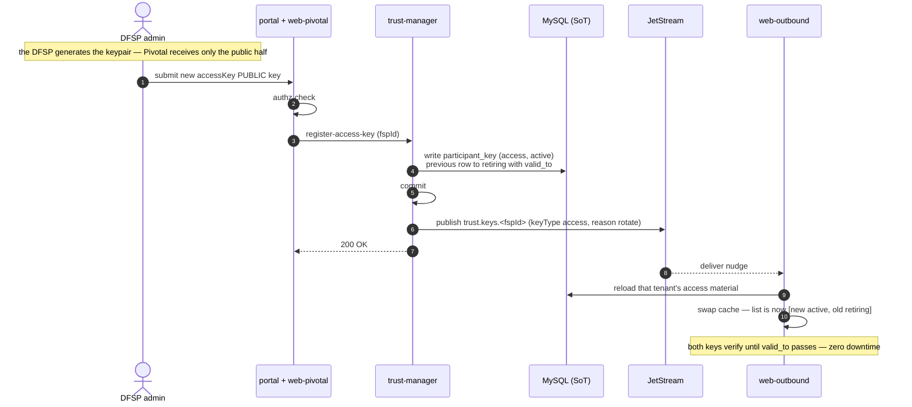
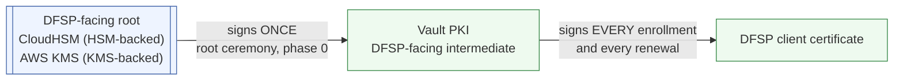
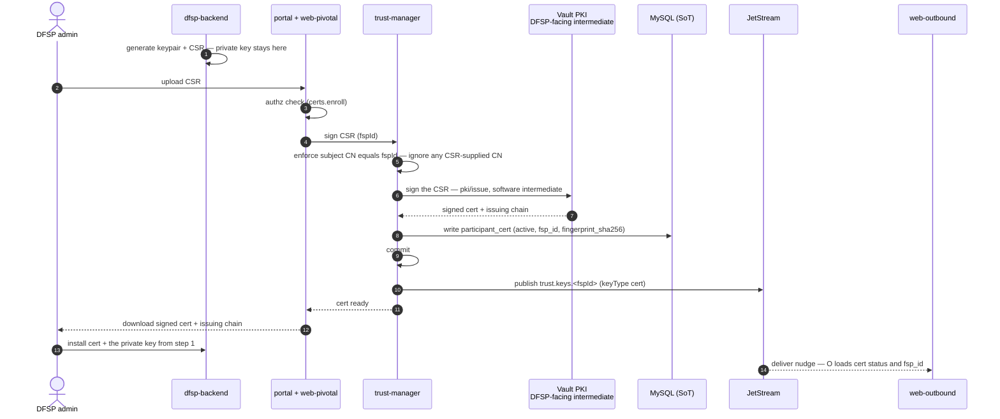
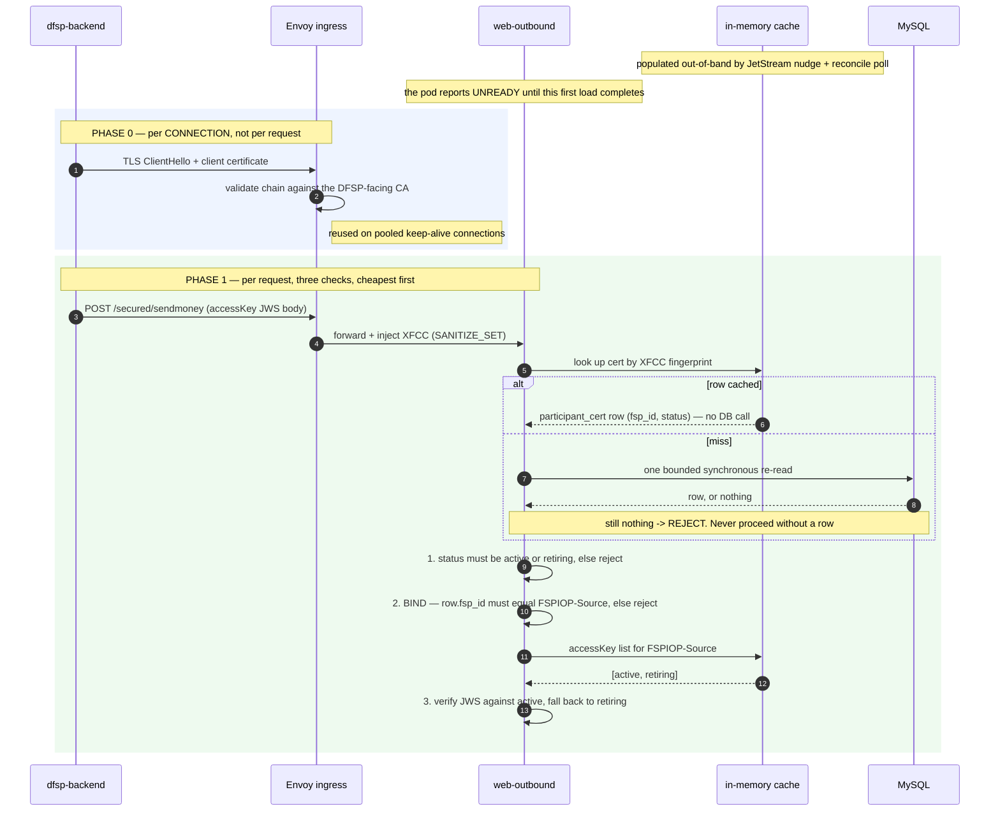
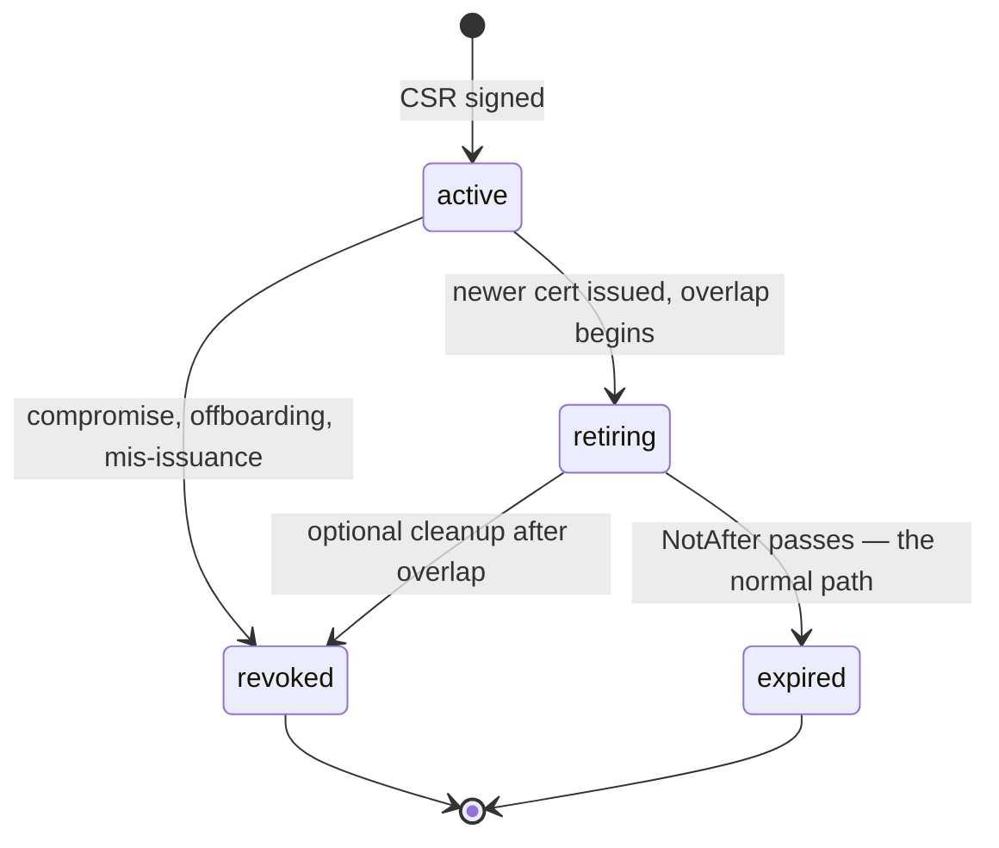

# DFSP-Facing Leg

The `payer DFSP → web-outbound` hop. Pivotal is the **server** here, and the **CA**.

Two independent credentials arrive with every request, and the design's central rule is that they
must agree:

| | Proves | Layer |
| --- | --- | --- |
| **accessKey JWS** | this *message* came from DFSP-A and wasn't altered | application |
| **TLS client certificate** | this *connection* is from DFSP-A | transport |

---

## 1. accessKey

### Provenance — the DFSP generates it

The DFSP creates the keypair, keeps the private half, and gives Pivotal the **public** half only.
Pivotal never sees, generates, or stores an accessKey private key.

trust-manager therefore **registers**, it does not issue. The command is `register-access-key`, and
there is deliberately no `generateKey` step in the onboarding flow — unlike the FSPIOP JWS key,
which Pivotal does generate.

### Algorithm — RS256, as on the Hub-facing leg

Settled decision 3 selects **RS256 (RSA-2048) on both legs**, so the accessKey is unchanged and no
DFSP has to do anything.

An earlier draft picked ES256 for the Hub-facing leg and had to explain why this leg differed. That
asymmetry is gone. Two reasons the accessKey was always going to stay RS256, and the second is the
one people miss:

- **It is the DFSP's key.** Changing its algorithm is a contract change every DFSP must implement —
  regenerate a keypair, change signing code, coordinate a cutover. Exactly the cost decision 2
  rejected `kid` for, and with no benefit to set against it.
- **RSA verification is cheaper than EC verification.** ES256 wins decisively on *signing*. But
  Pivotal never signs an accessKey — it only verifies. With a small public exponent, RSA verify beats
  a full curve operation, so RS256 is the faster choice on a verify-only path, not merely the
  compatible one.

**Still resolve the algorithm per key**, from `participant_key.algorithm`, even though every key is
RS256 today — it keeps the door open for an individual DFSP to move later without a flag day. When
touching the hardcoded `RS256` in `shared/security/component/jwt/jwt.ts`, **pin the algorithm to the
one recorded for the key being used** — do not replace the constant with a permissive
`['RS256','ES256']` list. That shape is what algorithm-confusion attacks exploit, and it is
unnecessary here because Pivotal controls the key lookup on both sides.

Note this makes the `jwt.ts` change smaller than previously planned: with both legs on RS256 the
hardcoded constant is no longer *wrong*, only inflexible. The **protected header** (
[`hub-facing-leg.md`](./hub-facing-leg.md) §A2) remains broken regardless and is the real work.

### Rotation — additive, with try-both verification

Registering a new accessKey moves the previous one to `retiring` with
`valid_to = now + overlap`, and it **expires automatically**. No operator action, so an overlap
cannot silently become permanent.

- **Overlap window:** fixed default ~7 days, hardcoded. An operator can end one early.
- **No `kid`.** The store caches `Map<fspId, PublicKey[]>`, ordered `active` then `retiring`, and the
  guard tries them in order.
- Rows are filtered to `status ∈ {active, retiring}` and unexpired **at cache-refresh time, not per
  request**, so the verification path never reasons about status. Outside a rotation window the list
  holds one key and the cost is identical to today.
- **Log which key verified.** That yields free telemetry on rotation progress — how much traffic
  still uses the retiring key is exactly what tells an operator when an overlap can end.

`kid` was rejected: it is a contract change every DFSP must adopt, and it makes rotation *more*
fragile client-side — a DFSP that switches signing keys while still emitting the old `kid` fails
every request, a failure mode try-both cannot produce. The saving is ~50µs of local CPU.

---

## 2. mTLS

### Uniform enforcement

There is deliberately **no per-tenant exception flag**. Enforcement in application code would be
fail-open if a lookup were missed, and a per-tenant `false` becomes a migration artifact that
outlives the migration — in a year nobody remembers whether it means "real VPN, deliberate" or "we
never finished." Your weakest tenant would define the actual security posture.

**Migration is handled by a parallel endpoint, not by configuration.** A second gateway
(`mtls.pivotal.<env>`, Envoy `mode: MUTUAL`) runs alongside the existing one. DFSPs enroll and switch
URL at their own pace. When the last one moves, the old endpoint is retired and nothing is left
behind. Enforcement is at the transport layer on both endpoints throughout — `MUTUAL` on the new
one, absent on the legacy one. No application code decides whether mTLS applies.

### What `DFSP_FACING_MTLS` actually controls

**Not whether the certificate checks run.** Both endpoints are live simultaneously throughout the
migration, so some requests carry XFCC and some do not — a global flag cannot describe that state,
and gating the checks on one would either leave migrated DFSPs unbound (defeating §3, the point of
the leg) or break everyone still on the legacy endpoint.

So the checks in §4 key on **XFCC presence, per request**. `DFSP_FACING_MTLS=true` means only that
**a request arriving without XFCC is rejected** — the final hardening step, flipped once the last
DFSP has migrated and the legacy endpoint is gone. See [`architecture.md`](./architecture.md) §6.1.

**No emergency bypass is needed.** Because Pivotal is the CA, a DFSP with a certificate problem is
re-issued in minutes through the same mechanism that governs normal operation.

### Enrollment

Pivotal is the CA; the DFSP's private key never leaves the DFSP.

**The chain**, and how often each link is exercised:

The root is genuinely upstream of every DFSP certificate — it is the trust anchor the whole chain
hangs from — but it acts **twice in the life of the deployment**, both during the phase-0 ceremony
([`implementation-plan.md`](../implementation/implementation-plan.md) §1.3). It is absent from the sequence below
because it does nothing during an enrollment. That is true whether it lives in CloudHSM (HSM-backed) or
in AWS KMS (KMS-backed).

In the KMS-backed profile ([`architecture.md`](./architecture.md) §4.8) the root is a non-exportable
**AWS KMS** key rather than a CloudHSM key. The intermediate, and everything below it, is identical.

The subject CN is **set by trust-manager**, not taken from the CSR, so no certificate exists whose
subject contradicts its `fsp_id`.

**Vault PKI issues every DFSP certificate**, using a software intermediate key. Two consequences
follow from CloudHSM being upstream but idle, and both are worth knowing:

- **Enrollment works while CloudHSM is unreachable.** An HSM outage stops signing on the Hub-facing
  leg; it does not stop a DFSP enrolling or renewing.
- **Adding an HSM does not make issuance slower.** There is no per-certificate HSM round trip.

The three components are easy to conflate, so to be explicit:

| | Role | Issues DFSP certificates? |
| --- | --- | --- |
| **Vault PKI** | issues X.509 from the intermediate | **yes — all of them** |
| CloudHSM — *HSM-backed only* | custodies JWS keys and the CA roots | no — its root signs the intermediate once, at setup. In KMS-backed an AWS KMS key plays this part |
| Vault **KV** | holds the JWS private key in the KMS-backed profile | no — it is a secret store, not a CA |

---

## 3. The binding rule

**A request is rejected unless the certificate and `FSPIOP-Source` name the same DFSP.**

Without this the certificate only proves "the caller is *some* enrolled tenant." An attacker holding
a leaked accessKey for DFSP-B plus **any** valid tenant certificate — their own, as an enrolled
DFSP-C — transacts as DFSP-B. Binding forces compromise of **both** credentials **of the same
tenant**, which is the entire reason to layer mTLS on a signature scheme that already exists.

It is effectively free: the row fetched for the revocation check already carries `fsp_id`.

**Hard requirement:** Envoy must run `SANITIZE_SET`, never `APPEND_FORWARD`. XFCC now carries
*identity*, so a client-settable header would defeat the rule entirely.

---

## 4. Runtime

Envoy has already proved the caller holds a key for a certificate *our CA issued* — but not **which
tenant** they are. The three app-layer checks close that gap. In steady state every lookup is an
in-memory cache hit.

### A miss fails closed

**No row means reject** — see open decision **D**, resolved. The checks above are not merely weakened
without a row, they cannot run at all: status comes from it, and the binding rule compares its
`fsp_id`. Proceeding anyway would admit exactly the attack §3 exists to prevent.

Nor is a miss usually benign. Envoy has already rejected anything not chaining to Pivotal's CA, so a
zero-row lookup means a cold or partially-loaded cache, a purged row, a certificate issued out of
band, a fingerprint-format mismatch (open decision **I**), or mis-issuance from the software-held
intermediate. The last two are the cases the database check exists for.

Two mechanisms make failing closed free rather than costly:

- **Readiness gating.** A pod reports unready until its first cache load succeeds, so Kubernetes
  routes nothing to a cold replica. The "cold cache causes an outage" objection assumes a cold pod
  receives traffic; it does not. This is a startup-sequencing concern, and it is solved in the
  startup layer.
- **One bounded synchronous re-read** on a miss, before rejecting — the escape hatch for a genuinely
  new certificate whose nudge has not yet landed. Safe against abuse because the presentable
  certificate space is already bounded by Envoy to those Pivotal's CA issued.

**Never hard-delete a `participant_cert` row before its `valid_to` passes.** A revoked certificate
whose row was purged becomes a *miss* rather than a *known revocation*, which is a materially
different thing to reason about.

**Checks 1 and 2 are gated on XFCC being present, not on configuration.** A request arriving over
the legacy endpoint carries no certificate, so they are skipped and the accessKey is the **sole**
credential — a deliberately weaker posture, and one that must be counted and reported rather than
inherited silently. A request over the mTLS endpoint always carries XFCC, so they always run. The
two coexist for the whole migration, which is why no global flag can decide this.

Emit a metric labelled by `FSPIOP-Source` and by whether a certificate was present. That count going
to zero is the signal that the legacy endpoint can be retired and `DFSP_FACING_MTLS=true` set — the
same role the "which key verified" log plays for accessKey rotation.

---

## 5. Certificate lifecycle

**Renewal never revokes.** The old certificate is left to expire after an overlap, giving zero
downtime — new connections use the new certificate while pooled connections drain on the old, and
both are accepted because both are non-revoked and chain to the same CA. A mid-transaction
certificate change is safe, since transactions are keyed by `transferId`, not by the connection.

**Revocation is separate and immediate** — status set to `revoked` with no overlap, propagated
sub-second by JetStream nudge. The DFSP must re-enroll to resume.

### Enforcement

Authoritative source is `participant_cert.status` in Pivotal's own database — Pivotal *is* the CA.
Envoy terminates mTLS, validates the chain, and injects XFCC. A guard in web-outbound resolves the
XFCC **fingerprint** to the cached row.

Key on the fingerprint, not a serial: Envoy's `set_current_client_cert_details` exposes `By`, `Hash`,
`Subject`, `URI` and `Cert` — there is **no serial field**. Confirm the exact field set against the
gateway product and version chosen for the deployment — open decision **I**.

CA-published CRL or OCSP are optional defence in depth. CRL has refresh staleness and OCSP adds
per-handshake latency and an availability dependency; skip OCSP unless compliance forces it. The
app-layer check is what catches revocation on already-open keep-alive connections, which a
handshake-only mechanism structurally cannot.

---

## 6. Scope boundary

`connector → payee FSP backend` is **outside this design**. See [`architecture.md`](./architecture.md).
The FSP is its own CA there, provisioning is manual, and Pivotal holds no key material.
