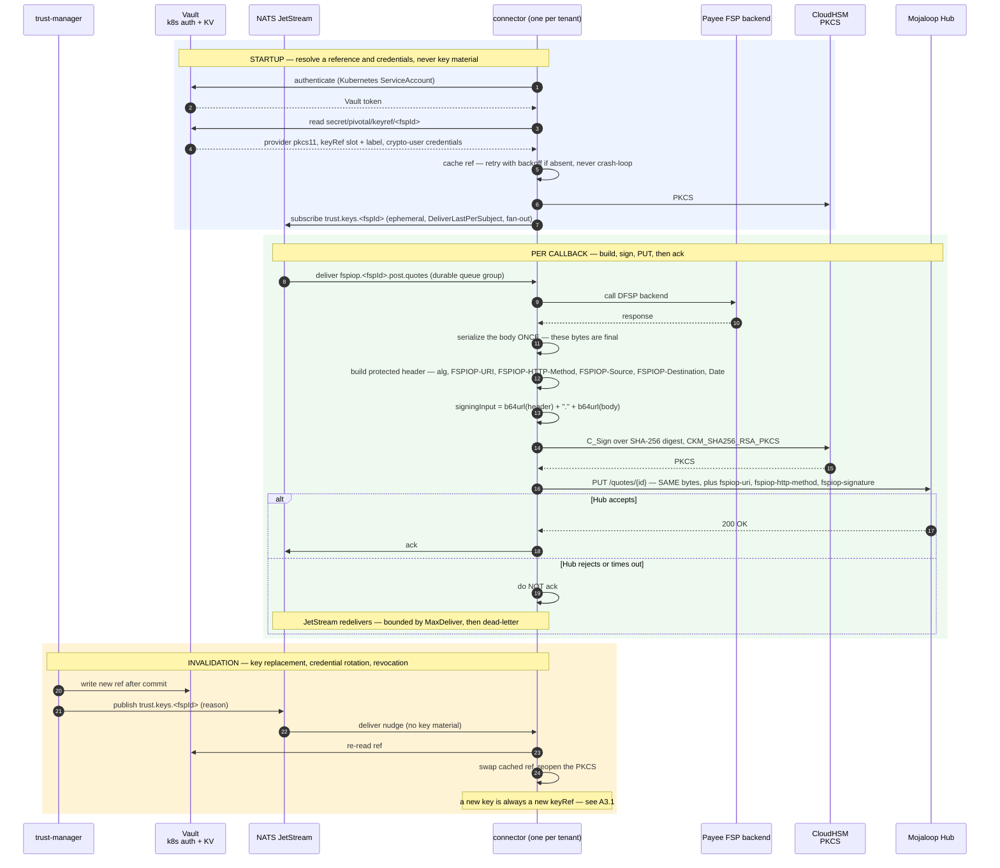
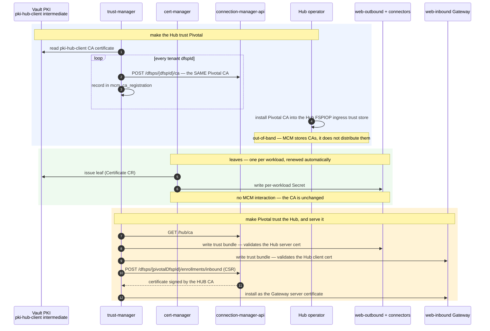

# Hub-Facing Leg

Pivotal ↔ Mojaloop Hub. Two independent mechanisms: **FSPIOP JWS** carries FSP identity at the
message level, **mTLS** authenticates the connection. They are not substitutes.

Design target is the **remote-cluster** case — Pivotal and the Hub in separate environments, so
service-mesh identity cannot be assumed. The design also works co-located.

---

# Part A — FSPIOP JWS

## A1. Who signs, with which key

**One FSPIOP JWS keypair per FSP.** MCM stores exactly one public key per `dfspId`, and the FSPIOP
protected header has no `kid` — the validator looks up `validationKeys[headers['fspiop-source']]`.
One source, one key, no selection.

So the same key is used by two different processes:

| Event | Signer | `FSPIOP-Source` | Key |
| --- | --- | --- | --- |
| DFSP-A sends money | web-outbound | `DFSP-A` | DFSP-A's |
| DFSP-A receives money (PUT callbacks) | DFSP-A's connector | `DFSP-A` | **the same key** |

In a DFSP-A → DFSP-B transfer, two keys are in play because two FSPs are: web-outbound signs with
A's, B's connector signs with B's.

**Algorithm: RS256 (RSA-2048).** This **reverses an earlier ES256 decision**, and the reason is the
agreed volume rather than a change of view about the cryptography.

At the agreed **80–100 TPS**, with roughly six signatures per transaction, signing runs at
**480–600/sec**. RS256 clears that comfortably on either backend — RSA-2048 signing is ~1,000–1,500/sec
per core in software, and well inside a two-HSM CloudHSM cluster. ES256 was selected when the working
figure was 200 TPS (600–1,200/sec), where its order-of-magnitude signing advantage mattered. At
480–600/sec it does not.

With the performance case gone, what remains is compatibility, and it points the other way:

- **ES256 depends on every peer's `sdk-standard-components` version.** `SIGNATURE_ALGORITHMS =
  ['RS256','ES256']` is confirmed in v19.11.2 and v19.18.9, but each peer's installed version is
  outside Pivotal's control. RS256 is accepted by every version ever shipped.
- **ES256 makes MCM flag every Pivotal key `INVALID`** — its validator is RSA-only (see below). RSA
  keys parse cleanly, so MCM's own validation signal stays usable.

Both were live external unknowns; RS256 removes them. **RSA-2048** is the Mojaloop norm and the size
peers will have tested against.

Two consequences carry forward unchanged:

- **Key type is fixed at creation.** Under `pkcs11` an HSM key's type cannot change after
  `C_GenerateKeyPair`, so this is decided before any key exists — and after phase 4's first MCM
  publish, changing it is a coordinated break per FSP (§A3.1).
- **`Jwt.sign`/`Jwt.verify` hardcode `RS256`** — which, now that **both legs are RS256**, is no longer
  a blocker. The `jwt.ts` work shrinks to the **protected header** (§A2), which is wrong
  independently of algorithm. Still resolve the algorithm **per key** from
  `participant_key.algorithm` rather than relying on the constant, so an individual DFSP can move
  later without a flag day — and do **not** substitute a permissive `['RS256','ES256']` list, which
  is the algorithm-confusion shape.

**Both legs now use RS256**, so the two-algorithm coexistence an earlier draft had to design around
no longer arises — see [`dfsp-facing-leg.md`](./dfsp-facing-leg.md) §1.

### MCM's RSA-only validator — why RS256 keeps a signal ES256 would have lost

MCM v3.8.0 stores each JWS public key as bare PEM — `createDfspJWSCerts` persists `body.publicKey`,
despite the endpoint being named `jwscerts`. It validates that PEM with
`forge.pki.publicKeyFromPem` (`PKIEngine.js:76`), and **node-forge is RSA-only**: an EC P-256 key
throws `Cannot read public key. Unknown OID.` and the record is stored with
`validationState: "INVALID"`.

**Under RS256 this does not arise** — RSA keys parse cleanly and register `VALID`. The analysis below
is retained because it was the decisive input into settled decision 3, and because it defines what
breaks if anyone revisits ES256 later.

**Nothing acts on the flag**, verified on both sides of the wire:

| | Behaviour with `validationState: INVALID` |
| --- | --- |
| MCM server | `setDFSPJWSCerts` writes the record regardless; `getAllDFSPJWSCerts` serves it unfiltered. The only `INVALID` gate in the codebase covers `dfspCA`, not JWS |
| PM4ML peer client | `compareAndUpdateJWS` diffs on `dfspId` and `createdAt` only, then builds `peerJWSKeys` as `{dfspId: publicKey}`. The field is carried for a log line and the UI, nothing else |
| Peer verification | `sdk-standard-components` declares `SIGNATURE_ALGORITHMS = ['RS256', 'ES256']` — confirmed in both v19.11.2 and v19.18.9 |

The visible effect is a red row per Pivotal-fronted DFSP in the MCM console. Expect it, and do not
treat it as a failed registration. The upstream fix is a one-line swap to Node's
`crypto.createPublicKey`, which handles RSA and EC alike.

**Two consequences that are not cosmetic**, and both are handled outside MCM rather than by patching
it:

- **MCM's validation is no longer a usable signal.** With every Pivotal-fronted key permanently
  `INVALID`, a genuinely malformed registration is indistinguishable from the expected state. Replace
  it with a stronger check under Pivotal's own control: **after every publish, read back
  `GET /dfsps/{dfspId}/jwscerts` and assert the returned PEM is byte-identical to what was sent.**
  That catches truncation, a failed write, the wrong tenant and later drift — none of which MCM's
  parse-only validator would have caught even for an RSA key.
- **A future MCM release could begin filtering on the flag.** Nothing today does, but the behaviour
  relied on here is incidental rather than contractual. Make an EC key round-trip — `POST`, then
  `GET /dfsps/jwscerts` — a standing regression check after any MCM version bump.

## A2. Protected header — normative

A JWS signature covers `base64url(protectedHeader) + "." + base64url(payload)`. "Protected" means
integrity-protected: alter any field and the signature breaks. FSPIOP uses a **detached** JWS — the
payload is the HTTP body, and `FSPIOP-Signature` carries only
`{"signature":"…","protectedHeader":"…"}`.

Its purpose is to bind request **metadata** into the signature, so a validly-signed body cannot be
replayed against a different endpoint or destination.

From `@mojaloop/sdk-standard-components/src/lib/jws/jwsSigner.js` — this is the contract:

```js
const protectedHeaderObject = {
    alg: this.alg,
    'FSPIOP-URI': requestOptions.headers['fspiop-uri'],
    'FSPIOP-HTTP-Method': requestOptions.method.toUpperCase(),
    'FSPIOP-Source': requestOptions.headers['fspiop-source']
};
if (requestOptions.headers['fspiop-destination']) {
    protectedHeaderObject['FSPIOP-Destination'] = requestOptions.headers['fspiop-destination'];
}
if (requestOptions.headers['date']) {
    protectedHeaderObject['Date'] = requestOptions.headers['date'];
}
```

**Three mandatory, two conditional, nothing else.** No `typ`, no `cty`, no other headers. The source
file warns explicitly that property names are **case sensitive** in the protected header even though
HTTP headers are not.

`FSPIOP-URI` is **not** the full URL. The signer extracts it with a regex anchored on the FSPIOP
resource name, so `https://hub.example.com/quotes/abc-123` yields `/quotes/abc-123`, and it throws if
the path contains no known resource name. The signer also **sets** the `fspiop-uri` and
`fspiop-http-method` HTTP headers, which the validator then cross-checks — that is why sender and
verifier always agree.

### What Pivotal produces today

`jwt.ts` builds `{ alg, typ: 'JWT', cty: 'json', ...allAxiosHeadersLowercased }`.

| Field | Required | Pivotal today |
| --- | --- | --- |
| `alg` | yes | ✓ |
| `FSPIOP-URI` | yes | **missing** |
| `FSPIOP-HTTP-Method` | yes | **missing** |
| `FSPIOP-Source` | yes, exact case | `fspiop-source` lowercase — **lookup fails** |
| `FSPIOP-Destination` | conditional | lowercase — **fails whenever the HTTP header is present** |
| `Date` | conditional | lowercase — check silently skipped |

Plus neither the `fspiop-uri` nor `fspiop-http-method` **HTTP header** is sent, so the validator
rejects at the presence check before reaching the signature. The Java connectors send no signature at
all.

Extra fields are harmless — the validator checks required fields, it does not reject extras — but
they are non-conformant and bloat every request.

**Body canonicalization is *not* a defect.** Mojaloop's validator builds the token as
`` `${protectedHeader}.${base64url(safeStringify(payload))}.${signature}` `` — a re-stringification of
the parsed body, exactly what Pivotal does. The residual risk is key-ordering edge cases, not a
structural mismatch.

## A3. Signing paths

Both signers build the protected header with the same logic and delegate the cryptography to
**CloudHSM over PKCS#11**. Neither ever holds key material, and **Vault is not on the signing path** —
it supplies the `keyRef` and the HSM credentials, nothing more.

- **web-outbound** signs for *every* payer tenant, so its crypto user reaches all tenant keys.
- **each connector** signs for *one* tenant, so its crypto user owns that key alone.

Isolation here is **CloudHSM crypto-user key ownership**, not a Vault policy — CloudHSM authenticates
crypto users with a username and password rather than IAM, so per-key scoping comes from ownership
and sharing between CUs. That is what makes "a compromised connector signs as one DFSP" true, and it
is open decision **O**.

### Connector signing

The connector holds a **key reference**, never a key. It reads that ref and its HSM credentials from
Vault KV — no MySQL access and no HTTP dependency on Pivotal. Signing then goes **direct to CloudHSM
over PKCS#11; Vault is not on the signing path.**



Four details that matter:

- **RS256 needs no signature re-encoding at all.** A PKCS#1 v1.5 signature is a single integer of
  fixed length, so PKCS#11, Node `crypto` and the JOSE wire format already agree. This is one of the
  quieter simplifications RS256 buys: the ECDSA R‖S-versus-DER question that would have differed per
  backend simply does not arise.
- **Sign the digest, not the message.** Compute SHA-256 in the application and pass it to `C_Sign`.
- **Serialize once.** The bytes hashed must be byte-identical to the bytes on the wire.
- **Ack after the PUT.** This is what gives JetStream-backed retry. Today the connector throws
  `IllegalStateException` with no retry and the transfer hangs.

### A3.1 JWS key rotation is coordinated, not zero-downtime

Rotation on this leg behaves **oppositely** to accessKey rotation, and the difference is easy to miss
because both are called "rotation".

The FSPIOP protected header carries no `kid` and MCM stores exactly one public key per `dfspId`, so a
verifying peer has **one** key and cannot try both. The moment a signer switches to a new keypair,
every peer holding the old public key rejects every message — a hard, total break for that FSP.

This is a property of *signing*, not of any particular backend. Key-management systems that
transparently roll versions make it dangerous by default: a signer that requests "the latest version"
starts emitting unverifiable signatures the instant an operator or an auto-rotation policy creates a
new one.

Two rules follow, and they apply to every signing provider:

- **Signing pins an explicit key version.** Never sign with "latest". The pinned version is part of
  the tenant's key reference, and changing it is a deliberate act.
- **Publish before switching.** The order is: create the new version → publish its public key to MCM
  → allow peer propagation → *then* advance the pinned version and nudge. Reversing these two steps
  is an outage.

Concretely, with `keyRef` authoritative in Vault KV
([`architecture.md`](./architecture.md) §5.1), rotation is four ordered steps:

| | Step | Effect |
| --- | --- | --- |
| 1 | Generate the new keypair in the HSM | inert — nothing references it |
| 2 | Write the new public key to `participant_key` | inert — a `self` public key has no local reader |
| 3 | Publish it to MCM, allow peer propagation | peers can now verify the new key |
| 4 | **Switch `keyRef` in Vault KV**, then nudge | **the commit point** — signing changes here, for every signer at once |

Steps 1–3 are idempotent and safe to retry. Only step 4 changes behaviour, it is a single write to a
single store, and it is last — which is what makes "publish before switching" structural rather than
a rule someone has to remember.

Disable automatic rotation on FSPIOP signing keys wherever the backend offers it. Backends that do
not auto-rotate asymmetric keys are **safer** here, not less capable.

#### The migration to fresh keys must complete before the first MCM publish

[`implementation-plan.md`](../implementation/implementation-plan.md) §2 does not migrate the existing RSA private
keys — fresh **RSA-2048** keys are generated and re-published (settled decisions 3 and 21; this
sentence said "EC" until 2026-08-27, left over from the ES256 draft). Combined with the rule above, that
creates a **one-way door**, and the phase order depends on it:

- **Before** the first publish to MCM, no peer holds any Pivotal key. Generating fresh keys for every
  tenant is free — there is nothing to break, which is exactly why phase 1 can do it unilaterally.
- **After** it, every key change is a coordinated break for that FSP, subject to the publish-then-
  switch sequence above.

So **all tenants must be on their final generated key before phase 4 runs.** Phase 1 precedes phase 4
today, but the reason is not otherwise recorded anywhere, and a resequencing would convert a free
operation into N coordinated outages. The phase-4 verification step is: no `participant_key` row with
`key_type = jws` remains at `source = legacy` before the first MCM publish.

The invalidation path covers provider and algorithm changes cleanly. What it does **not** yet specify
is a `revoke` nudge for the connector's own tenant — refuse the message and let JetStream redeliver,
fail loudly, or drain in-flight work and stop. That is **open decision B**, and it is the only
behaviour in this flow left undefined.

The NATS messages already carry everything needed — every publisher message includes `payerFsp` and
`payeeFsp` — so **no change is required in web-inbound or the publishers.**

## A4. Verification

Only **web-inbound** verifies, and it needs three classes of public key:

- **peer keys**, because the Hub forwards messages with the *originator's* signature intact. The Hub
  signs only what it originates: `fspiopSourceToSign: this.hubName`, and every signing site is gated
  on `fspiop-source === hubName`. Relayed traffic is not re-signed.
- **Pivotal's own tenants' keys** — `role = self`. When two Pivotal-fronted tenants transact, the Hub
  relays the payer's request back to Pivotal with `fspiop-source` naming one of our own tenants, so
  web-inbound verifies a signature web-outbound produced. In a deployment where most or all
  participants are Pivotal-fronted, this is the **common** case rather than an edge one, and it is
  the reason the inbound guard reads `participant_key` at both roles rather than filtering to peers.
- **the Hub's own key**, for Hub-generated errors arriving as `fspiop-source: hub`.

Two prerequisites the current code does not meet:

**No `hub` participant exists.** No migration or seed creates one, so enabling JWS makes every
Hub-originated error fail with 3105. Note also that the cache keys on `participant.name` verbatim —
`hub` and `Hub` will not match.

*Where the Hub's public key comes from.* The Mojaloop chart has no JWS plumbing — v17.2.0 contains
zero occurrences of `jws` — so this is deployment-level wiring, and it varies by Hub. The common
pattern is a Kubernetes secret holding an X.509 **certificate**, not a bare key: the deployment
points `jwsSigningKeySecret` at the secret's `tls.key` for signing, and the public half is obtained
from the same secret's `tls.crt` with `openssl x509 -pubkey -noout`. Seeding the `hub` participant
therefore means obtaining that certificate from the Hub operator and extracting the public key —
plan for a certificate, and re-extract whenever the Hub rotates it.

**`participant` cannot represent a peer.** It conflates tenants (which need a private key) with peers
(which need only a public key), and `add-signing-keys` marks `jwsPrivateKey` `@IsNotEmpty()`. The
`participant_key` table with `role = self | peer` is therefore a **prerequisite**, not a
normalization.

## A5. Who actually validates Pivotal

**Not the Hub.** No `JwsValidator` usage exists in `quoting-service/src`,
`account-lookup-service/src`, or `ml-api-adapter/src`, and `@mojaloop/central-services-shared`
contains no JWS validation implementation. Hub JWS config is signing-only.

The validators are the **peer DFSPs**, via `sdk-scheme-adapter` / PM4ML
(`InboundServer/middlewares.js`). Three consequences:

1. **You control the rollout.** Pivotal can start signing unilaterally — signatures are ignored until
   each peer is configured to verify. No flag day.
2. **Algorithm acceptability depends on the peers**, not the Hub — which is exactly why settled
   decision 3 chose RS256. Every shipped `sdk-standard-components` accepts it, so no peer version
   check is required. Re-open this only if ES256 is ever revisited.
3. If you want a scheme rule on algorithms to be *enforceable*, it needs a validation point — adding
   JWS validation at the Hub ingress would also give you a conformance gate at onboarding.

## A6. Two implementations, kept honest by vectors

The protected-header logic exists twice: TypeScript in the monorepo, Java across the connectors.
Contain the drift with a **shared Maven artifact** — one implementation consumed by every connector,
not one per connector — plus **shared conformance vectors**: fixture inputs mapped to expected signing input and
protected header, executed by both in CI. Worth writing regardless, since the TypeScript
implementation is currently wrong.

---

# Part B — Hub mTLS

## B1. Three relationships, four artifacts

The connectors call the Hub directly, so there are three TLS relationships, not two:

| Direction | Pivotal's role | Presents | Validates with |
| --- | --- | --- | --- |
| web-outbound → Hub | client | Pivotal client leaf | Hub CA |
| **connector → Hub** | client | Pivotal client leaf | Hub CA |
| Hub → web-inbound | **server** | Pivotal server cert | Hub CA |

| # | Artifact | Issued by | Owned by |
| --- | --- | --- | --- |
| 1 | Pivotal client leaves | Pivotal's `pki-hub-client` CA | **cert-manager** |
| 2 | Pivotal server cert | the **Hub CA**, via MCM inbound enrollment | trust-manager |
| 3 | Hub CA (trust anchor) | the Hub, via `GET /hub/ca` | trust-manager |
| 4 | Pivotal CA (trust anchor) | Pivotal | trust-manager → MCM |

## B2. Register the CA, not the leaf

MCM stores a CA per `dfspId` at `secrets/dfsp-ca/<dbId>` with **no uniqueness constraint and no
cross-DFSP comparison** — so the same Pivotal root CA can be registered under every tenant. Two
payoffs:

**Leaf renewal never touches MCM.** cert-manager rotates leaves on its own cadence and the Hub keeps
trusting them, because what it trusts is the CA above.

**Any number of leaves become possible.** web-outbound gets its own certificate and **each connector
gets its own**, all from the same registered CA, all trusted, with zero extra MCM work. Better than
sharing one leaf: no shared secret, and one workload can be revoked without touching the others.

> **Verified against Mojaloop chart v17.2.0.** This design depends on the Hub *not* deriving FSP
> identity from the client certificate — if it mapped a cert subject or SAN to a `dfspId`, one shared
> CA would not be enough and per-tenant leaves would become mandatory. It does not. A full-tree scan
> of v17.2.0 for `auth-tls`, `ssl-client`, `verify-client`, `clientCertificate`, `mutual` and `xfcc`
> returns nothing, and the FSPIOP ingress templates (e.g.
> `ml-api-adapter/chart-service/templates/ingress.yaml`) are stock Bitnami-common: annotations come
> only from `.Values.ingress.annotations`, and the `tls:` block is server-side only. **FSP identity
> comes from `FSPIOP-Source`.**
>
> Note that adding `auth-tls-*` annotations later would only prove the certificate chains to a CA. It
> would still not map certificate to FSP, and nothing downstream in Mojaloop consumes a forwarded
> client certificate.

### What Pivotal actually sends the Hub

**One public CA certificate. Nothing else, ever.** No CSR, no private key, no leaf.

What gets registered is the **root** certificate, whose private key lives in CloudHSM (HSM-backed,
[`architecture.md`](./architecture.md) §4.2) or in AWS KMS (KMS-backed, §4.8), and which
signs the intermediate exactly once. **Vault PKI holds the intermediate and issues the leaves in both
profiles.** Registering the root rather than the intermediate means an intermediate can be replaced
without re-registering anything with MCM.

The root certificate is produced by the one-time ceremony script described in
[`implementation-plan.md`](../implementation/implementation-plan.md) §1.3 — the root keypair is generated in CloudHSM
over PKCS#11 (HSM-backed) or via `kms:Sign` on a non-exportable KMS key (KMS-backed), self-signed there, and
exported as `pivotal-hub-client-ca.pem`. **Only the certificate leaves. The private key never does**,
under either profile.

```http
# once per tenant
POST /dfsps/{dfspId}/ca
{ "rootCertificate": "<pivotal-hub-client-ca.pem>" }
```

Leaves are then issued internally by cert-manager (`Certificate` CR → `issuerRef: pki-hub-client` →
`tls.crt` + `tls.key` in a per-workload Secret) and never registered anywhere.

**Skip MCM outbound enrollment.** That flow has MCM generate the keypair and store the private key in
*its* Vault, then ship it to PM4ML via `populateDFSPClientCertBundle` including `client_key`. It also
reintroduces a per-renewal upload. If the Hub operator's tooling reads enrollments rather than CAs,
upload a cert-manager-issued leaf instead of using MCM's CSR generation.

## B3. Bring-up

**Hub-facing mTLS is additive — the Hub does no client-certificate verification today.** Neither the
chart nor the reference deployment terminates or verifies client certs anywhere: the external edge
does server-side TLS only and forwards no client-cert header upstream. So step 3 below is not a
trust-store *update*, it is the Hub operator **enabling client-certificate verification for the first
time** — `ssl_client_certificate` + `ssl_verify_client on` at the edge, or `auth-tls-*` annotations
passed through `.Values.ingress.annotations`.

Treat it as a scheduled, coordinated change on the Hub operator's side with a lead time, not as a
configuration detail. Nothing Pivotal deploys can substitute for it, and until it lands, Pivotal's
client certificates are presented but never checked.



## B4. Rotation, by frequency

| What | Cadence | Impact |
| --- | --- | --- |
| Client leaf | 60–90 days | invisible — cert-manager, no MCM |
| Hub CA | rare | trust-manager re-pulls `GET /hub/ca`, rewrites both bundles |
| Pivotal server cert | annual | repeat inbound enrollment before expiry, with overlap |
| **Pivotal CA** | rare, disruptive | new CA → register under all N dfspIds → overlap in the Hub trust store → reissue leaves → retire old |

---

# Part C — MCM integration

**MCM requires no mTLS.** `src/index.js` uses `nodeHttp.createServer` — plain HTTP, OAuth2/Keycloak
bearer tokens only. There is no client-certificate relationship with MCM at all.

**MCM is a registry, not a distributor.** Nothing in v3.8.0 turns registered CAs into a trust bundle
for the Hub's ingress: `dfsp-watcher` is a ping prober, there is no aggregate CA endpoint, and
`CertManager.js` only patches an annotation to renew the hub's own server certificate. The ingress
trust store is wired out-of-band.

## Credentials

Use **one Keycloak client per Pivotal-fronted DFSP** — MCM's native model, where
`createClientConfig(dfspId)` sets `clientId: dfspId`. Per-DFSP credentials need only membership in
`Application/DFSP:<fspId>`; the `mta`/`pta` scopes declared in swagger are not enforced on
`/dfsps/{dfspId}/*` paths, because `AuthMiddleware` returns early on that branch.

**Avoid `pta` as the baseline.** It is the hub-operator role and short-circuits authorization on
every `/dfsps/{dfspId}` path, so it would let Pivotal modify the registrations of DFSPs it does not
front — including external participants. A Hub operator who is not you will refuse it. Keep `pta` as
an optional single-credential mode where you also operate the Hub.

Credentials are retrievable programmatically: `GET /dfsps/{dfspId}/credentials` returns
`{clientId, clientSecret}` from Vault. **Bootstrap with `GET`, never `POST`** — `POST` calls
Keycloak's `generateNewClientSecret` and invalidates the existing secret immediately, with no
dual-secret grace period. Already-issued access tokens survive rotation; only the next token request
needs the new secret.

## Load

MCM is control plane, so token traffic is **independent of TPS**. Steady state is the peer-refresh
loop and a Hub CA poll. `GET /dfsps/jwscerts` is an aggregate endpoint outside the `/dfsps/{dfspId}/`
pattern, so **pulling all peer keys needs one credential and one token**, not N. Per-tenant
credentials are exercised only on onboarding and rotation.

At a 5-minute token lifetime that is under two token requests per minute — five orders of magnitude
below the data plane. **The real capacity question is JWS signing throughput, not Keycloak** — CloudHSM `C_Sign` under HSM-backed, CPU under KMS-backed.
