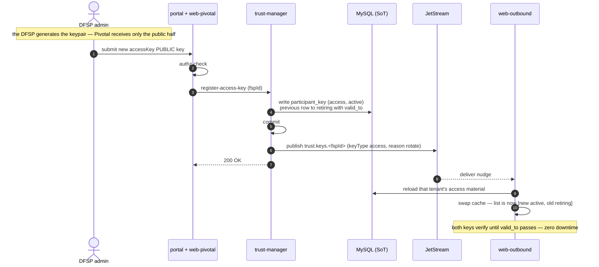
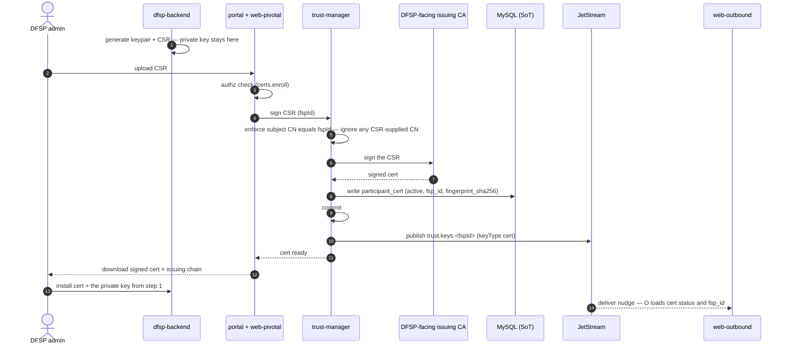
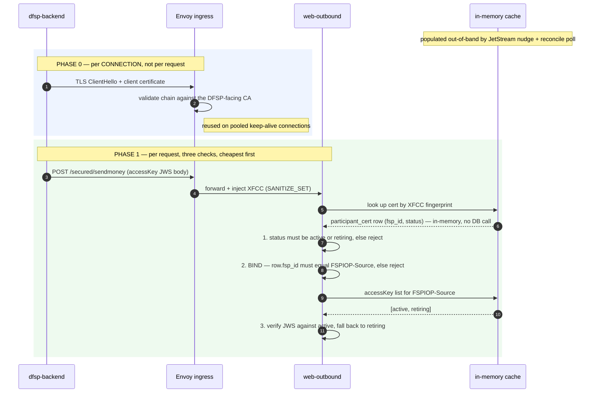
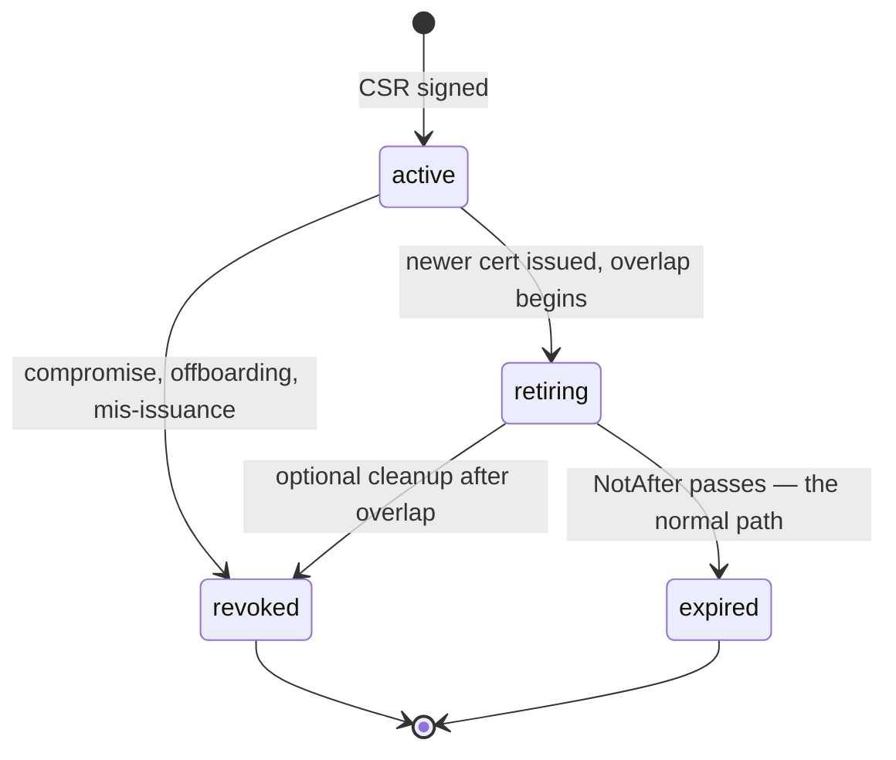

# DFSP-Facing Leg

The `payer DFSP → web-outbound` hop. Pivotal is the **server** here, and the **CA**.

Two independent credentials arrive with every request, and the design's central rule is that they
must agree:

| | Proves | Layer |
| --- | --- | --- |
| **accessKey JWS** | this *message* came from DFSP-A and wasn't altered | application |
| **TLS client certificate** | this *connection* is from DFSP-A | transport |

---

## 1. accessKey

### Provenance — the DFSP generates it

The DFSP creates the keypair, keeps the private half, and gives Pivotal the **public** half only.
Pivotal never sees, generates, or stores an accessKey private key.

trust-manager therefore **registers**, it does not issue. The command is `register-access-key`, and
there is deliberately no `generateKey` step in the onboarding flow — unlike the FSPIOP JWS key,
which Pivotal does generate.

### Rotation — additive, with try-both verification

Registering a new accessKey moves the previous one to `retiring` with
`valid_to = now + overlap`, and it **expires automatically**. No operator action, so an overlap
cannot silently become permanent.

- **Overlap window:** fixed default ~7 days, hardcoded. An operator can end one early.
- **No `kid`.** The store caches `Map<fspId, PublicKey[]>`, ordered `active` then `retiring`, and the
  guard tries them in order.
- Rows are filtered to `status ∈ {active, retiring}` and unexpired **at cache-refresh time, not per
  request**, so the verification path never reasons about status. Outside a rotation window the list
  holds one key and the cost is identical to today.
- **Log which key verified.** That yields free telemetry on rotation progress — how much traffic
  still uses the retiring key is exactly what tells an operator when an overlap can end.

`kid` was rejected: it is a contract change every DFSP must adopt, and it makes rotation *more*
fragile client-side — a DFSP that switches signing keys while still emitting the old `kid` fails
every request, a failure mode try-both cannot produce. The saving is ~50µs of local CPU.

---

## 2. mTLS

### Uniform enforcement

`DFSP_FACING_MTLS` is a **single global switch**. When it is on, every DFSP connection to
web-outbound must present a valid client certificate — Envoy `REQUIRE`, enforced at the transport
layer.

There is deliberately **no per-tenant exception flag**. Enforcement in application code would be
fail-open if a lookup were missed, and a per-tenant `false` becomes a migration artifact that
outlives the migration — in a year nobody remembers whether it means "real VPN, deliberate" or "we
never finished." Your weakest tenant would define the actual security posture.

**Migration is handled by a parallel endpoint, not by configuration.** A second gateway
(`mtls.pivotal.<env>`, Envoy `mode: MUTUAL`) runs alongside the existing one. DFSPs enroll and switch
URL at their own pace. When the last one moves, the old endpoint is retired and nothing is left
behind. Enforcement is at the transport layer on both endpoints throughout.

**No emergency bypass is needed.** Because Pivotal is the CA, a DFSP with a certificate problem is
re-issued in minutes through the same mechanism that governs normal operation.

### Enrollment

Pivotal is the CA; the DFSP's private key never leaves the DFSP.

The subject CN is **set by trust-manager**, not taken from the CSR, so no certificate exists whose
subject contradicts its `fsp_id`.

---

## 3. The binding rule

**A request is rejected unless the certificate and `FSPIOP-Source` name the same DFSP.**

Without this the certificate only proves "the caller is *some* enrolled tenant." An attacker holding
a leaked accessKey for DFSP-B plus **any** valid tenant certificate — their own, as an enrolled
DFSP-C — transacts as DFSP-B. Binding forces compromise of **both** credentials **of the same
tenant**, which is the entire reason to layer mTLS on a signature scheme that already exists.

It is effectively free: the row fetched for the revocation check already carries `fsp_id`.

**Hard requirement:** Envoy must run `SANITIZE_SET`, never `APPEND_FORWARD`. XFCC now carries
*identity*, so a client-settable header would defeat the rule entirely.

---

## 4. Runtime

Envoy has already proved the caller holds a key for a certificate *our CA issued* — but not **which
tenant** they are. The three app-layer checks close that gap. Every lookup is an in-memory cache hit.

In `DFSP_FACING_MTLS=false` mode there is no certificate, so checks 1 and 2 do not run and the
accessKey is the **sole** credential. That is a deliberately weaker posture and should be recorded as
such rather than inherited silently.

---

## 5. Certificate lifecycle

**Renewal never revokes.** The old certificate is left to expire after an overlap, giving zero
downtime — new connections use the new certificate while pooled connections drain on the old, and
both are accepted because both are non-revoked and chain to the same CA. A mid-transaction
certificate change is safe, since transactions are keyed by `transferId`, not by the connection.

**Revocation is separate and immediate** — status set to `revoked` with no overlap, propagated
sub-second by JetStream nudge. The DFSP must re-enroll to resume.

### Enforcement

Authoritative source is `participant_cert.status` in Pivotal's own database — Pivotal *is* the CA.
Envoy terminates mTLS, validates the chain, and injects XFCC. A guard in web-outbound resolves the
XFCC **fingerprint** to the cached row.

Key on the fingerprint, not a serial: Envoy's `set_current_client_cert_details` exposes `By`, `Hash`,
`Subject`, `URI` and `Cert` — there is **no serial field**. Confirm the exact field set against the
gateway product and version chosen for the deployment — open decision **I**.

CA-published CRL or OCSP are optional defence in depth. CRL has refresh staleness and OCSP adds
per-handshake latency and an availability dependency; skip OCSP unless compliance forces it. The
app-layer check is what catches revocation on already-open keep-alive connections, which a
handshake-only mechanism structurally cannot.

---

## 6. Scope boundary

`connector → payee FSP backend` is **outside this design**. See [`architecture.md`](./architecture.md).
The FSP is its own CA there, provisioning is manual, and Pivotal holds no key material.
