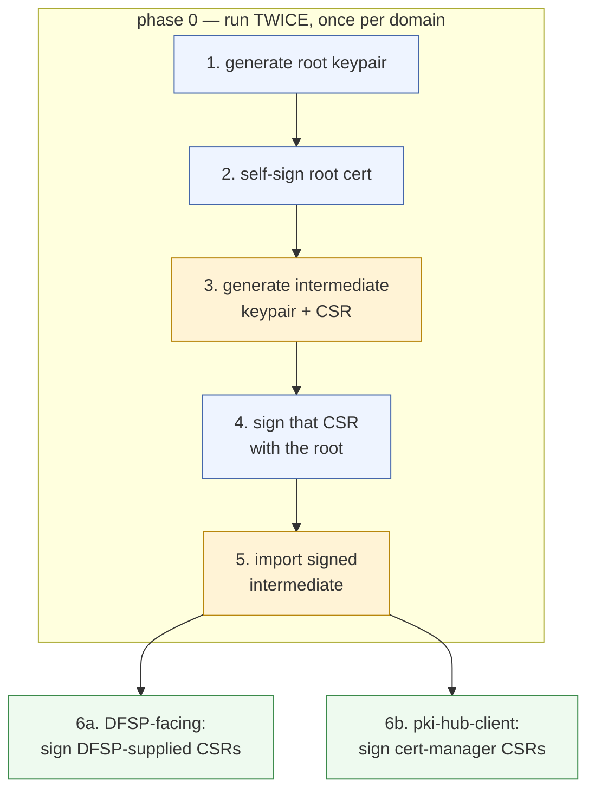
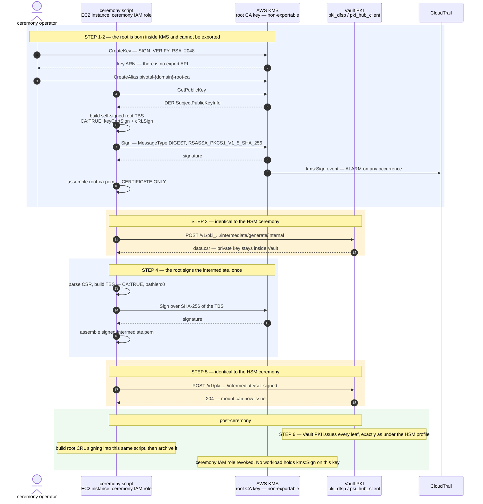
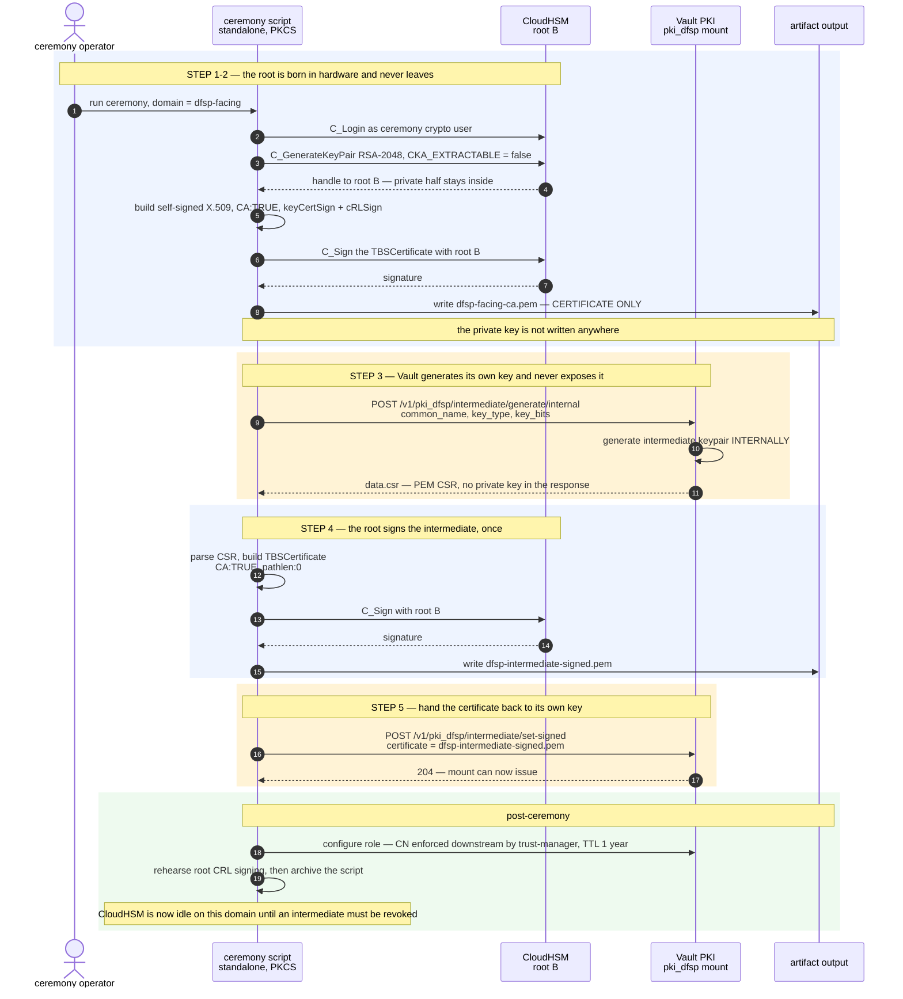
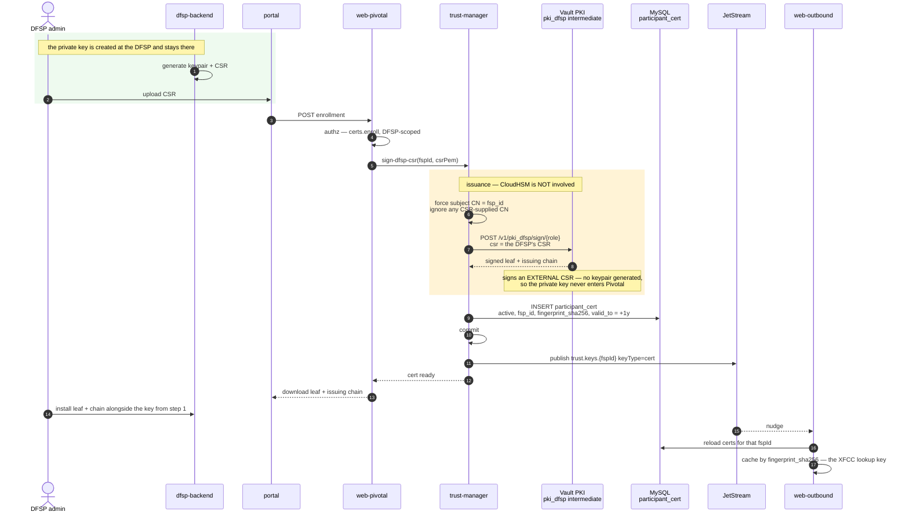
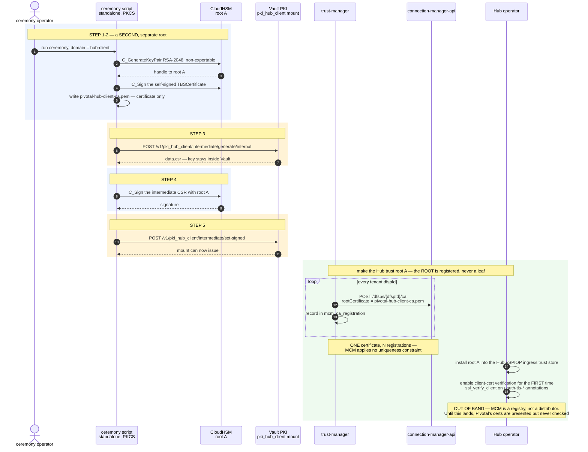
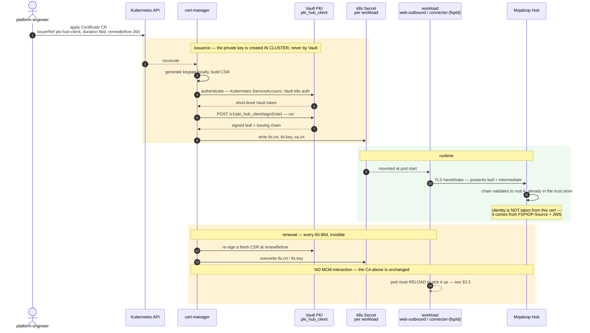
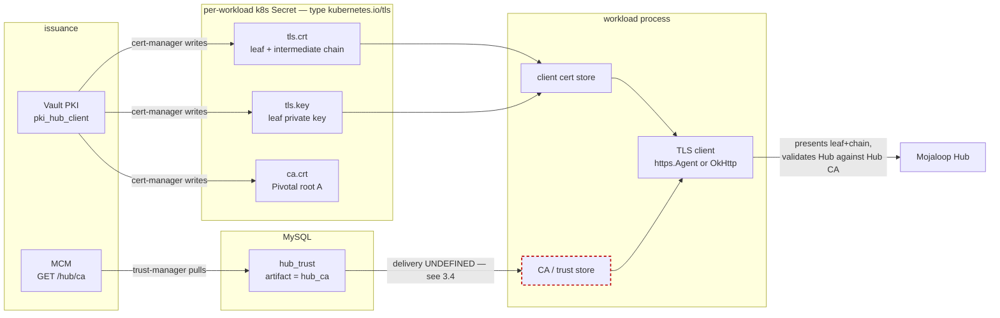

# PKI Issuance Flows

How certificates come into existence on both legs: the CloudHSM root ceremony, the Vault PKI
intermediate, and the two very different leaf-issuance paths that hang off them.

Design rationale lives in [`architecture.md`](../design/architecture.md) §4.7 (trust domains) and §1.3 of
[`implementation-plan.md`](./implementation-plan.md) (the ceremony). This document is the mechanics.

> **Profile note.** The ceremonies below show the **HSM-backed** profile, where both CA roots are
> generated in CloudHSM. In **KMS-backed** there is no cluster: steps 1, 2 and 4 run instead on an
> non-exportable **AWS KMS** key, and steps 3, 5 and 6 are byte-identical. Everything else in
> this document — the Vault PKI mechanics, cert-manager, enrollment, storage — applies unchanged to
> both. See [`architecture.md`](../design/architecture.md) §0 and §4.8.

> **Key algorithms.** FSPIOP **JWS** keys are **RS256 / RSA-2048** (settled decision 3) — that choice
> is fixed at generation and is a one-way door after phase 4. The **CA and TLS key algorithm below is
> a separate and much softer decision**: a root can be regenerated by re-running the ceremony at any
> point before it has been distributed to DFSPs or registered with MCM. RSA-2048 is used here for
> consistency with the conservative posture behind decision 3; EC P-256 is equally valid for a CA and
> nothing in Mojaloop constrains it. **Confirm before the ceremony is run.**

---

## 0. The shape shared by both legs

Both new trust domains are brought up by the **same 6-step ceremony, run twice** — once per domain,
with a **separate root keypair each time**. Merging them would make a DFSP's client certificate
trusted by the Hub ([`architecture.md`](../design/architecture.md) §4.7).

| | DFSP-facing CA | `pki-hub-client` |
| --- | --- | --- |
| Root keypair in CloudHSM | **root B** | **root A** |
| Vault PKI mount | `pki_dfsp` | `pki_hub_client` |
| Leaves issued to | **DFSP backends** — external parties | **Pivotal workloads** — web-outbound + each connector |
| Leaf requested by | a human, via portal CSR upload | **cert-manager**, automatically |
| Root distributed to | the DFSPs | MCM, then the Hub ingress trust store out of band |
| Brought up in phase | 0, consumed in phase 6 | 0, consumed in phase 5 |



Blue is the **root custodian**, amber is Vault PKI, green is leaf issuance. The root custodian touches
**steps 1, 2 and 4 only** — three operations in the life of the deployment, per domain — and it is
CloudHSM in the HSM-backed profile, AWS KMS in the KMS-backed profile. Everything from step 5 onward is Vault PKI
in **both** profiles, which is why an HSM outage never blocks certificate work.

### 0.1 The same ceremony, the other root custodian — KMS-backed

The KMS-backed profile funds no cluster, so the root is a **non-exportable AWS KMS asymmetric key**. The shape is
unchanged; only the custodian and the signing call differ. Run this twice — once per domain, with a
**separate KMS key each time**.



**KMS is not a CA, any more than CloudHSM is.** It signs a digest; the script builds the X.509. That
is why the two ceremonies differ by one call and nothing else:

```python
sig = pkcs11.C_Sign(session, digest)                       # HSM-backed
sig = kms.sign(KeyId=arn, Message=digest,                  # KMS-backed
               MessageType='DIGEST',
               SigningAlgorithm='RSASSA_PKCS1_V1_5_SHA_256')['Signature']
```

**Three controls this variant requires:**

- **Two separate root keys** — one per trust domain. Sharing one would make a DFSP client certificate
  trusted by the Hub ([`architecture.md`](../design/architecture.md) §4.7).
- **A third, separate key for Vault auto-unseal.** Never the root-CA key.
- **A CloudTrail alarm on `kms:Sign`** for each root key. Legitimate use is ~3 events for the life of
  the deployment, so alarm on *any* occurrence.

**Keep root creation out of GitOps.** It is a one-time bootstrap; record the key ARN in the deployment
repo rather than letting a reconcile loop own the trust anchor.

**Everything below applies to both profiles** unless a heading says otherwise. §1.1 and §2.1 show the
HSM-backed PKCS#11 detail; substitute this diagram for those two and the rest of the document is
unchanged.

---

## 1. DFSP-facing leg

Pivotal is the CA here. The leaves are **client certificates issued to DFSPs**, and Pivotal is the
only party that trusts them.

### 1.1 Root ceremony — **HSM-backed**: CloudHSM root B, Vault `pki_dfsp` intermediate



> **KMS-backed.** Steps 1, 2 and 4 use a non-exportable **AWS KMS** key via `kms:Sign`; steps 3 and 5
> are byte-identical. Drawn in full at §0.1.

### 1.2 DFSP enrollment — where a DFSP actually gets its certificate

The DFSP generates its own keypair. **Pivotal never sees the private half.** The route in is
portal → web-pivotal → trust-manager → Vault PKI.



**Runtime use of that leaf**: the DFSP presents it to the mTLS gateway, Envoy validates the chain
against the DFSP-facing root and injects XFCC (`SANITIZE_SET`), and web-outbound resolves the
fingerprint to the cached row to run the status check and the `fsp_id` ↔ `FSPIOP-Source` binding
rule — [`dfsp-facing-leg.md`](../design/dfsp-facing-leg.md) §3–§4.

---

## 2. Hub-facing leg

Same ceremony, different root, and a completely different leaf population: **Pivotal's own
workloads**, requested automatically rather than by a human.

### 2.1 Root ceremony — **HSM-backed**: CloudHSM root A, Vault `pki_hub_client` intermediate



### 2.2 Leaf issuance — cert-manager, not a script and not service code

Kubernetes drives this. One `Certificate` CR per workload; nothing in trust-manager or MCM
participates, which is the entire payoff of registering the CA rather than the leaf.



**Who gets a leaf:**

| Workload | Leaf | Why |
| --- | --- | --- |
| **web-outbound** | one | calls the Hub on the payer leg |
| **each connector** — one per tenant | one each | PUTs callbacks directly to the Hub |
| web-inbound | **none** | it is a *server* to the Hub; its cert comes from the **Hub's** CA via MCM inbound enrollment |
| trust-manager | none | only talks to MCM, which is plain HTTP + OAuth2 |
| web-pivotal, app-auditor, report-worker | none | never touch the Hub |

Leaf count scales with **tenant count**, not TPS.

---

## 3. Where the Hub-facing material is stored

Three distinct artifacts per workload, and they do **not** share a source.



### 3.1 The three artifacts

| Artifact | Stored in | Written by | Purpose |
| --- | --- | --- | --- |
| **Leaf + intermediate chain** | Secret key `tls.crt` | cert-manager | what the workload **presents** |
| **Leaf private key** | Secret key `tls.key` | cert-manager | proves possession on the handshake |
| **Pivotal root A** | Secret key `ca.crt` | cert-manager | the issuer's own CA — informational here; the *Hub* is the party that needs it |
| **Hub CA** | `hub_trust` table, `artifact = hub_ca` | trust-manager, via `GET /hub/ca` | what the workload **validates the Hub against** |

The asymmetry worth internalising: **`ca.crt` in the Secret is not the trust anchor this workload
uses.** It is Pivotal's own root, which the *Hub* needs in its trust store. The bundle the workload
needs is the **Hub CA**, and that arrives from an entirely different place.

### 3.2 The CA chain per leaf

There is **one chain, shared by every leaf**, not a chain per workload — every leaf on this leg is
issued by the same `pki_hub_client` intermediate, under the same root A:

```
leaf (web-outbound)      ─┐
leaf (connector-bigbank) ─┼─► pki_hub_client intermediate ─► root A (CloudHSM)
leaf (connector-orange)  ─┘         [Vault PKI]                    │
                                                                    ▼
                                            registered N× to MCM, installed once
                                            in the Hub FSPIOP ingress trust store
```

cert-manager writes the intermediate into each Secret's `tls.crt` alongside the leaf, so each
workload ships the full chain on the handshake and the Hub only ever needs root A.

### 3.3 How the running process reads it — and what is missing

| Workload | Reads from | Reload on renewal |
| --- | --- | --- |
| **web-outbound** | `FSPIOP_MTLS_CLIENT_CERT` / `_KEY` / `_CA` env → `FspiopMtlsClientCertStore.load()`, `FspiopMtlsCaStore.load()` → `https.Agent` in `core/outbound/domain/domain.module.ts` | **none** — `load()` runs once at startup |
| **TS sample connectors** | same stores → `https.Agent` in `core/connector/domain/domain.module.ts` | **none** |
| **Java connectors** | — nothing. `sharedOkHttpClient()` sets timeouts only: no `sslSocketFactory`, no trust manager, no client cert | **n/a — not wired at all** |

Two consequences:

- **cert-manager renews every 60–90 days, but no pod picks the new material up.** A renewal today
  means a restart. A volume-mounted Secret updates in place, but the stores read the PEMs once.
- **The Java connectors have no mTLS client path whatsoever**, yet
  [`hub-facing-leg.md`](../design/hub-facing-leg.md) B1 makes `connector → Hub` a client relationship.
  `implementation-plan.md` §3's connector row lists the protected header, PKCS#11 signing, the two new
  HTTP headers, the subscription and ack-after-PUT — but **not** certificate wiring.

### 3.4 Hub CA delivery is undefined

`hub_trust` is the authoritative store for the Hub CA, but [`architecture.md`](../design/architecture.md) §5.1
defines only two data-plane read paths — Vault KV for `keyRef`, MySQL for public key and certificate
*registry rows*. A trust bundle is neither, and the connectors have no MySQL access at all.

[`hub-facing-leg.md`](../design/hub-facing-leg.md) B3 shows `TM → data plane: write trust bundle` and
`TM → Gateway: write trust bundle` with no mechanism behind either arrow, and
[`architecture.md`](../design/architecture.md) §7 lists it under *Not yet specified*. **Phase 5 cannot
complete until this is chosen** — the candidates are a trust-manager-managed k8s Secret consumed the
same way as `tls.crt`, or a `hub_trust` read added to the reconcile poll for the components that do
have MySQL access.

---

## 4. PKI by deployment profile

Almost nothing here differs between HSM-backed and KMS-backed. The delta is **root custody only**, and it
is confined to three steps of a one-time ceremony.

| | HSM-backed | KMS-backed |
| --- | --- | --- |
| CA root keys ×2 | **CloudHSM**, PKCS#11 | **AWS KMS**, `kms:Sign` |
| Ceremony steps 1, 2, 4 | in the HSM | offline; CSR in and certificate out by removable media |
| Root CRL signing | PKCS#11 script | same script, `kms:Sign` |
| **Ceremony steps 3, 5, 6** | Vault PKI | **identical** |
| **Intermediates** | Vault PKI, software | **identical** |
| **Leaf issuance** | Vault PKI + cert-manager | **identical** |
| **Leaf private keys** | k8s Secrets | **identical** |
| **DFSP enrollment** | portal → trust-manager → `pki/sign` | **identical** |
| **mTLS handshakes** | Envoy / `https.Agent` / OkHttp | **identical** |

### Two things worth stating plainly

**No TLS private key is ever in an HSM, under either profile.** CloudHSM's entire PKI job is holding
the two roots and signing each intermediate once. Every certificate a DFSP or the Hub ever sees was
issued by software — Vault PKI — and every mTLS handshake is performed by the TLS stack with a key
from a Kubernetes Secret.

**"Signing" means two unrelated things in this design, and only the first varies by profile:**

| | What | Rate | Profile-dependent? |
| --- | --- | --- | --- |
| **JWS signing** | per FSPIOP message | `TPS × 6` — 480–600/s | **yes** — CloudHSM vs in-process |
| **Certificate signing** | per enrollment or renewal | a handful per day | **no** — Vault PKI in both |

A consequence worth keeping: **an HSM outage never blocks certificate work**, and in the KMS-backed profile there
is no HSM to be out. Phases 5 and 6 are therefore identical for both clients, and only phase 0
branches.

---

## 5. One correction to the existing documents

[`dfsp-facing-leg.md`](../design/dfsp-facing-leg.md) §2 labels the DFSP enrollment call
`TM->>V: sign the CSR — pki/issue`. The endpoint should be **`pki/sign`**, not `pki/issue`:

| Vault endpoint | Behaviour |
| --- | --- |
| `pki/issue/<role>` | **Vault generates the keypair** and returns the private key |
| **`pki/sign/<role>`** | signs an **externally supplied CSR**; no key is generated |

`issue` would contradict the leg's central guarantee that the DFSP's private key never leaves the
DFSP. The same applies to cert-manager on the Hub-facing leg — its Vault issuer generates the key
in-cluster and calls `sign`. Both flows in this document use `sign`.
