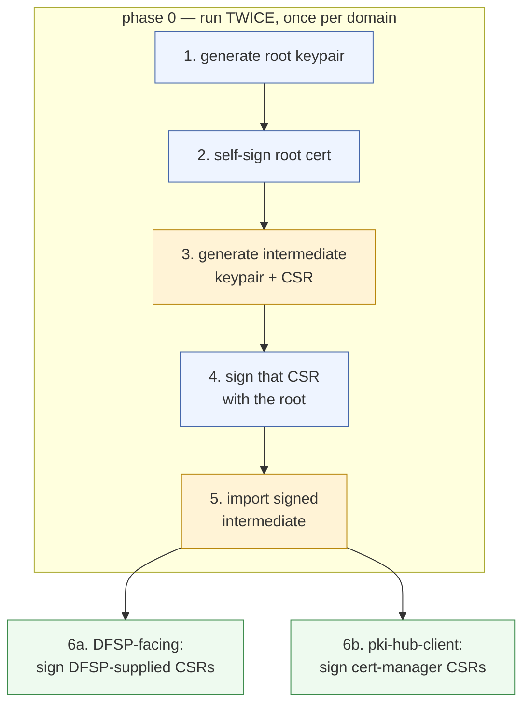
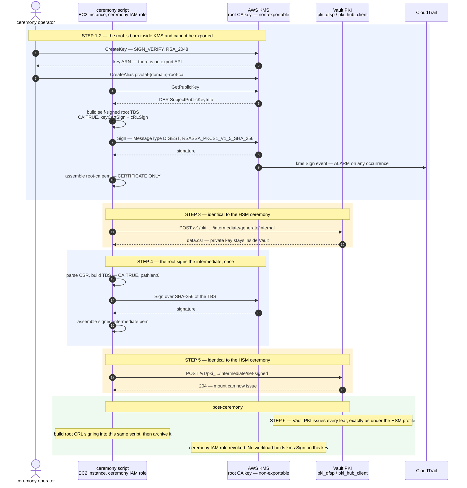
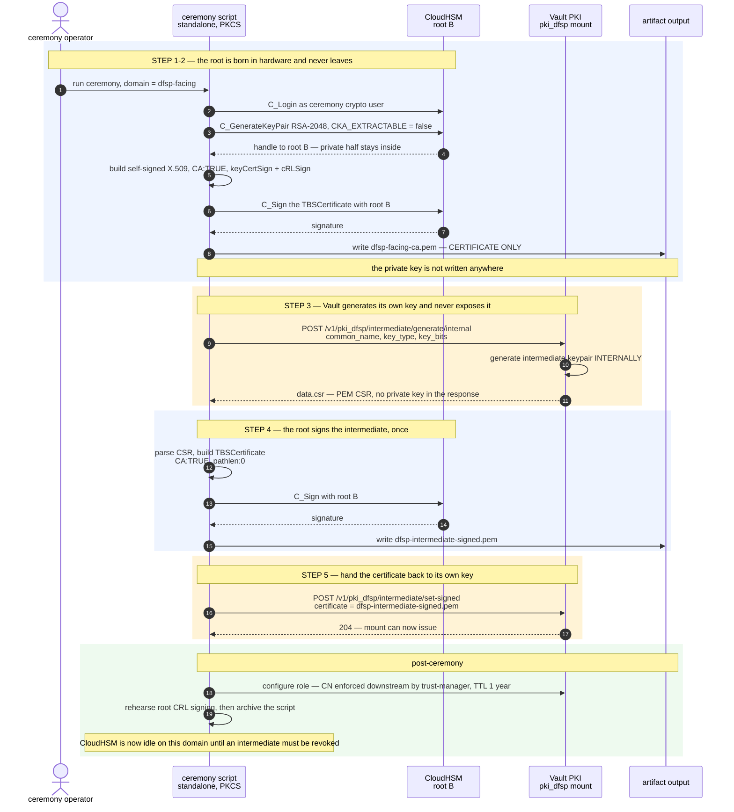
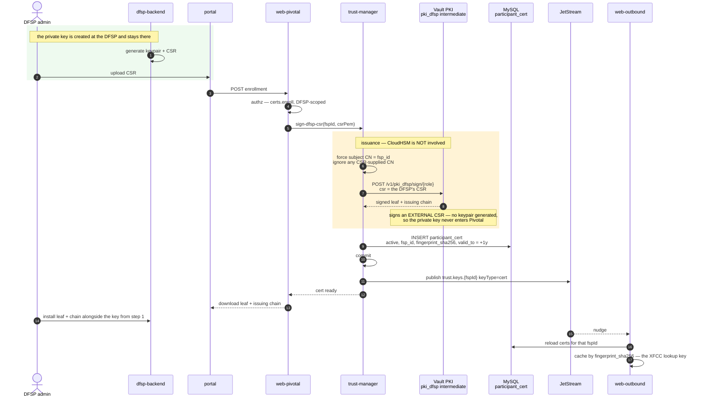
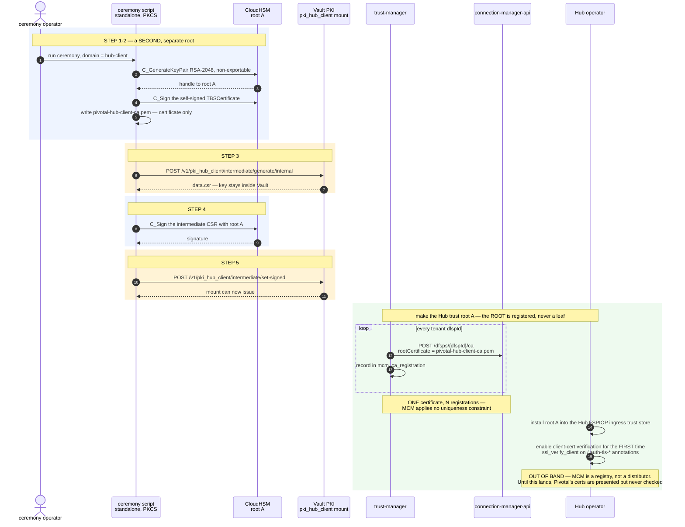
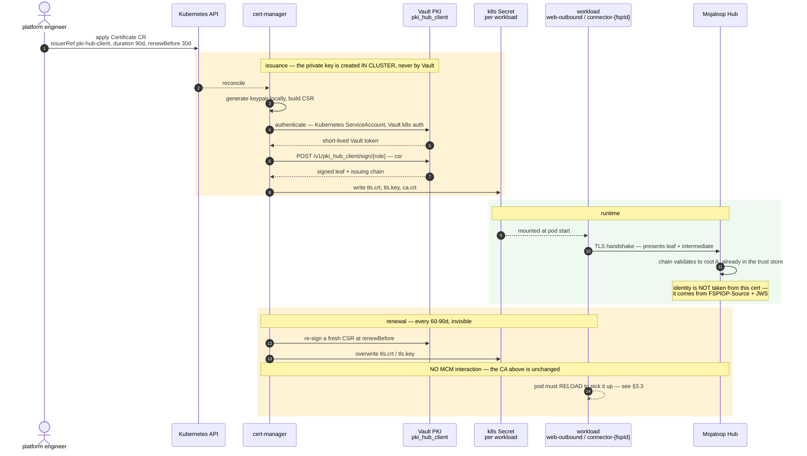
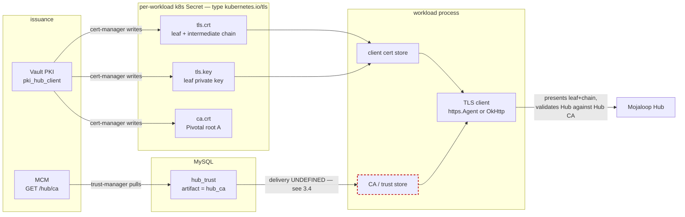

# PKI Issuance Flows

How certificates come into existence on both legs: the CloudHSM root ceremony, the Vault PKI
intermediate, and the two very different leaf-issuance paths that hang off them.

Design rationale lives in [`architecture.md`](../design/architecture.md) §4.7 (trust domains) and §1.3 of
[`implementation-plan.md`](./implementation-plan.md) (the ceremony). This document is the mechanics.

> **Profile note.** The ceremonies below show the **HSM-backed** profile, where both CA roots are
> generated in CloudHSM. In **KMS-backed** there is no cluster: steps 1, 2 and 4 run instead on an
> non-exportable **AWS KMS** key, and steps 3, 5 and 6 are byte-identical. Everything else in
> this document — the Vault PKI mechanics, cert-manager, enrollment, storage — applies unchanged to
> both. See [`architecture.md`](../design/architecture.md) §0 and §4.8.

> **Key algorithms.** FSPIOP **JWS** keys are **RS256 / RSA-2048** (settled decision 3) — that choice
> is fixed at generation and is a one-way door after phase 4. The **CA and TLS key algorithm below is
> a separate and much softer decision**: a root can be regenerated by re-running the ceremony at any
> point before it has been distributed to DFSPs or registered with MCM. RSA-2048 is used here for
> consistency with the conservative posture behind decision 3; EC P-256 is equally valid for a CA and
> nothing in Mojaloop constrains it. **Confirm before the ceremony is run.**

---

## 0. The shape shared by both legs

Both new trust domains are brought up by the **same 6-step ceremony, run twice** — once per domain,
with a **separate root keypair each time**. Merging them would make a DFSP's client certificate
trusted by the Hub ([`architecture.md`](../design/architecture.md) §4.7).

| | DFSP-facing CA | `pki-hub-client` |
| --- | --- | --- |
| Root keypair in CloudHSM | **root B** | **root A** |
| Vault PKI mount | `pki_dfsp` | `pki_hub_client` |
| Leaves issued to | **DFSP backends** — external parties | **Pivotal workloads** — web-outbound + each connector |
| Leaf requested by | a human, via portal CSR upload | **cert-manager**, automatically |
| Root distributed to | the DFSPs | MCM, then the Hub ingress trust store out of band |
| Brought up in phase | 0, consumed in phase 6 | 0, consumed in phase 5 |



Blue is the **root custodian**, amber is Vault PKI, green is leaf issuance. The root custodian touches
**steps 1, 2 and 4 only** — three operations in the life of the deployment, per domain — and it is
CloudHSM in the HSM-backed profile, AWS KMS in the KMS-backed profile. Everything from step 5 onward is Vault PKI
in **both** profiles, which is why an HSM outage never blocks certificate work.

### 0.1 The same ceremony, the other root custodian — KMS-backed

The KMS-backed profile funds no cluster, so the root is a **non-exportable AWS KMS asymmetric key**. The shape is
unchanged; only the custodian and the signing call differ. Run this twice — once per domain, with a
**separate KMS key each time**.



**KMS is not a CA, any more than CloudHSM is.** It signs a digest; the script builds the X.509. That
is why the two ceremonies differ by one call and nothing else:

```python
sig = pkcs11.C_Sign(session, digest)                       # HSM-backed
sig = kms.sign(KeyId=arn, Message=digest,                  # KMS-backed
               MessageType='DIGEST',
               SigningAlgorithm='RSASSA_PKCS1_V1_5_SHA_256')['Signature']
```

**Three controls this variant requires:**

- **Two separate root keys** — one per trust domain. Sharing one would make a DFSP client certificate
  trusted by the Hub ([`architecture.md`](../design/architecture.md) §4.7).
- **A third, separate key for Vault auto-unseal.** Never the root-CA key.
- **A CloudTrail alarm on `kms:Sign`** for each root key. Legitimate use is ~3 events for the life of
  the deployment, so alarm on *any* occurrence.

**Keep root creation out of GitOps.** It is a one-time bootstrap; record the key ARN in the deployment
repo rather than letting a reconcile loop own the trust anchor.

**Everything below applies to both profiles** unless a heading says otherwise. §1.1 and §2.1 show the
HSM-backed PKCS#11 detail; substitute this diagram for those two and the rest of the document is
unchanged.

---

## 1. DFSP-facing leg

Pivotal is the CA here. The leaves are **client certificates issued to DFSPs**, and Pivotal is the
only party that trusts them.

### 1.1 Root ceremony — **HSM-backed**: CloudHSM root B, Vault `pki_dfsp` intermediate



> **KMS-backed.** Steps 1, 2 and 4 use a non-exportable **AWS KMS** key via `kms:Sign`; steps 3 and 5
> are byte-identical. Drawn in full at §0.1.

### 1.2 DFSP enrollment — where a DFSP actually gets its certificate

The DFSP generates its own keypair. **Pivotal never sees the private half.** The route in is
portal → web-pivotal → trust-manager → Vault PKI.



### 1.3 Runtime enforcement — **built and proven 2026-09-04**

The DFSP presents its leaf to the mutual-TLS gateway; Envoy validates the chain against the
DFSP-facing CA, terminates, and describes what it verified in `x-forwarded-client-cert`;
web-outbound resolves the fingerprint to a `participant_cert` row and applies the binding rule from
[`dfsp-facing-leg.md`](../design/dfsp-facing-leg.md) §3.

| Where | Responsibility |
| --- | --- |
| Gateway (`mode: MUTUAL`) | demands a certificate, verifies it against the CA, **overwrites** any XFCC the caller sent |
| `Xfcc` parser | reads `Hash` from the **first** entry only — under `SANITIZE_SET` there is one, and a second means a proxy appended rather than replaced |
| `DfspCertificateGuard` | fingerprint → row → status, validity, then `fsp_id` against `FSPIOP-Source` |

> **Known deviation from decision 7 — to be corrected.** The guard currently treats
> `DFSP_FACING_MTLS` as a global switch: off means no request is checked, on means every request
> must carry XFCC. The decision specifies the opposite shape — verify **whenever XFCC is present**,
> and let the flag decide only whether its absence is fatal. Until that is changed, a deployment
> cannot serve a mixed scheme (one participant on VPN alone, others on mutual TLS), and migration by
> parallel endpoint still flips for everyone at once. Recorded in `status.md` under leg #1 with the
> table of intended behaviour.

**Three things this settled that the design left implicit.**

- **`Hash` is the field to key on**, not `Subject`. It is SHA-256 over the certificate's DER — the
  same value stored as `fingerprint_sha256` and printed by `openssl x509 -fingerprint -sha256` —
  and Envoy includes it whenever it sets the header. `Subject` requires explicit gateway
  configuration and depends on the CA having been configured correctly, which §5.1 shows cannot be
  assumed.
- **The row is read per request.** One indexed lookup on a unique key. Revocation therefore takes
  effect immediately, and validity is checked against the clock rather than trusted from `status`,
  so a lapsed certificate is refused without any expiry sweep having run.
- **`SANITIZE_SET` is load-bearing, and defaults are not evidence.** Istio's gateway default is
  already correct, but it is configured nowhere in the gitops repositories. Verified from Envoy's
  own config dump rather than assumed, by connecting with one participant's certificate while
  forging a header naming another: the forgery was discarded. Without a sanitising proxy the guard
  is worse than absent — it accepts anyone who names a fingerprint while reporting success — so
  web-outbound warns at startup that it trusts a header it cannot itself authenticate.

---

## 2. Hub-facing leg

Same ceremony, different root, and a completely different leaf population: **Pivotal's own
workloads**, requested automatically rather than by a human.

### 2.1 Root ceremony — **HSM-backed**: CloudHSM root A, Vault `pki_hub_client` intermediate



### 2.2 Leaf issuance — cert-manager, not a script and not service code

Kubernetes drives this. One `Certificate` CR per workload; nothing in trust-manager or MCM
participates, which is the entire payoff of registering the CA rather than the leaf.



**Who gets a leaf:**

| Workload | Leaf | Why |
| --- | --- | --- |
| **web-outbound** | one | calls the Hub on the payer leg |
| **each connector** — one per tenant | one each | PUTs callbacks directly to the Hub |
| web-inbound | **none** | it is a *server* to the Hub; its cert comes from the **Hub's** CA via MCM inbound enrollment |
| trust-manager | none | only talks to MCM, which is plain HTTP + OAuth2 |
| web-pivotal, app-auditor, report-worker | none | never touch the Hub |

Leaf count scales with **tenant count**, not TPS.

---

## 3. Where the Hub-facing material is stored

Three distinct artifacts per workload, and they do **not** share a source.



### 3.1 The three artifacts

| Artifact | Stored in | Written by | Purpose |
| --- | --- | --- | --- |
| **Leaf + intermediate chain** | Secret key `tls.crt` | cert-manager | what the workload **presents** |
| **Leaf private key** | Secret key `tls.key` | cert-manager | proves possession on the handshake |
| **Pivotal root A** | Secret key `ca.crt` | cert-manager | the issuer's own CA — informational here; the *Hub* is the party that needs it |
| **Hub CA** | `hub_trust` table, `artifact = hub_ca` | trust-manager, via `GET /hub/ca` | what the workload **validates the Hub against** |

The asymmetry worth internalising: **`ca.crt` in the Secret is not the trust anchor this workload
uses.** It is Pivotal's own root, which the *Hub* needs in its trust store. The bundle the workload
needs is the **Hub CA**, and that arrives from an entirely different place.

### 3.2 The CA chain per leaf

There is **one chain, shared by every leaf**, not a chain per workload — every leaf on this leg is
issued by the same `pki_hub_client` intermediate, under the same root A:

```
leaf (web-outbound)      ─┐
leaf (connector-fspA)    ─┼─► pki_hub_client intermediate ─► root A (CloudHSM)
leaf (connector-fspB)    ─┘         [Vault PKI]                    │
                                                                    ▼
                                            registered N× to MCM, installed once
                                            in the Hub FSPIOP ingress trust store
```

cert-manager writes the intermediate into each Secret's `tls.crt` alongside the leaf, so each
workload ships the full chain on the handshake and the Hub only ever needs root A.

### 3.3 How the running process reads it — **resolved 2026-09-02**

| Workload | Reads from | Reload on renewal |
| --- | --- | --- |
| **web-outbound** | `FSPIOP_MTLS_CLIENT_CERT_PATH` / `_KEY_PATH` / `FSPIOP_MTLS_CA_PATH` → `MutualTlsAgent` in `core/outbound/domain/domain.module.ts` | **yes** — polls every 60s, swaps the agent's `secureContext` |
| **web-inbound** | `FSPIOP_MTLS_SERVER_CERT_PATH` / `_KEY_PATH` / `FSPIOP_MTLS_CA_PATH` → `MutualTlsServer` in `apps/web-inbound/main.ts` | **yes** — polls every 60s, calls `setSecureContext` on the listener |
| **Java connectors** | `fspiopMtlsClientCertPath` / `fspiopMtlsClientKeyPath` / `fspiopMtlsCaPath` → `ReloadableMutualTls`, applied to the derived OkHttp client in `FspiopCallbackService` | **yes** — polls every 60s, swaps the delegating key and trust managers |
| **TS sample connectors** | the stores directly → `https.Agent` in `core/connector/domain/domain.module.ts` | **none** — still built once at startup |

**Reload is uniform in mechanism across all three production paths.** Each keeps one long-lived
object — an agent, a listener, a socket factory — and swaps only the material behind it. New
connections pick up the new certificate while established ones finish on the old, which is exactly
the overlap a renewal window provides. Each fingerprints the material rather than trusting a
timestamp, because a Secret update rewrites the file whether or not the bytes changed; and each
logs and swallows a failed read, because a Secret is briefly half-written mid-update and the
material already loaded is still valid.

**The TS sample connectors are the one path still reading once at startup.** They are samples rather
than a deployed artifact — the production connector path is Java — so this is a known gap, not an
oversight. Moving them onto `MutualTlsAgent` is a small change whenever it is wanted.

**Two things the implementation settled that the design did not state.**

- **The server certificate is not the client certificate.** `web-inbound` was building its listener
  from the *client* store, so it would have presented a leaf signed by Pivotal's own CA where the
  Hub expects one signed by the Hub's. A peer that verifies rejects it; a peer that does not accepts
  it, which is worse, because mTLS then only appears to work. The two stores are now separate types
  so the substitution cannot be made silently.
- **cert-manager issues PKCS#1 private keys by default, and the JDK cannot read them.** OpenSSL-based
  stacks read both encodings, so this surfaces only on the Java leg — where it is fatal at startup.
  Fixed at issuance with `privateKey.encoding: PKCS8` rather than by adding a second PEM parser to an
  artifact every connector inherits.

### 3.4 Hub CA delivery — **resolved 2026-09-02**

**A Kubernetes Secret is the authoritative store for the Hub CA bundle. The `hub_trust` row becomes a
non-authoritative mirror.**

This was open because it was posed as *"which pipe carries `hub_trust.hub_ca` to the data plane?"*
There is no good answer to that question, which is why it stayed open. The rule in
[`architecture.md`](../design/architecture.md) §5.1 settles it by being applied literally:

> Each value has **exactly one authoritative store**, chosen by **who reads it**.

`hub_ca` is read by web-outbound, web-inbound's Gateway **and every connector** — and connectors have
no MySQL access, by design. So MySQL cannot be the authoritative store for this value. The defect was
never a missing mechanism; it was giving `hub_trust` a row it has no business owning.

| | |
| --- | --- |
| **Authoritative** | Kubernetes Secret `hub-ca-bundle`, written by trust-manager after `GET /hub/ca` |
| **Mirror** | `hub_trust` row — expiry alerting and the portal only |

The mirror is not a new concession. It is exactly the pattern already settled for
`participant_key_ref` (§5.1): *"written after the Vault write. If it drifts, nothing breaks; it is a
view, not a source."* Same shape, same justification, no new precedent — and **no violation of
one-store-per-value**, because authority moved rather than being duplicated.

#### Why a Secret and not Vault KV

Vault KV looks like the cheaper answer: connectors already authenticate to Vault and read
`jwskey/<fspId>`, so it adds no new access path for them. **Envoy decides it.** web-inbound's Gateway
needs the Hub CA as its client-certificate trust store, and Envoy reads Kubernetes Secrets over SDS,
not Vault. Choosing Vault KV means maintaining two delivery mechanisms; choosing the Secret means one
that serves all three consumers — and it is the same mount the workloads already use for
cert-manager's `tls.crt`.

A CA certificate is public, so a Secret here is *storage*, not custody. No invariant bends. What the
bundle does need is **write-integrity and audit** rather than secrecy: anyone who can write it can
insert their own CA and be trusted as the Hub.

#### What this exposes rather than fixes

The mechanism was the easy half; §3.3 recorded the harder part, and both halves are now closed. The
bundle is re-read on a poll by web-outbound, web-inbound and the Java connectors, so a rotated Hub CA
takes effect within a minute rather than at the next restart. Choosing the store did not fix that —
it made it visible and schedulable, and it was then scheduled.

#### Naming collision, worth knowing before a design review

cert-manager ships an upstream CNCF project **also called `trust-manager`**, whose entire job is
distributing CA bundles across namespaces via a `Bundle` CR. It solves this problem directly and is
worth evaluating later, but it is a further component and Pivotal's own trust-manager will own this
eventually. Not adopted; recorded so the name collision does not surprise anyone.

---

## 4. PKI by deployment profile

Almost nothing here differs between HSM-backed and KMS-backed. The delta is **root custody only**, and it
is confined to three steps of a one-time ceremony.

| | HSM-backed | KMS-backed |
| --- | --- | --- |
| CA root keys ×2 | **CloudHSM**, PKCS#11 | **AWS KMS**, `kms:Sign` |
| Ceremony steps 1, 2, 4 | in the HSM | offline; CSR in and certificate out by removable media |
| Root CRL signing | PKCS#11 script | same script, `kms:Sign` |
| **Ceremony steps 3, 5, 6** | Vault PKI | **identical** |
| **Intermediates** | Vault PKI, software | **identical** |
| **Leaf issuance** | Vault PKI + cert-manager | **identical** |
| **Leaf private keys** | k8s Secrets | **identical** |
| **DFSP enrollment** | portal → trust-manager → `pki/sign` | **identical** |
| **mTLS handshakes** | Envoy / `https.Agent` / OkHttp | **identical** |

### Two things worth stating plainly

**No TLS private key is ever in an HSM, under either profile.** CloudHSM's entire PKI job is holding
the two roots and signing each intermediate once. Every certificate a DFSP or the Hub ever sees was
issued by software — Vault PKI — and every mTLS handshake is performed by the TLS stack with a key
from a Kubernetes Secret.

**"Signing" means two unrelated things in this design, and only the first varies by profile:**

| | What | Rate | Profile-dependent? |
| --- | --- | --- | --- |
| **JWS signing** | per FSPIOP message | `TPS × 6` — 480–600/s | **yes** — CloudHSM vs in-process |
| **Certificate signing** | per enrollment or renewal | a handful per day | **no** — Vault PKI in both |

A consequence worth keeping: **an HSM outage never blocks certificate work**, and in the KMS-backed profile there
is no HSM to be out. Phases 5 and 6 are therefore identical for both clients, and only phase 0
branches.

---

## 5. Corrections to the existing documents

[`dfsp-facing-leg.md`](../design/dfsp-facing-leg.md) §2 labels the DFSP enrollment call
`TM->>V: sign the CSR — pki/issue`. The endpoint should be **`pki/sign`**, not `pki/issue`:

| Vault endpoint | Behaviour |
| --- | --- |
| `pki/issue/<role>` | **Vault generates the keypair** and returns the private key |
| **`pki/sign/<role>`** | signs an **externally supplied CSR**; no key is generated |

`issue` would contradict the leg's central guarantee that the DFSP's private key never leaves the
DFSP. The same applies to cert-manager on the Hub-facing leg — its Vault issuer generates the key
in-cluster and calls `sign`. Both flows in this document use `sign`, and so does the implementation.

### 5.1 `sign` alone does not stop a DFSP naming itself — **found 2026-09-03**

Choosing `sign` over `issue` protects the *key*. It does not protect the *name*. Vault's PKI role
defaults to **`use_csr_common_name=true`**, which takes the subject from the submitted request and
ignores the `common_name` the caller supplies.

Found by enrolling a request whose subject deliberately claimed a different tenant: it came back
signed with that name. A DFSP could therefore have obtained a certificate for any participant,
which defeats the binding rule in §3 of the leg document entirely — the check compares the
certificate against `FSPIOP-Source`, and a self-named certificate satisfies it.

Two changes, deliberately in both places:

| Where | Change |
| --- | --- |
| `scripts/setup-vault-pki.sh` | the `dfsp-client` role sets `use_csr_common_name=false use_csr_sans=false` — SANs are the other place an identity can hide |
| `DfspCertificateIssuer` | verifies the returned common name against the enrolled participant, and records nothing when they differ |

**Any environment provisioned from the earlier script is still exposed**, and certificates issued
from a mis-configured role should be treated as suspect.

### 5.2 Private keys arrive as PKCS#1 unless asked otherwise

cert-manager and Vault both write PKCS#1 for RSA by default. OpenSSL-based stacks read both
encodings, so this surfaces only where a JVM is involved — where it is fatal at startup, as it was
for the Java connector. Set `privateKey.encoding: PKCS8` at issuance rather than adding a second
PEM parser. An encoding change alone does not trigger re-issuance: the Secret keeps its original
key until deleted.
